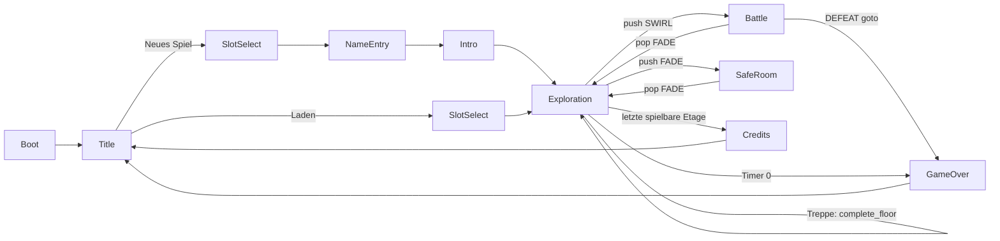

# PRIME TIME DUNGEON — Technische Architektur (verbindlich)

> Status: **verbindlicher Vertrag** für alle Implementierungs-Module M0–M7.
> Grundlage: `docs/00_BRIEF.md` (hat Vorrang bei Widersprüchen). Inhalte/Balancing-Zahlen: GDD (`docs/01_GDD.md`).
> Engine: Godot **4.7.2-stable**, GDScript, statisch typisiert. Alle in diesem Dokument genannten Godot-APIs
> wurden gegen das installierte 4.7.2-Binary geprüft (Doctool-Dump + Headless/Xvfb-Testprojekte).
>
> Sprache: Prosa Deutsch. Bezeichner, Pfade, JSON-Keys, Signal-/Methodennamen Englisch.

---

## Inhalt

0. [Spielregeln für parallele Entwicklung](#0-spielregeln-für-parallele-entwicklung)
1. [Dateibaum und Modulzuordnung](#1-dateibaum-und-modulzuordnung)
2. [project.godot](#2-projectgodot)
3. [Autoloads und Events](#3-autoloads-und-events)
4. [Daten (JSON) und DB](#4-daten-json-und-db)
5. [Kampf-Kern (M1)](#5-kampf-kern-m1)
6. [Show, Loot, Progression, Save (M2)](#6-show-loot-progression-save-m2)
7. [Dungeon-Generierung (M3)](#7-dungeon-generierung-m3)
8. [Art-Kit-API (M4)](#8-art-kit-api-m4)
9. [Szenenfluss und Router](#9-szenenfluss-und-router)
10. [Eingabe und Plattform](#10-eingabe-und-plattform)
11. [Tests, Capture, Autoplay](#11-tests-capture-autoplay)
12. [Performance, Export, CI](#12-performance-export-ci)
13. [Coding-Konventionen](#13-coding-konventionen)
14. [Anhang: Integrations-Checkliste](#14-anhang-integrations-checkliste)

---

## 0. Spielregeln für parallele Entwicklung

### 0.1 Phasen

| Phase | Wer | Ergebnis | Grün-Kriterium |
|---|---|---|---|
| **A — Fundament** | M0 allein | `project.godot`, alle Autoloads, Test-Harness, `GameData` + Defs, UI-Theme, **API-Stubs** aller modulübergreifenden Dateien (siehe 0.2), minimale gültige `data/*.json` | `tools/check.sh --tests-only` grün |
| **B — Implementierung** | M1–M7 parallel | Jedes Modul ersetzt **nur seine eigenen** Dateien (Stub → echte Implementierung) | `tools/check.sh --tests-only` grün |
| **C — Integration** | M0 (+ betroffene Module) | Echter Ablauf Titel → Erkundung → Kampf → Safe Room | `tools/check.sh` (inkl. Autoplay-Smoke) grün + Screenshots per `--shot` |

### 0.2 Stub-Regel (Phase A)

- M0 legt für **jede** Datei, deren öffentliche API in §3, §5, §6, §7, §8, §9 definiert ist, einen **Stub** an:
  exakte `class_name`, exakte Signaturen, Rümpfe geben Default-Werte zurück (`return null`, `return []`, `pass`).
  Erste Zeile jedes Stubs: `# STUB(M0) — owned by Mx. Replace completely, keep the public API.`
- Shader-Stubs (`art/shaders/*.gdshader`) sind gültige Minimal-Shader mit **allen** in §8.3 genannten Uniforms.
- Szenen-Stubs (`.tscn`) enthalten Root-Node + Skript. `scenes/boot/boot.gd`-Stub geht direkt zu `Router.SCENE_TITLE`
  und gibt bei `--autoplay` nur `AUTOPLAY: SKIPPED (stub)` aus.
- `data/*.json`-Stubs: je Tabelle minimal gültige Einträge (Party `kai` + `mopsula`, 1 Etage, alle Pflicht-Tags in `mod_lines`).
- Ab Phase B gehört jede Datei **ausschließlich** dem in §1 genannten Modul. Andere Module ändern sie nicht.
  Braucht ein Modul eine API-Änderung an fremden Dateien → Änderung an **diesem Dokument** beantragen, nicht selbst editieren.

### 0.3 Private Zusatzdateien

Module dürfen zusätzliche, nicht gelistete Hilfsdateien **nur in ihren eigenen Ordnern** anlegen.
Diese haben **kein** `class_name` (Kollisionsgefahr) und werden modulintern per `const Foo := preload("res://…")` genutzt.

### 0.4 Abhängigkeitsrichtung (Schichten)

`A ← B` heißt: B darf A benutzen, nie umgekehrt.

```
core/data (M0) ← core/stats ← core/battle (M1) ← core/show, core/loot, core/progression (M2)
core/dungeon (M3) ← core/data
art/* (M4) ← nur Godot + core/data (nur Def-Typen, optional)
autoload/* (M0/M2) ← core/*
scenes/* (M3/M5/M6) ← autoload/*, core/*, art/*
```

- `core/**` greift **nie** auf Autoloads (`Events`, `DB`, `Game`, `Show`, `Save`, `Router`, `Sfx`) oder den SceneTree zu.
  Daten kommen als `GameData`-Instanz, Zufall als `RandomNumberGenerator` per Parameter.
- `art/**` greift nie auf `Game`, `Show`, `Save`, `Router` zu; `Sfx`/`DB` nur in Gallery-Szenen.

---

## 1. Dateibaum und Modulzuordnung

Pfade relativ zu `prime-time-dungeon/game/` (= `res://`). Jede Datei gehört genau **einem** Modul.
`(S)` = von M0 in Phase A als Stub angelegt.

### 1.1 Projektwurzel

| Datei | Modul | Zweck |
|---|---|---|
| `project.godot` | M0 | Projekteinstellungen, Autoloads, Input-Map (§2) |
| `export_presets.cfg` | M0 | Export Windows/Linux/macOS/Android/iOS (§12.3) |
| `icon.svg` | M0 | App-Icon (handgeschriebenes SVG: „PTD“-Logo, Magenta/Cyan) |
| `../.github/workflows/ptd-check.yml` (Repo-Root `K0/.github/…`) | M0 | CI (§12.4) |

### 1.2 `autoload/`

| Datei | Modul | Zweck |
|---|---|---|
| `autoload/events.gd` | M0 | Autoload `Events`: globaler Signal-Bus, nur Signale (§3.2) |
| `autoload/db.gd` | M0 | Autoload `DB`: lädt `GameData` in `_init()`, Getter-Fassade (§3.3) |
| `autoload/game.gd` | M0 | Autoload `Game`: hält `GameState`, Etagen-Timer, Settings, Input-Schema, Flow-Helfer (§3.4) |
| `autoload/game_settings.gd` | M0 | `class_name GameSettings`: Einstellungen, persistiert in `user://settings.cfg` |
| `autoload/show.gd` | M2 (S) | Autoload `Show`: Hype/Zuschauer/Follower, Achievements, Sponsoren, M.O.D. (§3.5) |
| `autoload/save.gd` | M2 (S) | Autoload `Save`: Slots, Datei-I/O, Autosave (§3.6) |
| `autoload/router.gd` | M0 | Autoload `Router`: Szenen-Stack, Übergänge, Kampf/Safe-Room ein/aus (§3.7, §9) |
| `autoload/sfx.gd` | M0 | Autoload `Sfx`: Audio-Busse, Player-Pool, Musik (§3.8) |
| `autoload/sfx_synth.gd` | M0 | `class_name SfxSynth`: erzeugt prozedurale `AudioStreamWAV` |

### 1.3 `core/`

| Datei | Modul | Zweck |
|---|---|---|
| `core/data/game_data.gd` | M0 | `GameData`: Laden, Normalisieren, Validieren, Getter (§4.5) |
| `core/data/data_validator.gd` | M0 | `DataValidator`: Schema-/Referenz-/Wertebereichsprüfung, Vokabular-Konstanten (§4.3) |
| `core/data/json_util.gd` | M0 | `JsonUtil`: Datei lesen, `to_int`, `to_str_array`, `vec2i_to_arr`, `arr_to_vec2i` |
| `core/data/seed_util.gd` | M0 | `SeedUtil`: deterministische Seed-Ableitung (§4.6) |
| `core/data/defs/status_def.gd` | M0 | `StatusDef` |
| `core/data/defs/skill_def.gd` | M0 | `SkillDef` |
| `core/data/defs/item_def.gd` | M0 | `ItemDef` |
| `core/data/defs/class_def.gd` | M0 | `ClassDef` |
| `core/data/defs/party_member_def.gd` | M0 | `PartyMemberDef` |
| `core/data/defs/enemy_def.gd` | M0 | `EnemyDef` |
| `core/data/defs/encounter_def.gd` | M0 | `EncounterDef` (eingebettet in `floors.json`) |
| `core/data/defs/floor_def.gd` | M0 | `FloorDef` |
| `core/data/defs/lootbox_def.gd` | M0 | `LootboxDef` |
| `core/data/defs/achievement_def.gd` | M0 | `AchievementDef` |
| `core/data/defs/sponsor_def.gd` | M0 | `SponsorDef` |
| `core/data/defs/mod_line_def.gd` | M0 | `ModLineDef` |
| `core/stats/stat_block.gd` | M1 (S) | `StatBlock` + `enum Stat` (§5.2) |
| `core/stats/elements.gd` | M1 (S) | `Elements`: Element-Konstanten, Multiplikator-Helfer |
| `core/stats/balance.gd` | M1 (S) | `Balance`: alle Formelkonstanten (§5.9) |
| `core/battle/battle_setup.gd` | M1 (S) | `BattleSetup`: Eingabe für einen Kampf |
| `core/battle/combatant.gd` | M1 (S) | `Combatant`: Kampfteilnehmer |
| `core/battle/status_effect.gd` | M1 (S) | `StatusEffect`: aktiver Status |
| `core/battle/ctb_queue.gd` | M1 (S) | `CTBQueue`: Tick-System, Zugreihenfolge, Vorschau |
| `core/battle/battle_command.gd` | M1 (S) | `BattleCommand`: Befehl eines Akteurs |
| `core/battle/action_event.gd` | M1 (S) | `ActionEvent`: Ergebnis-Ereignis für die Darstellung (§5.3) |
| `core/battle/hit_result.gd` | M1 (S) | `HitResult`: Ergebnis einer Schadens-/Heilberechnung |
| `core/battle/damage_calc.gd` | M1 (S) | `DamageCalc`: Formeln (statisch) |
| `core/battle/action_resolver.gd` | M1 (S) | `ActionResolver`: wendet Befehle an, erzeugt `ActionEvent`s |
| `core/battle/enemy_ai.gd` | M1 (S) | `EnemyAI`: Gegner-Befehlswahl |
| `core/battle/auto_policy.gd` | M1 (S) | `AutoPolicy`: Auto-Kampf für die Party |
| `core/battle/battle_state.gd` | M1 (S) | `BattleState`: Kampfmodell + Zustandsautomat (§5.6) |
| `core/battle/battle_result.gd` | M1 (S) | `BattleResult`: Kampfausgang |
| `core/show/stat_ids.gd` | M2 (S) | `StatIds`: Achievement-Zähler-IDs (§6.3) |
| `core/show/show_state.gd` | M2 (S) | `ShowState`: Zuschauer/Follower/Hype/Zähler (Teil von `GameState`) |
| `core/show/show_model.gd` | M2 (S) | `ShowModel`: Zuschauer-/Follower-/Hype-Mathe |
| `core/show/show_rules.gd` | M2 (S) | `ShowRules`: `ActionEvent` → `ShowDelta` (pro Kampf) |
| `core/show/show_delta.gd` | M2 (S) | `ShowDelta` |
| `core/show/achievement_tracker.gd` | M2 (S) | `AchievementTracker` |
| `core/show/sponsor_system.gd` | M2 (S) | `SponsorSystem`: Sponsor-Auswahl |
| `core/show/mod_announcer.gd` | M2 (S) | `ModAnnouncer`: M.O.D.-/Chat-Zeilen wählen + formatieren |
| `core/loot/loot_reward.gd` | M2 (S) | `LootReward` |
| `core/loot/loot_roller.gd` | M2 (S) | `LootRoller`: Lootbox/Truhe/Drops würfeln |
| `core/progression/game_state.gd` | M2 (S) | `GameState`: kompletter Laufzeit-Spielstand |
| `core/progression/party_member.gd` | M2 (S) | `PartyMember` |
| `core/progression/inventory.gd` | M2 (S) | `Inventory` (Items + Credits) |
| `core/progression/floor_run.gd` | M2 (S) | `FloorRun`: Zustand der aktuellen Etage |
| `core/progression/progression.gd` | M2 (S) | `Progression`: EXP-Kurve, Level-Up, Stats, Ausrüsten |
| `core/progression/level_up_info.gd` | M2 (S) | `LevelUpInfo` |
| `core/progression/battle_bridge.gd` | M2 (S) | `BattleBridge`: `GameState` ↔ `BattleSetup`/`BattleResult` |
| `core/progression/battle_rewards.gd` | M2 (S) | `BattleRewards` |
| `core/progression/shop.gd` | M2 (S) | `Shop`: Automat (kaufen/verkaufen) |
| `core/progression/save_codec.gd` | M2 (S) | `SaveCodec`: Save-Dict ↔ `GameState`, Versionierung, Migration |
| `core/dungeon/room_cell.gd` | M3 (S) | `RoomCell` |
| `core/dungeon/chest_spawn.gd` | M3 (S) | `ChestSpawn` |
| `core/dungeon/enemy_spawn.gd` | M3 (S) | `EnemySpawn` |
| `core/dungeon/floor_layout.gd` | M3 (S) | `FloorLayout`: Ergebnis der Generierung |
| `core/dungeon/dungeon_generator.gd` | M3 (S) | `DungeonGenerator` (§7) |

### 1.4 `data/` (alle M7, Stubs von M0)

| Datei | Zweck |
|---|---|
| `data/statuses.json` | Statuseffekte |
| `data/skills.json` | Fähigkeiten inkl. Basisangriffe, Stunts, Item-Effekte, Gegner-Skills |
| `data/items.json` | Verbrauchsgüter, Ausrüstung, Schlüsselgegenstände |
| `data/classes.json` | Klassen (ab Etage 3, Datenmodell jetzt) |
| `data/party.json` | Kai, Graf Mopsula |
| `data/enemies.json` | Gegner inkl. Bosse |
| `data/floors.json` | Etagen inkl. Encounter-Tabellen, Truhen-Tabelle, Shop, Palette |
| `data/lootboxes.json` | Bronze/Silber/Gold/Fan-Box |
| `data/achievements.json` | Achievements |
| `data/sponsors.json` | Sponsoren + Geschenke |
| `data/mod_lines.json` | M.O.D.-, Mopsula-, Kai- und Chat-Zeilen |

### 1.5 `art/` (alle M4)

| Datei | Zweck |
|---|---|
| `art/shaders/toon.gdshader` (S) | Toon-Shading (Bänder, Rim, Flash, Highlight, Dissolve), optional Vertex-Color |
| `art/shaders/toon_outline.gdshader` (S) | Inverted-Hull-Outline (als `next_pass`) |
| `art/shaders/env_tiles.gdshader` (S) | Umgebung: Weltkoordinaten-Fliesen/Grout/Schmutz, Vertex-Color, keine Outline |
| `art/shaders/glow.gdshader` (S) | Unshaded Emissive (Neon, Treppen-Glühen) |
| `art/shaders/vfx_additive.gdshader` (S) | Additive Billboard-Partikel |
| `art/shaders/hologram.gdshader` (S) | M.O.D.-Hologramm / Bildschirme |
| `art/shaders/ui_swirl.gdshader` (S) | canvas_item: Kampf-Swirl-Übergang (Router) |
| `art/shaders/ui_tv_overlay.gdshader` (S) | canvas_item: Scanlines/Vignette/Chromatic für TV-Overlay |
| `art/materials/palette.gd` (S) | `Palette`: Farbkonstanten, Hex-Parser, Theme-Paletten |
| `art/materials/materials.gd` (S) | `Materials`: Material-Fabrik mit Cache |
| `art/kit/mesh_util.gd` (S) | `MeshUtil`: Low-Poly-Primitive, Merge mit Vertex-Colors, Tri-Zählung |
| `art/kit/character_rig.gd` (S) | `CharacterRig`: Standard-Animationsschnittstelle |
| `art/kit/character_builder.gd` (S) | `CharacterBuilder`: Modell-Spec → `CharacterRig` |
| `art/kit/archetypes.gd` | Teile-Rezepte je `base` (privat, kein class_name) |
| `art/kit/room_spec.gd` (S) | `RoomSpec`: Eingabe M3 → M4 |
| `art/kit/env_kit.gd` (S) | `EnvKit`: Räume, Arena, Safe Room, Environment, Licht |
| `art/kit/prop_kit.gd` (S) | `PropKit`: Props |
| `art/kit/chest_prop.gd` (S) | `ChestProp`: Truhe mit `open()` |
| `art/kit/vfx.gd` (S) | `Vfx`: Effekte + Schadenszahlen |
| `art/kit/damage_number.gd` | Label3D-Schadenszahl (privat) |
| `art/gallery/character_gallery.tscn` + `.gd` | Alle Archetypen/Party/Gegner aus DB nebeneinander (Screenshot-Ziel) |
| `art/gallery/env_gallery.tscn` + `.gd` | Raum-Varianten aller Türmasken + Arena + Safe Room |
| `art/gallery/vfx_gallery.tscn` + `.gd` | Alle Vfx-Arten im Loop |

### 1.6 `scenes/`

| Datei | Modul | Zweck |
|---|---|---|
| `scenes/boot/boot.tscn` + `boot.gd` | M6 (S) | **Main Scene**: Args lesen, Settings anwenden, GlobalUi + ggf. Autoplay anlegen, → Titel |
| `scenes/boot/autoplay.gd` | M6 | Autoplay-Treiber (§11.4) |
| `scenes/title/title.tscn` + `title.gd` | M6 (S) | `TitleScreen`: Neues Spiel / Laden / Einstellungen / Beenden |
| `scenes/title/slot_select.tscn` + `.gd` | M6 | Slot-Auswahl (Neu/Laden) |
| `scenes/title/name_entry.tscn` + `.gd` | M6 | Namenseingabe (Default „Kai“) |
| `scenes/title/intro.tscn` + `.gd` | M6 | M.O.D.-Intro-Sequenz |
| `scenes/title/game_over.tscn` + `.gd` | M6 | Game Over (Grund: `defeat`/`timer`) |
| `scenes/title/credits.tscn` + `.gd` | M6 | „Etage 2 folgt“-Abspann |
| `scenes/exploration/exploration.tscn` + `exploration.gd` | M3 (S) | `ExplorationScene`: Etage aufbauen, Spieler/Gegner/Interaktion, Encounter |
| `scenes/exploration/floor_builder.gd` | M3 | `FloorLayout` → Raum-Nodes via `EnvKit`/`PropKit` |
| `scenes/exploration/player.tscn` + `player_controller.gd` | M3 | CharacterBody3D + `CharacterRig`, Bewegung, Schwung-Angriff |
| `scenes/exploration/camera_rig.gd` | M3 | Orbit-Kamera mit SpringArm3D |
| `scenes/exploration/enemy_actor.tscn` + `enemy_actor.gd` | M3 | Sichtbare Gegnergruppe: Patrouille/Verfolgung/Kontakt |
| `scenes/exploration/interactable.gd` | M3 | Basis Area3D-Interaktion (Prompt-Text, `interact()`) |
| `scenes/exploration/chest_interactable.gd` | M3 | Truhe |
| `scenes/exploration/stairs_interactable.gd` | M3 | Treppe |
| `scenes/exploration/safe_door_interactable.gd` | M3 | Safe-Room-Tür |
| `scenes/battle/battle.tscn` + `battle_scene.gd` | M5 (S) | `BattleScene`: Root, Setup, Ende → Router |
| `scenes/battle/battle_controller.gd` | M5 | Kampfschleife (§5.7) |
| `scenes/battle/battle_player.gd` | M5 | Spielt `ActionEvent`-Listen ab |
| `scenes/battle/battle_stage.gd` | M5 | Arena, Slot-Positionen, Rigs |
| `scenes/battle/battle_camera.gd` | M5 | Kamera-Shots |
| `scenes/battle/ui/battle_hud.tscn` + `.gd` | M5 | Kampf-HUD (CanvasLayer 5): Party-Panels, CTB-Leiste, Menüs |
| `scenes/battle/ui/party_panel.gd` | M5 | HP/MP/Status je Partymitglied |
| `scenes/battle/ui/ctb_bar.gd` | M5 | Zugreihenfolge-Leiste rechts (10 Einträge, Vorschau) |
| `scenes/battle/ui/command_menu.gd` | M5 | Angriff/Fähigkeit/Stunt/Item/Verteidigen/Flucht |
| `scenes/battle/ui/action_list.gd` | M5 | Untermenü Fähigkeiten/Stunts/Items |
| `scenes/battle/ui/target_cursor.gd` | M5 | Zielauswahl |
| `scenes/battle/ui/battle_results.tscn` + `.gd` | M5 | Ergebnis: EXP, Credits, Items, Level-Ups, Follower, Achievements |
| `scenes/safe_room/safe_room.tscn` + `safe_room.gd` | M6 (S) | `SafeRoomScene`: Innenraum + Menü |
| `scenes/safe_room/vending_menu.tscn` + `.gd` | M6 | Automat (Shop) |
| `scenes/safe_room/lootbox_opening.tscn` + `.gd` | M6 | Lootbox-Öffnung mit M.O.D.-Kommentar |
| `scenes/ui/theme/ui_theme.gd` | **M0** | `UiTheme`: Basis-Theme (Code-generiert) |
| `scenes/ui/global_ui.tscn` + `global_ui.gd` | M6 (S) | Persistente UI: ShowOverlay, ModDialog, Toasts, DebugOverlay |
| `scenes/ui/show_overlay.tscn` + `.gd` | M6 | TV-Overlay: LIVE, Zuschauer, Follower, Hype-Meter, Sponsor-Banner, Chat-Ticker |
| `scenes/ui/mod_dialog.tscn` + `.gd` | M6 | M.O.D.-/Mopsula-Textbox mit Queue |
| `scenes/ui/toast_stack.gd` | M6 | Achievement-/Hinweis-Toasts |
| `scenes/ui/exploration_hud.tscn` + `.gd` | M6 (S) | `ExplorationHud`: Timer, Etage, Party-Mini-Status, Minimap, Prompt, Touch, Pause |
| `scenes/ui/minimap.gd` | M6 | Minimap + große Karte |
| `scenes/ui/touch_controls.tscn` + `.gd` | M6 | Touch-Layer (virtueller Stick + Buttons + Kamera-Drag) |
| `scenes/ui/virtual_joystick.gd` | M6 | Floating Joystick |
| `scenes/ui/pause_menu.tscn` + `.gd` | M6 | Pause: Party, Items, Ausrüstung, Einstellungen, Titel |
| `scenes/ui/party_menu.gd` | M6 | Party-Status |
| `scenes/ui/inventory_menu.gd` | M6 | Inventar (Feld-Nutzung) |
| `scenes/ui/equipment_menu.gd` | M6 | Ausrüstung |
| `scenes/ui/settings_menu.tscn` + `.gd` | M6 | Einstellungen |
| `scenes/ui/confirm_dialog.tscn` + `.gd` | M6 | Ja/Nein-Dialog |
| `scenes/ui/safe_area_container.gd` | M6 | MarginContainer mit Safe-Area-Rändern |
| `scenes/ui/input_glyph.gd` | M6 | Tasten-/Button-Symbol je Input-Schema |
| `scenes/ui/debug_overlay.gd` | M6 | F3: FPS, Draw Calls, Primitives, Seed, Raum |

### 1.7 `tests/`

| Datei | Modul | Zweck |
|---|---|---|
| `tests/run_tests.gd` | M0 | Test-Runner (§11.1) |
| `tests/capture.gd` | M0 | Screenshot-Werkzeug (§11.3) |
| `tests/test_case.gd` | M0 | `TestCase`: Basis mit Asserts (§11.2) |
| `tests/fixtures/data_min/*.json` | M0 | Minimaler gültiger Datensatz (alle 11 Tabellen) für M0-Tests |
| `tests/test_m0_harness.gd` | M0 | Selbsttest Asserts/Runner |
| `tests/test_m0_db.gd` | M0 | Laden/Validieren/Fehlerfälle von `GameData` |
| `tests/test_m0_compile_all.gd` | M0 | Lädt jede `.gd`/`.tscn` unter `res://` → fängt Parse-Fehler |
| `tests/test_m0_seed_util.gd` | M0 | Determinismus `SeedUtil` |
| `tests/test_m1_stats.gd` | M1 | StatBlock, Elemente |
| `tests/test_m1_ctb.gd` | M1 | Tick-System, Vorschau, Haste/Slow, Präventiv/Hinterhalt |
| `tests/test_m1_damage.gd` | M1 | Formeln, Krit, Elemente, Verteidigen, Treffer |
| `tests/test_m1_status.gd` | M1 | Statusdauer, DoT/HoT, skip_turn, Immunität |
| `tests/test_m1_ai.gd` | M1 | EnemyAI-Bedingungen/Phasen, AutoPolicy |
| `tests/test_m1_battle_flow.gd` | M1 | Kompletter Kampf bis Sieg/Niederlage/Flucht, Event-Invarianten |
| `tests/test_m2_show.gd` | M2 | ShowRules-Hype, Zuschauer, Follower, Sponsor-Trigger |
| `tests/test_m2_achievements.gd` | M2 | Zähler, Schwellen, Belohnungen |
| `tests/test_m2_loot.gd` | M2 | Lootbox/Truhe/Drops deterministisch |
| `tests/test_m2_progression.gd` | M2 | EXP-Kurve, Level-Up, Equip, BattleBridge |
| `tests/test_m2_save.gd` | M2 | Roundtrip, Migration, kaputte Dateien, Slots |
| `tests/test_m2_shop.gd` | M2 | Kaufen/Verkaufen |
| `tests/test_m3_dungeon_gen.gd` | M3 | 200 Seeds: Invarianten, Determinismus, Laufzeit |
| `tests/test_m3_exploration_scene.gd` | M3 | Szene headless instanziieren, Spawn, Encounter auslösen |
| `tests/test_m4_art_kit.gd` | M4 | Alle Bases/Props/Räume bauen, Tri-Budgets, Anim-Interface |
| `tests/test_m5_battle_scene.gd` | M5 | Battle-Szene headless mit Auto-Kampf bis Ende |
| `tests/test_m6_ui_scenes.gd` | M6 | Alle UI-Szenen instanziieren, Default-Fokus vorhanden |
| `tests/test_m7_data_content.gd` | M7 | Inhalt: Mengen (≥ x Gegner etc.), Balancing-Sanity (Etage 1 schaffbar) |

---

## 2. project.godot

### 2.1 Inhalt (exakt; `[input]` siehe 2.2)

```ini
config_version=5

[application]

config/name="Prime Time Dungeon"
config/version="0.1.0"
config/description="Galaktische Reality-Show-Dungeon-Crawler."
run/main_scene="res://scenes/boot/boot.tscn"
config/use_custom_user_dir=true
config/custom_user_dir_name="PrimeTimeDungeon"
config/quit_on_go_back=false
config/features=PackedStringArray("4.7", "Mobile")
boot_splash/bg_color=Color(0.055, 0.035, 0.09, 1)
boot_splash/show_image=false
config/icon="res://icon.svg"

[autoload]

Events="*res://autoload/events.gd"
DB="*res://autoload/db.gd"
Game="*res://autoload/game.gd"
Show="*res://autoload/show.gd"
Save="*res://autoload/save.gd"
Router="*res://autoload/router.gd"
Sfx="*res://autoload/sfx.gd"

[debug]

gdscript/warnings/untyped_declaration=2
gdscript/warnings/inferred_declaration=0
gdscript/warnings/unsafe_property_access=0
gdscript/warnings/unsafe_method_access=0
gdscript/warnings/unsafe_cast=0
gdscript/warnings/unsafe_call_argument=0
gdscript/warnings/integer_division=0
gdscript/warnings/return_value_discarded=0

[display]

window/size/viewport_width=1280
window/size/viewport_height=720
window/size/resizable=true
window/stretch/mode="canvas_items"
window/stretch/aspect="expand"
window/stretch/scale_mode="fractional"
window/handheld/orientation=4
window/energy_saving/keep_screen_on=true

[gui]

common/snap_controls_to_pixels=true

[input_devices]

pointing/emulate_touch_from_mouse=false
pointing/emulate_mouse_from_touch=true

[internationalization]

locale/fallback="de"

[layer_names]

3d_physics/layer_1="world"
3d_physics/layer_2="player"
3d_physics/layer_3="enemy"
3d_physics/layer_4="interact"

[physics]

common/physics_ticks_per_second=60
3d/physics_engine="Jolt Physics"

[rendering]

renderer/rendering_method="mobile"
renderer/rendering_method.mobile="mobile"
renderer/rendering_method.web="gl_compatibility"
rendering_device/fallback_to_opengl3=true
textures/vram_compression/import_etc2_astc=true
anti_aliasing/quality/msaa_3d=1
environment/defaults/default_clear_color=Color(0.055, 0.035, 0.09, 1)
lights_and_shadows/directional_shadow/size=2048
lights_and_shadows/directional_shadow/size.mobile=1024
lights_and_shadows/directional_shadow/soft_shadow_filter_quality=1
lights_and_shadows/directional_shadow/soft_shadow_filter_quality.mobile=0
lights_and_shadows/positional_shadow/atlas_size=0
lights_and_shadows/positional_shadow/atlas_size.mobile=0
```

Begründungen (kurz):
- `untyped_declaration=2` macht fehlende Typen zu **Parse-Fehlern** (geprüft: erscheint als `SCRIPT ERROR … (Warning treated as error.)` → `check.sh` schlägt fehl). Alle anderen Warnungen aus, weil JSON-Dictionaries sonst Rauschen erzeugen.
- `stretch canvas_items + expand`: Referenz 1280×720; auf 19,5:9-Handys wird die sichtbare Fläche breiter (z. B. 1600×720), auf 4:3 höher (1280×960). UI wird **nur über Anker/Container** platziert.
- `orientation=4` = Sensor Landscape.
- `positional_shadow/atlas_size=0`: Omni-/Spot-Schatten sind projektweit deaktiviert.
- `--rendering-driver opengl3` (Xvfb/CI) schaltet automatisch auf `gl_compatibility` (geprüft).

### 2.2 Input-Map

Alle Events mit `"device":-1` (= alle Geräte; geprüft: matcht Gamepad 0/1/3 und Tastatur). Tasten als **`physical_keycode`**
(layoutunabhängig, QWERTZ-sicher). Gamepad nach SDL-Layout (A unten, B rechts, X links, Y oben).

| Action | Deadzone | Tastatur (physical) | Gamepad | Kontext |
|---|---|---|---|---|
| `move_forward` | 0.25 | W, Up | Achse 1 (LY) −1.0 | Erkundung |
| `move_back` | 0.25 | S, Down | Achse 1 (LY) +1.0 | Erkundung |
| `move_left` | 0.25 | A, Left | Achse 0 (LX) −1.0 | Erkundung |
| `move_right` | 0.25 | D, Right | Achse 0 (LX) +1.0 | Erkundung |
| `cam_left` | 0.2 | Q | Achse 2 (RX) −1.0 | Erkundung |
| `cam_right` | 0.2 | E | Achse 2 (RX) +1.0 | Erkundung |
| `cam_up` | 0.2 | – | Achse 3 (RY) −1.0 | Erkundung |
| `cam_down` | 0.2 | – | Achse 3 (RY) +1.0 | Erkundung |
| `sprint` | 0.5 | Shift | Button 7 (L3), Achse 5 (RT) +1.0 | Erkundung |
| `interact` | 0.5 | F, Space, Enter, Kp Enter | Button 0 (A) | Erkundung |
| `attack` | 0.5 | X | Button 2 (X) | Erkundung (Präventivschlag) |
| `pause` | 0.5 | Escape, P | Button 6 (Start) | Erkundung, Safe Room |
| `map` | 0.5 | M, Tab | Button 4 (Back) | Erkundung |
| `tab_prev` | 0.5 | Q, PageUp | Button 9 (LB) | Menüs mit Reitern |
| `tab_next` | 0.5 | E, PageDown | Button 10 (RB) | Menüs mit Reitern |
| `toggle_auto` | 0.5 | T | Button 3 (Y) | Kampf |
| `toggle_speed` | 0.5 | R | Button 4 (Back) | Kampf |
| `toggle_fullscreen` | 0.5 | F11 | – | global (nur PC) |
| `debug_overlay` | 0.5 | F3 | – | global (nur `OS.is_debug_build()`) |
| `ui_accept` (Override!) | 0.5 | Enter, Kp Enter, Space | Button 0 (A) | Menüs |
| `ui_cancel` (Override!) | 0.5 | Escape | Button 1 (B) | Menüs (kein Backspace: kollidiert mit Texteingabe im Namensfeld) |

**Wichtig (geprüft in 4.7.2):** Die eingebauten `ui_accept`/`ui_cancel` enthalten **keine** Gamepad-Buttons → müssen in
`project.godot` überschrieben werden (Override ersetzt die Defaults vollständig, daher alle Events listen).
`ui_up/down/left/right` (Pfeile + D-Pad + linker Stick) und `ui_focus_next/prev` bleiben Default.

Keycodes: W=87, A=65, S=83, D=68, Q=81, E=69, F=70, X=88, P=80, M=77, T=84, R=82, Space=32, Enter=4194309,
Kp Enter=4194310, Escape=4194305, Tab=4194306, Shift=4194325, Up=4194320, Down=4194322,
Left=4194319, Right=4194321, PageUp=4194323, PageDown=4194324, F3=4194334, F11=4194342.

Serialisierung (so von Godot 4.7.2 geschrieben, `device` auf −1 setzen):

```ini
move_forward={
"deadzone": 0.25,
"events": [Object(InputEventKey,"resource_local_to_scene":false,"resource_name":"","device":-1,"window_id":0,"alt_pressed":false,"shift_pressed":false,"ctrl_pressed":false,"meta_pressed":false,"pressed":false,"keycode":0,"physical_keycode":87,"key_label":0,"unicode":0,"location":0,"echo":false,"script":null)
, Object(InputEventJoypadMotion,"resource_local_to_scene":false,"resource_name":"","device":-1,"axis":1,"axis_value":-1.0,"script":null)
]
}
interact={
"deadzone": 0.5,
"events": [Object(InputEventJoypadButton,"resource_local_to_scene":false,"resource_name":"","device":-1,"button_index":0,"pressure":0.0,"pressed":false,"script":null)
]
}
```

Hinweis M0: Die Sektion am zuverlässigsten mit einem Wegwerf-Skript im Scratchpad erzeugen
(`ProjectSettings.set_setting("input/<action>", {"deadzone": d, "events": [...]})` + `ProjectSettings.save_custom(path)`),
dann `"device"` auf `-1` setzen und einfügen.

### 2.3 Autoload-Reihenfolge und Initialisierungsregel

Reihenfolge: `Events → DB → Game → Show → Save → Router → Sfx` (Brief §6).

Geprüftes Verhalten 4.7.2: **alle** Autoload-Nodes hängen im Baum, bevor das erste `_ready()` läuft; `_ready()` läuft in
Listenreihenfolge. Daraus die Regel:

- Jeder Autoload baut seinen **eigenen** Zustand in `_init()` auf (DB lädt Daten in `_init()`).
- In `_ready()` darf jeder Autoload auf **alle** anderen zugreifen, aber nur auf Zustand, der dort in `_init()` entsteht
  (konkret: `DB.data` ist in jedem `_ready()` verfügbar). Signal-Verbindungen zu `Events` werden in `_ready()` hergestellt.

---

## 3. Autoloads und Events

### 3.1 Allgemein

- Autoload-Skripte haben **kein** `class_name` (Name = Autoload-Name).
- Prozessmodus: `Router`, `Sfx` = `PROCESS_MODE_ALWAYS`; alle anderen Default (`PAUSABLE`) → Etagen-Timer und
  Show-Ticks stehen bei `get_tree().paused = true` automatisch.

### 3.2 `Events` (M0) — vollständige Datei

```gdscript
extends Node
## Global signal bus. Signals only, no state, no logic.
## Arrays in signal args are untyped on purpose (no dependency on core classes); element types are documented.

# --- Flow ---------------------------------------------------------------
signal scene_changed(scene_path: String)
signal new_game_started(slot: int)
signal game_loaded(slot: int)
signal game_saved(slot: int, ok: bool)
signal settings_changed()
signal input_scheme_changed(scheme: int)                 # Game.InputScheme
signal overlay_mode_requested(mode: StringName)          # &"explore", &"battle", &"safe_room", &"menu", &"hidden"
signal pause_menu_toggled(open: bool)

# --- Floor / exploration -----------------------------------------------
signal floor_entered(floor_index: int)                   # first entry of a floor (not on resume)
signal floor_timer_changed(seconds_left: int)            # whenever the integer second changes
signal floor_timer_warning(seconds_left: int)            # exactly at FloorDef.timer_warnings values
signal floor_timer_expired()
signal floor_completed(floor_index: int)                 # stairs taken
signal room_entered(cell: Vector2i, room_kind: int, first_visit: bool)   # RoomCell.Kind
signal enemy_alerted(group_id: String)
signal encounter_triggered(group_id: String, encounter_id: String, advantage: int)  # BattleSetup.Advantage
signal chest_opened(chest_id: String, rewards: Array)    # Array[LootReward]
signal camera_drag(relative: Vector2)                    # touch camera drag in viewport px

# --- Battle ---------------------------------------------------------------
signal battle_started(encounter_id: String, is_boss: bool)
signal battle_turn_started(combatant_id: String, is_party: bool)
signal battle_ended(outcome: int, encounter_id: String)  # BattleResult.Outcome

# --- Show -----------------------------------------------------------------
signal viewers_changed(viewers: int)
signal followers_changed(followers: int, delta: int)
signal hype_changed(hype: float, delta: float, reason: StringName)
signal achievement_unlocked(achievement_id: String)
signal sponsor_gift_triggered(sponsor_id: String)
signal mod_said(text: String, voice: StringName, tag: String, blocking: bool)   # voice: &"mod", &"mopsula", &"kai", &"chat"
signal dialog_finished(tag: String)                      # emitted by ModDialog when a line is done/dismissed
signal chat_posted(user: String, text: String, mood: StringName)  # mood: &"hype", &"neutral", &"bored"

# --- Progression ------------------------------------------------------------
signal party_changed()
signal member_leveled(member_id: String, new_level: int, learned: PackedStringArray)
signal inventory_changed()
signal credits_changed(credits: int, delta: int)
signal lootbox_earned(box_id: String)
signal lootbox_opened(box_id: String, rewards: Array)    # Array[LootReward]

# --- UI -----------------------------------------------------------------
signal toast_requested(text: String, icon: StringName)
```

Wer emittiert was (verbindlich):

| Signal | Emitter |
|---|---|
| `scene_changed` | Router |
| `new_game_started`, `floor_timer_*`, `floor_completed`, `party_changed`, `member_leveled`, `inventory_changed`, `credits_changed`, `lootbox_opened`, `input_scheme_changed`, `settings_changed` | Game |
| `game_loaded`, `game_saved` | Save |
| `floor_entered`, `room_entered`, `enemy_alerted`, `encounter_triggered`, `chest_opened`, `overlay_mode_requested(&"explore")` | ExplorationScene (M3) |
| `battle_started`, `battle_turn_started`, `battle_ended`, `overlay_mode_requested(&"battle")` | BattleScene/BattleController (M5) |
| `viewers_changed`, `followers_changed`, `hype_changed`, `achievement_unlocked`, `sponsor_gift_triggered`, `mod_said`, `chat_posted`, `lootbox_earned` | Show |
| `dialog_finished` | ModDialog (M6) |
| `camera_drag` | TouchControls (M6) |
| `pause_menu_toggled`, `toast_requested`, `overlay_mode_requested(&"safe_room"/&"menu"/&"hidden")` | M6-Szenen; `toast_requested` darf jeder |

### 3.3 `DB` (M0)

```gdscript
extends Node
var data: GameData            # created + loaded in _init()
var ok: bool                  # data.is_valid()

func _init() -> void          # data = GameData.new(); ok = data.load_dir("res://data"); push_error each error
# Facade (forwarders, identical semantics to GameData, see §4.4):
func enemy(id: String) -> EnemyDef
func skill(id: String) -> SkillDef
func item(id: String) -> ItemDef
func party_member(id: String) -> PartyMemberDef
func achievement(id: String) -> AchievementDef
func lootbox(id: String) -> LootboxDef
func sponsor(id: String) -> SponsorDef
func status(id: String) -> StatusDef
func class_def(id: String) -> ClassDef
func floor_def(index: int) -> FloorDef
func encounter(id: String) -> EncounterDef
func mod_lines(tag: String) -> Array[ModLineDef]
func has_id(table: String, id: String) -> bool
```

Fehler beim Laden: jeder Eintrag aus `data.errors` per `push_error("DB: <msg> (res://data/<table>.json)")` — der
`res://`-Teil sorgt dafür, dass `check.sh` (`ERROR: .*res://`) den Smoke-Run scheitern lässt.

### 3.4 `Game` (M0)

```gdscript
extends Node
enum InputScheme { KEYBOARD_MOUSE, GAMEPAD, TOUCH }

var state: GameState = null          # null until new_game()/Save.load_slot()
var settings: GameSettings           # created in _init(), loaded from user://settings.cfg
var input_scheme: InputScheme = InputScheme.KEYBOARD_MOUSE
var timer_running: bool = false      # true only via ExplorationScene; Router resets to false on goto/push
var autoplay: bool = false           # set by Boot from --autoplay
var auto_battle: bool = false        # party uses AutoPolicy (toggle_auto / Settings / Autoplay)
var fast_text: bool = false          # dialogs show instantly (Autoplay, text_speed=2)

func has_state() -> bool
func new_game(slot: int, player_name: String = "Kai", seed: int = -1) -> void
	# seed -1 → (Time.get_unix_time_from_system() * 1000) & 0x7FFFFFFF; state = GameState.create_new(DB.data, slot, name, seed)
	# start_floor(1); emits new_game_started(slot)
func ensure_state() -> void          # if not has_state(): new_game(0, "Kai", 1)  — standalone scenes, capture, tests
func floor_def() -> FloorDef         # DB.floor_def(state.floor_run.index)
func start_floor(floor_index: int) -> void     # state.floor_run = FloorRun.create(DB.floor_def(i), state.seed); location "start"
func complete_floor() -> void
	# emits floor_completed; Show.bump_stat("floors_cleared"); next := DB.floor_def(index+1)
	# if next != null and next.playable: start_floor(index+1); Save.autosave(); Router.goto(Router.SCENE_EXPLORATION, {"spawn": &"start"})
	# else: Router.goto(Router.SCENE_CREDITS)
func next_seed(purpose: String) -> int   # state.rng_counter += 1; SeedUtil.derive(state.seed, purpose, state.rng_counter)
func make_battle_setup(encounter_id: String, advantage: int, group_id: String) -> BattleSetup
	# BattleBridge.make_setup(state, DB.data, encounter_id, advantage, group_id, next_seed("battle")); setup.auto_battle = auto_battle
func apply_battle_result(result: BattleResult) -> BattleRewards
	# BattleBridge.apply_result(state, DB.data, result); emits party_changed, inventory_changed, credits_changed, member_leveled
func open_lootbox(box_id: String) -> Array[LootReward]
	# removes one box_id from state.pending_lootboxes; LootRoller.roll_lootbox(..., rng from next_seed("lootbox"));
	# add_rewards(); emits lootbox_opened
func add_rewards(rewards: Array[LootReward]) -> void   # items → inventory, credits, followers (→ Show.add_followers)
func rest_full_heal() -> void         # Progression.full_heal(state, DB.data); emits party_changed
func set_flag(key: String, value: Variant) -> void
func get_flag(key: String, default: Variant = null) -> Variant
func time_left() -> float             # state.floor_run.time_left
func apply_settings() -> void         # audio volumes (Sfx), fullscreen, quality (scaling_3d_scale etc.), emits settings_changed
```

Laufzeitverhalten:
- `_process(delta)`: wenn `state != null`: `state.play_time_sec += delta`; wenn zusätzlich `timer_running`:
  `state.floor_run.time_left -= delta`; Ganzzahl-Sekundenwechsel → `floor_timer_changed`; Überschreiten eines Werts aus
  `floor_def().timer_warnings` → `floor_timer_warning(value)`; `≤ 0` → `timer_running = false`, `floor_timer_expired`,
  `Router.game_over(&"timer")`.
- `_input(event)`: erkennt `input_scheme` (Key/MouseButton/MouseMotion>2px → KEYBOARD_MOUSE; JoypadButton/JoypadMotion>0.5 → GAMEPAD;
  ScreenTouch → TOUCH; emulierte Maus-Events mit `device == InputEvent.DEVICE_ID_EMULATION` ignorieren), emittiert bei Wechsel.
  Bei GAMEPAD → `Input.mouse_mode = MOUSE_MODE_HIDDEN`, sonst `VISIBLE`.
- `toggle_fullscreen` behandelt `Game._unhandled_input` (nur PC); `debug_overlay` behandelt `DebugOverlay` (M6, Teil von `GlobalUi`) selbst.
- `timer_running` setzt **nur** die `ExplorationScene` auf `true` (`_ready()`, `on_resume()`); `Router` setzt es bei **jedem**
  `goto`/`push` auf `false` (verhindert, dass der Timer hinter Kampf, Safe Room, Game Over oder Abspann weiterläuft).

`GameSettings` (M0, `autoload/game_settings.gd`):

| Feld | Typ | Default | Sektion/Key in `user://settings.cfg` |
|---|---|---|---|
| `master_volume` | float 0..1 | 0.8 | `audio/master` |
| `music_volume` | float | 0.6 | `audio/music` |
| `sfx_volume` | float | 0.8 | `audio/sfx` |
| `battle_speed` | float ∈ {1.0, 1.5, 2.0} | 1.0 | `game/battle_speed` |
| `text_speed` | int 0 langsam / 1 normal / 2 sofort | 1 | `game/text_speed` |
| `auto_battle_default` | bool | false | `game/auto_battle_default` |
| `fullscreen` | bool | false | `display/fullscreen` |
| `quality` | StringName &"high"/&"low" | PC &"high", `OS.has_feature("mobile")` &"low" | `display/quality` |
| `touch_controls` | StringName &"auto"/&"on"/&"off" | &"auto" | `display/touch_controls` |
| `show_fps` | bool | false | `display/show_fps` |
| `camera_invert_x` / `camera_invert_y` | bool | false | `input/…` |
| `camera_sensitivity` | float 0.25..3.0 | 1.0 | `input/camera_sensitivity` |

Methoden: `func load_from_disk() -> void`, `func save_to_disk() -> Error`, `func to_dict() -> Dictionary`.

Qualitätsstufen (angewendet von `Game.apply_settings()` auf `get_tree().root`; Szenen lesen `Game.settings.quality` beim Bauen):

| | high | low |
|---|---|---|
| `scaling_3d_scale` | 1.0 (mobile: 0.85) | 0.7 |
| `msaa_3d` | 2× | aus |
| Directional Shadow | an | aus |
| Glow | an | aus |
| Max. aktive OmniLights in Reichweite | 4 | 2 |

### 3.5 `Show` (M2)

```gdscript
extends Node
func viewers() -> int
func followers() -> int
func hype() -> float
func add_hype(amount: float, reason: StringName = &"") -> void      # clamps 0..100, emits hype_changed
func add_followers(n: int, reason: StringName = &"") -> void        # emits followers_changed
func bump_stat(stat_id: String, amount: int = 1) -> void            # AchievementTracker.bump → unlock handling
func set_stat_max(stat_id: String, value: int) -> void              # gauge stats (max)
func is_unlocked(achievement_id: String) -> bool
func say(tag: String, ctx: Dictionary = {}, blocking: bool = false) -> String
	# ModAnnouncer.pick(tag, floor_index, hype) → format(line, ctx + player/floor) → emits mod_said(text, voice, tag, blocking);
	# returns text ("" if no line)
func chat(tag: String, ctx: Dictionary = {}) -> void                # picks voice &"chat" line → emits chat_posted
func begin_battle(setup: BattleSetup) -> void                       # ShowRules.new(DB.data, setup.is_boss), gifts=0, say("battle_start[_boss]")
func on_battle_event(e: ActionEvent) -> void                        # ShowRules.feed(e) → apply ShowDelta (hype, stats)
func take_sponsor_gift() -> String                                  # sponsor_id or ""; marks used, hype -= 20
func end_battle(result: BattleResult) -> int                        # followers gained; end stats; says win/flee line
func unlocked_this_battle() -> PackedStringArray
```

Zustand: ausschließlich `Game.state.show` (`ShowState`) + flüchtig `_rules: ShowRules`, `_gifts_this_battle: int`,
`_rng: RandomNumberGenerator` (Seed `Game.next_seed("show")` bei `begin_battle`/`new_game_started`).
Ticks (`_process`, nur wenn `Game.state != null`): jede 1,0 s Zuschauer neu berechnen (§6.2) + `viewers_changed`;
wenn `Game.timer_running`: Hype driftet mit 0,25/s Richtung 20; Sekunden seit letztem Kampf hochzählen →
`set_stat_max("max_seconds_without_battle", s)`; alle 6,0 ± 2,0 s eine Chat-Zeile nach Hype-Band
(`chat_hype_high` ≥ 70, `chat_hype_mid` 30–70, `chat_hype_low` < 30).
Hört auf `Events`: `chest_opened`, `lootbox_opened`, `member_leveled`, `floor_completed`, `room_entered(first_visit)`,
`credits_changed(delta<0)`, `floor_timer_warning`, `floor_entered`, `encounter_triggered` (→ Stats/M.O.D.-Zeilen, §6.3).

Achievement-Freischaltung (in `Show`): `Events.achievement_unlocked(id)`; `reward_box` → `state.pending_lootboxes.append()` +
`Events.lootbox_earned`; `reward_followers` → `add_followers`; `reward_credits` → Inventory; `say("achievement:<id>")` mit
Fallback `"achievement"` und `ctx {"achievement": def.name}`; `Events.toast_requested(def.name, &"achievement")`.

### 3.6 `Save` (M2)

```gdscript
extends Node
const SLOT_COUNT: int = 3                    # slots 1..3; slot 0 = "no slot" (debug/autoplay, never written)
var save_dir: String = "user://saves"        # tests may redirect, e.g. "user://test_saves"
var read_only: bool = false                  # Autoplay: true → save calls return OK without writing

func slot_path(slot: int) -> String          # save_dir + "/slot_%d.json" % slot
func has_save(slot: int) -> bool
func slot_summary(slot: int) -> Dictionary   # {} empty; {"corrupt": true} unreadable; else SaveCodec summary keys
func save_slot(slot: int) -> Error           # Game.state → SaveCodec.encode → atomic write; emits game_saved
func load_slot(slot: int) -> Error           # read → SaveCodec.decode → Game.state; emits game_loaded
func delete_slot(slot: int) -> Error
func autosave() -> Error                     # save_slot(Game.state.slot); slot 0 → OK, no write
func last_error() -> String
```

Atomar schreiben: `slot_N.json.tmp` schreiben → existierende `slot_N.json` nach `slot_N.json.bak` → tmp nach `slot_N.json`
umbenennen (`DirAccess.rename_absolute`). Laden: bei Parse-Fehler automatisch `.bak` versuchen.

### 3.7 `Router` (M0) — Details in §9

```gdscript
extends Node
enum Transition { NONE, FADE, SWIRL }
const SCENE_BOOT: String = "res://scenes/boot/boot.tscn"
const SCENE_TITLE: String = "res://scenes/title/title.tscn"
const SCENE_INTRO: String = "res://scenes/title/intro.tscn"
const SCENE_GAME_OVER: String = "res://scenes/title/game_over.tscn"
const SCENE_CREDITS: String = "res://scenes/title/credits.tscn"
const SCENE_EXPLORATION: String = "res://scenes/exploration/exploration.tscn"
const SCENE_BATTLE: String = "res://scenes/battle/battle.tscn"
const SCENE_SAFE_ROOM: String = "res://scenes/safe_room/safe_room.tscn"

var current: Node = null          # top of stack (active screen)
var busy: bool = false            # true during any transition

func goto(path: String, params: Dictionary = {}, transition: Transition = Transition.FADE) -> void
func push(path: String, params: Dictionary = {}, transition: Transition = Transition.FADE) -> void
func pop(payload: Dictionary = {}, transition: Transition = Transition.FADE) -> void
func start_battle(setup: BattleSetup) -> void       # push(SCENE_BATTLE, {"setup": setup}, SWIRL)
func end_battle(result: BattleResult) -> void       # DEFEAT → game_over(&"defeat"); else pop({"battle_result": result}, FADE)
func enter_safe_room() -> void                      # push(SCENE_SAFE_ROOM, {}, FADE)
func exit_safe_room() -> void                       # pop({"from_safe_room": true}, FADE)
func game_over(reason: StringName) -> void          # goto(SCENE_GAME_OVER, {"reason": reason}, FADE)
func stack_size() -> int
```

Alle Methoden sind Coroutinen; Aufrufer **müssen nicht** awaiten. Aufrufe während `busy == true` werden in eine
Warteschlange gestellt und nacheinander ausgeführt (nie verworfen). Jede Operation beginnt mit `await get_tree().process_frame`
(auch bei `Transition.NONE`), damit Aufrufe aus `_ready()` nie in einen Elternknoten einhängen, der gerade Kinder aufbaut. In `_ready()` setzt Router
`get_tree().root.theme = UiTheme.get_theme()`.

### 3.8 `Sfx` (M0)

```gdscript
extends Node
const BUS_MUSIC: StringName = &"Music"
const BUS_SFX: StringName = &"SFX"
const BUS_UI: StringName = &"UI"

func play(id: StringName, volume_db: float = 0.0, pitch: float = 1.0) -> void   # SFX bus; ±4 % pitch jitter; pool of 12 players
func play_ui(id: StringName) -> void                                            # UI bus, no jitter
func music(id: StringName, fade_sec: float = 0.8) -> void                       # &"" stops; crossfade 2 players
func set_volume(bus: StringName, linear: float) -> void                         # bus &"Master" allowed
func get_volume(bus: StringName) -> float
```

Busse werden in `_init()` per `AudioServer.add_bus()` angelegt (kein `.tres`). Streams werden **lazy** beim ersten Abspielen
von `SfxSynth.make(id)`/`SfxSynth.make_music(id)` erzeugt (22050 Hz, 16 Bit mono, `AudioStreamWAV`), danach gecacht.
Unbekannte ID → einmal `push_warning`, kein Absturz.

Feste IDs — SFX: `ui_move, ui_confirm, ui_cancel, ui_error, step, swing, hit, hit_crit, hit_weak, miss, magic, fire, ice,
shock, toxic, light, dark, heal, buff, debuff, ko, defend, flee, stunt_success, stunt_fail, level_up, chest_open, coin,
lootbox_shake, lootbox_open, lootbox_rare, sponsor, achievement, timer_warn, stairs, swirl, door, mod_blip, chat_pop, vending`.
Musik: `title, explore, battle, boss, safe_room, victory, game_over, credits` (Loops 4–8 s, `loop_mode = LOOP_FORWARD`).

### 3.9 `UiTheme` (M0, `scenes/ui/theme/ui_theme.gd`) — Basis-Theme für M5/M6

```gdscript
class_name UiTheme extends RefCounted
const FONT_SIZE: int = 22
const FONT_SIZE_SMALL: int = 16
const FONT_SIZE_HEADER: int = 30
const FONT_SIZE_TITLE: int = 56
const MIN_TOUCH: int = 64
const C_BG: Color = Color("#140d1c")
const C_PANEL: Color = Color(0.12, 0.08, 0.19, 0.9)
const C_TEXT: Color = Color("#f5f0ff")
const C_TEXT_DIM: Color = Color("#b3a7c9")
const C_ACCENT: Color = Color("#ff2e88")     # NOVA magenta
const C_ACCENT_2: Color = Color("#22d3ee")   # NOVA cyan (focus)
const C_GOLD: Color = Color("#ffc93c")
const C_DANGER: Color = Color("#ff4d4d")
const C_OK: Color = Color("#4ade80")
const C_MANA: Color = Color("#60a5fa")
static func get_theme() -> Theme              # built once in code, cached; Router assigns it to get_tree().root.theme
```

Schrift: Godot-Standardschrift (eingebettet, Umlaute vorhanden) + `FontVariation` (`variation_embolden = 0.5`) für Header/Title/
ButtonBig; Labels mit 2 px Outline `C_BG` (Title 4 px). Farben sind bewusst Kopien der `Palette`-Werte (keine Abhängigkeit M0 → M4).
Typ-Variationen (`theme_type_variation`), verbindliche Namen:

| Variation | Basistyp | Aussehen / Zweck |
|---|---|---|
| `ButtonBig` | Button | min. 72 px hoch, 26 px Schrift; Hauptmenü, Kampfbefehle |
| `ButtonFlat` | Button | transparent, Hover/Fokus-Balken; Listeneinträge |
| `PanelShow` | PanelContainer | halbtransparent, 2 px `C_ACCENT`-Kante, schräge Ecken (StyleBoxFlat `skew`); TV-Overlay |
| `PanelDialog` | PanelContainer | `C_PANEL`, 3 px `C_ACCENT_2`-Kante; M.O.D.-Box |
| `PanelMenu` | PanelContainer | `C_PANEL`, 12 px Innenabstand; Menüs |
| `LabelTitle` / `LabelHeader` / `LabelSmall` | Label | 56 / 30 / 16 px |
| `LabelTimer` | Label | 34 px, 4 px Outline; Etagen-Timer (rot unter 60 s per Code) |
| `LabelLive` | Label | Weiß auf `C_DANGER`-Box; „LIVE“-Badge |
| `BarHp` / `BarMp` / `BarHype` | ProgressBar | `C_OK` / `C_MANA` / `C_GOLD`, ohne Prozenttext |

Fokus-Stil aller Buttons: 3 px `C_ACCENT_2`-Rahmen (StyleBox `focus`).

---

## 4. Daten (JSON) und DB

### 4.1 Konventionen

- Jede Datei: **ein Objekt** `{"schema": 1, "entries": [ {...}, ... ]}`. Encounters sind in `floors.json` eingebettet.
- Texte (`name`, `desc`, `text`, `slogan`, `announce`) sind **deutscher Quelltext**; Anzeige immer über `tr(text)`
  (gettext-Stil: msgid = deutscher Text; spätere EN-Übersetzung per `.po`, kein Key-System).
- JSON kennt nur Floats: `JSON.parse_string` liefert `12` als `12.0` (geprüft). `int`-Felder müssen ganzzahlig sein
  (Validator prüft `fmod(v, 1.0) == 0.0`) und werden mit `int()` konvertiert.
- Farben: Hex-Strings `"#rrggbb"`.
- Unbekannte Keys sind **Fehler** (fängt Tippfehler).
- Optionale Felder werden beim Laden mit dem Default befüllt (Normalisierung) → Defs haben immer alle Felder.

### 4.2 ID-Konventionen

| Tabelle | Präfix | Regex | Beispiel |
|---|---|---|---|
| statuses | `sts_` | `^sts_[a-z0-9_]+$` | `sts_poison` |
| skills | `skl_` | `^skl_[a-z0-9_]+$` | `skl_mop_slam`, `skl_attack_kai`, `skl_stunt_kai_backflip`, `skl_item_bandage` |
| items | `itm_` | `^itm_[a-z0-9_]+$` | `itm_bandage` |
| classes | `cls_` | `^cls_[a-z0-9_]+$` | `cls_brawler` |
| party | – | `^[a-z][a-z0-9_]*$` | `kai`, `mopsula` |
| enemies | `enm_` | `^enm_[a-z0-9_]+$` | `enm_tunnel_rat` |
| floors | `floor_` | `^floor_[0-9]+$` | `floor_1` |
| encounters | `enc_` | `^enc_[a-z0-9_]+$` | `enc_f1_rats` |
| lootboxes | `box_` | `^box_[a-z0-9_]+$` | `box_bronze` |
| achievements | `ach_` | `^ach_[a-z0-9_]+$` | `ach_first_kill` |
| sponsors | `spn_` | `^spn_[a-z0-9_]+$` | `spn_krachchips` |
| mod_lines | `mod_` | `^mod_[a-z0-9_]+$` | `mod_battle_win_03` |

IDs sind **global eindeutig** über alle Tabellen. Laufzeit-IDs (nicht in Daten): Kampfteilnehmer `p0..p3`, `e0..eN`;
Gegnergruppen `f<etage>_g<i>`, Quartier-Boss `f<etage>_qb`, Etagenboss `f<etage>_fb`; Truhen `f<etage>_c<i>`.

### 4.3 Vokabulare (Konstanten in `DataValidator`, verbindlich für alle Module)

```gdscript
const STATS: PackedStringArray = ["hp", "mp", "str", "mag", "def", "res", "spd", "lck"]
const ELEMENTS: PackedStringArray = ["none", "fire", "ice", "shock", "toxic", "light", "dark"]
const DAMAGE_TYPES: PackedStringArray = ["physical", "magical", "heal", "true", "none"]
const SKILL_CATEGORIES: PackedStringArray = ["attack", "magic", "heal", "buff", "debuff", "stunt", "item", "summon"]
const TARGETS: PackedStringArray = ["single_enemy", "all_enemies", "random_enemy", "single_ally", "all_allies", "self", "single_ally_ko"]
const SKILL_USERS: PackedStringArray = ["party", "enemy", "item", "any"]
const ANIMS: PackedStringArray = ["attack", "cast", "stunt", "item"]
const SHOW_TAGS: PackedStringArray = ["flashy", "finisher", "cute", "gross", "risky"]
const ITEM_TYPES: PackedStringArray = ["consumable", "weapon", "armor", "accessory", "key"]
const EQUIP_SLOTS: PackedStringArray = ["weapon", "armor", "accessory"]
const RARITIES: PackedStringArray = ["common", "uncommon", "rare", "epic", "legendary"]
const USABLE: PackedStringArray = ["battle", "field", "both", "none"]
const STATUS_KINDS: PackedStringArray = ["buff", "debuff"]
const STATUS_FLAGS: PackedStringArray = ["skip_turn", "wake_on_hit", "no_magic", "no_stunt", "taunt"]
const AI_PROFILES: PackedStringArray = ["basic", "aggressive", "support", "boss"]
const AI_CONDITIONS: PackedStringArray = ["self_hp_below", "ally_hp_below", "turn_every", "turn_min", "phase", "target_lacks_status", "enemies_alive_below"]
const MODEL_BASES: PackedStringArray = ["humanoid", "pug", "rodent", "blob", "insect", "robot", "brute", "specter"]
const MODEL_PROPS: PackedStringArray = ["cape", "crown", "monocle", "top_hat", "cap", "bandana", "apron", "mop", "broom",
	"knife", "staff", "key_ring", "glasses", "lamp_helmet", "backpack", "mask", "wings", "antennae"]
const THEMES: PackedStringArray = ["metro", "mall"]
const LOOT_KINDS: PackedStringArray = ["item", "credits", "followers"]
const GIFT_KINDS: PackedStringArray = ["heal_party_pct", "mp_party_pct", "buff_party", "item", "revive_party", "damage_enemies_pct"]
const VOICES: PackedStringArray = ["mod", "mopsula", "kai", "chat"]
const TEXT_PLACEHOLDERS: PackedStringArray = ["player", "enemy", "item", "count", "floor", "sponsor", "achievement", "skill", "member", "seconds"]
const REQUIRED_MOD_TAGS: PackedStringArray = ["intro", "floor_enter", "battle_start", "battle_start_boss", "battle_win",
	"battle_win_close", "battle_flee", "battle_lose", "crit", "stunt_success", "stunt_fail", "ko_party", "sponsor_gift",
	"achievement", "lootbox_open", "lootbox_rare", "level_up", "chest_open", "timer_warn_300", "timer_warn_60",
	"timer_expired", "safe_room_enter", "mopsula_talk", "boss_phase", "floor_complete", "game_over",
	"chat_hype_high", "chat_hype_mid", "chat_hype_low", "chat_crit", "chat_stunt_fail", "chat_handle"]
```

`StatIds.ALL` (§6.3) ist das Vokabular für `achievements.stat`.

### 4.4 Schemas

Spalten: **F** = Feld, **T** = Typ, **P** = Pflicht (✓) sonst Default, **Regel**.

#### 4.4.1 `statuses.json` → `StatusDef`

| F | T | P / Default | Regel |
|---|---|---|---|
| `id` | String | ✓ | `sts_` |
| `name` | String | ✓ | |
| `kind` | String | ✓ | `STATUS_KINDS` |
| `default_turns` | int | 3 | 1..9 |
| `stat_mult` | Dict<stat,float> | `{}` | Keys ∈ STATS ohne hp/mp; 0.25..4.0 |
| `tick_pct` | int | 0 | −50..50; % max HP am `TURN_END` des Trägers (<0 Schaden, >0 Heilung) |
| `tick_speed_mult` | float | 1.0 | 0.25..4.0 (Hast 0.5, Langsam 2.0) |
| `accuracy_mult` | float | 1.0 | 0.0..1.0 (Blind 0.5) |
| `flags` | Array[String] | `[]` | ⊂ `STATUS_FLAGS` |
| `color` | String | `"#ffffff"` | Hex |
| `icon` | String | `""` | Glyph-ID für UI |

```json
{"id": "sts_poison", "name": "Vergiftet", "kind": "debuff", "default_turns": 3, "tick_pct": -8, "color": "#7ddc3a", "icon": "poison"}
```

#### 4.4.2 `skills.json` → `SkillDef`

| F | T | P / Default | Regel |
|---|---|---|---|
| `id` | String | ✓ | `skl_` |
| `name` | String | ✓ | |
| `desc` | String | `""` | |
| `user` | String | `"any"` | `SKILL_USERS` |
| `category` | String | ✓ | `SKILL_CATEGORIES` |
| `target` | String | ✓ | `TARGETS` |
| `damage_type` | String | `"none"` | `DAMAGE_TYPES` |
| `element` | String | `"none"` | `ELEMENTS` |
| `power` | int | 100 | 0..1000 (Prozent) |
| `base` | int | 0 | 0..9999 (flach) |
| `hits` | int | 1 | 1..8 |
| `mp_cost` | int | 0 | 0..999 |
| `rank` | int | 3 (Stunt: 4) | 1..6 (CTB-Verzögerung, §5.5) |
| `accuracy` | int | 95 (magical/heal/none: −1) | −1 = trifft immer, sonst 1..100 |
| `crit_bonus` | int | 0 | 0..100 (Prozentpunkte) |
| `statuses` | Array[{id, chance, turns}] | `[]` | id ∈ statuses; chance 0..1; turns 0..9 (0 = `default_turns`) |
| `cleanse` | Array[String] | `[]` | status ids |
| `revive_pct` | int | 0 | 0..100; nur mit `target: single_ally_ko` sinnvoll |
| `mp_restore` | int | 0 | 0..999 |
| `summon` | Array[String] | `[]` | enemy ids; nur `category: summon` |
| `stunt_chance` | int | 0 | `category: stunt` → 1..100 Pflicht, sonst 0 |
| `stunt_fail_status` | String | `""` | status id |
| `anim` | String | `"attack"` | `ANIMS` |
| `vfx` | String | `""` | Vfx-Kind (§8.6); `""` → aus Element/Damage-Type abgeleitet |
| `sfx` | String | `""` | Sfx-ID; `""` → Default |
| `hype` | int | 0 | −20..50 Hype-Bonus bei Nutzung durch Party |
| `show_tags` | Array[String] | `[]` | ⊂ `SHOW_TAGS` |

```json
{"id": "skl_mop_slam", "name": "Wischmopp-Schmetterer", "desc": "Ein nasser, lauter Hieb.", "user": "party",
 "category": "attack", "target": "single_enemy", "damage_type": "physical", "element": "none", "power": 140,
 "mp_cost": 4, "rank": 3, "statuses": [{"id": "sts_def_down", "chance": 0.3, "turns": 3}],
 "anim": "attack", "vfx": "slash", "hype": 2, "show_tags": ["flashy"]}
```

Pflicht-Skills: jeder Party-Member und jeder Gegner braucht `attack_skill` (Kategorie `attack`, `power` 100, `rank` 3).

#### 4.4.3 `items.json` → `ItemDef`

| F | T | P / Default | Regel |
|---|---|---|---|
| `id` | String | ✓ | `itm_` |
| `name` | String | ✓ | |
| `desc` | String | `""` | |
| `type` | String | ✓ | `ITEM_TYPES`; Ausrüstungs-Slot = `type` |
| `rarity` | String | `"common"` | `RARITIES` |
| `price` | int | 0 | 0..99999; Verkauf = `price / 2` (Ganzzahl); 0 = nicht handelbar |
| `use_skill` | String | `""` | consumable: Pflicht, Skill mit `user: "item"` |
| `usable` | String | `"none"` | `USABLE`; consumable ≠ `none` |
| `stats` | Dict<stat,int> | `{}` | Ausrüstung: −99..999 |
| `element_mods` | Dict<element,float> | `{}` | Ausrüstung: multipliziert auf Träger |
| `status_immune` | Array[String] | `[]` | Ausrüstung |
| `equip_by` | Array[String] | `[]` | Party-IDs; `[]` = alle |
| `attack_element` | String | `"none"` | weapon: Element des Basisangriffs |
| `icon` | String | `""` | |
| `color` | String | `"#ffffff"` | |

```json
{"id": "itm_bandage", "name": "Tierheim-Verband", "desc": "Heilt 40 HP.", "type": "consumable", "price": 20,
 "use_skill": "skl_item_bandage", "usable": "both", "icon": "bandage", "color": "#e8e0d0"}
```

#### 4.4.4 `classes.json` → `ClassDef` (vorbereitet, Wahl ab Etage 3)

| F | T | P / Default | Regel |
|---|---|---|---|
| `id` | String | ✓ | `cls_` |
| `name` | String | ✓ | |
| `desc` | String | `""` | |
| `for` | Array[String] | `[]` | Party-IDs; `[]` = alle |
| `min_floor` | int | 3 | 1..99 |
| `stat_mult` | Dict<stat,float> | `{}` | 0.5..2.0 |
| `learnset` | Array[{level, skill}] | `[]` | |
| `attack_skill` | String | `""` | Override |

```json
{"id": "cls_brawler", "name": "Raufbold", "for": ["kai"], "min_floor": 3, "stat_mult": {"str": 1.15, "def": 1.1}, "learnset": []}
```

#### 4.4.5 `party.json` → `PartyMemberDef`

| F | T | P / Default | Regel |
|---|---|---|---|
| `id` | String | ✓ | genau `kai` und `mopsula` müssen existieren |
| `name` | String | ✓ | Default-Anzeigename (Kai: vom Spieler überschreibbar) |
| `title` | String | `""` | z. B. „Graf“ |
| `base_stats` | Dict<stat,int> | ✓ | alle 8 STATS, hp ≥ 1 |
| `growth` | Dict<stat,float> | ✓ | alle 8 STATS, 0..50 pro Level |
| `attack_skill` | String | ✓ | |
| `learnset` | Array[{level:int, skill:String}] | `[]` | level 1..99 |
| `stunts` | Array[String] | `[]` | Skills mit `category: stunt` |
| `equipment` | {weapon, armor, accessory} | alle `""` | Item-IDs passenden Typs |
| `element_mods` | Dict<element,float> | `{}` | |
| `status_immune` | Array[String] | `[]` | |
| `battle_slot` | int | ✓ | 0..3, eindeutig |
| `model` | ModelSpec | ✓ | §4.4.12 |
| `portrait_color` | String | `"#ffffff"` | |

```json
{"id": "mopsula", "name": "Mopsula", "title": "Graf", "battle_slot": 1,
 "base_stats": {"hp": 62, "mp": 30, "str": 6, "mag": 14, "def": 6, "res": 11, "spd": 13, "lck": 9},
 "growth": {"hp": 7.5, "mp": 3.0, "str": 0.8, "mag": 2.0, "def": 0.9, "res": 1.6, "spd": 1.1, "lck": 1.0},
 "attack_skill": "skl_attack_mopsula", "learnset": [{"level": 1, "skill": "skl_noble_spark"}],
 "stunts": ["skl_stunt_mopsula_pose"], "equipment": {"weapon": "", "armor": "itm_velvet_collar", "accessory": ""},
 "model": {"base": "pug", "scale": 1.0, "colors": {"primary": "#d8b98a", "secondary": "#2a2024", "accent": "#7b2cbf"}, "props": ["cape", "monocle"]},
 "portrait_color": "#7b2cbf"}
```

#### 4.4.6 `enemies.json` → `EnemyDef`

| F | T | P / Default | Regel |
|---|---|---|---|
| `id` | String | ✓ | `enm_` |
| `name` | String | ✓ | |
| `level` | int | 1 | 1..99 |
| `stats` | Dict<stat,int> | ✓ | alle 8 STATS |
| `exp` | int | 0 | ≥ 0 |
| `credits` | int | 0 | ≥ 0 |
| `ai` | String | `"basic"` | `AI_PROFILES` |
| `attack_skill` | String | ✓ | |
| `skills` | Array[{id, weight, when}] | `[]` | weight ≥ 1; `when` = AI-Bedingung (§5.8) |
| `element_mods` | Dict<element,float> | `{}` | −1.0..3.0 (1.5 schwach, 0.5 resistent, 0 immun, −1 absorbiert) |
| `status_immune` | Array[String] | `[]` | |
| `drops` | Array[{item, chance}] | `[]` | chance 0..1 |
| `tags` | Array[String] | `[]` | frei |
| `boss` | bool | false | |
| `phases` | Array[Phase] | `[]` | Phase = `{hp_below: float, skills: [...], announce: String, mod_tag: String, stat_mult: {}}` |
| `hype_value` | int | 1 | 0..20 (Interesse des Publikums, skaliert Kill-Hype) |
| `model` | ModelSpec | ✓ | |
| `explore` | {speed, chase_speed, aggro_radius} | `{2.0, 4.2, 6.0}` | Meter/Sekunde, Meter |

```json
{"id": "enm_tunnel_rat", "name": "Tunnelratte", "level": 1,
 "stats": {"hp": 34, "mp": 0, "str": 8, "mag": 2, "def": 4, "res": 2, "spd": 12, "lck": 5},
 "exp": 6, "credits": 4, "ai": "basic", "attack_skill": "skl_attack_bite",
 "skills": [{"id": "skl_attack_bite", "weight": 3, "when": {}}, {"id": "skl_gnaw_poison", "weight": 1, "when": {"turn_min": 2}}],
 "element_mods": {"fire": 1.5}, "drops": [{"item": "itm_cheese", "chance": 0.25}], "tags": ["beast"],
 "hype_value": 1, "model": {"base": "rodent", "scale": 0.8, "colors": {"primary": "#7a6a5a", "secondary": "#d9b8a0", "accent": "#e04050"}, "props": ["bandana"]},
 "explore": {"speed": 2.0, "chase_speed": 4.4, "aggro_radius": 6.0}}
```

#### 4.4.7 `floors.json` → `FloorDef` (+ `EncounterDef`)

| F | T | P / Default | Regel |
|---|---|---|---|
| `id` | String | ✓ | `floor_<index>` |
| `index` | int | ✓ | 1..99, eindeutig |
| `name` | String | ✓ | |
| `playable` | bool | true | false → nach vorheriger Etage Abspann |
| `theme` | String | ✓ | `THEMES` |
| `timer_seconds` | int | ✓ | 60..7200 (Etage 1: 1200) |
| `timer_warnings` | Array[int] | `[300, 60]` | absteigend, < timer_seconds |
| `grid` | {w:int, h:int} | ✓ | 3..12 |
| `rooms` | {min:int, max:int} | ✓ | 6 ≤ min ≤ max ≤ w·h − 2 |
| `safe_rooms` | int | 1 | 1..2 |
| `chests` | {min, max} | ✓ | 0..20 |
| `enemy_groups` | {min, max} | ✓ | 0..20 |
| `viewer_base` | int | ✓ | 100..10_000_000 |
| `quarter_boss` | String | `""` | enc id mit `boss: true` |
| `floor_boss` | String | `""` | enc id mit `boss: true` |
| `encounters` | Array[EncounterDef] | ✓ | ≥ 1 nicht-Boss |
| `chest_table` | Array[{kind, id, weight, min, max}] | ✓ | kind ∈ {item, credits} |
| `shop` | Array[String] | `[]` | item ids mit price > 0 |
| `palette` | {floor, wall, accent, light, fog, ambient} | Theme-Default | Hex |
| `music` | String | `"explore"` | Sfx-Musik-ID |

`EncounterDef`: `id` (✓ `enc_`), `enemies` (✓ Array 1..4 enemy ids), `weight` (int, 10; Boss: 0), `min_depth`/`max_depth`
(float 0..1, Default 0.0/1.0, relative Raumtiefe), `boss` (bool false), `can_flee` (bool, Default `!boss`), `music` (`""` → `battle`/`boss`).

```json
{"id": "floor_1", "index": 1, "name": "Etage 1 – Gleis 9", "theme": "metro", "timer_seconds": 1200,
 "timer_warnings": [300, 60], "grid": {"w": 7, "h": 7}, "rooms": {"min": 14, "max": 18}, "safe_rooms": 1,
 "chests": {"min": 4, "max": 6}, "enemy_groups": {"min": 6, "max": 8}, "viewer_base": 1200,
 "quarter_boss": "enc_f1_janitor", "floor_boss": "enc_f1_rat_queen",
 "encounters": [
   {"id": "enc_f1_rats", "enemies": ["enm_tunnel_rat", "enm_tunnel_rat"], "weight": 10},
   {"id": "enc_f1_janitor", "enemies": ["enm_janitor"], "weight": 0, "boss": true}
 ],
 "chest_table": [{"kind": "item", "id": "itm_bandage", "weight": 10, "min": 1, "max": 2},
                 {"kind": "credits", "id": "", "weight": 6, "min": 20, "max": 60}],
 "shop": ["itm_bandage"], "palette": {"floor": "#3a3f4b", "wall": "#5b6270", "accent": "#ff2e88", "light": "#ffd59e", "fog": "#1a1430", "ambient": "#2a2440"},
 "music": "explore"}
```

#### 4.4.8 `lootboxes.json` → `LootboxDef`

| F | T | P / Default | Regel |
|---|---|---|---|
| `id` | String | ✓ | `box_` (Pflicht: `box_bronze`, `box_silver`, `box_gold`, `box_fan`) |
| `name` | String | ✓ | |
| `tier` | int | ✓ | 1..4 |
| `color` | String | ✓ | |
| `rolls` | int | 1 | 1..10 |
| `entries` | Array[{kind, id, weight, min, max}] | ✓ | kind ∈ `LOOT_KINDS`; id nur bei item |
| `guaranteed` | Array[gleiche Struktur ohne weight] | `[]` | |
| `mod_tag` | String | `"lootbox_open"` | |

```json
{"id": "box_bronze", "name": "Bronze-Box", "tier": 1, "color": "#cd7f32", "rolls": 2,
 "entries": [{"kind": "item", "id": "itm_bandage", "weight": 10, "min": 1, "max": 2},
             {"kind": "credits", "id": "", "weight": 8, "min": 15, "max": 40},
             {"kind": "followers", "id": "", "weight": 2, "min": 20, "max": 50}]}
```

#### 4.4.9 `achievements.json` → `AchievementDef`

| F | T | P / Default | Regel |
|---|---|---|---|
| `id` | String | ✓ | `ach_` |
| `name` | String | ✓ | |
| `desc` | String | ✓ | |
| `stat` | String | ✓ | ∈ `StatIds.ALL` |
| `gte` | int | ✓ | ≥ 1; freigeschaltet, sobald Zähler ≥ gte |
| `reward_box` | String | `""` | box id |
| `reward_followers` | int | 0 | |
| `reward_credits` | int | 0 | |
| `hidden` | bool | false | |
| `mod_tag` | String | `"achievement"` | spezifische Zeilen zusätzlich unter Tag `achievement:<id>` |

```json
{"id": "ach_pacifist", "name": "Pazifist", "desc": "5 Minuten ohne Kampf.", "stat": "max_seconds_without_battle", "gte": 300, "reward_box": "box_bronze", "reward_followers": 50}
```

#### 4.4.10 `sponsors.json` → `SponsorDef`

| F | T | P / Default | Regel |
|---|---|---|---|
| `id` | String | ✓ | `spn_` |
| `name` | String | ✓ | fiktive Marke |
| `slogan` | String | `""` | |
| `color` | String | ✓ | |
| `hype_threshold` | int | ✓ | 1..100 |
| `gift` | {kind, value, status, item} | ✓ | kind ∈ `GIFT_KINDS`; value int; status/item je nach kind Pflicht |
| `weight` | int | 10 | ≥ 1 |
| `min_floor` / `max_floor` | int | 1 / 0 | 0 = unbegrenzt |
| `mod_tag` | String | `"sponsor_gift"` | |

```json
{"id": "spn_krachchips", "name": "KrachChips", "slogan": "Knackt lauter als Knochen!", "color": "#ffcc00",
 "hype_threshold": 60, "gift": {"kind": "heal_party_pct", "value": 30, "status": "", "item": ""}, "weight": 10}
```

#### 4.4.11 `mod_lines.json` → `ModLineDef`

| F | T | P / Default | Regel |
|---|---|---|---|
| `id` | String | ✓ | `mod_` |
| `tag` | String | ✓ | `REQUIRED_MOD_TAGS`, `achievement:<ach_id>` oder frei (z. B. `boss_intro:enc_f1_janitor`) |
| `voice` | String | `"mod"` | `VOICES` |
| `text` | String | ✓ | Platzhalter nur `{name}` aus `TEXT_PLACEHOLDERS` |
| `user` | String | `""` | nur voice chat: fester Absender; `""` → zufälliger Handle (Tag `chat_handle`) |
| `weight` | int | 1 | ≥ 1 |
| `min_floor` / `max_floor` | int | 1 / 0 | |
| `min_hype` / `max_hype` | int | 0 / 100 | |

```json
{"id": "mod_battle_win_01", "tag": "battle_win", "voice": "mod", "text": "Applaus für {player}! Die Quote dankt.", "weight": 2}
```

#### 4.4.12 ModelSpec (in `party.json`, `enemies.json`)

```json
{"base": "rodent", "scale": 0.8, "colors": {"primary": "#7a6a5a", "secondary": "#d9b8a0", "accent": "#e04050", "skin": "#e8b89a", "eyes": "#111111"},
 "props": ["bandana"], "seed": 0, "gltf": ""}
```

`base` ∈ `MODEL_BASES` (✓), `scale` 0.3..4.0 (1.0), `colors.primary` ✓, übrige Farben optional (Archetyp-Defaults),
`props` ⊂ `MODEL_PROPS`, `seed` int (0), `gltf` = späterer `res://art/models/…glb`-Pfad (`""`).

### 4.5 Validierung (`DataValidator`) und `GameData`-API

Ablauf `GameData.load_dir(dir)`: (1) alle 11 Dateien parsen; (2) je Eintrag Schema prüfen + normalisieren; (3) zweiter Durchlauf:
Referenzen; (4) Defs bauen. Alle Fehler werden gesammelt (kein Abbruch beim ersten).

Regeln (jede Verletzung = ein Eintrag in `errors`, Format `"<table>[<index>|<id>].<field>: <message>"`):

1. Datei existiert, ist Objekt mit `schema == 1` und Array `entries`.
2. Pflichtfelder vorhanden; Typen korrekt; `int` ganzzahlig; unbekannte Keys verboten.
3. ID-Regex je Tabelle; IDs global eindeutig (inkl. Encounter-IDs).
4. Enums aus §4.3; Wertebereiche aus §4.4.
5. Referenzen auflösbar: Skills (Party/Gegner/Klassen/Items/Phasen), Status (Skills/Items/Sponsoren), Items (Drops, Lootboxen,
   Truhen, Shop, Startausrüstung, Sponsor-Item), Gegner (Encounter, Summon), Lootboxen (Achievements), Encounter (Etagen-Bosse).
6. Typ-Konsistenz: `use_skill` hat `user: "item"`; Stunts haben `category: "stunt"` und `stunt_chance > 0`;
   Startausrüstung passt zu Slot und `equip_by`; Bosse-Encounter haben `boss: true`.
7. Party enthält `kai` und `mopsula`; `battle_slot` eindeutig.
8. Etagen: `index` lückenlos ab 1; `floor_1.playable == true`.
9. `mod_lines`: jeder Tag aus `REQUIRED_MOD_TAGS` hat ≥ 1 Zeile; zusätzlich `timer_warn_<v>` für jeden Wert `v` aus allen
   `floors.timer_warnings`; Platzhalter nur aus `TEXT_PLACEHOLDERS` (Regex `\{([a-z_]+)\}`).
10. `achievements.stat` ∈ `StatIds.ALL` (DataValidator hält eine Kopie `STAT_IDS`; `test_m2_achievements` prüft Gleichheit).

```gdscript
class_name GameData extends RefCounted
const TABLES: PackedStringArray = ["statuses", "skills", "items", "classes", "party", "enemies", "floors",
	"lootboxes", "achievements", "sponsors", "mod_lines"]
var source: String = ""                    # dir or "dicts"
var errors: PackedStringArray = []

func load_dir(dir: String = "res://data") -> bool          # true if no errors
func load_from_dicts(tables: Dictionary) -> bool           # {"skills": [ {...} ], ...}; missing tables = empty; same validation
                                                           # except rules 7–9 (fixtures may be partial)
func is_valid() -> bool
# Getters: unknown id → null + push_error("GameData: unknown <table> id '<id>' (res://data/<table>.json)")
func enemy(id: String) -> EnemyDef
func skill(id: String) -> SkillDef
func item(id: String) -> ItemDef
func party_member(id: String) -> PartyMemberDef
func achievement(id: String) -> AchievementDef
func lootbox(id: String) -> LootboxDef
func sponsor(id: String) -> SponsorDef
func status(id: String) -> StatusDef
func class_def(id: String) -> ClassDef
func floor_def(index: int) -> FloorDef      # null (no error) if index has no floor → end of content
func floor_by_id(id: String) -> FloorDef
func encounter(id: String) -> EncounterDef
func mod_lines(tag: String) -> Array[ModLineDef]   # [] if none (no error)
func has_id(table: String, id: String) -> bool
func ids(table: String) -> PackedStringArray       # sorted ascending
func all_statuses() -> Array[StatusDef]
func all_skills() -> Array[SkillDef]
func all_items() -> Array[ItemDef]
func all_classes() -> Array[ClassDef]
func all_party() -> Array[PartyMemberDef]          # sorted by battle_slot
func all_enemies() -> Array[EnemyDef]
func all_floors() -> Array[FloorDef]               # sorted by index
func all_lootboxes() -> Array[LootboxDef]
func all_achievements() -> Array[AchievementDef]
func all_sponsors() -> Array[SponsorDef]
```

Def-Klassen (`core/data/defs/*.gd`): `class_name XxxDef extends RefCounted`, ein typisiertes Feld pro JSON-Feld
(gleicher Name; `for` → `for_members`), verschachtelte Strukturen als normalisierte `Dictionary`/`Array[Dictionary]`,
String-Listen als `PackedStringArray`, plus `static func from_dict(d: Dictionary) -> XxxDef` (erwartet normalisiertes Dict).
Zusatzfelder: `FloorDef.encounters: Array[EncounterDef]`, `ModLineDef.tag_base` (Teil vor `:`).
Defs sind nach dem Laden **unveränderlich** (Konvention: niemand schreibt in Def-Felder).

### 4.6 `SeedUtil` (M0)

```gdscript
class_name SeedUtil extends RefCounted
static func mix(a: int, b: int) -> int:
	var h: int = (a ^ (b * 0x9E3779B1)) & 0x7FFFFFFF
	h = ((h ^ (h >> 15)) * 0x2C1B3C6D) & 0x7FFFFFFF
	h = ((h ^ (h >> 12)) * 0x297A2D39) & 0x7FFFFFFF
	return (h ^ (h >> 15)) & 0x7FFFFFFF
static func derive(base: int, purpose: String, index: int) -> int:
	return mix(mix(base, purpose.hash()), index)
static func make_rng(seed: int) -> RandomNumberGenerator   # rng.seed = seed; returns rng
```

Verwendete Zwecke: `"floor"` (index = Etage), `"battle"`, `"lootbox"`, `"chest"`, `"show"`, `"shop"`.
Golden Values (gemessen mit 4.7.2, Pflicht in `test_m0_seed_util.gd`): `mix(1, 2) == 696197768`,
`derive(4242, "floor", 1) == 1557687279`, `derive(1, "battle", 1) == 582315397`.

---

## 5. Kampf-Kern (M1)

Alle Klassen `extends RefCounted`, keine Autoloads, keine Nodes, kein `await`. Jede Zufallsentscheidung nutzt
`BattleState.rng` (geseedet aus `BattleSetup.seed`) → gleicher Seed + gleiche Befehle = identische Events.

### 5.1 Zustandsautomat

```
            start()
SETUP ───────────────► AWAIT_COMMAND ◄──────────────┐
                            │ submit(cmd)            │ nächster Akteur kann handeln
                            ▼                        │
                       (resolve + TURN_END + CTB) ───┘
                            │ alle Gegner KO / alle Party KO / Flucht erfolgreich
                            ▼
                        FINISHED  (result != null, BATTLE_END war letztes Event)
```

**Invariante:** Nach `start()`, `submit()` und `apply_sponsor_gift()` gilt immer: entweder `is_finished()` oder
`current_actor()` ist lebendig und **kann handeln** (Züge mit `skip_turn`-Status werden intern verbraucht und erscheinen
als `TURN_START → TURN_SKIPPED → … → TURN_END` in der zurückgegebenen Liste).

### 5.2 `StatBlock`, `Elements`

```gdscript
class_name StatBlock extends RefCounted
enum Stat { HP, MP, STR, MAG, DEF, RES, SPD, LCK }
const KEYS: PackedStringArray = ["hp", "mp", "str", "mag", "def", "res", "spd", "lck"]   # index == Stat value
var values: PackedInt32Array                     # size 8
func get_stat(s: StatBlock.Stat) -> int
func set_stat(s: StatBlock.Stat, v: int) -> void
func add(other: StatBlock) -> StatBlock          # new block
func scaled(mults: Dictionary) -> StatBlock      # mults: key → float; roundi
func duplicate_block() -> StatBlock
func to_dict() -> Dictionary
static func from_dict(d: Dictionary) -> StatBlock   # missing keys → 0
static func key_to_stat(key: String) -> StatBlock.Stat

class_name Elements extends RefCounted
const NONE: String = "none"   # + FIRE, ICE, SHOCK, TOXIC, LIGHT, DARK
const ALL: PackedStringArray = ["none", "fire", "ice", "shock", "toxic", "light", "dark"]
static func multiplier(mods: Dictionary, element: String) -> float   # default 1.0; "none" → 1.0
```

### 5.3 `ActionEvent` (exakte Struktur)

```gdscript
class_name ActionEvent extends RefCounted
enum Type {
	BATTLE_START,    # value = advantage; target_ids = all combatant ids (party first)
	TURN_START,      # actor_id
	TURN_SKIPPED,    # actor_id, status_id (the skip_turn status)
	ACTION_START,    # actor_id, command, skill_id, item_id, target_ids, text = display name of skill/item/command
	DAMAGE,          # actor_id ("" for status tick), target_id, amount (>0), hp_after, element, crit, weak, resist,
	                 # beat, status_id (set if caused by a status tick), skill_id
	HEAL,            # actor_id, target_id, amount (>0), hp_after, beat, status_id (tick), skill_id
	MP_CHANGE,       # target_id, amount (+/-), mp_after, beat
	MISS,            # actor_id, target_id, beat
	STATUS_ADDED,    # target_id, status_id, value = turns, beat
	STATUS_REMOVED,  # target_id, status_id (expired, cleansed, woken)
	STATUS_BLOCKED,  # target_id, status_id (immune or resisted roll)
	DEFEND,          # actor_id
	KO,              # target_id, def_id, max_hp, actor_id (killer, "" for status), skill_id (killing skill), value = overkill amount
	REVIVE,          # target_id, hp_after, max_hp
	SUMMON,          # actor_id, target_id = new combatant id, def_id = enemy def id, value = slot
	STUNT_RESULT,    # actor_id, skill_id, success
	FLEE_RESULT,     # actor_id, success
	ITEM_GAINED,     # item_id, value = count (sponsor gift)
	SPONSOR_GIFT,    # sponsor_id, text = sponsor name
	PHASE_CHANGE,    # actor_id (boss), value = new phase index (1-based), text = announce
	ANNOUNCE,        # text (e.g. "Präventivschlag!", "Hinterhalt!")
	CTB_ORDER,       # order = next 10 combatant ids (index 0 = next actor)
	TURN_END,        # actor_id
	BATTLE_END,      # value = BattleResult.Outcome
}
var type: ActionEvent.Type
var actor_id: String = ""
var target_id: String = ""
var target_ids: PackedStringArray = []
var skill_id: String = ""
var item_id: String = ""
var status_id: String = ""
var sponsor_id: String = ""
var def_id: String = ""          # def id of target_id (KO, SUMMON; set on every event that has a target_id)
var command: int = -1            # BattleCommand.Kind or -1
var amount: int = 0
var max_hp: int = -1             # target's max HP (DAMAGE, HEAL, KO, REVIVE)
var hp_after: int = -1
var mp_after: int = -1
var element: String = ""
var beat: int = 0                # events of one action with the same beat play simultaneously (0 = first hit)
var crit: bool = false
var weak: bool = false
var resist: bool = false
var success: bool = false
var value: int = 0
var order: PackedStringArray = []
var text: String = ""            # already German, already formatted

static func make(t: ActionEvent.Type) -> ActionEvent
func to_dict() -> Dictionary     # only non-default fields + "type" as String name; used in tests/logs
```

Reihenfolge-Garantien (Tests prüfen das):
- Eine Aktion: `ACTION_START` → (`STUNT_RESULT`) → Effekt-Events (aufsteigender `beat`) → `KO`s direkt nach dem tödlichen
  `DAMAGE` → `TURN_END` (mit vorangehenden Status-Ticks/`STATUS_REMOVED` des Akteurs) → `CTB_ORDER` → `TURN_START` nächster Akteur
  **oder** `BATTLE_END` als letztes Event.
- Seitenzugehörigkeit ist an der ID ablesbar: `p…` = Party, `e…` = Gegner (ShowRules/HUD nutzen `begins_with("p")`).
- `hp_after`/`mp_after` sind Schnappschüsse **nach** dem Event. Die Darstellung liest während der Wiedergabe **nur** Event-Daten,
  nie den (bereits vorausgelaufenen) `BattleState`. Nach der Wiedergabe darf sie mit `BattleState` synchronisieren.

### 5.4 Weitere Klassen (Felder + Signaturen)

```gdscript
class_name BattleSetup extends RefCounted
enum Advantage { NORMAL, PREEMPTIVE, AMBUSH }
var encounter_id: String = ""
var group_id: String = ""                    # exploration group ("" for forced/debug)
var enemy_ids: PackedStringArray = []        # 1..4 EnemyDef ids, slot order
var party: Array[Combatant] = []             # built by BattleBridge, ids p0.., current hp/mp
var items: Dictionary = {}                   # item_id -> count (battle-usable consumables)
var advantage: BattleSetup.Advantage = Advantage.NORMAL
var seed: int = 1
var is_boss: bool = false
var can_flee: bool = true
var theme_id: String = "metro"
var palette: Dictionary = {}
var floor_index: int = 1
var auto_battle: bool = false

class_name Combatant extends RefCounted
enum Side { PARTY, ENEMY }
var id: String                    # "p0".."p3" / "e0".. (summons continue numbering, never reused)
var def_id: String                # "kai" / "enm_tunnel_rat"
var side: Combatant.Side
var slot: int                     # stage slot 0..3
var display_name: String
var level: int
var stats: StatBlock              # incl. equipment/class (computed outside); max_hp = stats HP
var hp: int
var mp: int
var statuses: Array[StatusEffect] = []
var ctb_counter: int = 0
var defending: bool = false
var attack_skill: String
var skills: PackedStringArray = []
var stunts: PackedStringArray = []
var element_mods: Dictionary = {}
var status_immune: PackedStringArray = []
var attack_element: String = "none"
var ai: String = "basic"
var is_boss: bool = false
var phase: int = 0                # boss phase (0 = base)
var exp_reward: int = 0
var credit_reward: int = 0
var drops: Array[Dictionary] = []
var hype_value: int = 1
var model: Dictionary = {}        # ModelSpec passthrough for presentation
var last_action_key: String = ""  # "attack" / skill id / "item" … (show variety)
var repeat_count: int = 0

static func create_enemy(def: EnemyDef, id: String, slot: int) -> Combatant
static func create_party(def: PartyMemberDef, id: String, slot: int, display_name: String, level: int,
	stats: StatBlock, hp: int, mp: int, skills: PackedStringArray, stunts: PackedStringArray, attack_skill: String,
	element_mods: Dictionary, status_immune: PackedStringArray, attack_element: String) -> Combatant
func is_alive() -> bool
func is_party() -> bool
func max_hp() -> int
func max_mp() -> int
func stat(s: StatBlock.Stat) -> int                # effective: base × product(status stat_mult), roundi, min 1 (HP/MP unmodified)
func has_status(status_id: String) -> bool
func has_flag(flag: String) -> bool                # any active status has flag
func hp_ratio() -> float
func tick_speed() -> int                           # CTBQueue.tick_speed(stat(SPD)) × product(tick_speed_mult), min 2

class_name StatusEffect extends RefCounted
var def: StatusDef
var turns_left: int
var source_id: String
func _init(p_def: StatusDef, p_turns: int, p_source_id: String) -> void
func id() -> String

class_name BattleCommand extends RefCounted
enum Kind { ATTACK, SKILL, STUNT, ITEM, DEFEND, FLEE }
var kind: BattleCommand.Kind
var actor_id: String
var skill_id: String = ""
var item_id: String = ""
var target_ids: PackedStringArray = []
static func attack(actor_id: String, target_id: String) -> BattleCommand
static func skill(actor_id: String, skill_id: String, target_ids: PackedStringArray) -> BattleCommand
static func stunt(actor_id: String, skill_id: String, target_ids: PackedStringArray) -> BattleCommand
static func item(actor_id: String, item_id: String, target_ids: PackedStringArray) -> BattleCommand
static func defend(actor_id: String) -> BattleCommand
static func flee(actor_id: String) -> BattleCommand

class_name HitResult extends RefCounted
var hit: bool = true
var amount: int = 0          # >= 0; absorb → absorbed = true and amount is the heal amount
var crit: bool = false
var weak: bool = false
var resist: bool = false
var immune: bool = false
var absorbed: bool = false

class_name BattleResult extends RefCounted
enum Outcome { VICTORY, DEFEAT, FLED }
var outcome: BattleResult.Outcome
var encounter_id: String
var group_id: String
var is_boss: bool
var turns: int                         # number of TURN_START events
var exp: int                           # sum of exp_reward of all defeated enemies (VICTORY only)
var credits: int
var drops: PackedStringArray = []      # rolled with battle rng at victory
var party_hp: Dictionary = {}          # member def id -> int (final, KO = 0)
var party_mp: Dictionary = {}
var item_delta: Dictionary = {}        # item id -> int (negative used, positive sponsor gifts)
var kills: int = 0
var damage_taken: int = 0              # total damage to party
var min_party_hp_ratio: float = 1.0    # lowest hp ratio any party member reached while alive
var lowest_end_hp: int = 0             # min hp among living party members at the end
```

### 5.5 `CTBQueue` (Tick-System)

```gdscript
class_name CTBQueue extends RefCounted
const RANK_QUICK: int = 2      # ITEM, DEFEND, failed FLEE
const RANK_NORMAL: int = 3     # ATTACK, default skill rank, skipped turn
const PREVIEW_LENGTH: int = 10
static func tick_speed(spd: int) -> int          # clampi(roundi(400.0 / float(spd + 10)), 4, 30)
func setup(combatants: Array[Combatant], advantage: int, rng: RandomNumberGenerator) -> void
func next_actor() -> Combatant                   # lowest counter among living; ties: party before enemy, then lower slot;
                                                 # subtracts that counter from all living; returns actor (counter now 0)
func on_acted(c: Combatant, rank: int) -> void   # c.ctb_counter = c.tick_speed() * rank
func preview(count: int, actor: Combatant = null, rank: int = -1) -> PackedStringArray
	# pure simulation, no mutation; index 0 = current/next actor; if actor+rank given, actor's next delay uses rank
func add(c: Combatant) -> void                   # summons: counter = tick_speed * RANK_NORMAL
func remove(c: Combatant) -> void
func delay(c: Combatant, ticks: int) -> void
```

Startwerte: NORMAL: `roundi(ts * 3 * rng.randf_range(0.7, 1.0))`. PREEMPTIVE: Party `slot`, Gegner `ts * 3 + 30`.
AMBUSH: Gegner `slot`, Party `ts * 3 + 30`. Beispiel `tick_speed`: SPD 5 → 27, 10 → 20, 20 → 13, 40 → 8, 60 → 6.
Rang: `ATTACK` 3, `SKILL`/`STUNT` = `SkillDef.rank`, `ITEM` 2, `DEFEND` 2, `FLEE` (fehlgeschlagen) 2, übersprungener Zug 3.

### 5.6 `BattleState`

```gdscript
class_name BattleState extends RefCounted
enum Phase { SETUP, AWAIT_COMMAND, FINISHED }
var phase: BattleState.Phase = Phase.SETUP
var setup: BattleSetup
var data: GameData
var rng: RandomNumberGenerator          # seeded from setup.seed in _init
var combatants: Array[Combatant] = []   # party (p0..) then enemies (e0..), summons appended
var queue: CTBQueue
var items: Dictionary                   # copy of setup.items, mutated by ITEM use / gifts
var turn_count: int = 0
var result: BattleResult = null
var history: Array[ActionEvent] = []    # every event ever returned (debug/tests)

func _init(p_setup: BattleSetup, p_data: GameData) -> void
func start() -> Array[ActionEvent]
	# BATTLE_START, ANNOUNCE (preemptive/ambush), CTB_ORDER, TURN_START(first actor) [+ skipped turns]
func current_actor() -> Combatant
func get_combatant(id: String) -> Combatant
func party() -> Array[Combatant]
func enemies() -> Array[Combatant]
func living(side: Combatant.Side) -> Array[Combatant]
func available_commands(actor: Combatant) -> Array[int]      # BattleCommand.Kind values in menu order
	# FLEE only if setup.can_flee; STUNT only if actor.stunts non-empty and no no_stunt flag;
	# ITEM only if any usable item count > 0; SKILL only if skills non-empty
func usable_skills(actor: Combatant) -> PackedStringArray    # mp sufficient, no no_magic flag for category magic/heal/buff/debuff
func usable_items() -> PackedStringArray                     # count > 0, usable battle/both
func valid_targets(actor: Combatant, skill_id: String) -> PackedStringArray   # respects taunt for single_enemy
func default_target(actor: Combatant, skill_id: String) -> String            # enemy: lowest hp; ally heal: lowest ratio
func preview_order(count: int, hover_rank: int = -1) -> PackedStringArray
func command_rank(cmd: BattleCommand) -> int
func validate(cmd: BattleCommand) -> String                  # "" valid, otherwise reason (English, for logs)
func submit(cmd: BattleCommand) -> Array[ActionEvent]        # push_error + [] if invalid or not current actor
func choose_ai_command() -> BattleCommand                    # enemy → EnemyAI; party → AutoPolicy
func apply_sponsor_gift(sponsor_id: String) -> Array[ActionEvent]   # only in AWAIT_COMMAND; does not consume a turn
func is_finished() -> bool
```

Regeln: Defend setzt `defending = true` bis zum nächsten `TURN_START` des Akteurs (Schaden × 0.5). Status-Ticks und
Dauer-Dekrement am `TURN_END` des Trägers; bei 0 → `STATUS_REMOVED`. Erneutes Anwenden: `turns_left = max(alt, neu)`.
`wake_on_hit`: jeder `DAMAGE` auf den Träger entfernt den Status. Flucht: Chance
`clampi(50 + (Ø SPD Party − Ø SPD Gegner) × 2, 20, 95)` %. Stunt: Chance `clampi(stunt_chance + roundi(LCK × 0.5), 10, 95)` %;
Erfolg → Skill-Effekt; Misserfolg → `stunt_fail_status` auf sich selbst (falls gesetzt). Bosse wechseln Phase, sobald
`hp_ratio < phases[i].hp_below` (Event `PHASE_CHANGE`, Skill-Liste/stat_mult der Phase aktiv). Summons füllen freie
Gegner-Slots (max. 4 lebende Gegner). Sieg: Drops (`rng.randf() < chance` je Drop je besiegtem Gegner), EXP/Credits summiert.
Sponsor-Geschenke (`apply_sponsor_gift`): `SPONSOR_GIFT` + Effekt — `heal_party_pct` (HEAL value % max HP an Lebende),
`mp_party_pct` (MP_CHANGE), `buff_party` (STATUS_ADDED `status`), `item` (ITEM_GAINED, `items[item] += value`),
`revive_party` (REVIVE mit value % HP), `damage_enemies_pct` (DAMAGE true, value % max HP; Bosse halbiert).

### 5.7 Darstellungs-Protokoll (M5 treibt den Kern)

Command-Pattern: Der Kern rechnet **synchron** und gibt eine Event-Liste zurück; die Szene spielt sie ab.

```gdscript
# scenes/battle/battle_controller.gd (M5) — verbindlicher Ablauf
func run(setup: BattleSetup) -> void:
	state = BattleState.new(setup, DB.data)
	Show.begin_battle(setup)
	Events.battle_started.emit(setup.encounter_id, setup.is_boss)
	await _play(state.start())
	while not state.is_finished():
		var actor: Combatant = state.current_actor()
		Events.battle_turn_started.emit(actor.id, actor.is_party())
		var cmd: BattleCommand
		if actor.is_party() and not Game.auto_battle:
			cmd = await hud.request_command(state, actor)     # menus, target cursor, CTB preview via state.preview_order
		else:
			cmd = state.choose_ai_command()
		await _play(state.submit(cmd))
	var result: BattleResult = state.result
	Events.battle_ended.emit(result.outcome, result.encounter_id)
	var rewards: BattleRewards = Game.apply_battle_result(result)
	rewards.followers = Show.end_battle(result)
	rewards.achievements = Show.unlocked_this_battle()
	await results.present(result, rewards)                  # autoplay: auto-continue after 1.0 s
	Router.end_battle(result)

func _play(events: Array[ActionEvent]) -> void:
	await player.play(events)          # BattlePlayer emits event_played(e) per event → Show.on_battle_event(e)
	if state.is_finished():
		return
	var sponsor_id: String = Show.take_sponsor_gift()
	if sponsor_id != "":
		await player.play(state.apply_sponsor_gift(sponsor_id))
```

`BattlePlayer` (M5): `signal event_played(e: ActionEvent)`; `var speed: float` (= `Game.settings.battle_speed`, Autoplay 4.0);
`func play(events: Array[ActionEvent]) -> void` (Coroutine). Events mit gleichem `beat` innerhalb einer Aktion starten gleichzeitig.
Richtdauern bei `speed = 1.0` (Dauer / speed):

| Event | Darstellung | Dauer |
|---|---|---|
| `BATTLE_START` | Kamera-Fahrt, Banner „KAMPF!“ / Boss-Intro | 1.2 s (Boss 2.5 s) |
| `TURN_START` | Akteur-Highlight, CTB-Leiste | 0.15 s |
| `ACTION_START` | Skill-Banner; Rig dasht (Nahkampf) und spielt `attack`/`cast`/`stunt`/`item`, wartet auf `impact` | Anim bis Impact |
| `DAMAGE` / `HEAL` / `MISS` / `MP_CHANGE` | `hit`-Anim, `flash`, Vfx, Schadenszahl | 0.35 s pro Beat |
| `STATUS_ADDED` / `REMOVED` / `BLOCKED` | Icon-Pop + Text | 0.25 s |
| `KO` | `die`-Anim, Dissolve (Gegner) | 0.6 s |
| `SUMMON` | Rig erscheint mit `smoke` | 0.6 s |
| `STUNT_RESULT` | „STUNT GEGLÜCKT!“ / „PATZER!“ | 0.6 s |
| `PHASE_CHANGE` / `ANNOUNCE` | Banner | 1.0 s |
| `SPONSOR_GIFT` | Billboard-Drop, Konfetti | 1.5 s |
| `CTB_ORDER` | Leiste animiert (parallel) | 0.2 s |
| `TURN_END` | Rig zurück zur Position | 0.15 s |
| `BATTLE_END` | `victory`-Pose bzw. Fade | 1.5 s |

### 5.8 `DamageCalc`, `ActionResolver`, `EnemyAI`, `AutoPolicy`

```gdscript
class_name DamageCalc extends RefCounted
static func compute(attacker: Combatant, target: Combatant, skill: SkillDef, element: String, rng: RandomNumberGenerator) -> HitResult
static func hit_chance(attacker: Combatant, target: Combatant, skill: SkillDef) -> float   # 0..1
static func crit_chance(attacker: Combatant, skill: SkillDef) -> float
static func status_chance(target: Combatant, base_chance: float) -> float
static func mitigation(defense: int) -> float

class_name ActionResolver extends RefCounted
static func resolve(state: BattleState, cmd: BattleCommand) -> Array[ActionEvent]     # validated cmd, no TURN_END
static func apply_skill(state: BattleState, actor: Combatant, skill: SkillDef, target_ids: PackedStringArray, out: Array[ActionEvent]) -> void
static func apply_status(state: BattleState, target: Combatant, status_id: String, turns: int, source_id: String, chance: float, beat: int, out: Array[ActionEvent]) -> void
static func end_of_turn(state: BattleState, actor: Combatant, out: Array[ActionEvent]) -> void   # ticks, durations

class_name EnemyAI extends RefCounted
static func choose(state: BattleState, actor: Combatant, rng: RandomNumberGenerator) -> BattleCommand
static func condition_met(state: BattleState, actor: Combatant, when: Dictionary) -> bool

class_name AutoPolicy extends RefCounted
static func choose(state: BattleState, actor: Combatant) -> BattleCommand   # deterministic, no rng
```

AI-Bedingungen (`when`, alle Schlüssel müssen gelten; `{}` = immer): `self_hp_below: float`, `ally_hp_below: float`
(irgendein Verbündeter), `turn_every: int` (eigene Zugnummer % n == 0), `turn_min: int`, `phase: int`,
`target_lacks_status: String` (mindestens ein Party-Ziel ohne Status), `enemies_alive_below: int` (lebende Gegner < n).
Profile: `basic` = gewichteter Zufall über erfüllte Skills, Ziel zufällig; `aggressive` = Ziel mit niedrigster HP;
`support` = Heil-/Buff-Skills bevorzugt (Gewicht × 3), wenn Verbündeter < 50 % HP; `boss` = wie `basic`, Skills der aktuellen
Phase zusätzlich. Taunt erzwingt Ziel. MP-Kosten müssen bezahlbar sein, sonst `attack_skill`.
AutoPolicy: (1) Verbündeter < 35 % HP und Heil-Skill/Item verfügbar → heilen (niedrigste Ratio); (2) MP ≥ 50 % → stärkster
bezahlbarer Schadens-Skill (höchste `power`, bei Gleichstand niedrigste ID) auf Gegner mit niedrigster HP;
(3) sonst `ATTACK` auf Gegner mit niedrigster HP. Nie Stunt, nie Flucht.

### 5.9 Formeln (`Balance`, Konstanten dürfen per Balancing geändert werden, die Struktur nicht)

```gdscript
class_name Balance extends RefCounted
const STAT_MULT: float = 2.0
const LEVEL_MULT: float = 2.0
const MITIGATION_K: float = 50.0
const DEF_WEIGHT: float = 1.5
const VARIANCE: float = 0.08            # × randf_range(1 - V, 1 + V)
const CRIT_BASE: float = 0.05
const CRIT_PER_LCK: float = 0.004
const CRIT_CAP: float = 0.40
const CRIT_MULT: float = 1.5
const DEFEND_MULT: float = 0.5
const HEAL_STAT_MULT: float = 1.5
const HIT_LCK_FACTOR: float = 0.01
const HIT_MIN: float = 0.30
const STATUS_RES_PER_LCK: float = 0.005
const FLEE_BASE: int = 50
const FLEE_SPD_FACTOR: int = 2
const FLEE_MIN: int = 20
const FLEE_MAX: int = 95
const STUNT_LCK_FACTOR: float = 0.5
const STUNT_MIN: int = 10
const STUNT_MAX: int = 95
const MAX_LEVEL: int = 99
const KO_REVIVE_HP: int = 1             # after VICTORY/FLED, KO'd members return with 1 HP
```

| Größe | Formel |
|---|---|
| physisch roh | `power/100 × (STR × 2 + Level × 2) + base` |
| magisch roh | `power/100 × (MAG × 2 + Level × 2) + base` |
| Mitigation | `50 / (50 + DEF × 1.5)` bzw. RES |
| Schaden | `roh × Mitigation × Varianz × Krit(1.5) × Element × Defend(0.5)`, `maxi(1, roundi(…))`; immun → 0 |
| true | `base` (keine Mitigation/Varianz/Krit) |
| Heilung | `power/100 × (MAG × 1.5 + Level) + base`, × Varianz |
| Krit (nur physisch/Stunt) | `min(0.05 + LCK × 0.004 + crit_bonus/100, 0.40)` |
| Treffer (accuracy ≥ 0) | `clamp(accuracy/100 × (1 + (LCK_a − LCK_t) × 0.01) × accuracy_mult, 0.30, 1.0)` |
| Status-Chance | `chance × (1 − LCK_t × 0.005)`; immun → `STATUS_BLOCKED` |
| Element | `element_mods[element]` (Default 1.0): >1 `weak`, 0<x<1 `resist`, 0 immun, <0 Absorb (HEAL statt DAMAGE) |

Element einer Aktion: Skill-Element; beim Basisangriff (`element: none`) das `attack_element` der Waffe.

---

## 6. Show, Loot, Progression, Save (M2)

### 6.1 Klassen

```gdscript
class_name ShowState extends RefCounted
var viewers: int = 0
var followers: int = 0
var hype: float = 20.0
var stats: Dictionary = {}                   # StatIds → int
var achievements: PackedStringArray = []     # unlocked ids
var sponsor_uses: Dictionary = {}            # sponsor id → total gifts given
func to_dict() -> Dictionary
static func from_dict(d: Dictionary) -> ShowState

class_name ShowModel extends RefCounted
static func viewers_for(viewer_base: int, hype: float, followers: int) -> int
	# int(viewer_base × (0.6 + hype × 0.016) × (1.0 + followers / 5000.0)); caller adds ±3 % noise
static func clamp_hype(h: float) -> float                     # 0..100
static func drift_hype(h: float, target: float, rate: float, dt: float) -> float
static func followers_for_battle(result: BattleResult, hype: float, stunts_ok: int) -> int

class_name ShowDelta extends RefCounted
var hype: float = 0.0
var stats: Dictionary = {}                   # StatIds → increment
var reasons: Array[StringName] = []          # &"crit", &"stunt_success", … (chat/M.O.D. triggers)

class_name ShowRules extends RefCounted
func _init(p_data: GameData, is_boss: bool) -> void      # self-contained: needs only ActionEvent fields + EnemyDef.hype_value
func feed(e: ActionEvent) -> ShowDelta
func stunts_succeeded() -> int

class_name AchievementTracker extends RefCounted
func _init(p_data: GameData, p_show: ShowState) -> void
func bump(stat_id: String, amount: int = 1) -> PackedStringArray      # newly unlocked ids
func set_max(stat_id: String, value: int) -> PackedStringArray
func check_all() -> PackedStringArray

class_name SponsorSystem extends RefCounted
const MAX_GIFTS_PER_BATTLE: int = 1
const MAX_GIFTS_PER_BOSS_BATTLE: int = 2
const HYPE_COST: float = 20.0
static func pick(data: GameData, show: ShowState, floor_index: int, gifts_this_battle: int, is_boss: bool, rng: RandomNumberGenerator) -> String
	# eligible: hype >= hype_threshold, floor in range; weighted pick; "" if none or limit reached

class_name ModAnnouncer extends RefCounted
func _init(p_data: GameData, p_rng: RandomNumberGenerator) -> void
func pick(tag: String, floor_index: int, hype: float) -> ModLineDef    # tag "a:b" falls back to "a"; avoids last 3 ids per tag
func format(line: ModLineDef, ctx: Dictionary) -> String               # text.format(ctx); missing keys stay visible
	# Show always adds ctx["player"] = Game.state.player_name and ctx["floor"] = floor index before calling format()

class_name LootReward extends RefCounted
var kind: String          # "item" | "credits" | "followers"
var id: String = ""       # item id
var amount: int = 1
var rarity: String = "common"
func to_dict() -> Dictionary

class_name LootRoller extends RefCounted
static func roll_lootbox(box: LootboxDef, data: GameData, rng: RandomNumberGenerator) -> Array[LootReward]
static func roll_chest(def: FloorDef, rng: RandomNumberGenerator) -> Array[LootReward]   # 1 roll from chest_table (+1 at 20 %)
static func roll_drops(drops: Array[Dictionary], rng: RandomNumberGenerator) -> PackedStringArray
static func is_rare(rewards: Array[LootReward], data: GameData) -> bool   # any item rarity >= rare → tag lootbox_rare

class_name PartyMember extends RefCounted
var id: String
var display_name: String
var level: int = 1
var exp: int = 0                       # progress toward next level
var hp: int
var mp: int
var equipment: Dictionary = {"weapon": "", "armor": "", "accessory": ""}
var skills: PackedStringArray = []     # learned (learnset up to level)
var class_id: String = ""
func to_dict() -> Dictionary
static func from_dict(d: Dictionary) -> PartyMember

class_name Inventory extends RefCounted
var counts: Dictionary = {}            # item id → int > 0 (equipped items are NOT counted)
var credits: int = 0
func add(item_id: String, n: int = 1) -> void
func remove(item_id: String, n: int = 1) -> bool
func count(item_id: String) -> int
func has(item_id: String, n: int = 1) -> bool
func ids_of_type(data: GameData, type: String) -> PackedStringArray
func battle_items(data: GameData) -> Dictionary
func add_credits(n: int) -> void
func spend_credits(n: int) -> bool
func to_dict() -> Dictionary
static func from_dict(d: Dictionary) -> Inventory

class_name FloorRun extends RefCounted
var floor_id: String
var index: int
var seed: int                          # SeedUtil.derive(run_seed, "floor", index)
var time_left: float
var visited: Array[Vector2i] = []
var opened_chests: PackedStringArray = []
var defeated_groups: PackedStringArray = []
var quarter_boss_defeated: bool = false
var floor_boss_defeated: bool = false
var stairs_found: bool = false
var location: StringName = &"start"    # &"start" | &"safe_room"
static func create(def: FloorDef, run_seed: int) -> FloorRun
func to_dict() -> Dictionary
static func from_dict(d: Dictionary) -> FloorRun

class_name GameState extends RefCounted
var slot: int = 0
var seed: int
var player_name: String = "Kai"
var play_time_sec: float = 0.0
var party: Array[PartyMember] = []     # ordered by battle_slot
var inventory: Inventory
var pending_lootboxes: PackedStringArray = []
var floor_run: FloorRun
var show: ShowState
var flags: Dictionary = {}
var rng_counter: int = 0
static func create_new(data: GameData, slot: int, player_name: String, seed: int) -> GameState
	# party from party.json (level 1, full hp/mp, learnset level 1, start equipment), credits 50, show: hype 20,
	# followers 0, viewers = floor_1.viewer_base × 0.6; floor_run = null (Game.start_floor sets it)
func member(id: String) -> PartyMember
func to_dict() -> Dictionary
static func from_dict(d: Dictionary) -> GameState

class_name LevelUpInfo extends RefCounted
var member_id: String
var old_level: int
var new_level: int
var stat_gains: Dictionary             # stat key → int
var learned: PackedStringArray

class_name Progression extends RefCounted
static func exp_to_next(level: int) -> int                       # 10 + roundi(15.0 × pow(level, 1.7))
static func base_stats_at(def: PartyMemberDef, level: int) -> StatBlock   # base + floori(growth × (level − 1))
static func total_stats(member: PartyMember, data: GameData) -> StatBlock # + equipment stats, × class stat_mult
static func add_exp(member: PartyMember, amount: int, data: GameData) -> Array[LevelUpInfo]
static func equip(member: PartyMember, inventory: Inventory, data: GameData, slot: String, item_id: String) -> bool   # "" unequips
static func full_heal(state: GameState, data: GameData) -> void
static func to_combatant(member: PartyMember, data: GameData, id: String, slot: int) -> Combatant

class_name BattleRewards extends RefCounted
var exp: int = 0
var credits: int = 0
var items: PackedStringArray = []
var level_ups: Array[LevelUpInfo] = []
var followers: int = 0
var revived: PackedStringArray = []
var achievements: PackedStringArray = []

class_name BattleBridge extends RefCounted
static func make_setup(state: GameState, data: GameData, encounter_id: String, advantage: int, group_id: String, seed: int) -> BattleSetup
static func apply_result(state: GameState, data: GameData, result: BattleResult) -> BattleRewards
	# hp/mp writeback; KO → 1 HP unless DEFEAT; item_delta → inventory; VICTORY: exp to every member
	# (living full, KO'd 50 %), credits, drops; defeated_groups += group_id; *_qb/*_fb → boss flags

class_name Shop extends RefCounted
static func stock(def: FloorDef) -> PackedStringArray
static func buy(state: GameState, data: GameData, item_id: String, qty: int) -> bool
static func sell(state: GameState, data: GameData, item_id: String, qty: int) -> bool   # price / 2 each; key items not sellable

class_name SaveCodec extends RefCounted
const FORMAT: String = "ptd_save"
const VERSION: int = 1
static func encode(state: GameState, game_version: String) -> Dictionary
static func decode(d: Dictionary, data: GameData) -> GameState     # null on fatal error; errors via last_errors()
static func migrate(d: Dictionary) -> Dictionary                    # stepwise v(n) → v(n+1); unknown higher version → {}
static func validate(d: Dictionary, data: GameData) -> PackedStringArray
static func summary(state: GameState) -> Dictionary
static func last_errors() -> PackedStringArray
```

### 6.2 Show-Zahlen (verbindlich, Konstanten in `show_rules.gd` / `show_model.gd`)

Hype-Deltas (`ShowRules.feed`), nur Party-Aktionen außer markiert:

| Ereignis | Δ Hype | Stats |
|---|---|---|
| `ACTION_START` Party, Skill mit `hype` | `+skill.hype` | `items_used` +1 bei Item |
| `ACTION_START` Party, anderer `last_action_key` als zuvor | +2 | |
| gleicher `last_action_key` zum 3. Mal in Folge | −4 | |
| `DAMAGE` durch Party | +1 | |
| … `crit` | +3 | `crits` +1 |
| … `weak` | +2 | `weakness_hits` +1 |
| `KO` Gegner | +4 × max(1, hype_value/2) | `kills` +1 |
| … durch Skill ≠ attack_skill | +3 | `kills_skill` +1 |
| … Overkill (value ≥ getötete max HP) | +2 | |
| `KO` Party-Mitglied | +6 | |
| Party-Mitglied fällt unter 25 % HP (1× pro Mitglied/Kampf) | +4 | |
| Gegner-Krit auf Party | +2 | |
| `STUNT_RESULT` Erfolg / Patzer | +12 / +5 | `stunts_success` / `stunts_failed` +1 |
| `DEFEND` Party | −1 | |
| `FLEE_RESULT` Erfolg / Fehlschlag | −10 / −3 | |
| `SPONSOR_GIFT` | +3 | `sponsor_gifts` +1 |
| `BATTLE_END` Sieg (+ knapp: min_party_hp_ratio < 0.2) | +5 (+10) | |

Zuschauer: `ShowModel.viewers_for(floor.viewer_base, hype, followers)` ± 3 % Rauschen, jede Sekunde.
Follower nach Kampf (Sieg): `roundi((10 + kills × 3 + stunts_ok × 5 + (knapp ? 15 : 0) + (Boss ? 100 : 0)) × (0.5 + hype / 100))`;
Flucht: `−roundi(followers × 0.01)`; Niederlage: 0. Hype-Drift in Erkundung Richtung 20 mit 0,25/s; Sponsor kostet 20 Hype.

### 6.3 `StatIds` (Achievement-Zähler)

| ID | Typ | Wer erhöht | Wann |
|---|---|---|---|
| `kills` | Zähler | Show (ShowRules) | Gegner-KO |
| `kills_skill` | Zähler | Show | Gegner-KO durch Skill ≠ Basisangriff |
| `crits` | Zähler | Show | Party-Krit |
| `weakness_hits` | Zähler | Show | Party trifft Schwäche |
| `stunts_success` / `stunts_failed` | Zähler | Show | Stunt-Ergebnis |
| `sponsor_gifts` | Zähler | Show | Geschenk |
| `items_used` | Zähler | Show | Item im Kampf |
| `battles_won` | Zähler | `Show.end_battle` | Sieg |
| `battles_won_close` | Zähler | `Show.end_battle` | Sieg mit `min_party_hp_ratio < 0.2` |
| `battles_won_1hp` | Zähler | `Show.end_battle` | Sieg mit `lowest_end_hp == 1` |
| `flawless_wins` | Zähler | `Show.end_battle` | Sieg mit `damage_taken == 0` |
| `boss_kills` | Zähler | `Show.end_battle` | Sieg mit `is_boss` |
| `battles_fled` / `battles_lost` | Zähler | `Show.end_battle` | Flucht / Niederlage |
| `chests_opened` | Zähler | Show (`Events.chest_opened`) | |
| `lootboxes_opened` | Zähler | Show (`Events.lootbox_opened`) | |
| `levels_gained` | Zähler | Show (`Events.member_leveled`) | |
| `floors_cleared` | Zähler | `Game.complete_floor` | |
| `rooms_visited` | Zähler | Show (`Events.room_entered`, first_visit) | |
| `credits_spent` | Zähler | Show (`Events.credits_changed`, delta < 0) | Betrag |
| `max_seconds_without_battle` | Max | Show `_process` | Pazifist |
| `hype_peak` | Max | Show (bei jedem Hype-Wechsel, `int(hype)`) | |
| `followers_peak` | Max | Show | |

### 6.4 Save-Format (Version 1)

Datei `user://saves/slot_<1..3>.json` (bei `use_custom_user_dir` unter `…/PrimeTimeDungeon/saves/`), UTF-8, `JSON.stringify(d, "\t")`.

```json
{
  "format": "ptd_save",
  "version": 1,
  "game_version": "0.1.0",
  "saved_at_unix": 1760000000,
  "summary": {"player_name": "Kai", "floor_index": 1, "level": 3, "play_time_sec": 812, "followers": 1520, "location": "safe_room"},
  "state": {
    "slot": 1,
    "seed": 123456,
    "player_name": "Kai",
    "play_time_sec": 812.5,
    "rng_counter": 41,
    "party": [
      {"id": "kai", "display_name": "Kai", "level": 3, "exp": 12, "hp": 88, "mp": 10,
       "equipment": {"weapon": "itm_mop", "armor": "itm_scrubs", "accessory": ""}, "skills": ["skl_mop_slam"], "class_id": ""},
      {"id": "mopsula", "display_name": "Mopsula", "level": 3, "exp": 30, "hp": 61, "mp": 24,
       "equipment": {"weapon": "", "armor": "itm_velvet_collar", "accessory": ""}, "skills": ["skl_noble_spark"], "class_id": ""}
    ],
    "inventory": {"credits": 140, "counts": {"itm_bandage": 3}},
    "pending_lootboxes": ["box_bronze"],
    "floor_run": {"floor_id": "floor_1", "index": 1, "seed": 99887, "time_left": 734.2,
                  "visited": [[3, 6], [3, 5]], "opened_chests": ["f1_c0"], "defeated_groups": ["f1_g2"],
                  "quarter_boss_defeated": false, "floor_boss_defeated": false, "stairs_found": false, "location": "safe_room"},
    "show": {"viewers": 1800, "followers": 1520, "hype": 35.0, "stats": {"kills": 12},
             "achievements": ["ach_first_kill"], "sponsor_uses": {"spn_krachchips": 1}},
    "flags": {"intro_seen": true}
  }
}
```

Regeln: `Vector2i` als `[x, y]`; Zahlen beim Laden mit `int()` konvertieren; unbekannte Item-/Skill-IDs beim Laden verwerfen
(Warnung, nicht fatal); fehlende Felder → Defaults; `version > VERSION` → Laden verweigern („Spielstand stammt aus neuerer Version“).
Speichern nur im Safe Room (manuell) + Autosave in `Game.complete_floor()`. Nach dem Laden: `Router.goto(SCENE_EXPLORATION,
{"spawn": state.floor_run.location})`; bei `&"safe_room"` ruft die Erkundung nach Aufbau `Router.enter_safe_room()` auf.

---

## 7. Dungeon-Generierung (M3)

### 7.1 Datenstrukturen

```gdscript
class_name RoomCell extends RefCounted
enum Kind { START, NORMAL, SAFE, QUARTER_BOSS, FLOOR_BOSS, STAIRS }
const DOOR_N: int = 1   # -Z (y - 1)
const DOOR_E: int = 2   # +X (x + 1)
const DOOR_S: int = 4   # +Z (y + 1)
const DOOR_W: int = 8   # -X (x - 1)
var coord: Vector2i
var kind: RoomCell.Kind = Kind.NORMAL
var doors: int = 0
var depth: int = 0          # BFS distance from start
var variant: int = 0        # 0..3 decoration variant
var on_path: bool = false   # on start→stairs path

class_name ChestSpawn extends RefCounted
var id: String              # "f1_c0"
var cell: Vector2i
var offset: Vector2         # room-local XZ, |x|,|y| <= 4.5

class_name EnemySpawn extends RefCounted
var id: String              # "f1_g3" / "f1_qb" / "f1_fb"
var cell: Vector2i
var offset: Vector2
var encounter_id: String
var lead_enemy_id: String   # first enemy of the encounter (visual + explore params)
var is_boss: bool

class_name FloorLayout extends RefCounted
const ROOM_SIZE: float = 16.0        # == EnvKit.ROOM_SIZE (test asserts)
var floor_index: int
var seed: int
var width: int
var height: int
var cells: Dictionary = {}           # Vector2i → RoomCell
var start: Vector2i
var stairs: Vector2i
var quarter_boss: Vector2i = Vector2i(-1, -1)   # (-1,-1) if floor has no quarter boss
var floor_boss: Vector2i = Vector2i(-1, -1)
var safe_rooms: Array[Vector2i] = []
var path: Array[Vector2i] = []       # start … stairs
var chests: Array[ChestSpawn] = []
var enemies: Array[EnemySpawn] = []
func cell_at(c: Vector2i) -> RoomCell
func cell_to_world(c: Vector2i) -> Vector3       # Vector3(c.x * 16.0, 0, c.y * 16.0) = room center
func world_to_cell(p: Vector3) -> Vector2i       # roundi(p.x / 16.0), roundi(p.z / 16.0)
func neighbors(c: Vector2i) -> Array[Vector2i]   # connected via doors
func validate() -> PackedStringArray
func to_debug_string() -> String                 # ASCII map: S start, T stairs, Q quarter boss, B floor boss, H safe, . normal

class_name DungeonGenerator extends RefCounted
const MAX_ATTEMPTS: int = 20
static func generate(def: FloorDef, floor_seed: int) -> FloorLayout
```

### 7.2 Algorithmus (deterministisch: nur `rng` aus `floor_seed`; Versuch k nutzt `SeedUtil.derive(floor_seed, "retry", k)`)

1. `target = rng.randi_range(rooms.min, rooms.max)`; `start = Vector2i(w / 2, h − 1)`.
2. **Baum wachsen** (keine Schleifen): solange `cells.size() < target`: zufällige bestehende Zelle, Richtungen in Zufallsreihenfolge,
   erste freie Nachbarzelle im Raster anhängen, Türbits beidseitig setzen. 400 Fehlversuche → Abbruch des Versuchs.
3. BFS ab Start → `depth`. `stairs` = Zelle mit max. Tiefe (Gleichstand: kleinstes y, dann kleinstes x).
   Bedingung `depth(stairs) ≥ ceili(target × 0.35)`, sonst neuer Versuch.
4. `path` = eindeutiger Baumpfad Start → Treppe; `on_path = true`.
5. **Quartier-Boss** (falls `def.quarter_boss != ""`): `path[roundi((path.size() − 1) × 0.6)]`, Index ≥ 2 und ≠ Treppe —
   Engstelle, weil Baum: alles hinter ihm ist nur durch ihn erreichbar.
6. **Etagenboss** (falls `def.floor_boss != ""`): neue Sackgasse an freiem Nachbar der Treppe (Raster-intern, nicht belegt);
   sonst tiefstes Blatt ≠ Treppe, nicht auf `path`; sonst neuer Versuch. Optional (nicht auf dem Weg zur Treppe).
7. **Safe Room(s)**: Kandidaten = Zellen mit `depth < depth(QB)`, nicht Start, nicht auf Pfad bevorzugt (Blätter zuerst);
   Wahl: Tiefe am nächsten an `0.6 × depth(QB)`. Fallback: Pfadzelle mit Index 1..QB−1. Zweiter Safe Room (falls `safe_rooms == 2`):
   `depth > depth(QB)`, nicht Treppe/Boss. Ohne QB gilt `depth(stairs)` statt `depth(QB)`.
8. Übrige Zellen `NORMAL`; `variant = rng.randi_range(0, 3)` für alle.
9. **Truhen**: `n = rng.randi_range(chests.min, chests.max)`, geeignet = NORMAL ohne Start; Blätter zuerst (gemischt), dann Rest
   (gemischt); IDs `f<i>_c<k>`; `offset = Vector2(rng.randf_range(−4.0, 4.0), rng.randf_range(−4.0, 4.0))`.
10. **Gegnergruppen**: `n = rng.randi_range(enemy_groups.min, enemy_groups.max)`, geeignet = NORMAL mit `depth ≥ 2`;
    max. 1 Gruppe pro Raum (bei Mangel 2); Encounter gewichtet aus Nicht-Boss-Encountern mit
    `min_depth ≤ depth / max_depth ≤ max_depth`; IDs `f<i>_g<k>`. Bosse: `f<i>_qb` / `f<i>_fb`, `offset = Vector2.ZERO`.
11. `validate()` muss leer sein, sonst neuer Versuch; nach `MAX_ATTEMPTS` → `push_error` und letztes Layout zurückgeben.

`validate()` prüft: alle Zellen verbunden; Türbits symmetrisch; genau 1 START/STAIRS; QB auf Pfad; Safe Room vor QB erreichbar ohne QB;
keine Truhe/Gruppe in START/SAFE/Boss-Räumen; IDs eindeutig; Anzahlen in den Grenzen der Def.
Test-Pflicht (M3): 200 Seeds × `floor_1` → `validate()` leer, gleicher Seed → identischer `to_debug_string()`, Ø-Laufzeit < 20 ms.

### 7.3 Aufbau der Erkundung (M3 ↔ M4)

`FloorBuilder` (M3) erzeugt pro Zelle einen `RoomSpec` und ruft `EnvKit.build_room(spec)`; Raum-Node wird unter `World/Rooms`
bei `layout.cell_to_world(c)` platziert (Name `Room_<x>_<y>`). Interaktions-Areas (M3) sitzen an `EnvKit.anchor_for(spec, …)`.
Weltkonventionen: Raum 16 × 16 m, Wandhöhe 3.5 m, Türöffnung 4.0 m breit (Mitte der Kante), Wandstärke 0.5 m, Boden y = 0.
Freihaltezone: Kreis r = 5.0 m um die Raummitte und 3 m tiefe Korridore vor jeder Tür sind kollisionsfrei (Props nur im
Randstreifen) → M3 darf Spawns/Truhen mit `|offset| ≤ 4.5` setzen.

Kollisionslayer: 1 `world` (Wände/Boden/große Props), 2 `player`, 3 `enemy`, 4 `interact` (Area3D, Maske 2).

Erkundungs-Kennzahlen (M3): Spieler-Kapsel r 0.4 / h 1.7, Gehen 5.0 m/s, Sprint 7.5 m/s, Beschleunigung 30 m/s², Drehrate 12 rad/s,
Gravitation 20 m/s². Kamera: SpringArm3D Länge 7.0 m (Kollisionsmaske `world`), Pitch −38° (Bereich −65°..−15°), FOV 60,
Stick-Yaw 2.6 rad/s, Maus (RMT halten) 0.005 rad/px × Empfindlichkeit, Touch-Drag 0.006 rad/px.
Gegner: Patrouille im Raum (Radius 4 m), `explore.speed`/`chase_speed`/`aggro_radius` aus Def, Sichtkegel 120°,
Aufgabe nach 12 m Distanz oder 6 s ohne Sicht, Kontakt bei ≤ 1.2 m. Bosse stehen an Anchor `&"boss_spot"`, Kampf bei Betreten
des Radius 5 m. Vorteil: Spieler-Schwung (`attack`, Reichweite 1.8 m, 90°-Bogen, Cooldown 0.6 s) trifft unaufmerksamen Gegner →
PREEMPTIVE; Spieler berührt Rücken eines unaufmerksamen Gegners (Winkel Gegner-Blickrichtung ↔ Richtung zum Spieler > 120°)
→ PREEMPTIVE; verfolgender Gegner trifft Spieler von hinten (Winkel > 120° zur Spieler-Blickrichtung) → AMBUSH; sonst NORMAL.
Nach Flucht: Gruppe 3 s betäubt, Spieler 2 s unverwundbar; nach jedem Kampf 1.5 s Encounter-Sperre.

```gdscript
class_name ExplorationScene extends Node3D        # scenes/exploration/exploration.gd (M3)
func setup(params: Dictionary) -> void            # {"spawn": &"start" | &"safe_room", "capture": bool}; default: state location
func on_suspend() -> void                         # Game.timer_running = false; release pressed move actions
func on_resume(payload: Dictionary) -> void       # {"battle_result": BattleResult} | {"from_safe_room": true}
func force_encounter(group_id: String = "") -> void   # "" → nearest living non-boss group; same path as contact (NORMAL);
	# no living group left → first non-boss encounter of the floor with group_id ""
func get_layout() -> FloorLayout
func get_player_position() -> Vector3
func get_player_cell() -> Vector2i
```

`_ready()`: `Game.ensure_state()`; Layout `DungeonGenerator.generate(Game.floor_def(), Game.state.floor_run.seed)`; Räume, Truhen
(bereits geöffnete als offen), Gegner (ohne `defeated_groups`, Bosse ohne Defeated-Flag), Spieler, Kamera,
`ExplorationHud` instanziieren und `bind_layout()`; beim ersten Betreten der Etage `Events.floor_entered`;
`Events.overlay_mode_requested(&"explore")`; `Sfx.music(&"explore")`; `Game.timer_running = true`.
Encounter: `Events.encounter_triggered` → `Router.start_battle(Game.make_battle_setup(encounter_id, advantage, group_id))`.

Weitere Abläufe in der Erkundung (M3, verbindlich):

| Auslöser | Ablauf |
|---|---|
| Raumwechsel (`layout.world_to_cell(player)` ändert sich) | erste Betretung → `floor_run.visited.append(cell)`, `hud.mark_visited(cell)`; immer `Events.room_entered(cell, kind, first_visit)`; STAIRS erstmals → `floor_run.stairs_found = true` |
| Truhe `interact` | Index k aus ID `f<i>_c<k>`; `rewards := LootRoller.roll_chest(Game.floor_def(), SeedUtil.make_rng(SeedUtil.derive(floor_run.seed, "chest", k)))`; `Game.add_rewards(rewards)`; `floor_run.opened_chests.append(id)`; `ChestProp.open()`; `Events.chest_opened(id, rewards)`; `Sfx.play(&"chest_open")` |
| Treppe `interact` | ConfirmDialog (M6) „Etage verlassen?“ → Ja: `Game.complete_floor()` |
| Safe-Room-Tür `interact` | `floor_run.location = &"safe_room"`; `Router.enter_safe_room()`. Rückkehr (`on_resume({"from_safe_room": true})`): Spieler 1,2 m vor Anchor `&"safe_door"`, Blick zur Raummitte; `floor_run.location = &"start"` |
| Laden mit `location == &"safe_room"` | Spieler wird vor der Safe-Room-Tür platziert, danach `Router.enter_safe_room()` (deferred, nach Aufbau) |
| Gegnergruppe besiegt (`on_resume` mit `VICTORY`) | Gruppen-Node `queue_free()` (`defeated_groups` hat `BattleBridge` bereits ergänzt) |

---

## 8. Art-Kit-API (M4)

Alle Builder sind statische Funktionen auf `class_name`-Klassen (`extends RefCounted`), erzeugen **neue Nodes** ohne sie in den Baum
zu hängen, nutzen nur den übergebenen `seed` für Zufall (deterministische Optik → stabile Screenshots).

### 8.1 Konventionen

- 1 Einheit = 1 m; +Y oben; **Vorderseite von Figuren = −Z** (kompatibel mit `look_at()`).
- Low-Poly: `SphereMesh` radial 10 / rings 6, `CapsuleMesh` radial 10 / rings 2, `CylinderMesh` radial 8, keine Subdivision.
- Figuren: starre Teile (Kopf, Rumpf, Arme, Beine, Schwanz, Props) als eigene `MeshInstance3D` unter Pivot-`Node3D`s, je Teil
  Primitive per `MeshUtil.merge()` mit **Vertex-Colors** zusammengeführt → **ein** Toon-Material pro Figur (geprüft: Vertex-Color-Merge,
  `instance uniform` und `next_pass`-Outline funktionieren in `gl_compatibility`).
- Umgebung: pro Raum Boden+Wände zu **einem** Mesh, Props zu **einem** Mesh gemerged (Vertex-Colors, `env_tiles`-Shader, keine Outline).
- Shader nur mit Features, die in `mobile` **und** `gl_compatibility` laufen: kein `hint_screen_texture` in Spatial-Shadern,
  keine Compute/SDFGI/Volumetric Fog, Partikel nur `CPUParticles3D`, Texte als `Label3D`.

### 8.2 `Palette`, `Materials`, `MeshUtil`

```gdscript
class_name Palette extends RefCounted
const INK: Color = Color("#140d1c")            # outlines, UI-dark
const NOVA_MAGENTA: Color = Color("#ff2e88")
const NOVA_CYAN: Color = Color("#22d3ee")
const HYPE_GOLD: Color = Color("#ffc93c")
const DANGER: Color = Color("#ff4d4d")
const HEAL: Color = Color("#4ade80")
const MANA: Color = Color("#60a5fa")
static func hex(s: String, fallback: Color = Color.MAGENTA) -> Color
static func theme_palette(theme_id: String) -> Dictionary       # keys floor, wall, accent, light, fog, ambient → Color
static func resolve(palette: Dictionary, theme_id: String) -> Dictionary   # hex dict (FloorDef.palette) merged over theme defaults

class_name Materials extends RefCounted
static func toon(color: Color, opts: Dictionary = {}) -> ShaderMaterial
static func toon_vc(opts: Dictionary = {}) -> ShaderMaterial     # use_vertex_color = true
static func env(opts: Dictionary = {}) -> ShaderMaterial          # env_tiles, vertex color, no outline
static func glow(color: Color, energy: float = 2.0) -> ShaderMaterial
static func vfx_additive(color: Color) -> ShaderMaterial
static func outline(width: float = 0.025, color: Color = Palette.INK) -> ShaderMaterial
static func clear_cache() -> void
# opts: "outline": bool (true), "outline_width": float (0.025), "rim": float (0.25), "bands": int (2),
#       "emission": Color (black), "shade": Color (palette-derived), "tile_size": float (2.0, env only)
# Same color+opts → same cached instance (fewer material switches).

class_name MeshUtil extends RefCounted
static func sphere(radius: float) -> SphereMesh
static func capsule(radius: float, height: float) -> CapsuleMesh
static func box(size: Vector3) -> BoxMesh
static func cylinder(top_radius: float, bottom_radius: float, height: float) -> CylinderMesh
static func merge(parts: Array[Dictionary]) -> ArrayMesh   # each {"mesh": Mesh, "xform": Transform3D, "color": Color}
static func tri_count(mesh: Mesh) -> int
```

### 8.3 Shader-Uniforms (verbindlich, auch für Stubs)

| Shader | Typ | Uniforms (Name: Typ = Default) |
|---|---|---|
| `toon.gdshader` | spatial, `render_mode specular_disabled`, eigene `light()` | `albedo: vec4 = (1,1,1,1)`, `use_vertex_color: bool = false`, `shade_color: vec4 = (0.35,0.3,0.5,1)`, `bands: float = 2.0`, `rim_color: vec4 = (1,0.95,0.85,1)`, `rim_amount: float = 0.25`, `emission_color: vec4 = (0,0,0,1)`, `emission_energy: float = 0.0`; **instance**: `flash_amount: float = 0`, `flash_color: vec4 = (1,1,1,1)`, `highlight: float = 0`, `dissolve: float = 0` |
| `toon_outline.gdshader` | spatial, `unshaded, cull_front` | `outline_color: vec4 = INK`, `outline_width: float = 0.025`; **instance**: `flash_amount`, `dissolve` (gleiche Namen) |
| `env_tiles.gdshader` | spatial, eigene `light()` | `tile_size: float = 2.0`, `grout_color: vec4`, `grout_width: float = 0.04`, `dirt_amount: float = 0.3`, `shade_color: vec4`, `bands: float = 3.0`, `use_vertex_color: bool = true` |
| `glow.gdshader` | spatial, `unshaded` | `color: vec4`, `energy: float = 2.0`, `pulse_speed: float = 0.0` |
| `vfx_additive.gdshader` | spatial, `unshaded, blend_add, cull_disabled, depth_draw_never` | `color: vec4`, `softness: float = 0.5` |
| `hologram.gdshader` | spatial, `unshaded, blend_add` | `color: vec4 = NOVA_CYAN`, `scan_speed: float = 1.5`, `alpha: float = 0.6` |
| `ui_swirl.gdshader` | canvas_item | `progress: float = 0` (0..1), `snapshot: sampler2D`, `tint: vec4 = INK` |
| `ui_tv_overlay.gdshader` | canvas_item | `scanline_alpha: float = 0.08`, `vignette: float = 0.35`, `aberration: float = 0.6` |

Instance-Uniforms setzen nur über `GeometryInstance3D.set_instance_shader_parameter()` (via `CharacterRig`-Methoden), nie Material duplizieren.

### 8.4 `CharacterBuilder`, `CharacterRig`

```gdscript
class_name CharacterBuilder extends RefCounted
static func build(model: Dictionary, seed: int = 0) -> CharacterRig
	# model = ModelSpec (§4.4.12). If model.gltf != "" and ResourceLoader.exists(model.gltf) → glTF wrapped in CharacterRig
	# subclass mapping to AnimationPlayer clips of the same names; otherwise procedural archetype.
static func supported_bases() -> PackedStringArray    # == DataValidator.MODEL_BASES (test asserts)
static func supported_props() -> PackedStringArray    # == DataValidator.MODEL_PROPS

class_name CharacterRig extends Node3D
signal impact                                  # contact moment of attack/cast/stunt/item
signal anim_finished(anim: StringName)
const ANIMS: Array[StringName] = [&"idle", &"walk", &"run", &"attack", &"cast", &"hit", &"die", &"victory", &"defend", &"stunt", &"item"]
const LOOPING: Array[StringName] = [&"idle", &"walk", &"run", &"victory", &"defend"]
var model: Dictionary
var height: float                              # top of head in local Y (for UI/number anchors)
func play(anim: StringName, speed: float = 1.0) -> void
func play_and_wait(anim: StringName, speed: float = 1.0) -> void   # coroutine; loops return immediately
func current_anim() -> StringName
func set_locomotion(speed_mps: float) -> void  # < 0.2 idle, < 5.5 walk (cadence scales), else run
func flash(color: Color = Color.WHITE, duration: float = 0.12) -> void
func set_highlight(on: bool) -> void
func set_dissolve(amount: float) -> void
func set_dead(dead: bool) -> void              # instant KO pose (no anim), for loading/standalone states
func anchor(anchor_name: StringName) -> Node3D # &"head", &"center", &"overhead", &"hand_r", &"hand_l", &"feet"
func face_towards(world_pos: Vector3) -> void
func reset_pose() -> void
```

Animationen sind prozedurale Tweens auf den Pivots (Rotation/Position/Scale). Dauern bei `speed = 1.0`:
`attack` 0.55 s (`impact` bei 0.30), `cast` 0.80 s (0.55), `stunt` 1.20 s (0.80), `item` 0.60 s (0.35), `hit` 0.35 s,
`die` 0.70 s, `idle` Loop 1.6 s (Atmen/Bob), `walk` Loop 0.8 s, `run` Loop 0.5 s, `victory` Loop 1.0 s, `defend` Loop 1.2 s.
Jede One-Shot-Anim endet mit `anim_finished`, danach automatisch `idle` (außer `die`).
Größen bei `scale = 1.0`: humanoid 1.75 m, pug 0.6 m, rodent 0.7 m, blob 0.9 m, insect 0.8 m, robot 1.5 m, brute 2.2 m, specter 1.6 m.

glTF-Pfad (später): Blender → glTF 2.0 (`.glb`) nach `res://art/models/characters/<name>.glb`, AnimationPlayer-Clips exakt wie
`ANIMS` benannt, Methodenspur ruft `emit_impact()` am Trefferframe, Ursprung zwischen den Füßen, Blickrichtung −Z,
Materialien werden beim Import durch `Materials.toon_vc()`/`toon()` ersetzt (Vertex-Colors oder `albedo`). Daten wechseln nur `model.gltf`.

### 8.5 `RoomSpec`, `EnvKit`, `PropKit`, `ChestProp`

```gdscript
class_name RoomSpec extends RefCounted
enum Kind { START, NORMAL, SAFE, QUARTER_BOSS, FLOOR_BOSS, STAIRS }   # same order as RoomCell.Kind
var theme_id: String = "metro"
var kind: RoomSpec.Kind = Kind.NORMAL
var doors: int = 0              # RoomCell.DOOR_* bitmask
var variant: int = 0            # 0..3
var seed: int = 0
var palette: Dictionary = {}    # FloorDef.palette (hex strings)
var with_light: bool = true
var quality: StringName = &"high"

class_name EnvKit extends RefCounted
const ROOM_SIZE: float = 16.0
const WALL_HEIGHT: float = 3.5
const DOOR_WIDTH: float = 4.0
const WALL_THICKNESS: float = 0.5
const CLEAR_RADIUS: float = 5.0
static func build_room(spec: RoomSpec) -> Node3D
	# children: "Geometry" (MeshInstance3D, floor+walls merged, cast_shadow OFF), "Props" (MeshInstance3D merged),
	# "Collision" (StaticBody3D layer 1: floor box + wall boxes + large prop boxes), optional "Light" (OmniLight3D:
	# y 3.0, range 9, energy 1.2, no shadow, distance_fade 24 m / length 6 m), kind-specific set pieces:
	# STAIRS → PropKit stairs_down at anchor stairs; SAFE → PropKit safe_door at anchor safe_door
static func anchor_for(spec: RoomSpec, anchor: StringName) -> Transform3D
	# room-local: &"player_spawn" (center), &"stairs" (center), &"boss_spot" (center), &"safe_door" (center of the first wall
	# WITHOUT door in order N,E,S,W, 0.6 m in front of it, facing room center; room with 4 doors → center, facing +Z)
static func build_battle_arena(theme_id: String, palette: Dictionary, is_boss: bool, seed: int, quality: StringName = &"high") -> Node3D
	# round stage r = 9 m at origin, backdrop, 2 camera drones, sponsor billboard; no sun (see make_sun)
static func build_safe_room(seed: int, quality: StringName = &"high") -> Node3D
	# interior 12 × 10 m at origin, incl. vending_machine, save_terminal, couch, door, warm OmniLight
static func safe_room_anchor(anchor: StringName) -> Transform3D
	# local transforms inside build_safe_room(): &"vending", &"terminal", &"couch", &"mopsula_spot", &"player_spot", &"door", &"camera"
static func make_environment(theme_id: String, palette: Dictionary, mode: StringName, quality: StringName = &"high") -> Environment
	# mode &"explore" | &"battle" | &"safe"; BG_COLOR, ambient color, exponential fog (density 0.02), filmic tonemap, glow (high only)
static func make_sun(theme_id: String, mode: StringName, quality: StringName = &"high") -> DirectionalLight3D
	# shadows only on high; directional_shadow_mode ORTHOGONAL on mobile (OS.has_feature("mobile")) else PSSM 2 splits;
	# directional_shadow_max_distance 30 (explore) / 20 (battle)

class_name PropKit extends RefCounted
const IDS: PackedStringArray = ["chest", "stairs_down", "safe_door", "vending_machine", "save_terminal", "couch", "crate",
	"barrel", "bench", "pillar", "lamp", "trash_bin", "turnstile", "poster", "camera_drone", "billboard", "rail", "wreck", "pipe"]
static func build(prop_id: StringName, seed: int = 0, palette: Dictionary = {}) -> Node3D   # "chest" returns ChestProp

class_name ChestProp extends Node3D
signal opened
var is_open: bool
func open(animated: bool = true) -> void        # lid tween 0.5 s + glow; emits opened
func set_open_instant() -> void
```

### 8.6 `Vfx`

```gdscript
class_name Vfx extends RefCounted
const KINDS: Array[StringName] = [&"hit", &"crit", &"slash", &"bite", &"magic", &"fire", &"ice", &"shock", &"toxic",
	&"light", &"dark", &"heal", &"buff", &"debuff", &"ko", &"levelup", &"sponsor", &"confetti", &"smoke", &"sparkle",
	&"stairs_glow", &"chest_open"]
static func spawn(kind: StringName, parent: Node, at: Vector3, color: Color = Color(0, 0, 0, 0), scale: float = 1.0) -> Node3D
	# adds itself to parent at global position `at`, frees itself after duration(kind); color.a == 0 → kind default
static func duration(kind: StringName) -> float  # 0.3 .. 1.5 s
static func for_skill(skill: SkillDef) -> StringName   # skill.vfx or element/damage_type default
static func damage_number(parent: Node, at: Vector3, text: String, style: StringName) -> void
	# Label3D billboard, no_depth_test, rises 0.8 m in 0.8 s; style &"damage", &"crit", &"heal", &"mp", &"miss", &"weak", &"resist", &"status"
```

---

## 9. Szenenfluss und Router

### 9.1 Fluss



### 9.2 Stack-Modell (Erkundungszustand bleibt erhalten)

Router verwaltet `_stack: Array[Node]`. Nur der oberste Screen hängt im Baum; darunterliegende werden per
`get_tree().root.remove_child()` **ausgehängt, nicht freigegeben**. Geprüft (4.7.2): Beim Wiedereinhängen bleiben Positionen
(CharacterBody3D), Kamera (`current`), `WorldEnvironment` und alle Variablen erhalten; `_ready()` läuft **nicht** erneut;
`_enter_tree()`/`_exit_tree()` laufen → dürfen keinen Zustand zerstören. Kein Serialisieren nötig, keine doppelten
`WorldEnvironment`/Kameras im Baum.

Abläufe:

| Aufruf | Schritte |
|---|---|
| `goto(path, params, t)` | `busy = true` → `Game.timer_running = false` → Übergang-aus → eingehängten Top-Screen `queue_free()`, ausgehängte Stack-Screens `free()`, beim ersten Aufruf zusätzlich die Boot-Szene (`get_tree().current_scene`) `queue_free()` → `load(path).instantiate()` → `setup(params)` falls vorhanden → `root.add_child()` → `get_tree().current_scene = node` → Übergang-ein → `busy = false` → `scene_changed` |
| `push(path, params, t)` | `busy` → `Game.timer_running = false` → oberer Screen `on_suspend()` falls vorhanden → Übergang-aus → `root.remove_child(top)` → neuen Screen instanziieren/`setup`/einhängen → Übergang-ein → `scene_changed` |
| `pop(payload, t)` | `busy` → Übergang-aus → oberen Screen `queue_free()` → vorherigen wieder einhängen, `current_scene` setzen → `on_resume(payload)` falls vorhanden → Übergang-ein → `scene_changed` |

Screen-Vertrag (Duck-Typing, alle optional): `setup(params: Dictionary) -> void` (vor `add_child`), `on_suspend() -> void`,
`on_resume(payload: Dictionary) -> void`. Kein Code verlässt sich auf `get_tree().current_scene` außer Router selbst.

### 9.3 Übergänge

Router besitzt `CanvasLayer` (layer 100) mit `ColorRect` (Mausfilter STOP während `busy`) und `TextureRect` (Swirl).
Tweens auf Router (`PROCESS_MODE_ALWAYS`, Tween `set_pause_mode(Tween.TWEEN_PAUSE_PROCESS)`).

| Transition | aus | ein |
|---|---|---|
| `NONE` | 0 s | 0 s |
| `FADE` | 0.25 s nach `Palette.INK` | 0.25 s |
| `SWIRL` | Snapshot `get_viewport().get_texture().get_image()` → `ui_swirl.gdshader` `progress` 0→1 in 0.7 s + `Sfx.play(&"swirl")` | 0.3 s Fade |

Headless (`DisplayServer.get_name() == "headless"`) → **kein Snapshot** (liefert dort `null` + Engine-Fehler, geprüft), SWIRL wird zu FADE.

### 9.4 CanvasLayer-Ordnung

| layer | Inhalt | Besitzer |
|---|---|---|
| 5 | ExplorationHud / BattleHud | M6 / M5 |
| 20 | TouchControls | M6 |
| 40 | GlobalUi: ShowOverlay | M6 |
| 45 | GlobalUi: ModDialog, Toasts | M6 |
| 60 | Modale Menüs (Pause, Inventar, Automat, Lootbox, Bestätigung) | M6 |
| 90 | DebugOverlay | M6 |
| 100 | Router-Übergang | M0 |

`GlobalUi` (`scenes/ui/global_ui.tscn`) wird von Boot **einmal** per `get_tree().root.add_child.call_deferred(ui)` direkt unter
`root` gehängt (nicht im Router-Stack, `PROCESS_MODE_ALWAYS`) und schaltet seine Anzeige über `Events.overlay_mode_requested`. `capture.gd` hängt es ebenfalls an (§11.3).
Pause: `ExplorationHud` öffnet `PauseMenu` auf `pause` und setzt `get_tree().paused = true` (`Events.pause_menu_toggled`).

### 9.5 Weitere Screen-APIs (modulübergreifend genutzt)

```gdscript
class_name TitleScreen extends Control            # M6
func request_new_game(slot: int, player_name: String, skip_intro: bool, seed: int = -1) -> void
	# same code path as the menu: Game.new_game(...) → goto(SCENE_INTRO) or, if skip_intro, goto(SCENE_EXPLORATION, {"spawn": &"start"})

class_name BattleScene extends Node3D             # M5
func setup(params: Dictionary) -> void            # {"setup": BattleSetup}; missing → Game.ensure_state() + debug setup
	# with first non-boss encounter of the current floor (seed 1), {"capture": true} → stop at first command menu

class_name SafeRoomScene extends Node3D           # M6
func setup(params: Dictionary) -> void            # full heal on enter, Show.say("safe_room_enter"), overlay &"safe_room"

class_name ExplorationHud extends CanvasLayer     # M6, instanced by ExplorationScene
func bind_layout(layout: FloorLayout, visited: Array[Vector2i]) -> void
func set_player(cell: Vector2i, yaw_rad: float) -> void
func mark_visited(cell: Vector2i) -> void
func set_prompt(text: String) -> void             # "" hides; touch interact button visible only with prompt
```

---

## 10. Eingabe und Plattform

### 10.1 Tastatur/Maus/Gamepad

- Bewegung: `Input.get_vector(&"move_left", &"move_right", &"move_forward", &"move_back")`, kamerarelativ.
- Kamera: `cam_*`-Actions (Stick/Q/E) + Maus-Drag mit gehaltener rechter Maustaste; Touch über `Events.camera_drag`.
- Gameplay-Eingaben in `_unhandled_input` bzw. `_physics_process`; UI konsumiert über `_gui_input`/Fokus → Menüs blockieren Gameplay.
- Menü-Logik für `ui_cancel`/`pause`/`tab_*` ebenfalls in `_unhandled_input` (nie `_input`), damit fokussierte `LineEdit`s Tasten zuerst bekommen.
- Kontextabhängige Doppelbelegungen (Q/E, Tab, Esc, Back) sind gewollt; jeder Kontext wertet nur seine Actions aus.
- Esc ist `pause` **und** `ui_cancel`: Ein offenes Menü schließt bei `ui_cancel` oder `pause` und ruft
  `get_viewport().set_input_as_handled()`; die Erkundung reagiert auf `pause` nur, wenn kein Menü offen ist.

### 10.2 UI-Fokus-Regeln (alle Menüs)

1. Jedes Menü ruft beim Öffnen `grab_focus.call_deferred()` auf einem definierten Default-Control auf (auch bei Touch).
2. Alle interaktiven Controls `focus_mode = FOCUS_ALL`; Container-Navigation per `ui_up/down/left/right`; Wrap am Listenende
   über `focus_neighbor_*` explizit gesetzt.
3. `ui_cancel` schließt das oberste Menü / geht eine Ebene zurück; im Kampfmenü zurück zur Befehlsliste.
4. Fokus-Stil (aus `UiTheme`): 3 px `NOVA_CYAN`-Rahmen + leichte Skalierung; bei Schema TOUCH ausgeblendet (`UiTheme`-Variante).
5. Mindestgröße interaktiver Elemente 64 × 64 px (Referenz 1280 × 720), Abstand ≥ 8 px.
6. Kein Menü ohne Tastatur-/Gamepad-Weg; `test_m6_ui_scenes.gd` prüft, dass jede UI-Szene nach `_ready` ein fokussiertes Control hat.

### 10.3 Touch

- Sichtbar, wenn `settings.touch_controls == &"on"` oder (`&"auto"` und `DisplayServer.is_touchscreen_available()` und
  `Game.input_scheme == TOUCH`); bei Wechsel auf Tastatur/Gamepad ausgeblendet.
- Linke 40 % Bildbreite: Floating-Joystick (erscheint am Berührpunkt), Radius 90 px, Knopf 40 px, Deadzone 0.15; setzt
  `Input.action_press(&"move_*", strength)` / `action_release`.
- Rechte Seite: Buttons `interact` (96 px, nur mit Prompt), `attack` (80 px), `map` (64 px), `pause` (64 px, oben rechts);
  Buttons lösen `Input.parse_input_event()` mit `InputEventAction` (pressed true/false) aus.
- Drag auf freier rechter Fläche → `Events.camera_drag(relative)`.
- `emulate_mouse_from_touch = true` (Buttons reagieren auf Touch); keine Maus-Taste ist an Gameplay-Actions gebunden,
  daher keine Fehlauslösung durch emulierte Klicks.
- Kampf & Menüs: reine Button-UI, keine Touch-Sonderlogik.

### 10.4 Safe Area und Seitenverhältnis

`SafeAreaContainer` (M6, `MarginContainer`), Wurzel aller HUD-/Menü-Layouts:
```
safe := DisplayServer.get_display_safe_area(); win := DisplayServer.window_get_size()
scale := get_viewport().get_visible_rect().size / Vector2(win)
left = safe.position.x * scale.x; top = safe.position.y * scale.y
right = (win.x - safe.end.x) * scale.x; bottom = (win.y - safe.end.y) * scale.y   (jeweils max(0, …) + 24 px Rand)
Nicht-Mobil (not OS.has_feature("mobile")): nur 24 px Rand.
```
Neu berechnen bei `get_viewport().size_changed`. Unterstützte sichtbare Fläche: 1280 × 960 (4:3) bis 1680 × 720 (21:9).

### 10.5 Plattform

- Android-Zurück: `quit_on_go_back=false`; Router fängt `NOTIFICATION_WM_GO_BACK_REQUEST` und sendet `InputEventAction` `ui_cancel`
  (im Erkundungs-HUD ohne offenes Menü → `pause`).
- „Beenden“-Button nur wenn `not OS.has_feature("mobile")`.
- `toggle_fullscreen` nur PC (`DisplayServer.window_set_mode`).
- Mobile Default-Qualität `&"low"` (§3.4), Desktop `&"high"`.

---

## 11. Tests, Capture, Autoplay

Geprüftes Verhalten (4.7.2), aus dem die Regeln folgen:
- `check.sh` importiert zuerst (`--import`) → `class_name`-Cache existiert für `-s`-Läufe.
- Im `-s`-Einstiegsskript sind **Autoload-Bezeichner nicht verfügbar** (`Identifier not found: DB` → Compile-Fehler, Exit 1), und ein
  direkter Verweis auf eine `class_name`-Klasse, die selbst Autoloads nutzt, lässt das Einstiegsskript scheitern, ohne dass der Prozess
  endet (**hängt** bis zum Timeout).
- Bricht `_initialize()` durch einen Fehler ab, wird `quit()` nie erreicht → Prozess hängt. Daher prüft jedes Einstiegsskript
  Ladeergebnisse, statt blind aufzurufen.
- Per `load()` **nach** `await process_frame` geladene Skripte dürfen Autoloads und `class_name`s frei nutzen.
- Autoload-`_ready()` läuft erst **nach** `_initialize()` des `-s`-Skripts.
- `await obj.call("method")` funktioniert für synchrone und Coroutine-Methoden.

### 11.1 `tests/run_tests.gd` (M0)

```
extends SceneTree   — enthält KEINE class_name-Referenzen und KEINE Autoload-Bezeichner.
_initialize():
  args = OS.get_cmdline_user_args(): optional --filter=<substring>, --verbose
  await process_frame                     # Autoloads bereit (DB geladen)
  files = rekursiv res://tests/**/test_*.gd (DirAccess), alphabetisch; Filter auf Dateinamen
  für jede Datei:
    script := load(path) as GDScript
    script == null oder not script.can_instantiate() → "[ERROR] <file>: failed to compile", errors += 1, weiter
      (Parse-Fehler liefern ein nicht instanziierbares Script; ohne diese Prüfung bricht _initialize ab und der
       Prozess hängt bis zum check.sh-Timeout, geprüft)
    inst := script.new()
    inst ist kein TestCase (inst.has_method("_tc_marker") == false) → "[ERROR] <file>: does not extend TestCase", failed += 1
    inst.set("tree", self)
    methods := script.get_script_method_list() mit Namen "test_*", in Deklarationsreihenfolge
    für jede Methode:
      inst.call("_tc_begin", name); await inst.call("before_each"); await inst.call(name); await inst.call("after_each")
      ergebnis := inst.call("_tc_end")   # Dictionary {"failures": PackedStringArray, "skipped": String}
      Ausgabe-Zeile (s. u.)
  Zusammenfassung; quit(1) wenn failed > 0 oder errors > 0 oder Anzahl Tests == 0, sonst quit(0)
  Laufzeitfehler in einem Test (SCRIPT ERROR) brechen nur diese Testmethode ab; der Runner läuft weiter (geprüft).
```

Ausgabeformat (stdout):
```
[PASS] test_m1_ctb.gd :: test_fast_actor_goes_first (2 ms)
[FAIL] test_m1_ctb.gd :: test_haste_halves_delay — expected 10, got 20 (Haste)
[SKIP] test_m3_exploration_scene.gd :: test_touch — needs display
RESULT: 143 passed, 1 failed, 1 skipped, 0 errors in 1.92 s
```
Bei Fehlschlägen zusätzlich `printerr("Assertion failed: <file>::<test> — <msg>")` (trifft `ERR_RE` in `check.sh`).
Ein `SCRIPT ERROR` innerhalb eines Tests kann GDScript nicht abfangen; `check.sh` erkennt ihn über `ERR_RE`.

### 11.2 `tests/test_case.gd` (M0)

```gdscript
class_name TestCase extends RefCounted
var tree: SceneTree                       # set by runner
func before_each() -> void                # override
func after_each() -> void                 # override; free nodes added via add_to_tree() automatically
func assert_true(cond: bool, msg: String = "") -> void
func assert_false(cond: bool, msg: String = "") -> void
func assert_eq(actual: Variant, expected: Variant, msg: String = "") -> void   # deep equality for Array/Dictionary
func assert_ne(actual: Variant, unexpected: Variant, msg: String = "") -> void
func assert_almost(actual: float, expected: float, eps: float = 0.0001, msg: String = "") -> void
func assert_gt(a: Variant, b: Variant, msg: String = "") -> void
func assert_lt(a: Variant, b: Variant, msg: String = "") -> void
func assert_between(v: Variant, lo: Variant, hi: Variant, msg: String = "") -> void   # inclusive
func assert_null(v: Variant, msg: String = "") -> void
func assert_not_null(v: Variant, msg: String = "") -> void
func assert_has(container: Variant, item: Variant, msg: String = "") -> void        # Array/Packed*/Dictionary key/String
func assert_len(container: Variant, n: int, msg: String = "") -> void
func fail(msg: String) -> void
func skip(reason: String) -> void          # marks test skipped; further asserts ignored
func make_rng(seed: int = 1) -> RandomNumberGenerator
func real_data() -> GameData               # cached GameData.load_dir("res://data")
func fixture_data(tables: Dictionary) -> GameData   # GameData.load_from_dicts(tables); fails test if invalid
func add_to_tree(node: Node) -> Node       # tree.root.add_child(node); auto-freed in after_each
func wait_frames(n: int) -> void           # coroutine: await tree.process_frame n times
func _tc_marker() -> void                  # identifies TestCase for the runner
```
Asserts brechen den Test **nicht** ab (keine Exceptions in GDScript); alle Fehlschläge eines Tests werden gesammelt.
Unit-Tests von M1/M2 nutzen `fixture_data()` mit eigenen Mini-Daten (unabhängig von M7-Inhalten); nur `test_m7_*` und
Integrationstests nutzen `real_data()`.

### 11.3 `tests/capture.gd` (M0) — passend zu `check.sh --shot`

`check.sh` ruft: `xvfb-run … godot --path <tmp> --rendering-driver opengl3 --resolution WxH -s res://tests/capture.gd -- --scene=<res://…tscn> --out=<abs.png> --frames=<n>`

```
extends SceneTree   — keine class_name-/Autoload-Bezeichner.
_initialize():
  args: --scene (Pflicht), --out (Pflicht, absoluter Pfad), --frames (Default 90), optional --no-global-ui
  fehlend → printerr("Assertion failed: capture: missing --scene/--out"); quit(1)
  await process_frame
  Engine.max_fps = 60
  nicht ResourceLoader.exists(scene) → printerr("Assertion failed: capture: scene not found <scene>"); quit(1)
  node := (load(scene) as PackedScene).instantiate()
  node.has_method("setup") → node.call("setup", {"capture": true})
  root.add_child(node)
  ohne --no-global-ui und ResourceLoader.exists("res://scenes/ui/global_ui.tscn") → instanziieren, an root hängen
  frames × await process_frame; await RenderingServer.frame_post_draw
  img := root.get_texture().get_image(); null/leer → printerr("Assertion failed: capture: empty image"); quit(2)
  DirAccess.make_dir_recursive_absolute(out.get_base_dir()); img.save_png(out) → print("CAPTURE: saved <out> <w>x<h>"); quit(0)
```
Jede Szene unter `scenes/**` und `art/gallery/**` muss **standalone** instanziierbar sein (`Game.ensure_state()` bzw. Debug-Setup,
§9.5) und mit `{"capture": true}` einen aussagekräftigen Standbild-Zustand zeigen.

### 11.4 `--autoplay` (Boot + `scenes/boot/autoplay.gd`, M6)

`check.sh` startet `godot --headless --path <tmp> --quit-after 600 -- --autoplay`. Gemessen: headless ohne FPS-Limit ≈ 144 Frames/s;
mit `Engine.max_fps = 60` exakt 16,7 ms/Frame; `Engine.time_scale` skaliert `_process`-/Physik-Delta, Tweens und Timer (geprüft).

Boot bei `--autoplay`: `Game.autoplay = true`, `Engine.max_fps = 60`, `Engine.time_scale = 5.0` (1 Frame = 0,083 s Spielzeit;
600 Frames = 10 s real = 50 s Spielzeit), `Save.read_only = true`, `Game.fast_text = true`, Autoplay-Node per `get_tree().root.add_child.call_deferred()` unter `root`
(`PROCESS_MODE_ALWAYS`), dann normaler Start → Titel. `BattlePlayer.speed = 4.0`, Ergebnis-Screen fährt nach 1,0 s automatisch fort.

Schritte (Frame-Budgets ab Start des Schritts; Watchdog gesamt 590 Frames):

| # | Schritt | Aktion | Erfolgsbedingung | Budget |
|---|---|---|---|---|
| 1 | `boot_to_title` | – | `Router.current is TitleScreen` und `not Router.busy` | 60 |
| 2 | `new_game` | `title.request_new_game(0, "Kai", true, 4242)` | `Router.current is ExplorationScene`, nicht busy, `Events.floor_entered` empfangen | 90 |
| 3 | `explore` | `Input.action_press(&"move_forward")` 24 Frames, dann `action_release` | Spieler ≥ 1,0 m bewegt (`get_player_position()`) | 30 |
| 4 | `force_battle` | `Game.auto_battle = true`; `exploration.force_encounter("")` | `Router.current is BattleScene`, nicht busy | 60 |
| 5 | `battle` | – (AutoPolicy) | `Events.battle_ended` mit `VICTORY` **und** wieder `ExplorationScene`, nicht busy | 300 |
| 6 | `safe_room` | `Router.enter_safe_room()`, nach Ankunft `Router.exit_safe_room()` | erst `SafeRoomScene`, dann `ExplorationScene` | 60 |
| 7 | `done` | `print("AUTOPLAY: OK frames=%d" % n)`; `get_tree().quit(0)` | | |

Fehler (Budget überschritten, falscher Ausgang, Watchdog): `printerr("Assertion failed: AUTOPLAY step '<name>' failed: <grund>")`
(trifft `ERR_RE`) und `get_tree().quit(1)`. Fortschritt je Schritt: `print("AUTOPLAY: <name> ok @frame <n>")`.

Weitere Boot-Argumente (Entwicklung): `--seed=<int>` (Seed für Neues Spiel), `--goto=explore|safe_room|battle:<enc_id>`
(überspringt Titel mit `Game.ensure_state()`).

### 11.5 Was jedes Modul testen muss (Minimum)

| Modul | Pflicht-Tests |
|---|---|
| M0 | Harness-Selbsttest; `GameData` lädt `tests/fixtures/data_min` fehlerfrei; ≥ 1 Negativtest je Validierungsregel 1–10; compile-all; SeedUtil-Golden-Values |
| M1 | CTB-Reihenfolge/Preview/Haste/Slow/Preemptive/Ambush; jede Formel aus §5.9 mit festen Zahlen; Status-Ticks/Dauer/skip_turn; AI-Bedingungen; 100 Seeds Auto-vs-Auto-Kampf terminiert < 200 Züge; Event-Reihenfolge-Invarianten (§5.3) |
| M2 | Hype-Tabelle §6.2 Zeile für Zeile; Sponsor-Limits; Achievement-Schwellen + Belohnung; Loot deterministisch bei Seed; EXP-Kurve; Equip/Unequip; Save-Roundtrip (encode→decode→encode identisch), v0-Migration-Stub, kaputte Datei → `.bak` |
| M3 | §7.2-Invarianten für 200 Seeds; Determinismus; Szene: Spawn ≠ in Wand, `force_encounter` ruft Router |
| M4 | Jede Base × Prop baut; Tri-Budgets §12.1; `play_and_wait` jeder One-Shot-Anim endet, `impact` feuert genau 1× bei attack/cast/stunt/item; `build_room` für alle 16 Türmasken |
| M5 | Battle-Szene headless mit `auto_battle` bis `BATTLE_END`; HUD-Werte = letzte `hp_after` |
| M6 | Jede UI-Szene instanziierbar + Default-Fokus; SafeAreaContainer-Ränder ≥ 24 |
| M7 | `real_data()` valide; Mindestmengen laut GDD; jede Etage-1-Encounter mit Startparty (Lv 1–3) per Auto-Kampf (50 Seeds) ≥ 80 % Siegquote, Bosse mit Lv 4–6 |

---

## 12. Performance, Export, CI

### 12.1 Budgets (Zielgeräte: Mittelklasse-Android 2021 (Adreno 610/Mali-G57), iPhone 11; PC: integrierte GPU)

| Größe | Erkundung | Kampf | Safe Room |
|---|---|---|---|
| Ziel-FPS | PC 60, Mobil 60 (Minimum 30) | gleich | gleich |
| Draw Calls (Monitor `RENDER_TOTAL_DRAW_CALLS_IN_FRAME`) | ≤ 250 | ≤ 200 | ≤ 150 |
| Sichtbare Dreiecke (`RENDER_TOTAL_PRIMITIVES_IN_FRAME`) | ≤ 120 000 | ≤ 80 000 | ≤ 60 000 |
| DirectionalLight3D | 1 (Schatten nur „high“) | 1 | 1 |
| OmniLight3D aktiv im Umkreis 24 m | ≤ 4 (low: 2), keine Schatten | ≤ 2 | ≤ 3 |
| Lichter pro Mesh | ≤ 3 (Compat rendert je Licht einen Pass) | ≤ 3 | ≤ 3 |
| Schattenkarte | 2048 PC / 1024 mobil, max. Distanz 30 m | 20 m | 15 m |
| Materialien (eindeutig) | ≤ 24 | ≤ 24 | ≤ 16 |
| Physik | ≤ 40 Bodies, keine RigidBodies | keine | keine |
| RAM | ≤ 400 MB | | |
| Aufbauzeit | Etage generieren + bauen ≤ 500 ms PC / 1,5 s mobil | Arena ≤ 300 ms | ≤ 300 ms |

Pro Asset: Party-Figur ≤ 3 000 Tris, Gegner ≤ 2 500, Boss ≤ 6 000, Raum (Geometrie + Props) ≤ 4 000, Arena ≤ 8 000.
Figur ≤ 10 MeshInstances (je 2 Draw Calls inkl. Outline). Verboten: SSAO, SSIL, SSR, SDFGI, VoxelGI, Volumetric Fog, GPUParticles,
Echtzeit-Reflexionen, Texturen > 512 px (es gibt keine). `DebugOverlay` (F3) zeigt FPS, Draw Calls, Primitives.

### 12.2 Plattform-Renderer

PC/Android/iOS: `mobile` (Vulkan/Metal; D3D12-Fallback ist nicht konfiguriert, Windows nutzt Vulkan, bei Fehlen → OpenGL 3).
Fallback auf `gl_compatibility` automatisch (`fallback_to_opengl3=true`). CI-Screenshots laufen immer in `gl_compatibility`
(`--rendering-driver opengl3` unter Xvfb/llvmpipe, geprüft) → jede Darstellung muss in beiden Renderern korrekt aussehen.

### 12.3 Export-Presets (`export_presets.cfg`, M0)

Gemeinsam für alle: `export_filter="all_resources"`, `include_filter="data/*.json"` (JSON sind keine Ressourcen und würden sonst
fehlen — geprüft mit `--export-pack`), `exclude_filter="tests/*, art/gallery/*"`. Skripte werden als `.gdc` exportiert → Laufzeitcode
darf **nie** `.gd`-Dateien per `DirAccess` suchen (DB lädt feste Dateiliste).

| name | platform | export_path | Optionen (Auszug) |
|---|---|---|---|
| `Windows` | `Windows Desktop` | `../build/windows/PrimeTimeDungeon.exe` | `binary_format/embed_pck=true`, `texture_format/s3tc_bptc=true` |
| `Linux` | `Linux` | `../build/linux/PrimeTimeDungeon.x86_64` | `binary_format/embed_pck=true`, `binary_format/architecture="x86_64"` |
| `macOS` | `macOS` | `../build/macos/PrimeTimeDungeon.zip` | `application/bundle_identifier="org.primetimedungeon.game"`; Codesign/Notarisierung: Editor-Default (ad-hoc), Notarisierung aus |
| `Android` | `Android` | `../build/android/PrimeTimeDungeon.apk` | `package/unique_name="org.primetimedungeon.game"`, `version/code=1`, `version/name="0.1.0"`, `architectures/arm64-v8a=true`, `architectures/armeabi-v7a=false`, `screen/immersive_mode=true`, `gradle_build/use_gradle_build=false` |
| `iOS` | `iOS` | `../build/ios/PrimeTimeDungeon.ipa` | `application/bundle_identifier="org.primetimedungeon.game"`, `application/app_store_team_id=""` (lokal setzen), `application/targeted_device_family=2` |

Nicht gelistete Optionen setzt der Editor beim ersten Öffnen auf Defaults; die Datei wird danach so committet.
Bundle-ID ist ein Platzhalter-Namensraum und wird vor Store-Veröffentlichung auf die eigene Domain umgestellt. `build/` ist per
Repo-`.gitignore` ausgeschlossen. Plattformnamen wurden gegen 4.7.2 geprüft (`Linux` wird erkannt; Templates fehlen lokal).

### 12.4 CI (`K0/.github/workflows/ptd-check.yml`, M0)

```yaml
name: ptd-check
on:
  push:
    paths: ["prime-time-dungeon/**", ".github/workflows/ptd-check.yml"]
  pull_request:
    paths: ["prime-time-dungeon/**", ".github/workflows/ptd-check.yml"]
  workflow_dispatch: {}
env:
  GODOT_VERSION: "4.7.2"
jobs:
  check:
    runs-on: ubuntu-24.04
    timeout-minutes: 30
    steps:
      - uses: actions/checkout@v4
      - name: System deps
        run: sudo apt-get update && sudo apt-get install -y xvfb libgl1 libglx-mesa0 libgl1-mesa-dri unzip
      - name: Cache Godot
        id: cache-godot
        uses: actions/cache@v4
        with:
          path: ~/godot
          key: godot-${{ env.GODOT_VERSION }}-stable-linux
      - name: Download Godot
        if: steps.cache-godot.outputs.cache-hit != 'true'
        run: |
          mkdir -p ~/godot && cd ~/godot
          curl -fsSL -o godot.zip "https://github.com/godotengine/godot/releases/download/${GODOT_VERSION}-stable/Godot_v${GODOT_VERSION}-stable_linux.x86_64.zip"
          unzip -q godot.zip && mv "Godot_v${GODOT_VERSION}-stable_linux.x86_64" godot && chmod +x godot
      - name: Import + tests + autoplay smoke
        run: GODOT=~/godot/godot prime-time-dungeon/tools/check.sh
      - name: Screenshots (gl_compatibility)
        run: |
          mkdir -p shots
          for s in res://art/gallery/character_gallery.tscn res://art/gallery/env_gallery.tscn res://art/gallery/vfx_gallery.tscn \
                   res://scenes/title/title.tscn res://scenes/exploration/exploration.tscn res://scenes/battle/battle.tscn \
                   res://scenes/safe_room/safe_room.tscn; do
            GODOT=~/godot/godot prime-time-dungeon/tools/check.sh --shot "$s" "shots/$(basename "$s" .tscn).png" 120 1280x720
          done
      - uses: actions/upload-artifact@v4
        if: always()
        with:
          name: screenshots
          path: shots/
  export:
    needs: check
    if: startsWith(github.ref, 'refs/tags/v')
    runs-on: ubuntu-24.04
    steps:
      - uses: actions/checkout@v4
      - name: Godot + templates
        run: |
          mkdir -p ~/godot && cd ~/godot
          curl -fsSL -o godot.zip "https://github.com/godotengine/godot/releases/download/${GODOT_VERSION}-stable/Godot_v${GODOT_VERSION}-stable_linux.x86_64.zip"
          unzip -q godot.zip && mv "Godot_v${GODOT_VERSION}-stable_linux.x86_64" godot && chmod +x godot
          curl -fsSL -o tpl.tpz "https://github.com/godotengine/godot/releases/download/${GODOT_VERSION}-stable/Godot_v${GODOT_VERSION}-stable_export_templates.tpz"
          mkdir -p ~/.local/share/godot/export_templates/${GODOT_VERSION}.stable
          unzip -q tpl.tpz -d tpl && mv tpl/templates/* ~/.local/share/godot/export_templates/${GODOT_VERSION}.stable/
      - name: Export desktop
        working-directory: prime-time-dungeon/game
        run: |
          ~/godot/godot --headless --path . --import
          mkdir -p ../build/windows ../build/linux ../build/macos
          ~/godot/godot --headless --path . --export-release "Linux" ../build/linux/PrimeTimeDungeon.x86_64
          ~/godot/godot --headless --path . --export-release "Windows" ../build/windows/PrimeTimeDungeon.exe
          ~/godot/godot --headless --path . --export-release "macOS" ../build/macos/PrimeTimeDungeon.zip
      - uses: actions/upload-artifact@v4
        with:
          name: builds
          path: prime-time-dungeon/build/
```

Android/iOS werden lokal exportiert (Android: JDK 17 + SDK + Debug-Keystore in Editor-Einstellungen; iOS: Xcode auf macOS).
`check.sh` bleibt unverändert die einzige Prüf-Quelle (CI ruft nur `check.sh`).

---

## 13. Coding-Konventionen

### 13.1 Typisierung und Stil

- **Alles statisch typisiert** (erzwungen durch `untyped_declaration=2`): Variablen, Parameter (auch in Lambdas), Rückgabetypen.
  `:=` nur, wenn der Typ aus der rechten Seite eindeutig ist (Konstruktor, Literal, typisierte Funktion).
- JSON-Werte immer explizit konvertieren: `int(d["hp"])`, `float(...)`, `str(...)`; typisierte Arrays per
  `var a: Array[String] = []; a.assign(raw_array)`.
- Einrückung Tabs; Zeilen ≤ 120 Zeichen; `##`-Doc-Kommentare für öffentliche APIs; Kommentare Englisch.
- Namen: Dateien `snake_case.gd`; `class_name` = PascalCase des Dateinamens; Konstanten `UPPER_SNAKE`; Methoden/Variablen
  `snake_case`; privat `_prefix`; Bools `is_/has_/can_`; Signale im Partizip (`chest_opened`), Anfragen `*_requested`.
- **Enum-Typen in `class_name`-Skripten immer voll qualifiziert annotieren — auch in der deklarierenden Klasse selbst:**
  `var side: Combatant.Side = Side.PARTY`, `func make(t: ActionEvent.Type)`, `-> StatBlock.Stat`.
  Geprüfter Bug in 4.7.2: `var side: Side = Side.PARTY` in einer `class_name`-Klasse ergibt
  `Parse Error: Cannot assign a value of type "Combatant.Side" as "Side"`, und externer Zugriff auf so typisierte Member scheitert
  mit `Could not resolve external class member`. Enum-**Werte** dürfen innerhalb der Klasse unqualifiziert bleiben (`Side.PARTY`).
  Autoload-Skripte (ohne `class_name`) sind nicht betroffen (`Router.Transition` funktioniert).
- Keine Methoden/Variablen mit Namen eingebauter Funktionen (`floor`, `str`, `min`, `max`, `range`, `print`, `load` …) —
  daher `floor_def()`, `floor_run`, `Stat.STR` statt `str`. Einzige Ausnahme: `seed` als Feld-/Parametername (wie
  `RandomNumberGenerator.seed`; geprüft: kompiliert), weil die globale Funktion `seed()` nirgends benutzt werden darf.
- Keine globalen `randi()/randf()` in `core/` und `art/kit/`; reine Darstellungs-Jitter (Kamera-Shake, Partikel) dürfen sie nutzen.
- Ganzzahlen für HP/MP/Schaden/Credits; `float` nur für Verhältnisse, Zeiten, Hype.
- Spielertexte: `tr("Deutscher Text")`; Datentexte: `tr(def.name)`; Formatierung mit `"…{player}…".format(ctx)`.

### 13.2 `class_name`-Regeln

1. `class_name` nur für Dateien, die in §1 als öffentlich (mit Klassennamen) aufgeführt sind; private Zusatzdateien ohne (§0.3).
2. Keine Kollision mit Godot-Klassen (geprüft für alle Namen dieses Dokuments; z. B. **nicht** `Theme`, `Environment`) und
   keine mit Autoload-Namen. Autoload-Skripte haben kein `class_name`.
3. Neue `class_name`s erfordern einen Import (`godot --headless --path game --import`), bevor `-s`-Skripte sie sehen.
   `check.sh` importiert immer in einer frischen Kopie; lokal nach dem Anlegen neuer Klassen einmal importieren.
4. `-s`-Einstiegsskripte (`run_tests.gd`, `capture.gd`) referenzieren **weder** `class_name`s **noch** Autoloads direkt; alles
   wird nach `await process_frame` per `load()` geholt (§11).
5. Skripte werden über `class_name` referenziert, **Szenen** über Pfad-Konstanten + `load()` zur Laufzeit; kein `preload()` von
   Szenen anderer Module (verhindert Lade-Zyklen und Kaskaden-Ladefehler). `preload()` nur modulintern.

### 13.3 Kommunikation zwischen Modulen

- Erlaubt: (1) Autoload-APIs, (2) `Events`-Signale, (3) typisierte öffentliche Methoden von Szenen-Root-Skripten aus §7.3/§9.5,
  (4) statische Builder (`EnvKit`, `CharacterBuilder` …).
- Verboten: `get_node("/root/…")`, String-Pfade in fremde Szenen (`$"../Hud/Label"`), `get_tree().current_scene`, Gruppen als
  Modul-API, Schreiben in Def-Objekte.
- Innerhalb der eigenen Szene: `$Child`, `%UniqueName`, `@export`-Referenzen, `@onready`.
- Signal-Verbindungen per Callable: `Events.chest_opened.connect(_on_chest_opened)`. RefCounted-Objekte verbinden sich nie mit `Events`.
  Nodes, die sich mit Autoload-Signalen verbinden, trennen in `_exit_tree()` nicht (Godot trennt beim Freigeben automatisch),
  **aber** ausgehängte Stack-Screens (Exploration während Kampf) müssen in ihren Handlern prüfen `if not is_inside_tree(): return`.

### 13.4 Szenen-Dateien

- `.tscn` handgeschrieben im Format `[gd_scene format=3]`, `ext_resource` **nur mit `path`, ohne `uid`** (geprüft: lädt korrekt).
  Werden `.uid`-Dateien vom Editor erzeugt, werden sie mit committet.
- Minimal halten: Root + Skript (+ statische UI-Kinder). Prozedurale Inhalte (Meshes, Räume, Rigs) im Code.
- Jede Szene ist standalone lauffähig (§11.3).

### 13.5 Fehlerbehandlung und Logging

- Datenfehler: `push_error("… (res://data/<file>.json)")` (→ `check.sh` schlägt an).
- Programmierfehler/Invarianten: `assert(cond, "msg")` (Debug-Builds; Text „Assertion failed“ trifft `check.sh`).
- Erwartbare Laufzeitfälle (fehlender Spielstand, I/O): Rückgabe `Error`/`null` + `push_warning`, kein Crash.
- Logs mit Präfix in eckigen Klammern: `print("[Router] goto ", path)`; im Release keine `print` in `_process`.

---

## 14. Anhang: Integrations-Checkliste

1. `tools/check.sh` grün (Import, alle Tests, Autoplay `AUTOPLAY: OK`).
2. `tools/check.sh --shot` für alle sieben Szenen aus §12.4 ohne Fehlerzeilen; Bilder zeigen Toon-Look mit Outlines.
3. `DebugOverlay`-Werte in Erkundung/Kampf innerhalb §12.1 (Release-Build auf PC + einem Android-Gerät).
4. Etage 1 manuell durchspielbar: Titel → Intro → Erkundung → ≥ 3 Kämpfe → Achievement + Lootbox → Safe Room (Speichern, Laden,
   Lootbox öffnen, Automat) → Quartier-Boss → Treppe (optional Etagenboss) → Abspann.
5. Tastatur, Gamepad und Touch bedienen alle Menüs und die Erkundung. Touch auf Android-Gerät; am PC ersatzweise
   `touch_controls = &"on"` plus lokal (nicht committen) `input_devices/pointing/emulate_touch_from_mouse=true`.
6. Spielstand aus Slot laden stellt Etage (gleiches Layout per Seed), geöffnete Truhen, besiegte Gruppen, Timer und Show-Werte wieder her.
