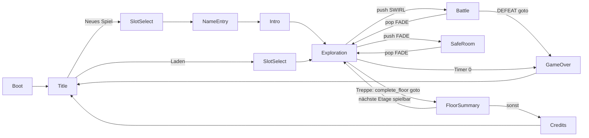

# PRIME TIME DUNGEON — Technische Architektur (verbindlich)

> Status: **verbindlicher Vertrag** für alle Implementierungs-Module M0–M8 (M8 = Live-Hooks, `core/live/`, 05_LIVE_MODUS).
> Vorrang bei Widersprüchen: `00_BRIEF` > **dieses Dokument** (APIs, Schemas, Pfade, IDs, Feldnamen) > `01_GDD` (Zahlen, Inhalte)
> > `03_ART` > `04`/`05`. Formeln und Spielzahlen dieses Dokuments sind aus dem GDD übernommen (GDD §3, §4, §7, §9 kanonisch);
> wo das GDD andere Bezeichner nutzt, gilt die Abbildung in §4.2/§4.4.0.
> Engine: Godot **4.7.2-stable**, GDScript, statisch typisiert. Alle in diesem Dokument genannten Godot-APIs
> wurden gegen das installierte 4.7.2-Binary geprüft (Doctool-Dump + Headless/Xvfb-Testprojekte).
>
> Sprache: Prosa Deutsch. Bezeichner, Pfade, JSON-Keys, Signal-/Methodennamen Englisch.

---

## Inhalt

0. [Spielregeln für parallele Entwicklung](#0-spielregeln-für-parallele-entwicklung)
1. [Dateibaum und Modulzuordnung](#1-dateibaum-und-modulzuordnung)
2. [project.godot](#2-projectgodot)
3. [Autoloads und Events](#3-autoloads-und-events)
4. [Daten (JSON) und DB](#4-daten-json-und-db)
5. [Kampf-Kern (M1)](#5-kampf-kern-m1)
6. [Show, Loot, Progression, Save (M2)](#6-show-loot-progression-save-m2)
7. [Dungeon und Erkundung (M3)](#7-dungeon-und-erkundung-m3)
8. [Art-Kit-API (M4)](#8-art-kit-api-m4)
9. [Szenenfluss und Router](#9-szenenfluss-und-router)
10. [Eingabe und Plattform](#10-eingabe-und-plattform)
11. [Tests, Capture, Autoplay](#11-tests-capture-autoplay)
12. [Performance, Export, CI](#12-performance-export-ci)
13. [Coding-Konventionen](#13-coding-konventionen)
14. [Anhang: Integrations-Checkliste](#14-anhang-integrations-checkliste)

---

## 0. Spielregeln für parallele Entwicklung

### 0.1 Phasen

| Phase | Wer | Ergebnis | Grün-Kriterium |
|---|---|---|---|
| **A — Fundament** | M0 allein | `project.godot`, alle Autoloads, Test-Harness, `GameData` + Defs, UI-Theme, **API-Stubs** aller modulübergreifenden Dateien (siehe 0.2), minimale gültige `data/*.json` | `tools/check.sh --tests-only` grün |
| **B — Implementierung** | M1–M7 parallel | Jedes Modul ersetzt **nur seine eigenen** Dateien (Stub → echte Implementierung) | `tools/check.sh --tests-only` grün |
| **C — Integration** | M0 (+ betroffene Module) | Echter Ablauf Titel → Erkundung → Kampf → Safe Room | `tools/check.sh` (inkl. Autoplay-Smoke) grün + Screenshots per `--shot` |

### 0.2 Stub-Regel (Phase A)

> **Stand 2026-10-10:** Phasen A–C sind abgeschlossen, jede Stub-Datei ist ersetzt. Es gibt keinen Stub-Header und keinen
> Stub-Pfad mehr (`test_m0_compile_all` prüft keine Stub-Header mehr, Tests enthalten keine Stub-Wächter, Autoplay meldet nur
> noch `AUTOPLAY: OK`). Die Regeln unten bleiben als Historie und für künftige neue Module.

- M0 legt für **jede** Datei, deren öffentliche API in §3, §5, §6, §7, §8, §9 definiert ist, einen **Stub** an:
  exakte `class_name`, exakte Signaturen, Rümpfe geben Default-Werte zurück (`return null`, `return []`, `pass`).
  Erste Zeile jedes Stubs: `# STUB(M0) — owned by Mx. Replace completely, keep the public API.`
  **Ausnahme Zustands-Stubs (M2):** `GameState.create_new` (Party aus `party.json` mit Level 1/Basis-HP/-MP/Startausrüstung/
  Lernset ≤ 1, Startinventar + Credits, leerer `ShowState`), `GameState.member`, `FloorRun.create` (`floor_id`, `index`, `seed`,
  `time_left_ticks`, `timer_started`), `FloorRun.time_left_sec` und `FloorRun.summary` (alle Schlüssel) liefern **minimal gültige**
  Werte statt `null`, damit `Game.new_game`/`ensure_state()` schon in Phase B einen Zustand haben und die Szenentests von M3/M5/M6
  unabhängig von M2 grün werden können.
- Shader-Stubs (`art/shaders/*.gdshader`) sind gültige Minimal-Shader mit **allen** in §8.3 genannten Uniforms.
- Szenen-Stubs (`.tscn`) enthalten Root-Node + Skript. `scenes/boot/boot.gd`-Stub geht direkt zu `Router.SCENE_TITLE`
  und gab in Phase A bei `--autoplay` nur `AUTOPLAY: SKIPPED (stub)` aus (Phase A ist abgeschlossen: Autoplay hat keinen
  Stub-/Skip-Pfad mehr, `check.sh` verlangt `AUTOPLAY: OK`, §11.4).
- `data/*.json`-Stubs: je Tabelle minimal gültige Einträge (Party `kai` + `mopsula`, 1 Etage, alle Pflicht-Tags in `mod_lines`).
- Ab Phase B gehört jede Datei **ausschließlich** dem in §1 genannten Modul. Andere Module ändern sie nicht.
  Braucht ein Modul eine API-Änderung an fremden Dateien → Änderung an **diesem Dokument** beantragen, nicht selbst editieren.

### 0.3 Private Zusatzdateien

Module dürfen zusätzliche, nicht gelistete Hilfsdateien **nur in ihren eigenen Ordnern** anlegen.
Diese haben **kein** `class_name` (Kollisionsgefahr) und werden modulintern per `const Foo := preload("res://…")` genutzt.

### 0.4 Abhängigkeitsrichtung (Schichten)

`A ← B` heißt: B darf A benutzen, nie umgekehrt.

```
core/data (M0) ← core/stats ← core/battle (M1) ← core/show, core/loot, core/progression (M2)
core/dungeon (M3) ← core/data, core/loot, core/progression (FloorEvent liest/schreibt GameState)
core/live (M8) ← core/* (RunSim, RunLog, Gift…; nie umgekehrt)
art/* (M4) ← nur Godot + core/data (nur Def-Typen, optional)
autoload/* (M0/M2) ← core/*
scenes/* (M3/M5/M6) ← autoload/*, core/*, art/*
```

`autoload/game.gd` (M0) hält `RunSim`/`RunLog` und ruft `RunRules` (M8), `Show` nutzt `Gift`/`GiftPolicy`/`GiftApplier` (M8) —
das ist die normale Richtung `autoload ← core`. Spielregeln, die Live-Lauf und Verifier teilen, liegen in `core/live/run_rules.gd`
(nicht in `Game`), damit `RunSim` sie ohne Autoloads aufrufen kann (§7.1).

- `core/**` greift **nie** auf Autoloads (`Events`, `DB`, `Game`, `Show`, `Save`, `Router`, `Sfx`) oder den SceneTree zu.
  Daten kommen als `GameData`-Instanz, Zufall als `RandomNumberGenerator` per Parameter.
- `art/**` greift nie auf `Game`, `Show`, `Save`, `Router` zu; `Sfx`/`DB` nur in Gallery-Szenen.

---

## 1. Dateibaum und Modulzuordnung

Pfade relativ zu `prime-time-dungeon/game/` (= `res://`). Jede Datei gehört genau **einem** Modul.
`(S)` = von M0 in Phase A als Stub angelegt (historisch; alle Stubs sind ersetzt, §0.2). Private Helfer ohne `class_name`
(§0.3) dürfen ungelistet bleiben; die, auf die andere Abschnitte verweisen, stehen in §1.8.

### 1.1 Projektwurzel

| Datei | Modul | Zweck |
|---|---|---|
| `project.godot` | M0 | Projekteinstellungen, Autoloads, Input-Map (§2) |
| `export_presets.cfg` | M0 | Export Windows/Linux/macOS/Android/iOS (§12.3) |
| `icon.svg` | M0 | App-Icon (handgeschriebenes SVG: „PTD“-Logo, Magenta/Cyan) |
| `../.github/workflows/ptd-check.yml` (Repo-Root `K0/.github/…`) | M0 | CI (§12.4) |
| `../tools/check.sh` | M0 | Import + Tests + Autoplay-Smoke, `--shot` (§11) |
| `../tools/fullrun.sh` | M6 | Full-Run-Bot Etage 1 headless (§11.4.1; CI-Schritt §12.4) |
| `../tools/perf.sh` | M0 (Phase C) | Performance-Probe unter Xvfb + Leak-Schleife (§12.5, `docs/PERFORMANCE.md`) |
| `../tools/make_icons.sh` | M0 (Phase C) | Launcher-Icons aus `icon.svg` neu erzeugen (§12.3) |
| `../README.md` | M0 | Einstieg: Öffnen/Starten, Steuerung, Dev-Argumente, Werkzeuge, Ordner, Doku-Index, Screenshots |

### 1.2 `autoload/`

| Datei | Modul | Zweck |
|---|---|---|
| `autoload/events.gd` | M0 | Autoload `Events`: globaler Signal-Bus, nur Signale (§3.2) |
| `autoload/db.gd` | M0 | Autoload `DB`: lädt `GameData` in `_init()`, Getter-Fassade (§3.3) |
| `autoload/game.gd` | M0 | Autoload `Game`: hält `GameState`, Etagen-Timer, Settings, Input-Schema, Flow-Helfer (§3.4) |
| `autoload/game_replay.gd` | M0 | Privater Helfer von `Game` (kein class_name, per `preload`): Replay-Motor hinter `Game.replay_log` (§3.4, 05 §11.4) |
| `autoload/game_settings.gd` | M0 | `class_name GameSettings`: Einstellungen, persistiert in `user://settings.cfg` |
| `autoload/show.gd` | M2 (S) | Autoload `Show`: Hype/Zuschauer/Follower, Achievements, Sponsoren, M.O.D. (§3.5) |
| `autoload/save.gd` | M2 (S) | Autoload `Save`: Slots, Datei-I/O, Autosave (§3.6) |
| `autoload/router.gd` | M0 | Autoload `Router`: Szenen-Stack, Übergänge, Kampf/Safe-Room ein/aus (§3.7, §9) |
| `autoload/sfx.gd` | M0 | Autoload `Sfx`: Audio-Busse, Player-Pool, Musik (§3.8) |
| `autoload/sfx_synth.gd` | M0 | `class_name SfxSynth`: erzeugt prozedurale `AudioStreamWAV` |

### 1.3 `core/`

| Datei | Modul | Zweck |
|---|---|---|
| `core/data/game_data.gd` | M0 | `GameData`: Laden, Normalisieren, Validieren, Getter (§4.5) |
| `core/data/data_validator.gd` | M0 | `DataValidator`: Schema-/Referenz-/Wertebereichsprüfung, Vokabular-Konstanten (§4.3) |
| `core/data/json_util.gd` | M0 | `JsonUtil`: Datei lesen, `to_int`, `to_str_array`, `vec2i_to_arr`, `arr_to_vec2i` |
| `core/data/seed_util.gd` | M0 | `SeedUtil`: deterministische Seed-Ableitung (§4.6) |
| `core/data/condition_expr.gd` | M0 | `ConditionExpr`: Parser/Auswerter für Achievement- und Szenen-Bedingungen (§4.4.9, §6.1) |
| `core/data/defs/status_def.gd` | M0 | `StatusDef` |
| `core/data/defs/skill_def.gd` | M0 | `SkillDef` |
| `core/data/defs/item_def.gd` | M0 | `ItemDef` |
| `core/data/defs/class_def.gd` | M0 | `ClassDef` |
| `core/data/defs/party_member_def.gd` | M0 | `PartyMemberDef` |
| `core/data/defs/enemy_def.gd` | M0 | `EnemyDef` |
| `core/data/defs/pseudo_unit_def.gd` | M0 | `PseudoUnitDef` (`enemies.json → pseudo_units`) |
| `core/data/defs/milestone_def.gd` | M0 | `MilestoneDef` |
| `core/data/defs/scene_def.gd` | M0 | `SceneDef` (Mopsula-Szenen) |
| `core/data/defs/encounter_def.gd` | M0 | `EncounterDef` (eingebettet in `floors.json`) |
| `core/data/defs/floor_def.gd` | M0 | `FloorDef` |
| `core/data/defs/lootbox_def.gd` | M0 | `LootboxDef` |
| `core/data/defs/achievement_def.gd` | M0 | `AchievementDef` |
| `core/data/defs/sponsor_def.gd` | M0 | `SponsorDef` |
| `core/data/defs/mod_line_def.gd` | M0 | `ModLineDef` |
| `core/data/defs/talent_def.gd` | 06-B | `TalentDef` (`talents.json`, §4.4.15; Vokabulare `KINDS`, `BEHAVIOUR_KINDS`, `ICONS`) |
| `core/data/defs/species_def.gd` | 06-B | `SpeciesDef` (`species.json`, §4.4.16) |
| `core/data/validators/talents.gd`, `species.gd` | 06-B | Regeln der Tabellen `talents`/`species`, von `DataValidator` per `preload` aufgerufen (06 §8.0 Nr. 7: je neuer Tabelle eine Datei; ohne `class_name`) |
| `core/stats/stat_block.gd` | M1 (S) | `StatBlock` + `enum Stat` (§5.2) |
| `core/stats/elements.gd` | M1 (S) | `Elements`: Element-Konstanten, Multiplikator-Helfer |
| `core/stats/balance.gd` | M1 (S) | `Balance`: alle Formelkonstanten (§5.9) |
| `core/battle/battle_setup.gd` | M1 (S) | `BattleSetup`: Eingabe für einen Kampf |
| `core/battle/combatant.gd` | M1 (S) | `Combatant`: Kampfteilnehmer |
| `core/battle/status_effect.gd` | M1 (S) | `StatusEffect`: aktiver Status |
| `core/battle/ctb_queue.gd` | M1 (S) | `CTBQueue`: Tick-System, Zugreihenfolge, Vorschau |
| `core/battle/battle_command.gd` | M1 (S) | `BattleCommand`: Befehl eines Akteurs |
| `core/battle/action_event.gd` | M1 (S) | `ActionEvent`: Ergebnis-Ereignis für die Darstellung (§5.3) |
| `core/battle/hit_result.gd` | M1 (S) | `HitResult`: Ergebnis einer Schadens-/Heilberechnung |
| `core/battle/damage_calc.gd` | M1 (S) | `DamageCalc`: Formeln (statisch) |
| `core/battle/action_resolver.gd` | M1 (S) | `ActionResolver`: wendet Befehle an, erzeugt `ActionEvent`s |
| `core/battle/enemy_ai.gd` | M1 (S) | `EnemyAI`: Gegner-Befehlswahl |
| `core/battle/auto_policy.gd` | M1 (S) | `AutoPolicy`: Auto-Kampf für die Party |
| `core/battle/battle_state.gd` | M1 (S) | `BattleState`: Kampfmodell + Zustandsautomat (§5.6) |
| `core/battle/battle_result.gd` | M1 (S) | `BattleResult`: Kampfausgang |
| `core/show/stat_ids.gd` | M2 (S) | `StatIds`: Achievement-Zähler-IDs (§6.3) |
| `core/show/show_state.gd` | M2 (S) | `ShowState`: Zuschauer/Follower/Hype/Zähler (Teil von `GameState`) |
| `core/show/show_model.gd` | M2 (S) | `ShowModel`: Zuschauer-/Follower-/Hype-Mathe |
| `core/show/show_rules.gd` | M2 (S) | `ShowRules`: `ActionEvent` → `ShowDelta` (pro Kampf) |
| `core/show/show_delta.gd` | M2 (S) | `ShowDelta` |
| `core/show/achievement_tracker.gd` | M2 (S) | `AchievementTracker` |
| `core/show/sponsor_system.gd` | M2 (S) | `SponsorSystem`: Sponsor-Auswahl |
| `core/show/mod_announcer.gd` | M2 (S) | `ModAnnouncer`: M.O.D.-/Chat-Zeilen wählen + formatieren |
| `core/loot/loot_reward.gd` | M2 (S) | `LootReward` |
| `core/loot/loot_roller.gd` | M2 (S) | `LootRoller`: Lootbox/Truhe würfeln, Pools, Besitz-Menge für die Duplikat-Regel (Kampf-Drops: `BattleState.roll_drops`) |
| `core/progression/game_state.gd` | M2 (S) | `GameState`: kompletter Laufzeit-Spielstand |
| `core/progression/party_member.gd` | M2 (S) | `PartyMember` |
| `core/progression/inventory.gd` | M2 (S) | `Inventory` (Items + Credits) |
| `core/progression/floor_run.gd` | M2 (S) | `FloorRun`: Zustand der aktuellen Etage |
| `core/progression/progression.gd` | M2 (S) | `Progression`: EXP-Kurve, Level-Up, Stats, Ausrüsten |
| `core/progression/level_up_info.gd` | M2 (S) | `LevelUpInfo` |
| `core/progression/battle_bridge.gd` | M2 (S) | `BattleBridge`: `GameState` ↔ `BattleSetup`/`BattleResult` |
| `core/progression/battle_rewards.gd` | M2 (S) | `BattleRewards` |
| `core/progression/shop.gd` | M2 (S) | `Shop`: Automat (kaufen/verkaufen) |
| `core/progression/save_codec.gd` | M2 (S) | `SaveCodec`: Save-Dict ↔ `GameState`, Versionierung, Migration |
| `core/progression/talents.gd` | 06-B | `Talents`: Talent-Show — offene Wahlen, geseedetes Angebot, Wahl, Wirkungen (§6.5) |
| `core/progression/casting.gd` | 06-B | `Casting`: Spezies + Spezialisierung ab Etage 3 — Optionen, Regeln, Wahl (§6.5; UI folgt mit Etage 3) |
| `core/dungeon/room_cell.gd` | M3 (S) | `RoomCell` |
| `core/dungeon/chest_spawn.gd` | M3 (S) | `ChestSpawn` |
| `core/dungeon/enemy_spawn.gd` | M3 (S) | `EnemySpawn` |
| `core/dungeon/event_spawn.gd` | M3 (S) | `EventSpawn` (Etagen-Event im Layout) |
| `core/dungeon/floor_layout.gd` | M3 (S) | `FloorLayout`: Ergebnis von Layout/Generierung |
| `core/dungeon/dungeon_generator.gd` | M3 (S) | `DungeonGenerator` (§7) |
| `core/dungeon/explore_event.gd` | M3 (S) | `ExploreEvent`: serialisierbare Erkundungs-Ereignisse (Brief §6b.2) |
| `core/dungeon/floor_event.gd` | M3 (S) | `FloorEvent`: Regeln der Etagen-Events (§7.4) |

`core/live/` (M8 „Live-Hooks“, 05_LIVE_MODUS §11.2; Stubs von M0, alle `RefCounted`, ohne Autoloads/SceneTree/`Time`):

| Datei | Modul | Zweck |
|---|---|---|
| `core/live/run_sim.gd` | M8 (S) | `RunSim`: deterministische Erkundungs-Uhr in Ticks (§7.1), Replay von Commands (`RunSim.replay`) |
| `core/live/run_rules.gd` | M8 | `RunRules`: die gemeinsamen Spielregeln der aufgezeichneten Nicht-Kampf-Commands (Etage, Räume, Truhen, Tore, Lootboxen, Etagen-Events, Safe Rooms, Szenen, Schwierigkeit) und ihre Legalitätsprüfung `command_refusal` (inkl. `talent`/`casting`, 06-B) — von `Game` und `RunSim` aufgerufen (§7.1) |
| `core/live/run_log.gd` | M8 (S) | `RunLog`: Seed + Commands + Ticks (Brief §6b.3); `to_dict`/`from_dict`/`digest` |
| `core/live/command.gd` | M8 (S) | `Command`: Schema-Prüfung der aufgezeichneten Commands (`t`-Typen aus §3.4) |
| `core/live/canonical_json.gd` | M8 (S) | `CanonicalJson`: kanonische Serialisierung für Hashes; `static var last_error: String` (von den statischen Funktionen gesetzt, gelesen als `CanonicalJson.last_error`) |
| `core/live/state_hash.gd` | M8 (S) | `StateHash`: SHA-256 über `GameState`/`BattleState` (ohne Anzeigefelder) |
| `core/live/event_def.gd` | M8 (S) | `EventDef`: Live-/Offline-Event inkl. `quest`, `window` (Brief §6b.5) |
| `core/live/event_catalog.gd` | M8 (S) | `EventCatalog`: lädt/validiert `data/events.json` |
| `core/live/quest_tracker.gd` | M8 (S) | `QuestTracker`: Quest-Fortschritt aus normalisierten Events |
| `core/live/score_calc.gd` | M8 (S) | `ScoreCalc`: Punkte eines Event-Laufs |
| `core/live/leaderboard.gd` | M8 (S) | `Leaderboard`: lokale Top 10 |
| `core/live/gift.gd` | M8 (S) | `Gift`: Geschenk-Schema, `validate` (Art je Quelle, `sender_ref`, Inhaltsgrenzen), `make_system`, `make_dev`, `is_external` |
| `core/live/gift_policy.gd` | M8 (S) | `GiftPolicy`: Caps, Wirkungsfaktoren (Ganzzahl), Lauf-Bindung, Mindestabstand; `refusal` = DIE Anwendungsprüfung (Show und RunSim), `remember`/`note_applied` = Buchung; prüft zuletzt die Sponsor-Fenster (`SponsorWindows.check`) |
| `core/live/sponsor_windows.gd` | M8 | `SponsorWindows`: Sponsor-Fenster (Nutzerentscheidung 2026-10-08, 05 §6.13) — Fahrplan in Ticks (periodisch / Safe Room / Boss-Countdown / QA), Plätze, Pro-Zuschauer-Limit, Gnadenfrist gestempelter Geschenke, Regeln `rules.sponsor_windows` + Standard für Kampagne/Offline; Zustand in `GameState.flags["live"]["sponsor"]` |
| `core/live/gift_applier.gd` | M8 (S) | `GiftApplier`: Geschenk außerhalb des Kampfes anwenden; Buchung im Kampf angewandter Geschenke (`note_battle_gift`) |
| `core/live/fair_roll.gd` | M8 (S) | `FairRoll`: Commit-Reveal-Würfel (nur Tests im Slice) |

Signaturen von `RunSim` stehen in §7.1, die übrigen in 05_LIVE_MODUS §11.2 (dort normativ; Namen/Typen dieses Dokuments haben Vorrang).

### 1.4 `data/` (alle M7, Stubs von M0)

| Datei | Zweck |
|---|---|
| `data/statuses.json` | Statuseffekte |
| `data/skills.json` | Fähigkeiten inkl. Basisangriffe, Stunts, Item-Effekte, Gegner-Skills |
| `data/items.json` | Verbrauchsgüter, Ausrüstung, Schlüsselgegenstände |
| `data/classes.json` | Klassen (ab Etage 3, Datenmodell jetzt) |
| `data/party.json` | Kai, Graf Mopsula + Startinventar/-Credits (`start`) |
| `data/enemies.json` | Gegner inkl. Bosse (KI, Phasen) + Pseudo-Einheiten (`pseudo_units`) |
| `data/floors.json` | Etagen inkl. Encounter, handgebautem Layout (Zonen, Tore, Truhen, Events, Spawner, Safe Rooms), Palette, `quest`/`window` |
| `data/lootboxes.json` | Bronze/Silber/Gold/Fan-Box + Seltenheits-Pools (`pools`) + Pity (`pity`) |
| `data/achievements.json` | Achievements (Trigger + Bedingung) |
| `data/sponsors.json` | Sponsoren + Geschenke + Gewichtungsregeln |
| `data/milestones.json` | Follower-Meilensteine |
| `data/mod_lines.json` | M.O.D.-, Mopsula-, Kai- und Chat-Zeilen |
| `data/scenes.json` | Mopsula-Szenen (Safe Room) |
| `data/talents.json` | Talente der Talent-Show (06-B, Inhalt + Schema §4.4.15) |
| `data/species.json` | Spezies ab Etage 3 (06-B, Inhalt + Schema §4.4.16) |
| `data/events.json` | Live-/Offline-Events (M7 Inhalt, M8 Schema); **nicht** in `GameData.TABLES`, geladen von `EventCatalog` (§4.5); eigenes Format `{schema, events}` (Ausnahme von §4.1, 05 §10.1) |

### 1.5 `art/` (alle M4)

| Datei | Zweck |
|---|---|
| `art/shaders/toon.gdshader` (S) | Toon-Shading (Bänder, Rim, Flash, Highlight, Dissolve), optional Vertex-Color |
| `art/shaders/toon_outline.gdshader` (S) | Inverted-Hull-Outline (als `next_pass`) |
| `art/shaders/env_tiles.gdshader` (S) | Umgebung: Weltkoordinaten-Fliesen/Grout/Schmutz, Vertex-Color, keine Outline |
| `art/shaders/glow.gdshader` (S) | Unshaded Emissive (Neon, Treppen-Glühen) |
| `art/shaders/vfx_additive.gdshader` (S) | Additive Billboard-Partikel |
| `art/shaders/hologram.gdshader` (S) | M.O.D.-Hologramm / Bildschirme |
| `art/shaders/ui_swirl.gdshader` (S) | canvas_item: Kampf-Swirl-Übergang (Router) |
| `art/shaders/ui_tv_overlay.gdshader` (S) | canvas_item: Scanlines/Vignette/Chromatic für TV-Overlay |
| `art/shaders/ui_tv_overlay_aberration.gdshader` | canvas_item: TV-Overlay Qualität `high` (chromatische Aberration über einen Screen-Sampler, sonst gleiche Uniforms wie `ui_tv_overlay`, 03_ART §3.9/F7, A10); `ShowOverlay` wählt ihn bei `high`, sonst `ui_tv_overlay` |
| `art/shaders/ptd_color.gdshaderinc` | Gemeinsamer Farbraum-Helfer `ptd_vertex_albedo` (sRGB-Vertex-/Partikelfarben → linear nur außerhalb von Compatibility, 03_ART F1/A10) für `toon`/`env_tiles`/`vfx_additive` (`#include`) |
| `art/materials/palette.gd` (S) | `Palette`: Farbkonstanten, Hex-Parser, Theme-Paletten |
| `art/materials/materials.gd` (S) | `Materials`: Material-Fabrik mit Cache |
| `art/kit/mesh_util.gd` (S) | `MeshUtil`: Low-Poly-Primitive, Merge mit Vertex-Colors, Tri-Zählung |
| `art/kit/character_rig.gd` (S) | `CharacterRig`: Standard-Animationsschnittstelle |
| `art/kit/character_builder.gd` (S) | `CharacterBuilder`: Modell-Spec → `CharacterRig` |
| `art/kit/archetypes.gd` | Teile-Rezepte je `base` (privat, kein class_name) |
| `art/kit/room_spec.gd` (S) | `RoomSpec`: Eingabe M3 → M4 |
| `art/kit/env_kit.gd` (S) | `EnvKit`: Räume, Arena, Safe Room, Environment, Licht |
| `art/kit/prop_kit.gd` (S) | `PropKit`: Props |
| `art/kit/chest_prop.gd` (S) | `ChestProp`: Truhe mit `open()` |
| `art/kit/vfx.gd` (S) | `Vfx`: Effekte + Schadenszahlen |
| `art/kit/damage_number.gd` | Label3D-Schadenszahl (privat) |
| `art/gallery/character_gallery.tscn` + `.gd` | Alle Archetypen/Party/Gegner aus DB nebeneinander (Screenshot-Ziel) |
| `art/gallery/env_gallery.tscn` + `.gd` | Raum-Varianten aller Türmasken + Arena + Safe Room |
| `art/gallery/vfx_gallery.tscn` + `.gd` | Alle Vfx-Arten im Loop |
| `art/gallery/render_probe.tscn` + `.gd` | Render-Regressionsprobe (03_ART A11): Outline-Richtung, Partikel-Farbraum, Schadenszahl-Helligkeit, Log ohne „different indices“; druckt `RENDER_PROBE: OK` (Pflicht-Shot in §12.4) |
| `art/gallery/log_spy.gd` | `Logger`, der Log-Nadeln (z. B. „different indices“) sammelt — von Probe und M4-Tests genutzt (privat) |
| `art/gallery/*_gallery.tscn` (Varianten) | Seiten-Varianten der Galerien (`page`-Export: archetype/hero/enemy/boss/anim/prop, env room/kinds/props/arena/safe) |
| `art/gallery/name_tags.gd` | Bildschirm-Namensschilder der Galerien (2D-Labels an 3D-Punkten, überlappungsfrei; privat) |
| `art/icons/icon_1024.png`, `icon_192.png`, `icon_fg_432.png`, `icon_bg_432.png` | Export-Launcher-Icons (iOS 1024 deckend, Android Legacy + Adaptive Vorder-/Hintergrund), erzeugt aus `icon.svg` von `tools/make_icons.sh` (§12.3) |

### 1.6 `scenes/`

| Datei | Modul | Zweck |
|---|---|---|
| `scenes/boot/boot.tscn` + `boot.gd` | M6 (S) | **Main Scene**: Args lesen, Settings anwenden, GlobalUi + ggf. Autoplay anlegen, → Titel |
| `scenes/boot/autoplay.gd` | M6 | Autoplay-Treiber (§11.4) |
| `scenes/boot/fullrun.gd` | M6 | Full-Run-Bot `--autoplay=full` (§11.4.1) |
| `scenes/title/title.tscn` + `title.gd` | M6 (S) | `TitleScreen`: Fortsetzen / Neues Spiel / Laden / Event-Lauf / Optionen / Credits / Beenden (§9.5) |
| `scenes/title/slot_select.tscn` + `.gd` | M6 | Slot-Auswahl (Neu/Laden) |
| `scenes/title/name_entry.tscn` + `.gd` | M6 | Namenseingabe (Default „Kai“, `LineEdit.max_length = 12`) + Modus Prime Time / Vorabendprogramm |
| `scenes/title/intro.tscn` + `.gd` | M6 | M.O.D.-Intro-Sequenz |
| `scenes/title/game_over.tscn` + `.gd` | M6 | Game Over (Grund: `defeat`/`timer`) |
| `scenes/title/credits.tscn` + `.gd` | M6 | „Etage 2 folgt“-Abspann |
| `scenes/exploration/exploration.tscn` + `exploration.gd` | M3 (S) | `ExplorationScene`: Etage aufbauen, Spieler/Gegner/Interaktion, Encounter |
| `scenes/exploration/floor_builder.gd` | M3 | `FloorLayout` → Raum-Nodes via `EnvKit`/`PropKit` |
| `scenes/exploration/player.tscn` + `player_controller.gd` | M3 | CharacterBody3D + `CharacterRig`, Laufen/Schleichen, Feldschlag/Interagieren (`action`) |
| `scenes/exploration/companion_follower.gd` | M3 | Mopsula folgt Kais Spur (ohne NavigationServer, §7.3) |
| `scenes/exploration/camera_rig.gd` | M3 | Orbit-Kamera mit SpringArm3D |
| `scenes/exploration/enemy_actor.tscn` + `enemy_actor.gd` | M3 | Sichtbare Gegnergruppe: IDLE/PATROL/ALERT/CHASE/RETURN, Kontakt |
| `scenes/exploration/interactable.gd` | M3 | Basis Area3D-Interaktion (Prompt-Text, `interact()`) |
| `scenes/exploration/chest_interactable.gd` | M3 | Truhe (wood/metal/locked) |
| `scenes/exploration/gate_interactable.gd` | M3 | Tor (benötigt Schlüssel/Event) |
| `scenes/exploration/event_interactable.gd` | M3 | Etagen-Event mit Wahl-Dialog (§7.4) |
| `scenes/exploration/stairs_interactable.gd` | M3 | Treppe |
| `scenes/exploration/safe_door_interactable.gd` | M3 | Safe-Room-Tür (trägt die Safe-Room-ID) |
| `scenes/battle/battle.tscn` + `battle_scene.gd` | M5 (S) | `BattleScene`: Root, Setup, Ende → Router |
| `scenes/battle/battle_controller.gd` | M5 | Kampfschleife (§5.7) |
| `scenes/battle/battle_player.gd` | M5 | Spielt `ActionEvent`-Listen ab |
| `scenes/battle/battle_stage.gd` | M5 | Arena, Slot-Positionen, Rigs |
| `scenes/battle/battle_camera.gd` | M5 | Kamera-Shots |
| `scenes/battle/ui/battle_hud.tscn` + `.gd` | M5 | Kampf-HUD (CanvasLayer 5): Party-Panels, CTB-Leiste, Menüs |
| `scenes/battle/ui/party_panel.gd` | M5 | HP/MP/Status je Partymitglied |
| `scenes/battle/ui/ctb_bar.gd` | M5 | Zugreihenfolge-Leiste rechts (12 Einträge, bei Schema TOUCH 10; Pseudo-Icons, Geist-Vorschau) |
| `scenes/battle/ui/command_menu.gd` | M5 | Angriff/Fähigkeit/Stunt (mit Cooldown-Zahl)/Item/Verteidigen/Flucht |
| `scenes/battle/ui/action_list.gd` | M5 | Untermenü Fähigkeiten/Stunts/Items |
| `scenes/battle/ui/target_cursor.gd` | M5 | Zielauswahl |
| `scenes/battle/ui/battle_results.tscn` + `.gd` | M5 | Ergebnis: EXP, Credits, Items, Level-Ups, Follower, Achievements |
| `scenes/safe_room/safe_room.tscn` + `safe_room.gd` | M6 (S) | `SafeRoomScene`: Innenraum (Theme je Safe Room) + Menü + Mopsula-Szenen (`scenes.json`) |
| `scenes/safe_room/vending_menu.tscn` + `.gd` | M6 | Automat (Shop) |
| `scenes/safe_room/lootbox_opening.tscn` + `.gd` | M6 | Lootbox-Öffnung mit M.O.D.-Kommentar |
| `scenes/ui/theme/ui_theme.gd` | **M0** | `UiTheme`: Basis-Theme (Code-generiert) |
| `scenes/ui/global_ui.tscn` + `global_ui.gd` | M6 (S) | Persistente UI: ShowOverlay, ModDialog, Toasts, DebugOverlay |
| `scenes/ui/show_overlay.tscn` + `.gd` | M6 | TV-Overlay: LIVE, Zuschauer, Follower, Hype-Meter, Sponsor-Banner, Chat-Ticker |
| `scenes/ui/mod_dialog.tscn` + `.gd` | M6 | M.O.D.-/Mopsula-Textbox mit Queue; Dialog-Presenter (`Game.set_dialog_presenter`, §9.4) |
| `scenes/ui/toast_stack.gd` | M6 | Achievement-/Hinweis-Toasts |
| `scenes/ui/exploration_hud.tscn` + `.gd` | M6 (S) | `ExplorationHud`: Timer, Etage, Party-Mini-Status, Minimap, Prompt, Touch, Pause |
| `scenes/ui/minimap.gd` | M6 | Minimap + große Karte |
| `scenes/ui/touch_controls.tscn` + `.gd` | M6 | Touch-Layer (virtueller Stick + Buttons + Kamera-Drag) |
| `scenes/ui/virtual_joystick.gd` | M6 | Floating Joystick |
| `scenes/ui/pause_menu.tscn` + `.gd` | M6 | Pause: Party, Inventar, Ausrüstung, Fähigkeiten, Achievements, Bestiarium, Optionen, Zum Titel |
| `scenes/ui/party_menu.gd` | M6 | Party-Status (+ 06-B: Talente-Zeile mit „n Wahl(en) offen“, Casting-Zeile) |
| `scenes/ui/talent_show.tscn` + `.gd` | 06-B | Talent-Show (Modal, Ebene 60): je offene Wahl zwei Karten, `pick(i)` → `Game.pick_talent`; „Später“ |
| `scenes/ui/talent_text.gd` | 06-B | Texte/Icons der Talente (Wirkungszeilen aus den Daten), privat |
| `scenes/ui/inventory_menu.gd` | M6 | Inventar (Feld-Nutzung) |
| `scenes/ui/equipment_menu.gd` | M6 | Ausrüstung |
| `scenes/ui/skills_menu.gd` | M6 | Fähigkeiten + Freischalt-Level (aus `learnset`) |
| `scenes/ui/achievements_menu.gd` | M6 | Achievements (erhalten / verborgen „???“) |
| `scenes/ui/bestiary_menu.gd` | M6 | Bestiarium aus `GameState.bestiary` |
| `scenes/ui/floor_summary.tscn` + `.gd` | M6 | `FloorSummary`: Etagen-Bilanz (Zeit, Kills, Zuschauer-Peak, Follower, Achievements) → `Game.continue_after_summary()` |
| `scenes/ui/event_lobby.tscn` + `.gd` | M6 | Event-Lauf-Karte (05 CR-10) |
| `scenes/ui/run_result.tscn` + `.gd` | M6 | Event-Lauf-Ergebnis (05 CR-10) |
| `scenes/ui/settings_menu.tscn` + `.gd` | M6 | Einstellungen |
| `scenes/ui/confirm_dialog.tscn` + `.gd` | M6 | Ja/Nein-Dialog |
| `scenes/ui/safe_area_container.gd` | M6 | MarginContainer mit Safe-Area-Rändern |
| `scenes/ui/input_glyph.gd` | M6 | Tasten-/Button-Symbol je Input-Schema |
| `scenes/ui/debug_overlay.gd` | M6 | Nur Debug-Build: F3 FPS, Draw Calls, Primitives, Seed, Raum, Show-Werte, Sponsor-Fenster; bei offenem Overlay F4 Test-Geschenk, F5 QA-Sponsor-Fenster (05 §11.3) |
| `scenes/ui/icon_mesh.gd` | M6 | Privat: sammelt die Primitive eines Vektor-Icons/Widgets und gibt sie als **ein** Dreiecks-Array aus (ein Canvas-Draw-Call; genutzt von `ui_icon.gd`, `minimap.gd`, Hype-Leiste und `HudStyle.Icon`, §12.1) |

### 1.7 `tests/`

Jede Datei unter `tests/` gehört dem genannten Modul; `test_<modul>_*.gd` ist die Pflicht-Benennung (Runner lädt alle
`test_*.gd` außer in `tests/lib/` und `tests/fixtures/`).

| Datei | Modul | Zweck |
|---|---|---|
| `tests/run_tests.gd` | M0 | Test-Runner (§11.1): Fehler schlagen Skips; ein Skip lässt den Lauf scheitern, außer er steht mit Grund in `ALLOWED_SKIPS` oder `--allow-skips` ist gesetzt |
| `tests/capture.gd` | M0 | Screenshot-Werkzeug (§11.3) |
| `tests/capture_recipes.gd` | M0 | Benannte Capture-Zustände für `--recipe=` (§11.3; per `load()` nach den Autoloads, kein class_name) |
| `tests/lib/test_case.gd` | M0 | `TestCase`: Basis mit Asserts (§11.2) inkl. `assert_time_budget` (nur mit `PTD_PERF_ASSERTS=1`); liegt in `lib/`, damit der Runner sie nicht als Testdatei lädt |
| `tests/fixtures/data_min/*.json` | M0 | Minimaler gültiger Datensatz (alle 15 Tabellen aus `GameData.TABLES`) für M0-Tests |
| `tests/fixtures/router/router_screen.tscn` + `.gd` | M0 | Fixture-Screen (nur Screen-Vertrag §9.2) für die generischen Operationen in `test_m0_router` |
| `tests/fixtures/runner_selftest/test_selftest_cases.gd` | M0 | Absichtlich fehlschlagende, abstürzende und überspringende Fälle; nur im Kindprozess des Runner-Selbsttests (`--root=…`) ausgeführt |
| `tests/fixtures/live/canonical_vectors.json`, `gift_tables.json` | M8 | Testvektoren `CanonicalJson` (identisch mit Python/JS/Go) und Gift-Tabellen für `FairRoll` (05 §10.2) |
| `tests/test_m0_harness.gd` | M0 | Selbsttest Asserts/Runner (Kindprozess: SCRIPT ERROR → FAIL, Fehler schlagen Skip, nicht zugelassener Skip → Exit 1) |
| `tests/test_m0_autoloads.gd` | M0 | `project.godot`-Vertrag, Autoload-Reihenfolge, Events-Signalliste, Game/Settings-Grundlagen, UiTheme |
| `tests/test_m0_router.gd` | M0 | Router: Stack, Queue, goto/push/pop, Fehlerpfade; Kampf-, Safe-Room- und Game-Over-Helfer gegen die echten Screens (`Router.current.scene_file_path`, Payloads) |
| `tests/test_m0_game.gd` | M0 | Game: Command-IDs, Dialog-Pause-Reset, Quest-Metriken, Replay-Kontext; Integration Live-Lauf ≡ `replay_log` |
| `tests/test_m0_db.gd` | M0 | Laden/Validieren/Fehlerfälle von `GameData` |
| `tests/test_m0_compile_all.gd` | M0 | Lädt jede `.gd`/`.tscn`/`.gdshader` unter `res://` → fängt Parse-Fehler; §13.4 tscn-Format; §13.1 Zeilenlänge ≤ 120 (Tab = 1 Zeichen) |
| `tests/test_m0_seed_util.gd` | M0 | Determinismus `SeedUtil` |
| `tests/test_m0_sfx.gd` | M0 | Busse, jede ID baut, Musik-Loop läuft weiter (`loop_end`), unbekannte ID ohne Absturz |
| `tests/test_m0_condition_expr.gd` | M0 | `ConditionExpr`: Grammatik, Typvergleiche, Fehlerfälle |
| `tests/test_m1_fixture.gd` | M1 | Mini-Datensatz unabhängig von `res://data` + gemeinsame Helfer der `test_m1_*` (per `preload`), mit Selbsttest |
| `tests/test_m1_stats.gd` | M1 | StatBlock, Elemente |
| `tests/test_m1_ctb.gd` | M1 | Tick-System, Vorschau, Haste/Slow, Präventiv/Hinterhalt |
| `tests/test_m1_damage.gd` | M1 | Formeln, Krit, Elemente, Verteidigen, Treffer, Stunt-Chance |
| `tests/test_m1_status.gd` | M1 | Statusdauer, Gift am Zugbeginn, Stun-Verzögerung, Haste/Slow-Ausschluss, Resistenz, Immunität |
| `tests/test_m1_ai.gd` | M1 | EnemyAI-Bedingungen/Zielregeln/Taunt, Phasen-Ops, Pseudo-Einheit, AutoPolicy |
| `tests/test_m1_battle_flow.gd` | M1 | Kompletter Kampf bis Sieg/Niederlage/Flucht, Event-Invarianten, Drops |
| `tests/test_m1_battle_snapshot.gd` | M1 | `BattleState.to_dict`/`from_dict` (05 CR-14): hash-stabil, ohne Floats, Weiterspielen identisch |
| `tests/test_m2_fixtures.gd` | M2 | Mini-Datensatz + Helfer der `test_m2_*` (per `preload`) |
| `tests/test_m2_show.gd` | M2 | ShowRules-Hype, Zuschauer, Follower, Sponsor-Trigger |
| `tests/test_m2_achievements.gd` | M2 | Zähler, Schwellen, Belohnungen |
| `tests/test_m2_loot.gd` | M2 | Lootbox/Truhe deterministisch, Ausrüstungs-Duplikate → Credits, Drop-Regel `BattleState.roll_drops` |
| `tests/test_m2_progression.gd` | M2 | EXP-Kurve, Level-Up, Equip, BattleBridge (Diebstahl bei geflohenem Dieb, KO-Rückkehr mit 1 HP nach der EXP) |
| `tests/test_m2_save.gd` | M2 | Roundtrip, Migration, kaputte Dateien, Slots |
| `tests/test_m2_shop.gd` | M2 | Kaufen/Verkaufen |
| `tests/test_m3_dungeon_gen.gd` | M3 | `floor_1`-Layout valide/deterministisch; 200 Seeds prozedural: Invarianten, Determinismus, Laufzeit |
| `tests/test_m3_floor_event.gd` | M3 | `FloorEvent.choices/resolve/apply` für alle 5 Typen mit festen Seeds |
| `tests/test_m3_exploration_scene.gd` | M3 | Szene headless instanziieren, Spawn, Encounter auslösen (Signal-Spion) |
| `tests/test_m4_art_kit.gd` | M4 | Alle Bases/Props/Räume bauen, Tri-Budgets, Anim-Interface |
| `tests/test_m4_env.gd` | M4 | `build_room` für alle Türmasken × Arten × Zonenstile (Budgets, Türen, Wände, Determinismus, Aufbauzeit), Arena, Safe Rooms, Glyphen (`has_char`) |
| `tests/test_m4_galleries.gd` | M4 | Jede Galerie-Szene instanziiert, baut und läuft einige Frames ohne Skriptfehler |
| `tests/test_m4_materials.gd` | M4 | Palette, Materials-Cache, MeshUtil, Shader-Verträge (§8.2/§8.3) |
| `tests/test_m4_style.gd` | M4 | §13.1 Zeilenlänge in `art/**` und den M4-Tests (seit `test_m0_compile_all` projektweit auch dort geprüft) |
| `tests/test_m4_vfx.gd` | M4 | Jede Vfx-Art (CPUParticles, Budgets, Pool, Dauer), Schadenszahlen, Glyphen (`has_char`) |
| `tests/test_m4_visual_pass.gd` | M4 | Befunde der Screenshot-Matrix im Art-Kit (Türsturz-Lampe, Arena-Bildschirm, Müll-Abstand …) |
| `tests/test_m5_battle_scene.gd` | M5 | Battle-Szene headless mit Auto-Kampf bis Ende |
| `tests/test_m5_visual_pass.gd` | M5 | Kampf-Framing/HUD-Layout der Screenshot-Matrix (reservierte Ecken der M.O.D.-Box, Untermenüs darüber) |
| `tests/test_m6_ui_scenes.gd` | M6 | Alle UI-Szenen instanziieren, Default-Fokus vorhanden, Glyphen statischer Texte (`has_char`) |
| `tests/test_m6_autoplay.gd` | M6 | Autoplay-Schritttabelle, Trockenlauf über `boot_to_title`, Watchdog, Safe-Room-Wahl, Boot-Argumente |
| `tests/test_m6_fullrun.gd` | M6 | Full-Run-Bot: Argumente, reine Helfer (Wege, Stick-Eingabe, Bewertungen), Niederlage → Game Over → Laden mit echten Screens |
| `tests/test_m6_hud.gd` | M6 | `ExplorationHud`: API, Etagen-Timer-Stufen, Party-Mini-Status, Minimap, Prompt, Quest-Zeile |
| `tests/test_m6_lootbox_odds.gd` | M6 | Angezeigte Lootbox-Wahrscheinlichkeiten ≡ Würfelregeln (GDD §9.3) |
| `tests/test_m6_menus.gd` | M6 | Menüs ändern den Zustand nur über aufgezeichnete Game-Commands; Bestätigungsdialog, Einstellungen (Schwierigkeit nur Kampagne), Titel, Event-Lobby, Ergebnis |
| `tests/test_m6_overlay.gd` | M6 | ShowOverlay (Modi, Zahlenformate, Sponsor-Bauchbinde, Geschenk-Banner, Chat), ModDialog, Toasts, DebugOverlay |
| `tests/test_m6_safe_room.gd` | M6 | Safe Room: Aufzeichnung + Vollheilung, Menüreihenfolge, Modals mit Fokus-Rückgabe, Mopsula-Szenen, Event-Läufe speichern nicht |
| `tests/test_m6_visual_pass.gd` | M6 | UI-Layout-Verträge der Screenshot-Matrix; alle Capture-Rezepte existieren |
| `tests/test_m7_data_content.gd` | M7 | Inhalt: Mengen laut GDD (11 Gegner, 2 Bosse, 16 Party-Skills, 2 Stunts, 25 Gegner-Skills, 11 Boss-Skills, 29 Achievements, 7 Sponsoren, 6 Meilensteine, 6 Status, 4 Szenen), Balancing-Sanity |
| `tests/test_m7_balance.gd` | M7 | Jede reguläre Begegnung von Etage 1 ≥ 80 % Siegquote (50 Seeds) auf GDD-§13-Level und -Ausrüstung; Boss-Bänder |
| `tests/test_m7_show_balance.gd` | M7 | Etage 1 als Show-Staffel mit dem echten `Show`-Autoload: Follower-, Hype- und Geschenk-Bänder (GDD §13) |
| `tests/test_m7_events.gd` | M7 | Inhalt von `data/events.json` gegen das Schema (05 §10.1) und die Spieldaten |
| `tests/test_m7_floor_layout.gd` | M7 | Handgebautes Layout Etage 1 (Zellen, Zonen, Tore, Truhen, Gruppen, Events, Streuner, Safe Rooms, Treppe, Routen) |
| `tests/test_m7_text_content.gd` | M7 | M.O.D.-/Chat-/Mopsula-Zeilen (Mindestzahlen, Längen, Platzhalter, IDs), Szenen, deutsche Anzeigetexte |
| `tests/test_m8_canonical_json.gd` | M8 | `CanonicalJson` gegen die gemeinsamen Testvektoren |
| `tests/test_m8_command.gd` | M8 | `Command.validate` je Typ; jeder Typ hat einen Zweig in `RunSim.apply` und im Replay-Motor von `Game.replay_log` |
| `tests/test_m8_event_def.gd` | M8 | `EventDef`/`EventCatalog`: Fenster, ISO-Zeiten, Validierung (u. a. `rules.gifts.sources`) |
| `tests/test_m8_fair_roll.gd` | M8 | `FairRoll`: Testvektor 05 §7.4 bitgenau, Verteilung |
| `tests/test_m8_gift.gd` | M8 | Gift-Schema: Pflichtfelder, Art je Quelle, `sender_ref`, Inhaltsgrenzen, Signaturformat |
| `tests/test_m8_gift_applier.gd` | M8 | `GiftApplier` außerhalb des Kampfes; gleiche Kiste im/außerhalb des Kampfes ergibt dasselbe |
| `tests/test_m8_gift_policy.gd` | M8 | `effect_pm`-Tabelle, Caps, Kistenschwelle, Buchung je Lieferung, Mindestabstand, Lauf-Bindung |
| `tests/test_m8_integrity.gd` | M8 | Verifier gegen gefälschte Logs (Schwierigkeit, Header, Etagen-/Szenen-/Talent-/Casting-Commands, Geschenke nach `descend`, `wrong_target`, Ledger, `too_soon`), `Game.replay_log`-Vertrag, eindeutige `run_id`s |
| `tests/test_m8_leaderboard.gd` | M8 | Bestenliste: Rang, Top 10, Persistenz, korrupte Datei → leer |
| `tests/test_m8_no_global_rng.gd` | M8 | Determinismus-Lint für `core/**` (kein globales RNG, keine Uhr, keine Gleitkomma-Funktionen) |
| `tests/test_m8_quest_tracker.gd` | M8 | Alle S0-Quest-Typen |
| `tests/test_m8_receive_gift.gd` | M8 | `Show.receive_gift` als einziger Geschenk-Eingang (System nicht im Log, Dev im Log, Pur-Liga) |
| `tests/test_m8_replay.gd` | M8 | Replay-Gleichheit headless gegen `RunSim` und über die `Game`-Fassade; gefälschte Commands/Geschenke → `errors` |
| `tests/test_m8_run_log.gd` | M8 | `RunLog`: Rundlauf, `digest`, Tick-Reihenfolge, Command-IDs, Positionsproben, Checkpoints |
| `tests/test_m8_run_sim.gd` | M8 | `RunSim` ohne Autoloads: Timer, Hype-Abkühlung, Pazifist-Zählung, Streuner in Ticks; `step(1)` × n ≡ `step(n)` |
| `tests/test_m8_score_calc.gd` | M8 | `ScoreCalc`: Beispiel 05 §10.4, Caps, Tie-Break |
| `tests/test_m8_sponsor_windows.gd` | M8 | Sponsor-Fenster (05 §6.13): Fahrplan in Ticks, Kampf friert ein, Plätze/Zuschauer-Limit, Codes, Safe Room (Leerlauf-Ticks), Boss-Countdown, Replay-Gleichheit; Integration `Show.receive_gift`, Overlay-Badge, Debug-Werkzeug |
| `tests/test_m8_state_hash.gd` | M8 | `StateHash.of`/`of_battle` ohne Anzeigefelder |
| `tests/test_06b_talents.gd` | 06-B | `talents.json` + Validator, offene Wahlen (ungerade Level ab L3), geseedetes Angebot, Wahlregeln, jede Wirkungsart an ihrem Ort, Command + Replay (`RunSim`, `Game`-Fassade), Save/Hash-Kompatibilität |
| `tests/test_06b_species.gd` | 06-B | `species.json` + Validator (kein Kronen-Motiv an Mopsula, `spc_original`), `Casting` (Optionen, Gründe, Re-Spec-Regeln, Werte Klasse × Spezies), Command + Replay, Save |
| `tests/test_06b_talent_show.gd` | 06-B | Talent-Show-Szene (Karten, „Später“, Erst-Erklärung, Vorschau), TALENT-SHOW-Knopf im Safe Room, Chip „TALENT BEREIT“, Party-Seite |
| `tests/test_06b_balance.gd` | 06-B | Talentboni bei L10 ≤ +15 % je Kampfwert für jede Wahlfolge (erschöpfend); Boss-Quoten mit Bot-Wahl ±5 Punkte (gepaart, 300 Seeds) |
| `tests/test_perf_router_cycles.gd` | Phase C | Router-Zyklen Erkundung → Kampf → Safe Room ohne Wachstum der Node-/Objekt-Minima, `Sfx.stop_all`, Etagen-Aufbauzeit, Physik-/Licht-Layer der Etage (§12.1, §12.5) |
| `tests/test_perf_platform.gd` | Phase C | Mobil-Projekteinstellungen, Export-Presets + Launcher-Icons, Boot kompiliert keine Screens vorab (§2.1, §12.3) |
| `tests/perf/perf_probe.gd` + `perf_runner.gd`, `tests/perf/boot_timer.gd` | Phase C | Mess-Werkzeug für `tools/perf.sh` (§12.5); keine Tests (kein `test_`-Präfix) |
| `tests/tools/make_icons.gd` | Phase C | Icon-Generator für `tools/make_icons.sh` (§12.3) |

### 1.8 Private Helfer, auf die andere Abschnitte verweisen (§0.3)

Ohne `class_name`, genutzt per `const X := preload("res://…")` innerhalb des Moduls:

| Datei | Modul | Inhalt |
|---|---|---|
| `core/stats/fixed_math.gd` | M1 | `FixedMath`: Ganzzahl-/Promille-/Basispunkt-Arithmetik (`div_round`, `roll_bp`, …), CR-12 |
| `autoload/game_replay.gd` | M0 | Replay-Motor von `Game.replay_log` (§3.4) |
| `scenes/title/title_flow.gd` | M6 | `TitleFlow.parse_args` (Boot-Argumente, §11.4) |
| `scenes/battle/ui/hud_style.gd` | M5 | `HudStyle` inkl. `HudStyle.Icon` (§12.1) |
| `scenes/exploration/encounter_rules.gd`, `choice_dialog.gd` | M3 | Kontakt-/Vorteilsregeln (`CONTACT_RADIUS`, `GRACE_*`), Wahl-Dialog der Etagen-Events |
| `scenes/ui/ui_util.gd`, `menu_base.gd`, `scene_kit.gd`, `broadcast_bg.gd` | M6 | UI-Bausteine, Menü-Basis, Safe-Room-/Studio-Kulissen, TV-Hintergrund |
| `art/kit/room_builder.gd`, `set_builder.gd`, `gltf_rig.gd` | M4 | Raum-/Kulissenbau und glTF-Rig hinter `EnvKit`/`CharacterBuilder` |

---

## 2. project.godot

### 2.1 Inhalt (exakt; `[input]` siehe 2.2)

```ini
config_version=5

[application]

config/name="Prime Time Dungeon"
config/version="0.1.0"
config/description="Galaktische Reality-Show-Dungeon-Crawler."
run/main_scene="res://scenes/boot/boot.tscn"
run/max_fps.mobile=60
config/use_custom_user_dir=true
config/custom_user_dir_name="PrimeTimeDungeon"
config/quit_on_go_back=false
config/features=PackedStringArray("4.7", "Mobile")
boot_splash/bg_color=Color(0.055, 0.035, 0.09, 1)
boot_splash/show_image=false
config/icon="res://icon.svg"

[autoload]

Events="*res://autoload/events.gd"
DB="*res://autoload/db.gd"
Game="*res://autoload/game.gd"
Show="*res://autoload/show.gd"
Save="*res://autoload/save.gd"
Router="*res://autoload/router.gd"
Sfx="*res://autoload/sfx.gd"

[debug]

gdscript/warnings/untyped_declaration=2
gdscript/warnings/inferred_declaration=0
gdscript/warnings/unsafe_property_access=0
gdscript/warnings/unsafe_method_access=0
gdscript/warnings/unsafe_cast=0
gdscript/warnings/unsafe_call_argument=0
gdscript/warnings/integer_division=0
gdscript/warnings/return_value_discarded=0

[display]

window/size/viewport_width=1280
window/size/viewport_height=720
window/size/resizable=true
window/stretch/mode="canvas_items"
window/stretch/aspect="expand"
window/stretch/scale_mode="fractional"
window/handheld/orientation=4
window/energy_saving/keep_screen_on=true

[gui]

common/snap_controls_to_pixels=true

[input_devices]

pointing/emulate_touch_from_mouse=false
pointing/emulate_mouse_from_touch=true

[internationalization]

locale/fallback="de"

[layer_names]

3d_physics/layer_1="world"
3d_physics/layer_2="player"
3d_physics/layer_3="enemy"
3d_physics/layer_4="interact"

[physics]

common/physics_ticks_per_second=60
3d/physics_engine="Jolt Physics"

[rendering]

renderer/rendering_method="mobile"
renderer/rendering_method.mobile="mobile"
renderer/rendering_method.web="gl_compatibility"
rendering_device/fallback_to_opengl3=true
rendering_device/fallback_to_d3d12=false
textures/vram_compression/import_etc2_astc=true
anti_aliasing/quality/msaa_3d=1
environment/defaults/default_clear_color=Color(0.055, 0.035, 0.09, 1)
lights_and_shadows/directional_shadow/size=2048
lights_and_shadows/directional_shadow/size.mobile=1024
lights_and_shadows/directional_shadow/soft_shadow_filter_quality=1
lights_and_shadows/directional_shadow/soft_shadow_filter_quality.mobile=0
lights_and_shadows/positional_shadow/atlas_size=0
lights_and_shadows/positional_shadow/atlas_size.mobile=0
```

Begründungen (kurz):
- `untyped_declaration=2` macht fehlende Typen zu **Parse-Fehlern** (geprüft: erscheint als `SCRIPT ERROR … (Warning treated as error.)` → `check.sh` schlägt fehl). Alle anderen Warnungen aus, weil JSON-Dictionaries sonst Rauschen erzeugen.
- `stretch canvas_items + expand`: Referenz 1280×720; auf 19,5:9-Handys wird die sichtbare Fläche breiter (z. B. 1600×720), auf 4:3 höher (1280×960). UI wird **nur über Anker/Container** platziert.
- `orientation=4` = Sensor Landscape.
- `run/max_fps.mobile=60`: Telefone mit 90/120-Hz-Panels würden sonst mit Bildwiederholrate rendern (Akku/Wärme); Ziel ist 60 FPS
  (§12.1). PC bleibt ungedrosselt (V-Sync, Default an, begrenzt). Feature-Override `.mobile` gilt für Android und iOS.
- `positional_shadow/atlas_size=0`: Omni-/Spot-Schatten sind projektweit deaktiviert.
- `fallback_to_d3d12=false`: In 4.7.2 ist der Default `true` (gemessen). D3D12 testen wir nicht; Windows nutzt Vulkan und fällt
  ohne Vulkan direkt auf OpenGL 3 (`gl_compatibility`) zurück, das in CI ohnehin geprüft wird.
- `--rendering-driver opengl3` (Xvfb/CI) schaltet automatisch auf `gl_compatibility` (geprüft).

### 2.2 Input-Map

Alle Events mit `"device":-1` (= alle Geräte; geprüft: matcht Gamepad 0/1/3 und Tastatur). Tasten als **`physical_keycode`**
(layoutunabhängig, QWERTZ-sicher). Gamepad nach SDL-Layout (A unten, B rechts, X links, Y oben).

| Action | Deadzone | Tastatur (physical) | Gamepad | Kontext |
|---|---|---|---|---|
| `move_forward` | 0.25 | W, Up | Achse 1 (LY) −1.0 | Erkundung |
| `move_back` | 0.25 | S, Down | Achse 1 (LY) +1.0 | Erkundung |
| `move_left` | 0.25 | A, Left | Achse 0 (LX) −1.0 | Erkundung |
| `move_right` | 0.25 | D, Right | Achse 0 (LX) +1.0 | Erkundung |
| `cam_left` | 0.2 | Q | Achse 2 (RX) −1.0 | Erkundung |
| `cam_right` | 0.2 | E | Achse 2 (RX) +1.0 | Erkundung |
| `cam_up` | 0.2 | – | Achse 3 (RY) −1.0 | Erkundung |
| `cam_down` | 0.2 | – | Achse 3 (RY) +1.0 | Erkundung |
| `sneak` | 0.5 | Shift | Achse 4 (LT) +1.0, Button 7 (L3) | Erkundung (halten = Schleichen 2.5 m/s) |
| `action` | 0.5 | F, Space, Enter, Kp Enter | Button 0 (A) | Erkundung: Interagieren (Vorrang, wenn Prompt aktiv), sonst Feldschlag |
| `pause` | 0.5 | Escape, P | Button 6 (Start) | Erkundung, Safe Room |
| `map` | 0.5 | M, Tab | Button 4 (Back) | Erkundung |
| `tab_prev` | 0.5 | Q, PageUp | Button 9 (LB) | Menüs mit Reitern |
| `tab_next` | 0.5 | E, PageDown | Button 10 (RB) | Menüs mit Reitern |
| `toggle_auto` | 0.5 | T | Button 3 (Y) | Kampf |
| `toggle_speed` | 0.5 | R | Button 8 (R3) | Kampf (×1 ↔ ×2) |
| `toggle_fullscreen` | 0.5 | F11 | – | global (nur PC) |
| `debug_overlay` | 0.5 | F3 | – | global (nur `OS.is_debug_build()`) |
| `ui_accept` (Override!) | 0.5 | Enter, Kp Enter, Space | Button 0 (A) | Menüs |
| `ui_cancel` (Override!) | 0.5 | Escape | Button 1 (B) | Menüs (kein Backspace: kollidiert mit Texteingabe im Namensfeld) |

**Wichtig (geprüft in 4.7.2):** Die eingebauten `ui_accept`/`ui_cancel` enthalten **keine** Gamepad-Buttons → müssen in
`project.godot` überschrieben werden (Override ersetzt die Defaults vollständig, daher alle Events listen).
`ui_up/down/left/right` (Pfeile + D-Pad + linker Stick) und `ui_focus_next/prev` bleiben Default.
Es gibt **eine** Erkundungs-Taste `action` (GDD §2.1: Feldschlag und Interagieren auf derselben Taste); E bleibt `cam_right`.
Gamepad-Konstanten (gemessen 4.7.2): `JOY_AXIS_TRIGGER_LEFT` = 4, `JOY_BUTTON_LEFT_STICK` = 7, `JOY_BUTTON_RIGHT_STICK` = 8,
`JOY_BUTTON_BACK` = 4.

Keycodes: W=87, A=65, S=83, D=68, Q=81, E=69, F=70, P=80, M=77, T=84, R=82, Space=32, Enter=4194309,
Kp Enter=4194310, Escape=4194305, Tab=4194306, Shift=4194325, Up=4194320, Down=4194322,
Left=4194319, Right=4194321, PageUp=4194323, PageDown=4194324, F3=4194334, F11=4194342.

Serialisierung (so von Godot 4.7.2 geschrieben, `device` auf −1 setzen):

```ini
move_forward={
"deadzone": 0.25,
"events": [Object(InputEventKey,"resource_local_to_scene":false,"resource_name":"","device":-1,"window_id":0,"alt_pressed":false,"shift_pressed":false,"ctrl_pressed":false,"meta_pressed":false,"pressed":false,"keycode":0,"physical_keycode":87,"key_label":0,"unicode":0,"location":0,"echo":false,"script":null)
, Object(InputEventJoypadMotion,"resource_local_to_scene":false,"resource_name":"","device":-1,"axis":1,"axis_value":-1.0,"script":null)
]
}
action={
"deadzone": 0.5,
"events": [Object(InputEventJoypadButton,"resource_local_to_scene":false,"resource_name":"","device":-1,"button_index":0,"pressure":0.0,"pressed":false,"script":null)
]
}
```

Hinweis M0: Die Sektion am zuverlässigsten mit einem Wegwerf-Skript im Scratchpad erzeugen
(`ProjectSettings.set_setting("input/<action>", {"deadzone": d, "events": [...]})` + `ProjectSettings.save_custom(path)`),
dann `"device"` auf `-1` setzen und einfügen.

### 2.3 Autoload-Reihenfolge und Initialisierungsregel

Reihenfolge: `Events → DB → Game → Show → Save → Router → Sfx` (Brief §6).

Geprüftes Verhalten 4.7.2: **alle** Autoload-Nodes hängen im Baum, bevor das erste `_ready()` läuft; `_ready()` läuft in
Listenreihenfolge. Daraus die Regel:

- Jeder Autoload baut seinen **eigenen** Zustand in `_init()` auf (DB lädt Daten in `_init()`).
- In `_ready()` darf jeder Autoload auf **alle** anderen zugreifen, aber nur auf Zustand, der dort in `_init()` entsteht
  (konkret: `DB.data` ist in jedem `_ready()` verfügbar). Signal-Verbindungen zu `Events` werden in `_ready()` hergestellt.

---

## 3. Autoloads und Events

### 3.1 Allgemein

- Autoload-Skripte haben **kein** `class_name` (Name = Autoload-Name).
- Prozessmodus: `Router`, `Sfx` = `PROCESS_MODE_ALWAYS`; alle anderen Default (`PAUSABLE`) → Etagen-Timer und
  Show-Ticks stehen bei `get_tree().paused = true` automatisch.

### 3.2 `Events` (M0) — vollständige Datei

```gdscript
extends Node
## Global signal bus. Signals only, no state, no logic.
## Arrays in signal args are untyped on purpose (no dependency on core classes); element types are documented.
## Achievement triggers carry one `payload: Dictionary` (keys: §6.3 "Trigger-Payloads").

# --- Flow ---------------------------------------------------------------
signal scene_changed(scene_path: String)
signal new_game_started(slot: int)
signal game_loaded(slot: int)
signal game_saved(slot: int, ok: bool)
signal settings_changed()
signal input_scheme_changed(scheme: int)                 # Game.InputScheme
signal overlay_mode_requested(mode: StringName)          # &"explore", &"battle", &"safe_room", &"menu", &"hidden", &"game_over"
signal pause_menu_toggled(open: bool)

# --- Floor / exploration -----------------------------------------------
signal floor_entered(floor_index: int)                   # first entry of a floor (not on resume)
signal floor_timer_started()                             # FloorRun.timer_started false → true (after tutorial battle)
signal floor_timer_changed(seconds_left: int)            # whenever the integer second changes
signal floor_timer_warning(seconds_left: int)            # exactly at FloorDef.timer_warnings values
signal floor_timer_expired()
signal floor_completed(floor_index: int)                 # stairs taken (before summary overlay)
signal room_entered(cell: Vector2i, room_kind: int, first_visit: bool)   # RoomCell.Kind
signal enemy_alerted(group_id: String)
signal encounter_triggered(group_id: String, encounter_id: String, advantage: int)  # BattleSetup.Advantage
signal chest_opened(chest_id: String, rewards: Array)    # Array[LootReward]; Game.open_chest
signal gate_opened(cell: Vector2i, dir: int)             # RoomCell.DOOR_*
signal stray_spawn_requested(zone_id: String, group_id: String, encounter_id: String)   # Game (RunSim STRAY_DUE)
signal camera_drag(relative: Vector2)                    # touch camera drag in viewport px
signal camera_zoom(amount: float)                        # touch pinch: arm length change in m (> 0 = zoom out)

# --- Battle ---------------------------------------------------------------
signal battle_started(encounter_id: String, is_boss: bool)
signal battle_turn_started(combatant_id: String, is_party: bool)
signal battle_ended(outcome: int, encounter_id: String)  # BattleResult.Outcome

# --- Achievement triggers (payload keys: §6.3) --------------------------------
signal enemy_killed(payload: Dictionary)                 # Show (from ActionEvent KO)
signal battle_won(payload: Dictionary)                   # Show.end_battle
signal battle_fled(payload: Dictionary)                  # Show.end_battle
signal stunt_resolved(payload: Dictionary)               # Show (STUNT_RESULT)
signal combo(payload: Dictionary)                        # Show (COMBO)
signal party_ko(payload: Dictionary)                     # Show (KO of a party member)
signal boss_defeated(payload: Dictionary)                # Show.end_battle (VICTORY + is_boss)
signal boss_hp_changed(payload: Dictionary)              # Show (boss hit, hp_after): {"boss_id", "hp", "max_hp"}
signal item_bought(payload: Dictionary)                  # Game.buy
signal event_completed(payload: Dictionary)              # Game.apply_floor_event (FloorEvent done)
signal explore_tick(payload: Dictionary)                 # Game, once per full explore second (RunSim)
signal level_up(payload: Dictionary)                     # Game.apply_battle_result, once per level gained

# --- Show -----------------------------------------------------------------
signal viewers_changed(viewers: int)                     # noise-free ShowModel value (deterministic)
signal followers_changed(followers: int, delta: int)
signal hype_changed(hype: float, delta: float, reason: StringName)
signal achievement_unlocked(achievement_id: String)
signal milestone_reached(milestone_id: String)
signal sponsor_gift_triggered(sponsor_id: String)
signal mod_said(text: String, voice: StringName, tag: String, blocking: bool)   # voice: &"mod", &"mopsula", &"kai", &"chat"
signal dialog_finished(tag: String)                      # emitted by ModDialog when a line is done/dismissed
signal chat_posted(user: String, text: String, mood: StringName)  # mood: &"hype", &"neutral", &"bored"

# --- Progression ------------------------------------------------------------
signal party_changed()
signal member_leveled(member_id: String, new_level: int, learned: PackedStringArray)
signal inventory_changed()
signal credits_changed(credits: int, delta: int)
signal lootbox_earned(box_id: String)
signal lootbox_opened(box_id: String, rewards: Array)    # Array[LootReward]
# --- Talents & casting (06 §2/§3, package B) ----------------------------------
signal talent_pending(member_id: String, level: int)     # Game.apply_battle_result: a level-up earned a talent choice
signal talent_picked(member_id: String, talent_id: String)   # Game.pick_talent (recorded)

# --- Live mode (M8 hooks, Brief §6b; 05_LIVE_MODUS CR-1) ------------------------
signal run_started(event_id: String, league: String)
signal run_finished(summary: Dictionary)
signal quest_progress(progress: float)
signal quest_completed()
signal gift_received(gift: Dictionary)                   # every accepted gift, incl. source "system"
signal gift_rejected(gift_id: String, reason: String)
# Sponsor-Fenster (05 §6.13, user decision 2026-10-08): viewers may help only while a window is open.
# window = SponsorWindows.window_view: {"open", "id", "kind" (periodic|safe_room|boss|dev), "ref", "slots", "used",
# "free", "full", "per_viewer", "left_ticks", "len_ticks", "left_sec"}.
signal sponsor_window_opened(window: Dictionary)         # Game (RunSim SPONSOR_WINDOW_OPENED)
signal sponsor_window_closed(window_id: String, reason: String)   # Game (RunSim): reason time|left|superseded|floor
signal sponsor_window_updated(window: Dictionary)        # Show: a gift took a slot of the open window

# --- UI -----------------------------------------------------------------
signal toast_requested(text: String, icon: StringName)
## Bottom corners (canvas px inside the safe frame) a screen keeps for its own panels while overlay `mode` is active;
## the ModDialog box centres in the free span between them (battle: command menu / party panels). (0, 0) clears.
signal dialog_reserve_requested(mode: StringName, left: float, right: float)
```

Wer emittiert was (verbindlich):

| Signal | Emitter |
|---|---|
| `scene_changed` | Router |
| `new_game_started`, `floor_timer_*`, `floor_completed`, `stray_spawn_requested`, `party_changed`, `member_leveled`, `level_up`, `inventory_changed`, `credits_changed`, `lootbox_opened`, `chest_opened` (`open_chest`), `event_completed` (`apply_floor_event`), `input_scheme_changed`, `settings_changed`, `item_bought`, `explore_tick`, `run_started`, `run_finished`, `quest_progress`, `quest_completed`, `sponsor_window_opened`, `sponsor_window_closed` (`_dispatch` der RunSim-Events), `talent_pending` (`apply_battle_result`), `talent_picked` (`pick_talent`) | Game |
| `game_loaded`, `game_saved` | Save |
| `floor_entered`, `room_entered`, `enemy_alerted`, `encounter_triggered`, `gate_opened`, `overlay_mode_requested(&"explore")` | ExplorationScene (M3) |
| `battle_started`, `battle_turn_started`, `battle_ended`, `overlay_mode_requested(&"battle")` | BattleScene/BattleController (M5) |
| `viewers_changed`, `followers_changed`, `hype_changed`, `achievement_unlocked`, `milestone_reached`, `sponsor_gift_triggered`, `mod_said`, `chat_posted`, `lootbox_earned`, `enemy_killed`, `battle_won`, `battle_fled`, `stunt_resolved`, `combo`, `party_ko`, `boss_defeated`, `boss_hp_changed`, `gift_received`, `gift_rejected`, `sponsor_window_updated` | Show |
| `dialog_finished` | ModDialog (M6) |
| `camera_drag`, `camera_zoom` | TouchControls (M6); `camera_zoom` = Zwei-Finger-Pinch auf der freien Kamerafläche (0.02 m/px Abstandsänderung), `CameraRig` klemmt wie das Mausrad auf 5–9 m |
| `dialog_reserve_requested` | Screens mit eigenen Panels unten links/rechts (BattleHud M5: `&"battle"`); Empfänger ModDialog (M6) |
| `pause_menu_toggled`, `toast_requested`, `overlay_mode_requested(&"safe_room"/&"menu"/&"hidden"/&"game_over")` | M6-Szenen (`&"game_over"`: GameOver-Screen, nur Scanlines); `toast_requested` darf jeder |

Achievement-Trigger, deren Name **kein** eigenes Signal ist, bildet `Show` aus bestehenden Signalen (Payload §6.3):
`battle_started` → `battle_started`, `sponsor_gift_triggered` → `sponsor_gift`, `viewers_changed` → `viewers_changed`,
`chest_opened` → `chest_opened`, `lootbox_opened` → `lootbox_opened`, `floor_completed` → `floor_completed`.

### 3.3 `DB` (M0)

```gdscript
extends Node
var data: GameData            # created + loaded in _init()
var ok: bool                  # data.is_valid()

func _init() -> void          # data = GameData.new(); ok = data.load_dir("res://data"); push_error each error
# Facade (forwarders, identical semantics to GameData, see §4.5):
func enemy(id: String) -> EnemyDef
func pseudo_unit(id: String) -> PseudoUnitDef
func skill(id: String) -> SkillDef
func item(id: String) -> ItemDef
func party_member(id: String) -> PartyMemberDef
func achievement(id: String) -> AchievementDef
func lootbox(id: String) -> LootboxDef
func sponsor(id: String) -> SponsorDef
func milestone(id: String) -> MilestoneDef
func status(id: String) -> StatusDef
func class_def(id: String) -> ClassDef
func scene_def(id: String) -> SceneDef
func floor_def(index: int) -> FloorDef
func encounter(id: String) -> EncounterDef
func mod_lines(tag: String) -> Array[ModLineDef]
func talent(id: String) -> TalentDef          # 06-B
func species_def(id: String) -> SpeciesDef    # 06-B
func has_id(table: String, id: String) -> bool
```

Fehler beim Laden: jeder Eintrag aus `data.errors` per `push_error("DB: <msg> (res://data/<table>.json)")` — der
`res://`-Teil sorgt dafür, dass `check.sh` (`ERROR: .*res://`) den Smoke-Run scheitern lässt.
`data/events.json` (Live-Events) lädt **nicht** `DB`, sondern `EventCatalog` (M8, §1.3) bei Bedarf (Titel → „Event-Lauf“).

### 3.4 `Game` (M0)

```gdscript
extends Node
enum InputScheme { KEYBOARD_MOUSE, GAMEPAD, TOUCH }
const TICKS_PER_SEC: int = 30        # simulation clock (05 CR-3): 1 tick = 1/30 s explore time

var state: GameState = null          # null until new_game()/Save.load_slot()
var settings: GameSettings           # created in _init(); loaded from user://settings.cfg unless ephemeral
var input_scheme: InputScheme = InputScheme.KEYBOARD_MOUSE
var timer_running: bool = false      # "explore view active": true only via ExplorationScene; Router resets to false on goto/push
var autoplay: bool = false           # set by Boot from --autoplay (smoke) and --autoplay=full (full-run bot)
var auto_battle: bool = false        # party uses AutoPolicy (toggle_auto / Settings / Autoplay)
var fast_text: bool = false          # dialogs show instantly (Autoplay, text_speed=2)
var ephemeral: bool = false          # tests, autoplay, capture: settings defaults, never read/written on disk
var mode: StringName = &"campaign"   # &"campaign" | &"event_offline" (M8)
var run_log: RunLog = null           # Brief §6b.3; created by new_game/start_event_run/Save.load_slot
var quest: QuestTracker = null       # only mode &"event_offline"
var sim: RunSim = null               # deterministic explore clock (thin variant, 05 CR-6)
var in_battle: bool = false          # make_battle_setup → apply_battle_result (also reset by new run/game over); Show routes
                                     # external gifts by it (§3.5)
var replaying: bool = false          # true while replay_log runs: record() no-op, no Router/Save calls; UI/Show may skip
                                     # pure presentation (M.O.D. lines, toasts)
var safe_room_clock: bool = false    # SafeRoomScene shown (true in _ready, false on leave/_exit_tree): the run clock keeps
                                     # ticking there ("idle ticks", Sponsor-Fenster 05 §6.13) — the floor timer does not

func has_state() -> bool
func new_game(slot: int, player_name: String = "Kai", seed: int = -1, difficulty: StringName = &"prime") -> void
	# seed -1 → int(Time.get_unix_time_from_system() * 1000.0) & 0x7FFFFFFF
	# state = GameState.create_new(DB.data, slot, player_name, seed, difficulty); run_log = RunLog.new() (header: schema, seed,
	# slot, player_name, mode, difficulty, game_version, sim_hz, sim_version, run identity event_id / run_id
	# (RunLog.local_run_id(seed), unique per attempt) / player_id "local" / window_id "" / league — 05 §10.6);
	# sim = RunSim.new(DB.data, state, {}, RunSim.identity_of(header)) with sim.run_log = run_log (checkpoints, see below);
	# start_floor(1); emits new_game_started(slot)
func start_event_run(event_id: String, p_league: String = "") -> void   # M8: EventCatalog → EventDef.run_seed();
	# mode = &"event_offline"; slot 0 — an event run is never saved to a save slot (§3.6); league = p_league if it is one of
	# rules.leagues, else the only / "pur" league (header "league"); sim = RunSim.new(…, def.rules, identity) like new_game
func accepts_gifts() -> bool         # Show.receive_gift: a run is active and not finished, no "descend" since start_floor
func gift_context() -> Dictionary    # sim.gift_context(): {"tick", "run_id", "event_id", "player_id", "window_id"} — the
	# `extra` of GiftPolicy.refusal (§7.1), identical to what RunSim.replay derives from the log header
func adopt_loaded_state(st: GameState, p_log: RunLog) -> void   # Save.load_slot: resets the PRIVATE run context
	# (event def, finished flag, quest + metric memory, layout cache, command ids, dialog/timer state — as for a new game),
	# mode = &"campaign", state = st, run_log = p_log (header "from_save"), sim = RunSim.new(DB.data, st, {}) recording
	# into p_log. Save emits game_loaded.
func event_rules() -> Dictionary     # EventDef.rules of the running event run; {} in the campaign (Show → GiftPolicy)
func emit_party_changed() -> void    # Game is the only party_changed emitter: Show calls it after an outside gift healed
func ensure_state() -> void          # if not has_state(): ephemeral-safe new_game(0, "Kai", 1) — standalone scenes, capture, tests
func floor_def() -> FloorDef         # DB.floor_def(state.floor_run.index)
func start_floor(floor_index: int) -> void
	# state.floor_run = FloorRun.create(DB.floor_def(i), state.seed, state.difficulty); clear_blocking_dialogs();
	# Show.start_floor(i) (hype := 30); record({"t": "floor", "floor": i}); _dispatch(sim.sponsor_floor())
func is_timer_ticking() -> bool      # timer_running and state.floor_run.timer_started and _blocking_dialogs == 0
func is_idle_ticking() -> bool       # safe_room_clock, not replaying/in_battle, no blocking dialog, countdown started,
	# floor_run.location = a safe room, SponsorWindows.tracked(state) → Game._process steps RunSim (idle ticks)
func open_dev_sponsor_window(sec: int = 60, slots: int = 3) -> bool   # QA (debug overlay F5, tests): recorded
	# {"t": "sponsor_window", "op": "dev_open", "sec", "slots"} + sim.sponsor_dev_open; false where rules.sponsor_windows.dev_open
	# forbids it (live events) or no windows run (Pur-Liga)
func sponsor_window() -> Dictionary  # sim.sponsor_window() = SponsorWindows.view (open window, slots, left/next seconds)
func complete_floor() -> void
	# timer_running = false; record({"t": "descend"}); sim.request_checkpoint(); emits floor_completed(index) (Show: trigger +
	# say("floor_end")); event run → finish_run(&"floor_completed");
	# Router.goto(Router.SCENE_FLOOR_SUMMARY, {"summary": state.floor_run.summary()}, FADE)
func continue_after_summary() -> void   # called by FloorSummary "Weiter"
	# next := DB.floor_def(index + 1); if next != null: start_floor(index + 1); Save.autosave()
	# if next == null or not next.playable: Router.goto(Router.SCENE_CREDITS) else Router.goto(SCENE_EXPLORATION, {"spawn": &"start"})
	# the party (sponsor_buff)
func on_game_over(reason: StringName) -> void   # Router.game_over calls it first: in_battle = false; stat game_overs +1;
	# not while replaying: Save.record_game_over(state.slot), event run → finish_run(reason)
func next_seed(purpose: String) -> int   # state.rng_counter += 1; SeedUtil.derive(state.seed, purpose, state.rng_counter)
	# purposes of the live game: "battle" (make_battle_setup), "show" (Show.begin_battle), "lootbox" (open_lootbox),
	# "gift" (Show: GiftApplier outside battles) — replay_log consumes them identically (same code path)
func make_battle_setup(encounter_id: String, advantage: int, group_id: String) -> BattleSetup
	# record({"t": "encounter", "enc": encounter_id, "adv": advantage, "group": group_id});
	# BattleBridge.make_setup(state, DB.data, encounter_id, advantage, group_id, next_seed("battle")); setup.auto_battle = auto_battle;
	# setup != null → in_battle = true
func apply_battle_result(result: BattleResult) -> BattleRewards
	# in_battle = false; BattleBridge.apply_result(state, DB.data, result); sim.request_checkpoint(); emits party_changed,
	# inventory_changed, credits_changed, member_leveled + level_up({"member", "level"}) per level; floor_timer_started if
	# timer_started flipped; talent_pending(member, level) per new level that earns a talent choice (06-B, Talents)
func open_lootbox(box_id: String) -> Array[LootReward]
	# record({"t": "lootbox", "box": box_id}); removes one box_id from state.pending_lootboxes;
	# LootRoller.roll_lootbox(box, DB.data, floor_index, state, rng from next_seed("lootbox")); add_rewards(); emits lootbox_opened
func add_rewards(rewards: Array[LootReward]) -> void   # Inventory.add_rewards (items; overflow over max_stack → credits at
	# Shop.sell_value; credits) + inventory_changed / credits_changed
func buy(item_id: String, qty: int, safe_room_id: String) -> bool
	# record({"t": "buy", ...}); Shop.buy(); emits inventory_changed, credits_changed, item_bought({"item_id", "qty", "cost", "safe_room_id"})
func sell(item_id: String, qty: int) -> bool          # record; Shop.sell(); emits inventory_changed, credits_changed
func equip(member_id: String, slot: String, item_id: String) -> bool   # record; Progression.equip(); emits party_changed
func use_item(item_id: String, member_id: String) -> bool   # inventory menu (field use): record({"t": "use_item", "item", "member"});
	# Progression.use_item(state, DB.data, item_id, member_id); emits party_changed, inventory_changed
func rest_full_heal() -> void         # record({"t": "rest"}); Progression.full_heal(state, DB.data); emits party_changed
func pick_talent(member_id: String, talent_id: String) -> bool   # 06-B Talent-Show: Talents.check_pick == "" (safe room,
	# oldest open choice of the member, id in its offer, rank < max_rank) → record({"t": "talent", "member", "id"});
	# Talents.pick; emits talent_picked, party_changed. Refused → false, nothing recorded
func choose_casting(member_id: String, species_id: String, class_id: String) -> bool   # 06-B (UI: Etage 3): Casting.check
	# == "" → record({"t": "casting", "member", "species", "class"}); Casting.choose; emits party_changed. Refused → false
func apply_floor_event(event_id: String, choice: String) -> Dictionary   # §7.4 (FloorEvent resolve/apply + Show + record;
	# outcome.completed → emits event_completed({"event_id", "choice"}))
func visit_room(cell: Vector2i) -> bool   # ExplorationScene on every room change; first visit: floor_run.visited.append(cell),
	# STAIRS → stairs_found = true, record({"t": "room", "cell": [x, y]}), _dispatch(sim.sponsor_room(cell)) (boss room →
	# Boss-Countdown, 05 §6.13); returns first_visit
func open_chest(chest_id: String) -> Array[LootReward]   # §7.3 chest flow without visuals: RunRules.openable_chest — unknown /
	# already open / locked without itm_key_master → [] (no change); else record({"t": "chest", "id"}), RunRules.open_chest
	# (LootRoller.roll_chest with rng SeedUtil.derive(floor_run.loot_seed, "chest", k) — 05 CR-11: never the public layout
	# seed; RunSim calls the same function), opened_chests.append(id), emits chest_opened(id, rewards)
func open_gate(key: String) -> void   # requirement checked by the caller (M3); once: record({"t": "gate", "key"}), opened_gates.append
func enter_safe_room(safe_room_id: String) -> Dictionary
	# record({"t": "safe_room", "id"}); location = id; safe_room_visits += 1; first_visit := id not in visited_safe_rooms → append;
	# full heal (Progression.full_heal, not recorded separately); _dispatch(sim.sponsor_safe_room(id)); returns scene context
	# {"safe_room_id", "first_visit", "safe_room_visits", "kai_level"} for scenes.json conditions
func leave_safe_room() -> void        # ExplorationScene.on_resume({"from_safe_room"}): record({"t": "safe_room_exit"}); location = &"start";
	# _dispatch(sim.sponsor_safe_room_exit())
func next_scene(ctx: Dictionary) -> SceneDef      # first SceneDef (priority order) whose condition holds and that was not seen; null
func mark_scene_seen(scene: SceneDef) -> void     # record({"t": "scene", "id"}); flags scene_<id> = true, set_flag (e.g. mop_pep_talk)
func set_difficulty(d: StringName) -> bool   # only &"prime" → &"vorabend" (never up), campaign only (event runs: false);
	# record({"t": "difficulty", "to"}); damage/EXP from the next battle, timer ×1.5 from the next floor start
	# (FloorRun.create, GDD §2.9) — the running floor timer is NOT changed
func can_lower_difficulty() -> bool   # state, mode campaign, difficulty prime (settings menu enables its mode row by it)
func record(cmd: Dictionary) -> void  # run_log.add_cmd(sim.tick(), cmd, cmd_id); no-op if run_log == null or replaying;
	# cmd_id: "gift"/"twist" (external inputs) → 0, every other command strictly increasing from 1 per run log (05 §10.6;
	# a new run log — new_game, start_event_run, Save.load_slot — starts at 1 again)
func replay_log(p_log: RunLog, until_tick: int = -1) -> Dictionary   # M8: {"final_hash", "result", "mismatch_at", "errors"} — see
	# "Replay" below; until_tick >= 0: afterwards the clock steps on to that tick (the live sim.tick(): idle ticks in a safe
	# room move the clock without a command — the full-run bot's replay check in the safe room passes it)
func set_flag(key: String, value: Variant) -> void   # only player flags (Command.FLAG_KEYS, e.g. "intro_seen"; other keys →
	# warning, no change): record({"t": "flag", "key", "value"}) (value bool/int/String); flags[key] = value
func get_flag(key: String, default: Variant = null) -> Variant
func time_left() -> float             # state.floor_run.time_left_ticks / float(TICKS_PER_SEC) (display only)
func clear_blocking_dialogs() -> void # _blocking_dialogs = 0 — Router at every goto (old screens freed), start_floor
func set_dialog_presenter(active: bool) -> void   # ModDialog (M6) true in _ready, false in _exit_tree (false also clears)
func apply_settings() -> void         # audio volumes (Sfx), fullscreen, quality (scaling_3d_scale etc.), emits settings_changed
```

Laufzeitverhalten:
- `_init()`: `settings = GameSettings.new()`; **nur wenn nicht ephemer** `settings.load_from_disk()`. Ephemer ist der Lauf, wenn
  `OS.get_cmdline_user_args()` `--autoplay`, `--autoplay=<modus>` (z. B. `full`, §11.4.1) oder `--capture` enthält oder das
  Hauptskript ein `-s`-Skript ist (`OS.get_cmdline_args()` enthält `-s`/`--script`) — Regel als
  `static func is_ephemeral_args(user_args, args) -> bool` testbar; `run_tests.gd` und `capture.gd` setzen zusätzlich
  `Game.ephemeral = true`.
  Ephemer: Defaults, `save_to_disk()` ist ein No-op → Tests und Screenshots sind maschinenunabhängig.
- `_process(delta)`: wenn `state != null`: `state.play_time_sec += delta` (nur Anzeige, nicht im Hash). Wenn `is_timer_ticking()`
  oder `is_idle_ticking()` (Safe Room, Sponsor-Fenster):
  `_acc += delta`; `n := floori(_acc * TICKS_PER_SEC)`; `_acc -= n / float(TICKS_PER_SEC)`; dann **n-mal einzeln**
  `_dispatch(sim.step(1))` (Abbruch, sobald beides false wird). `RunSim` entscheidet am Zustand (`floor_run.location` ≠
  `&"start"`), ob ein Tick ein Erkundungs- oder ein Leerlauf-Tick ist — Replay und Verifier ticken damit identisch. Einzelticks, damit Reaktionen auf die Events eines Ticks
  (Show-Hype bei Timer-Warnungen, Achievements bei `explore_tick`) vor dem nächsten Tick greifen — unabhängig von der Framerate;
  `replay_log` tickt genauso.
  **Alle** spielrelevanten Zeitregeln der Erkundung (Etagen-Timer, Warnungen, Hype-Zerfall, Pazifist-Zähler, Streuner) laufen in
  `RunSim.step` auf ganzen Ticks, nie auf `delta` (Brief §6b.1). `_dispatch` übersetzt die `ExploreEvent`s (§7.1):
  `TIMER_SECOND` → `floor_timer_changed`; `TIMER_WARNING` → `floor_timer_warning`; `TIMER_EXPIRED` → `timer_running = false`,
  `floor_timer_expired`, `Router.game_over(&"timer")` (beim Replay nur `on_game_over(&"timer")`); `EXPLORE_TICK` → `explore_tick(payload)`; `HYPE` → `Show.sync_from_state()`;
  `STRAY_DUE` → `stray_spawn_requested` (ExplorationScene platziert die Gruppe); `SPONSOR_WINDOW_OPENED` →
  `sponsor_window_opened(window)`, `SPONSOR_WINDOW_CLOSED` → `sponsor_window_closed(id, reason)`.
- Dialog-Pause: `_ready()` verbindet `Events.mod_said` (`blocking == true` **und** ein Presenter ist angemeldet →
  `_blocking_dialogs += 1`) und `Events.dialog_finished` (`maxi(0, _blocking_dialogs - 1)`). Presenter = `ModDialog` (M6), meldet sich
  per `Game.set_dialog_presenter(true)` in `_ready()` und `(false)` in `_exit_tree()` an/ab; ohne Presenter (Tests, Standalone-Szenen,
  Szenen ohne `GlobalUi`) pausiert keine Zeile den Countdown — sonst bliebe er für den Rest des Laufs stehen. Zurückgesetzt wird
  der Zähler zusätzlich bei jedem `Router.goto` (`clear_blocking_dialogs()` nach dem Freigeben der alten Screens, vor `add_child` des
  neuen, damit dessen `_ready()`-Zeilen zählen), in `start_floor`, beim Abmelden des Presenters und bei jedem neuen Lauf.
  Cutscenes und Lootbox-Öffnen laufen außerhalb der Erkundung (Timer steht ohnehin).
- Eingabeschema: Ein Kind-Node `InputSchemeWatcher` (privat, `process_mode = PROCESS_MODE_ALWAYS`) erkennt in `_input(event)` das
  Schema (Key/MouseButton/MouseMotion > 2 px → KEYBOARD_MOUSE; JoypadButton/JoypadMotion > 0.5 → GAMEPAD; ScreenTouch → TOUCH;
  emulierte Maus-Events mit `device == InputEvent.DEVICE_ID_EMULATION` ignorieren), setzt `Game.input_scheme` und emittiert bei
  Wechsel; bei GAMEPAD `Input.mouse_mode = MOUSE_MODE_HIDDEN`, sonst `VISIBLE`. `Game` selbst bleibt `PAUSABLE` (Timer steht
  in der Pause), der Watcher funktioniert auch im Pausemenü.
- `toggle_fullscreen` behandelt `Game._unhandled_input` (nur PC); `debug_overlay` behandelt `DebugOverlay` (M6, Teil von `GlobalUi`) selbst.
- `timer_running` setzt **nur** die `ExplorationScene` auf `true` (`_ready()`, `on_resume()`); `Router` setzt es bei **jedem**
  `goto`/`push` auf `false`. Die `ExplorationScene` setzt es selbst auf `false`, sobald ein Encounter ansteht (Feldschlag-Treffer
  mit Hitstop, Kontakt, Event-Folgekampf) — die Uhr läuft also nicht bis zum `push` des Kampfes weiter (ein im Hitstop ablaufender
  Timer stapelte sonst den Kampf auf den Game-Over-Screen). Der Countdown einer Etage beginnt erst mit
  `FloorRun.timer_started` (Etage 1: nach dem Sieg über `FloorDef.timer_start_after` = `enc_f1_a1_tutorial`, GDD B2).
- **Gemeinsame Regeln (`RunRules`, §7.1):** Die aufzeichnenden Methoden `start_floor`, `visit_room`, `open_chest`, `open_gate`,
  `open_lootbox`, `apply_floor_event`, `enter_safe_room`/`leave_safe_room`, `mark_scene_seen` und `set_difficulty` ändern den
  Zustand ausschließlich über die gleichnamigen statischen `RunRules`-Funktionen, die auch `RunSim.apply` aufruft; `Game` ergänzt
  nur `record()`, Signale, Show-Reaktionen und Sponsor-Fenster. Eine Regeländerung passiert damit an genau einer Stelle.
  Talent-Show und Casting (06-B) folgen demselben Muster mit eigenen Kernklassen: `pick_talent`/`choose_casting` ändern den
  Zustand nur über `Talents.pick`/`Casting.choose` (auch in `RunSim.apply`), ihre Legalität (`Talents.check_pick`/
  `Casting.check`) steht in `RunRules.command_refusal`.
- **Aufzeichnungsregel:** Jede Zustandsänderung, die von außerhalb des Kerns (Szenen, UI) ausgelöst wird, läuft über eine
  aufzeichnende `Game`-Methode; Szenen/UI schreiben **nie** direkt in `Game.state` (auch nicht `floor_run.visited`, `location`,
  `opened_chests`, `flags`). Reaktionen (Show auf `Events`-Signale, `BattleBridge`, `RunSim`) sind deterministisch und werden nicht
  aufgezeichnet. Ausnahme: `Save.load_slot` ersetzt den Zustand und startet einen neuen `RunLog`.
- Aufgezeichnete Commands (`record`, Brief §6b.2/3) mit Feldern: `floor {floor}`, `encounter {enc, adv, group}`,
  `battle {cmd, auto}` (M5, jeder `BattleCommand.to_dict()`), `lootbox {box}`, `buy {item, qty, safe_room}`, `sell {item, qty}`,
  `equip {member, slot, item}`, `use_item {item, member}`, `rest {}`, `event {id, choice}` (FloorEvent-Wahl), `chest {id}`,
  `gate {key}`, `room {cell: [x, y]}` (nur Erstbesuch), `safe_room {id}`, `safe_room_exit {}`, `scene {id}`, `flag {key, value}`,
  `difficulty {to}`, `descend {}`, `gift {gift}` (nur `source ≠ "system"`, aufgezeichnet bei der **Anwendung**, §3.5; `cmd_id` 0;
  mit Stempel `gift.sponsor_window`), `sponsor_window {op: "dev_open", sec, slots}` (QA-Fenster, 05 §6.13),
  `talent {member, id}` (06-B, `pick_talent`), `casting {member, species, class}` (06-B, `choose_casting`).
  `Command.TYPES` (M8) = genau diese Liste. Ein `talent`/`casting`-Command, das die Regeln nicht erlauben, lehnt
  `RunRules.command_refusal` ab (`Talents.check_pick` / `Casting.check`, deren Grund) — beide Verifier (`RunSim.replay`,
  `Game.replay_log`) melden es in `errors`, der Zustand bleibt unverändert.
- **Sponsor-Fenster** (Nutzerentscheidung 2026-10-08, 05 §6.13): Externe Geschenke nur in offenen Fenstern. Die Auslöser sind die
  aufzeichnenden Methoden selbst — `start_floor` (schließt, Countdown neu), `visit_room` (Erstbesuch einer Boss-Zelle →
  Boss-Countdown 45 s), `enter_safe_room` / `leave_safe_room` (Safe-Room-Fenster ≤ 90 s, je Safe Room und Etage einmal),
  `open_dev_sponsor_window` (QA) — sie rufen die gleichnamige `RunSim.sponsor_*()`-Funktion und `_dispatch`en deren Events; der
  periodische Fahrplan (alle 300 s Erkundungszeit für 60 s) läuft in `RunSim.step`. Live-Lauf, `replay_log` und `RunSim.replay`
  öffnen/schließen damit dieselben Fenster an denselben Ticks; der Zustand steht in `flags["live"]["sponsor"]` (Hash, Save).
- Quest-Adapter (05 CR-4, nur `mode == &"event_offline"`): `enemy_killed` → `{"type": "enemy_killed", "enemy_id"}`,
  `boss_defeated` → `{"type": "boss_defeated", "boss_id"}`, `battle_started` → `{"type": "battle_started"}`, `floor_completed` →
  `{"type": "floor_completed", "floor"}`, `achievement_unlocked` → `{"type": "achievement", "id"}`; Detail-Events wie `RunSim`
  (Fortschritt vor dem Abschluss): `visit_room` (Erstbesuch) → `RunSim.zones_event(floor_run, layout)` = `{"type": "zones",
  "explored", "total"}` (nur handgebaute Etagen mit Zonen), `boss_hp_changed` (Show) → `{"type": "boss_hp", "boss_id", "hp",
  "max_hp"}`; Metriken (CR-13)
  `{"type": "metric", "name", "value": int}` mit `value = state.show.stats[name]` (deterministisch, nie die verrauschten
  Anzeige-Zuschauer): `viewers_changed` → `viewers_target_peak`, `followers_changed` → `followers_gained_run`, `hype_changed` →
  `hype_100_count`; nur wenn sich der Wert seit der letzten Meldung geändert hat. Show aktualisiert diese Zähler **bevor** es das
  Signal sendet (§6.3). Damit ist der Quest-Typ `hype_peak` im Slice verdrahtet.
- **Checkpoints** (05 §3.3 Nr. 8): die Live-Uhr `sim` schreibt in `run_log` (`sim.run_log = run_log` bei `new_game`,
  `start_event_run`, `adopt_loaded_state`): alle 300 Ticks sowie nach jedem Kampf (`apply_battle_result`) und jedem
  `descend` (`complete_floor`) per `RunSim.request_checkpoint()` — geschrieben, wenn die Uhr den Tick verlässt (Checkpoint
  `k` = Zustand nach allen Commands mit `k' ≤ k`). `finish_run` schließt das Log mit `sim.close(cause, {"score"})`
  (letzter Checkpoint + `run_log.result {"cause", "final_hash", "ticks", "score"}`) vor `Save.save_replay`. `replay_log`
  vergleicht jeden Checkpoint (`mismatch_at`). Summary von `finish_run` (für `ScoreCalc`): `FloorRun.summary()` +
  `cause`, `event_id`, `quest_complete`, `quest_progress`, `quest_progress_ppm`, `party_kos` (`floor_run.stats.party_kos`,
  BattleBridge), `followers`, `followers_gained_run`, `achievements_total`, `achievements_in_run` (Event-Läufe starten bei
  `create_new` → = Anzahl), `score`, `breakdown`, `rank`, `final_hash`.
- **Replay** (`replay_log(p_log, until_tick)`, Motor im privaten Helfer `autoload/game_replay.gd`): sichert den Live-Kontext
  (`state`, `run_log`, `sim`, `quest`, `mode`, Zähler …), setzt `replaying = true`, baut `state = GameState.create_new(DB.data,
  header.slot, header.player_name, header.seed, header.difficulty)`, bei `header.event_id != ""` `mode = &"event_offline"`,
  `EventCatalog` → `EventDef` → `RunSim.new(…, def.rules, RunSim.identity_of(header))` und `quest = QuestTracker.from_def(def.quest)`,
  sonst Regeln `{}`. Die Reihenfolge liefert `RunLog.walk` (gemeinsam mit `RunSim.replay`): Checkpoints mit `k` kleiner als der
  Command-Tick prüfen, Uhr **tickweise** wie live bis `k` (`_dispatch(sim.step(1))`), dann das Command: Nicht-Kampf-Commands
  prüft zuerst `RunRules.command_refusal` (dieselbe Legalität wie `RunSim.command_refusal`), dann ruft der Motor **dieselbe**
  Methode wie live (`start_floor`, `open_lootbox`, `buy`, `sell`, `equip`, `use_item`, `rest_full_heal`, `apply_floor_event`,
  `open_chest`, `open_gate`, `visit_room`, `enter_safe_room`, `leave_safe_room`, `mark_scene_seen`, `set_flag`, `set_difficulty`,
  `open_dev_sponsor_window`, `pick_talent`, `choose_casting` (06-B), `descend` → `floor_completed` senden, `gift` außerhalb des Kampfes → `Show.receive_gift`). Kämpfe
  exakt nach §5.7 ohne Szene: `encounter` → `make_battle_setup` (next_seed "battle") → `BattleState.new` → `Show.begin_battle`
  (next_seed "show") → `battle_started` → `_play(start())`; `battle` → `BattleState.validate`, dann
  `_play(submit(BattleCommand.from_dict(cmd)))`; `_play` = Events → `Show.on_battle_event`, dann (Kampf läuft) ein direkt
  folgendes `gift`-Command in `Show.receive_gift` und `Show.take_pending_gift(battle)` → `apply_gift` →
  `Show.note_battle_gift(g, events)`; Kampfende → `battle_ended`, `apply_battle_result`, `Show.end_battle`, DEFEAT →
  `on_game_over(&"defeat")`. Checkpoint `k` = Zustand nach allen Commands mit `k' ≤ k`. Danach Live-Kontext zurück,
  `replaying = false`, `Show.sync_from_state()`. RNG-Verbrauch, Show-Reaktionen, Meilensteine und Safe-Room-Buchhaltung sind
  damit per Konstruktion identisch.
  **Vertrag (05 §11.4):** `errors` (PackedStringArray) sammelt `RunLog.validate()` und abgelehnte Log-Einträge, Header-Fehler
  von Katalog-Events (`RunSim.header_errors`: fester Seed, Schwierigkeit `prime`, Liga), jedes Command, das `command_refusal`
  oder `BattleState.validate` ablehnt oder das nicht anwendbar ist, und jedes Geschenk, das Show ablehnt (`gift_rejected`).
  Bestätigt ist ein Log nur bei `mismatch_at == -1` **und** leerem `errors`. Nicht während eines Replays oder Kampfes und nicht
  für Logs mit `header.from_save` (nach `Save.load_slot`) — dann leeres Ergebnis mit Fehlertext in `errors`.

`GameSettings` (M0, `autoload/game_settings.gd`):

| Feld | Typ | Default | Sektion/Key in `user://settings.cfg` |
|---|---|---|---|
| `master_volume` | float 0..1 | 0.8 | `audio/master` |
| `music_volume` | float | 0.6 | `audio/music` |
| `sfx_volume` | float | 0.8 | `audio/sfx` |
| `battle_speed` | float ∈ {1.0, 2.0} | 1.0 | `game/battle_speed` |
| `text_speed` | int 0 langsam / 1 normal / 2 sofort | 1 | `game/text_speed` |
| `auto_battle_default` | bool | false | `game/auto_battle_default` |
| `fullscreen` | bool | false | `display/fullscreen` |
| `quality` | StringName &"high"/&"low" | PC &"high", `OS.has_feature("mobile")` &"low" | `display/quality` |
| `touch_controls` | StringName &"auto"/&"on"/&"off" | &"auto" | `display/touch_controls` |
| `show_fps` | bool | false | `display/show_fps` |
| `camera_invert_x` / `camera_invert_y` | bool | false | `input/…` |
| `camera_sensitivity` | float 0.25..3.0 | 1.0 | `input/camera_sensitivity` |

Methoden: `func load_from_disk() -> void`, `func save_to_disk() -> Error` (ephemer: `OK` ohne Schreiben), `func to_dict() -> Dictionary`.
Der Spielmodus (Prime Time / Vorabendprogramm) ist **keine** Einstellung, sondern `GameState.difficulty` (pro Spielstand).

Qualitätsstufen (angewendet von `Game.apply_settings()` auf `get_tree().root`; Szenen lesen `Game.settings.quality` beim Bauen):

| | high | low |
|---|---|---|
| `scaling_3d_scale` | 1.0 (mobile: 0.85) | 0.7 |
| `msaa_3d` | 2× | aus |
| Directional Shadow | an | aus |
| Glow | an | aus |
| Max. aktive OmniLights in Reichweite | 4 | 2 |
| Raumlichter (03_ART §5; `distance_fade` ab Kamera 24 m / 6 m auf beiden Stufen) | jeder sichtbare Raum (aktueller + per Tür verbundene) hat sein OmniLight; + 1 Neon-Omni im Treppen- und Safe-Room-Raum | nur der aktuelle Raum hat sein OmniLight (`ExplorationScene._set_room_light`, Raumwechsel blendet 0.4 s über); Nachbarräume im Umgebungs- + Sonnenlicht; kein Neon-Omni |

### 3.5 `Show` (M2)

```gdscript
extends Node
func viewers() -> int                 # noise-free ShowModel.viewers_for(...) — deterministic, used by stats/achievements
func display_viewers() -> int         # smoothed + noise, UI only
func followers() -> int
func hype() -> float
func add_hype(amount: float, reason: StringName = &"") -> void      # amount > 0 → × hype_gain_mult (equipment); clamp 0..100; emits hype_changed
func add_followers(n: int, reason: StringName = &"") -> void        # emits followers_changed; checks milestones (§4.4.11)
func bump_stat(stat_id: String, amount: int = 1) -> void
func set_stat(stat_id: String, value: int) -> void
func set_stat_max(stat_id: String, value: int) -> void
func trigger(trigger_id: String, payload: Dictionary) -> void       # AchievementTracker.evaluate → unlock handling (below)
func is_unlocked(achievement_id: String) -> bool
func say(tag: String, ctx: Dictionary = {}, blocking: bool = false) -> String
	# ModAnnouncer.pick(tag, floor_index, hype, now_sec) → format(line, ctx + name/floor/level/viewers/followers)
	# → emits mod_said(text, voice, tag, blocking); returns text ("" if no line or suppressed by priority/cooldown)
func chat(tag: String, ctx: Dictionary = {}) -> void                # voice &"chat" line → emits chat_posted
func start_floor(floor_index: int) -> void                          # hype := Balance.HYPE_START (30); viewers, milestones
	# "floor_start" kommt NICHT hier (Etage 1 steht dann noch vor Intro/Tutorial, eine nicht spielbare Etage vor dem Abspann),
	# sondern sobald der Countdown in der Erkundung läuft (GDD §1.4 B2): nach Events.floor_timer_started (Tutorial-Sieg)
	# bzw. Events.floor_entered mit bereits laufendem Timer → beim nächsten Events.explore_tick say("floor_start");
	# von höherer Priorität / Tag-Cooldown unterdrückt → nächster Tick, genau 1×. Neues Spiel / Laden setzt das zurück.
func sync_from_state() -> void                                      # re-emit hype/viewers/followers after load or RunSim tick
func begin_battle(setup: BattleSetup) -> void
	# _rules = ShowRules.new(DB.data, setup); _rng seeded Game.next_seed("show"); thresholds/gifts reset; stat
	# explore_seconds_since_battle := 0; preemptives +1 on PREEMPTIVE; trigger("battle_started", payload); say("first_fight") once
func on_battle_event(e: ActionEvent) -> void
	# ShowRules.feed(e) → ShowDelta → add_hype, stats, triggers (enemy_killed/stunt_resolved/combo/party_ko signals + trigger());
	# M.O.D. lines for delta.reasons; viewers_peak_battle = max(viewers()); sponsor threshold check (§6.2)
func receive_gift(gift: Dictionary) -> Dictionary                   # THE single gift entry (Brief §6b.4) → {"accepted": bool, "reason": String}
func take_pending_gift(battle: BattleState = null) -> Dictionary   # {} = none; battle gives the party situation for weight_mods
func note_battle_gift(g: Dictionary, events: Array[ActionEvent]) -> void   # after battle.apply_gift(g): counts the gift
	# items (GiftApplier.count_battle_items); the run counters were booked once in take_pending_gift
func application_refusal(g: Dictionary) -> String                  # "" or why an external gift may not be applied NOW:
	# GiftPolicy.refusal(Game.state, DB.data, g, event rules, _gift_extra()) — THE rule RunSim.gift_refusal uses too
func end_battle(result: BattleResult) -> int                        # followers gained; stats; battle_won/battle_fled/boss_defeated
func abort_battle() -> void          # battle torn down before its end (BattleScene freed): drops _rules/_setup/thresholds/queue
	# without end_battle (no followers/stats); waiting external gifts → gift_rejected(id, "run_not_active"), never applied
func unlocked_this_battle() -> PackedStringArray
func sponsor_presentation() -> StringName   # Sponsor-Fenster (05 §6.13): &"off" (no windows: Pur-Liga, gifts disabled),
	# &"subtle" (campaign: dim overlay line, no M.O.D. lines), &"live" (event/live runs taking viewer gifts: badge + lines)
func sponsor_window_view() -> Dictionary    # Game.sponsor_window() + "mode" + "pending" (queued gifts holding a slot);
	# "free"/"full" count the pending reservations — for the overlay badge, the debug tool and a shop UI ("next_in_sec")
```

Zustand: ausschließlich `Game.state.show` (`ShowState`) + flüchtig `_rules: ShowRules`, `_queue: Array[Dictionary]` (angenommene,
noch nicht ausgelieferte Geschenke), `_rng` (Spiellogik: **nur** Sponsor-Auswahl, Seed `Game.next_seed("show")` bei
`begin_battle`) und `_fx_rng` (Chat, Zuschauer-Rauschen, M.O.D.-Zeilenwahl; nicht spielrelevant).

Geschenke (Brief §6b.4, 05 §6.5): das Gift-Dictionary aus 05 §6.5 (`source` ∈ `system`/`fan`/`bits`/`shop`/`dev`, erlaubte
Art je Quelle laut 05 §6.3).
`receive_gift(g)`: kein Lauf oder `not Game.accepts_gifts()` (Etage per `descend` beendet, Event-Lauf fertig) → `run_not_active`;
`Gift.validate(g)`; `dev` außerhalb von Debug-Builds → `not_accepting` → bei `source ≠ "system"`: Duplikat, dann
`GiftPolicy.refusal(Game.state, DB.data, g, Game.event_rules(), _gift_extra())` (`_gift_extra` = `Game.gift_context()` — Tick
und Lauf-Identität — plus die Reservierungen der Queue; Lauf-Bindung `wrong_target`, Mindestabstand `too_soon`, Caps …, zuletzt
die **Sponsor-Fenster**,
05 §6.13: offenes Fenster, freier Platz, Pro-Zuschauer-Limit; wartende Geschenke der Queue zählen als Reservierung →
`window_closed` / `window_full` / `window_sender_limit`) → Stempel `g["sponsor_window"] = <Fenster-ID>` → angenommen: **im Kampf**
(`Game.in_battle`, also schon ab `Game.make_battle_setup`, auch während des Swirl-Übergangs) in `_queue`; **außerhalb** sofort
anwenden = `Game.record({"t": "gift", "gift": g})` (nur `source ≠ "system"`) → `GiftApplier.apply(Game.state, DB.data, g,
SeedUtil.make_rng(Game.next_seed("gift")), tick)` (Show merkt sich die ID per `GiftPolicy.remember`; `apply` bucht genau einmal
über `GiftPolicy.note_applied`) +
`Game.add_rewards()` → `Events.gift_received(g)`; abgelehnt →
`Events.gift_rejected(gift_id, reason)`.
`take_pending_gift(battle)`: (1) erstes wartendes externes Geschenk, solange in diesem Kampf weniger als
`rules.gifts.max_per_battle` (Standard 1, `GiftPolicy.can_deliver_in_battle`) externe ausgeliefert wurden → **erneut geprüft**
(`application_refusal` = `GiftPolicy.refusal` mit aktuellen Lauf-Zählern und `tick = Game.sim.tick()` — Duplikat, Frist,
Caps, Wirkungsfaktor, Lauf-Bindung; `too_soon` bleibt in der Queue für eine spätere Zuggrenze, jeder andere Grund → aus der
Queue, `gift_rejected`, nicht aufgezeichnet) → **jetzt** `Game.record({"t": "gift", "gift": g})` + `GiftPolicy.remember` +
`GiftPolicy.note_applied(…, tick)` (die **eine** Buchung eines Geschenks im Kampf) → Rückgabe (der Controller wendet es per
`battle.apply_gift` an und ruft `note_battle_gift(g, events)`); sonst (2) ist eine Hype-Schwelle offen (§6.2):
`SponsorSystem.pick(DB.data, {"floor_index", "is_boss", "party": battle.party()}, _rng)` → `Gift.make_system(sponsor_id, battle_n, k)` → **ebenfalls** `receive_gift()` → Rückgabe.
Der Hype-Schwellen-Trigger hat damit keinen eigenen Geschenkweg. Externe Geschenke, die bei `end_battle` noch warten, werden als
**letzter** Schritt von `end_battle` außerhalb des Kampfes angewendet — ebenfalls nach erneuter Prüfung (`application_refusal`;
abgelehnt → `gift_rejected`), sonst wie oben: record → `GiftApplier` → `gift_received`. Die Prüfung bei Anwendung ist maßgeblich
(05 §6.10): Live-Lauf, `Game.replay_log` und `RunSim.replay` verwerfen dasselbe Geschenk und buchen dieselben Zähler
(`flags["live"]`), sonst wichen Checkpoints/Final-Hash ab. Nach einem `sponsor_buff` außerhalb des Kampfes ruft Show
`Game.emit_party_changed()`. Ein vorzeitig freigegebener Kampf (`BattleScene._exit_tree` ohne Ergebnis) ruft `abort_battle()`.
Zeilen: `gift_received` mit `{sender}` (nur bei nicht-anonymem Absender, sonst `gift_received:anon`), `gift_received:credits`
mit `{amount}` (angewendete Credits), `fan_pack_received` mit `{sender}`, `gift_diminished` mit `{pct}` (Wirkung < 100 %),
Ablehnungen `cap_reached`/`chest_blocked` → `gift_capped`, `not_accepting` → `gift_declined` (05 §6.12; Pur-Liga,
Duplikate, Schemafehler und `window_*` stumm — das Overlay zeigt, wann das nächste Fenster öffnet).
Sponsor-Fenster (05 §6.13): ein angewendetes externes Geschenk belegt seinen Platz (`GiftPolicy.note_applied` →
`SponsorWindows.book`) → `sponsor_window_updated(view)`; letzter Platz → `say("sponsor_window_full")`. Hört auf
`sponsor_window_opened` → `say("sponsor_window_open:<kind>", {"seconds", "count"})` und `sponsor_window_closed` (nur Grund
`time`) → `say("sponsor_window_closed")` — **nur** bei `sponsor_presentation() == &"live"`, nie im Replay; die Kampagne bleibt
beim dezenten Overlay-Hinweis. Zeilen ohne Kaufaufforderung (L13).
**Aufzeichnung bei Anwendung, nicht bei Empfang:** Nur so ist die Reihenfolge im Log eindeutig (ein `gift`-Command im Kampf steht
direkt hinter dem `battle`- bzw. `encounter`-Command, an dessen `_play`-Grenze es ausgeliefert wurde) und `Game.replay_log` kann
es an derselben Stelle wieder einspeisen (§3.4 „Replay“).

Zeitabhängiges: `Show._process` ist **reine Anzeige**: `display_viewers` glättet Richtung `viewers()` mit
`1 - exp(-delta / 1.5)`, alle 2.0 s Rauschen ±1.5 % (`_fx_rng`), Chat alle 6.0 ± 2.0 s (mind. 2.5 s Abstand) nach Hype-Band
(`chat_hype_high` ≥ 70, `chat_hype_mid` 30–70, `chat_hype_low` < 30). Hype-Zerfall und Pazifist-Zählung rechnet `RunSim` (§7.1).
`viewers_changed` feuert, sobald sich der rauschfreie Wert ändert — **synchron** in der Zustandsänderung (`add_hype`, `add_followers`,
`start_floor`, `sync_from_state`, Kampf-Events), nie aus `_process` (sonst hinge die Achievement-Reihenfolge an der Framerate);
dabei `set_stat_max("viewers_max", v)`, `set_stat_max("viewers_target_peak", v)` und `trigger("viewers_changed", {"viewers": v})`.
CR-13-Zähler (§6.3) werden **vor** dem jeweiligen Signal aktualisiert: `add_followers(n)` mit `n > 0` → `followers_gained_run += n`
(vor `followers_changed`); `add_hype` erreicht 100 von unten (`prev < 100`, neu = 100) → `hype_100_count += 1` (vor `hype_changed`).
Replay: Alle Show-Methoden laufen auch während `Game.replay_log` (`Game.replaying == true`); sie dürfen dann reine Präsentation
(M.O.D.-/Chat-Zeilen, Toasts) weglassen, führen aber jede Zustandsänderung und jeden RNG-Verbrauch exakt wie live aus.

Story-Beats (GDD §1.4, `tutorial_*`/`story_*`-Zeilen): `floor_entered` einer Etage, deren Countdown auf ihr Tutorial wartet
(`FloorDef.timer_start_after` gesetzt, `timer_started == false`) → `say("tutorial_explore")` + `say("tutorial_sneak")` (B1);
`begin_battle` mit `setup.tutorial` → `say("tutorial_battle")`, nach dem 2. Party-Zug (`TURN_END`) → `say("tutorial_stunt")`
(B2); `begin_battle` → `say("story_battle:<encounter_id>")`, falls Zeilen existieren (B4: `enc_f1_b2` „Die Königin hört von
euch.“). `on_battle_event` emittiert `boss_hp_changed({"boss_id", "hp", "max_hp"})` für Events mit `hp_after` auf einer
Boss-Einheit (Quest-Fortschritt `defeat_boss`, gleiche Regel wie `RunSim`).

Hört auf `Events`: `chest_opened` (Hype +2, `chests_opened` +1, Trigger), `lootbox_opened` (`lootboxes_opened` +1, Trigger),
`level_up` (Trigger, `say("level_up")`), `floor_completed` (Trigger mit `{"floor", "timer_left"}`, `say("floor_end")`),
`room_entered` (STAIRS erstmals → `say("stairs_found")`), `floor_timer_warning` (600 → `chat("timer_warn_600")`;
300 → `say("timer_warn_300")` + Hype +10; 60 → `say("timer_warn_60")` + Hype +15), `floor_timer_expired` (`say("timer_expired")`),
`event_completed` (Hype +5, `events_completed` +1, Trigger), `item_bought` (`credits_spent_vendor` += cost, `say("vendor_buy")`, Trigger),
`explore_tick` (Trigger), `sponsor_gift_triggered` (`sponsor_gifts` +1, Trigger `sponsor_gift`).

Achievement-Freischaltung (in `Show`): `Events.achievement_unlocked(id)`; `def.box` → `state.pending_lootboxes.append()` +
`Events.lootbox_earned`; Follower = `def.followers` oder (−1) fest nach Box-Tier: bronze 20 / silver 40 / gold 80 (`add_followers`);
Hype +5; `say("achievement:<id>")` mit Fallback `"achievement_generic"` und `ctx {"achievement": def.name}`;
`Events.toast_requested(def.name, &"achievement")`. Meilensteine (`add_followers` überschreitet `MilestoneDef.followers`):
Box/Credits/Item/Titel gutschreiben (Titel-Flag `title_<id>` direkt in `Game.state.flags` — Reaktion, **nicht** über das
aufzeichnende `Game.set_flag`), `state.show.milestones.append(id)`, `Events.milestone_reached`, `say("follower_milestone")`.

### 3.6 `Save` (M2)

```gdscript
extends Node
const SLOT_COUNT: int = 3                    # slots 1..3; slot 0 = "no slot" (debug/autoplay, never written)
var save_dir: String = "user://saves"        # tests may redirect, e.g. "user://test_saves"
var read_only: bool = false                  # Autoplay: true → save calls return OK without writing

func slot_path(slot: int) -> String          # save_dir + "/slot_%d.json" % slot
func has_save(slot: int) -> bool
func slot_summary(slot: int) -> Dictionary   # {} empty; {"corrupt": true} unreadable; else SaveCodec summary keys
func save_slot(slot: int) -> Error           # Game.state → SaveCodec.encode → atomic write; emits game_saved; after a
                                             # successful write `slot` becomes the active slot (Game.state.slot — autosave
                                             # and record_game_over follow it); `slot` is meta data, not in StateHash;
                                             # event runs (Game.mode ≠ campaign) are never written → ERR_UNAVAILABLE
func load_slot(slot: int) -> Error           # read → SaveCodec.decode (+ grace time_left ≥ 180 s, §6.4) →
                                             # Game.adopt_loaded_state(state, run_log) (privater Lauf-Kontext zurückgesetzt;
                                             # Header wie new_game + "from_save": true; nur für Bug-Reports — replay_log
                                             # startet immer bei create_new); emits game_loaded
func delete_slot(slot: int) -> Error
func autosave() -> Error                     # save_slot(Game.state.slot); slot 0 → OK, no write
func newest_slot() -> int                    # slot with the latest saved_at_unix, 0 if none (Title "Fortsetzen")
func record_game_over(slot: int) -> Error    # read-modify-write: state.show.stats.game_overs += 1 in the slot file; slot 0 → OK
func load_leaderboard(event_id: String) -> Dictionary            # M8 (05 CR-8): user://leaderboards/<event_id>.json
func save_leaderboard(event_id: String, d: Dictionary) -> Error  # atomic like slots
func save_replay(p_log: RunLog) -> Error                         # user://replays/<run_id>.json, max. 20 files (run_id
                                                                 # unique per attempt, RunLog.local_run_id)
func last_error() -> String
```

Event-Läufe (`Game.mode == &"event_offline"`, Slot 0) werden nie in einen Spielstand-Slot geschrieben — weder `save_slot`
noch `autosave` noch `record_game_over` berühren dann Slot-Dateien; sie hinterlassen nur Bestenliste und Replay. Lokale
Bestenlisten und Replays sind normales, editierbares JSON: nie hochgeladen, nie vertrauenswürdig (05 §10.4).

Atomar schreiben: `slot_N.json.tmp` schreiben → existierende `slot_N.json` nach `slot_N.json.bak` → tmp nach `slot_N.json`
umbenennen (`DirAccess.rename_absolute`). Laden: bei Parse-Fehler automatisch `.bak` versuchen.

### 3.7 `Router` (M0) — Details in §9

```gdscript
extends Node
enum Transition { NONE, FADE, SWIRL }
const SCENE_BOOT: String = "res://scenes/boot/boot.tscn"
const SCENE_TITLE: String = "res://scenes/title/title.tscn"
const SCENE_INTRO: String = "res://scenes/title/intro.tscn"
const SCENE_GAME_OVER: String = "res://scenes/title/game_over.tscn"
const SCENE_CREDITS: String = "res://scenes/title/credits.tscn"
const SCENE_EXPLORATION: String = "res://scenes/exploration/exploration.tscn"
const SCENE_BATTLE: String = "res://scenes/battle/battle.tscn"
const SCENE_SAFE_ROOM: String = "res://scenes/safe_room/safe_room.tscn"
const SCENE_FLOOR_SUMMARY: String = "res://scenes/ui/floor_summary.tscn"

var current: Node = null          # top of stack (active screen)
var busy: bool = false            # true during any transition

func goto(path: String, params: Dictionary = {}, transition: Transition = Transition.FADE) -> void
func push(path: String, params: Dictionary = {}, transition: Transition = Transition.FADE) -> void
func pop(payload: Dictionary = {}, transition: Transition = Transition.FADE) -> void
func adopt(node: Node) -> void                      # _stack = [node], current = node (node already under root);
                                                    # used by capture.gd and TestCase.add_to_tree for screen scenes (§9.2)
func start_battle(setup: BattleSetup) -> void       # push(SCENE_BATTLE, {"setup": setup}, SWIRL)
func end_battle(result: BattleResult) -> void       # DEFEAT → game_over(&"defeat"); else pop({"battle_result": result}, FADE)
func enter_safe_room(safe_room_id: String) -> void  # push(SCENE_SAFE_ROOM, {"safe_room_id": safe_room_id}, FADE)
func exit_safe_room() -> void                       # pop({"from_safe_room": <id of the safe room>}, FADE)
func game_over(reason: StringName) -> void          # Game.on_game_over(reason); goto(SCENE_GAME_OVER, {"reason": reason}, FADE)
func stack_size() -> int
```

Alle Methoden sind Coroutinen; Aufrufer **müssen nicht** awaiten. Aufrufe während `busy == true` werden in eine
Warteschlange gestellt und nacheinander ausgeführt (nie verworfen). Jede Operation beginnt mit `await get_tree().process_frame`
(auch bei `Transition.NONE`), damit Aufrufe aus `_ready()` nie in einen Elternknoten einhängen, der gerade Kinder aufbaut. In `_ready()` setzt Router
`get_tree().root.theme = UiTheme.get_theme()`.

### 3.8 `Sfx` (M0)

```gdscript
extends Node
const BUS_MUSIC: StringName = &"Music"
const BUS_SFX: StringName = &"SFX"
const BUS_UI: StringName = &"UI"

func play(id: StringName, volume_db: float = 0.0, pitch: float = 1.0) -> void   # SFX bus; ±4 % pitch jitter; pool of 12 players
func play_ui(id: StringName) -> void                                            # UI bus, no jitter
func music(id: StringName, fade_sec: float = 0.8) -> void                       # &"" stops; crossfade 2 players
func set_volume(bus: StringName, linear: float) -> void                         # bus &"Master" allowed
func get_volume(bus: StringName) -> float
func stop_all() -> bool                                                         # music + all players, no fade; true if any played
```

**Beenden ohne Lecks:** Sfx verlässt den Baum nur beim Prozessende (letztes Autoload, alle Screens sind vorher weg). Der AudioServer
gibt gestoppte Playbacks erst einen Mix-Schritt später auf seinem Thread frei und wird direkt nach dem Szenenbaum abgebaut — ein
beim Beenden noch registriertes Playback meldete Godot als „ObjectDB instances were leaked at exit“ (`AudioStreamPlaybackWAV` +
`AudioStreamWAV`, gemessen 4.7.2, sporadisch in Tests und Autoplay). Daher `_exit_tree()`: `stop_all()` und, falls etwas lief,
120 ms warten (`SHUTDOWN_DRAIN_MS`).

Busse werden in `_init()` per `AudioServer.add_bus()` angelegt (kein `.tres`). Streams werden **lazy** beim ersten Abspielen
von `SfxSynth.make(id)`/`SfxSynth.make_music(id)` erzeugt (22050 Hz, 16 Bit mono, `AudioStreamWAV`), danach gecacht.
Unbekannte ID → einmal `push_warning`, kein Absturz.
**Musik-Loops:** `make_music` setzt `loop_mode = AudioStreamWAV.LOOP_FORWARD`, `loop_begin = 0` **und**
`loop_end = data.size() / 2` (16 Bit mono = Anzahl Frames). Ohne `loop_end` (Default 0) stoppt der Stream sofort (gemessen 4.7.2:
`playing == false`, Position 0.0). Pflichttest in `test_m0_sfx.gd`: `AudioStreamPlayer` mit `make_music(&"explore")` im Baum, nach
1.5 × Stream-Länge (`wait_until`, §11.2) gilt `playing == true`.

Feste IDs — SFX: `ui_move, ui_confirm, ui_cancel, ui_error, step, swing, hit, hit_crit, hit_weak, miss, magic, fire, ice,
shock, toxic, light, dark, heal, buff, debuff, ko, defend, flee, stunt_success, stunt_fail, level_up, chest_open, coin,
lootbox_shake, lootbox_open, lootbox_rare, sponsor, achievement, timer_warn, stairs, swirl, door, mod_blip, chat_pop, vending`.
Musik: `title, explore, battle, boss, safe_room, victory, game_over, credits` (Loops 4–8 s, Loop-Regel oben).

### 3.9 `UiTheme` (M0, `scenes/ui/theme/ui_theme.gd`) — Basis-Theme für M5/M6

```gdscript
class_name UiTheme extends RefCounted
const FONT_SIZE: int = 22
const FONT_SIZE_SMALL: int = 16
const FONT_SIZE_HEADER: int = 30
const FONT_SIZE_TITLE: int = 56
const MIN_TOUCH: int = 64                     # minimum VISIBLE size of touch controls (reference 1280×720)
const TOUCH_HIT: int = 88                     # minimum HIT area (invisible margin around smaller controls, ART A9)
const C_BG: Color = Color("#140d1c")
const C_PANEL: Color = Color(0.12, 0.08, 0.19, 0.9)
const C_TEXT: Color = Color("#f5f0ff")
const C_TEXT_DIM: Color = Color("#b3a7c9")
const C_ACCENT: Color = Color("#ff2e88")     # NOVA magenta
const C_ACCENT_2: Color = Color("#22d3ee")   # NOVA cyan (focus)
const C_GOLD: Color = Color("#ffc93c")
const C_DANGER: Color = Color("#ff4d4d")
const C_OK: Color = Color("#4ade80")
const C_MANA: Color = Color("#60a5fa")
static func get_theme() -> Theme              # built once in code, cached; Router assigns it to get_tree().root.theme
static func font_mono() -> Font               # SystemFont (monospace fallback list, ART §9.3) for counters/timer digits
static func ensure_hit_area(button: BaseButton) -> void
	# custom_minimum_size >= TOUCH_HIT; the visible part is a centered child (>= MIN_TOUCH), the button's own styleboxes empty
```

Schrift: Godot-Standardschrift (eingebettet, Umlaute vorhanden) + `FontVariation` (`variation_embolden = 0.5`) für Header/Title/
ButtonBig; Labels mit 2 px Outline `C_BG` (Title 4 px). Farben sind bewusst Kopien der `Palette`-Werte (keine Abhängigkeit M0 → M4).
Typ-Variationen (`theme_type_variation`), verbindliche Namen:

| Variation | Basistyp | Aussehen / Zweck |
|---|---|---|
| `ButtonBig` | Button | min. 72 px hoch, 26 px Schrift; Hauptmenü, Kampfbefehle |
| `ButtonFlat` | Button | transparent, Hover/Fokus-Balken; Listeneinträge |
| `PanelShow` | PanelContainer | halbtransparent, 2 px `C_ACCENT`-Kante, schräge Ecken (StyleBoxFlat `skew`); TV-Overlay |
| `PanelDialog` | PanelContainer | `C_PANEL`, 3 px `C_ACCENT_2`-Kante; M.O.D.-Box |
| `PanelMenu` | PanelContainer | `C_PANEL`, 12 px Innenabstand; Menüs |
| `LabelTitle` / `LabelHeader` / `LabelSmall` | Label | 56 / 30 / 16 px |
| `LabelTimer` | Label | 34 px, 4 px Outline; Etagen-Timer (rot unter 60 s per Code) |
| `LabelLive` | Label | Weiß auf `C_DANGER`-Box; „LIVE“-Badge |
| `BarHp` / `BarMp` / `BarHype` | ProgressBar | `C_OK` / `C_MANA` / `C_GOLD`, ohne Prozenttext |

Fokus-Stil aller Buttons: 3 px `C_ACCENT_2`-Rahmen (StyleBox `focus`).

---

## 4. Daten (JSON) und DB

### 4.1 Konventionen

- Jede Datei der 15 `GameData.TABLES`: **ein Objekt** `{"schema": 1, "entries": [ {...}, ... ]}`. Encounters sind in
  `floors.json` eingebettet. Zusätzliche Top-Level-Schlüssel sind **nur** diese: `party.json` → `start`; `enemies.json` →
  `pseudo_units`; `lootboxes.json` → `pools`, `pity`. Jeder andere Top-Level-Schlüssel ist ein Fehler.
  **Ausnahme `data/events.json`:** `{"schema": 1, "events": [ … ]}` (Schema 05 §10.1), geladen von `EventCatalog` (M8),
  nicht von `GameData`; geprüft von `EventDef.validate`.
- Texte (`name`, `desc`, `text`, `slogan`) sind **deutscher Quelltext**; Anzeige immer über `tr(text)`
  (gettext-Stil: msgid = deutscher Text; spätere EN-Übersetzung per `.po`, kein Key-System). Das erfüllt die `tr()`-Pflicht
  aus Brief §4; die `name_key`/`desc_key`-Spalten des GDD werden direkt als deutscher Text in `name`/`desc` geschrieben (§4.4.0).
- JSON kennt nur Floats: `JSON.parse_string` liefert `12` als `12.0` (geprüft). `int`-Felder müssen ganzzahlig sein
  (Validator prüft `fmod(v, 1.0) == 0.0` und `|v| < 9·10¹⁵` = `JsonUtil.MAX_INTEGRAL`, sonst liefert `int()` Überlauf-Werte)
  und werden mit `int()` konvertiert.
- Farben: Hex-Strings `"#rrggbb"`. Rasterkoordinaten: `[x, y]`. Raum-lokale Offsets: `[x, z]` in Metern.
- Unbekannte Keys sind **Fehler** (fängt Tippfehler).
- Optionale Felder werden beim Laden mit dem Default befüllt (Normalisierung) → Defs haben immer alle Felder.
- Sprechtexte (`mod_lines.text`, `scenes.lines[].text`) haben **≤ 110 Zeichen** (GDD §11.1, 2 Zeilen im HUD).

### 4.2 ID-Konventionen

| Tabelle | Präfix | Regex | Beispiel |
|---|---|---|---|
| statuses | `sts_` | `^sts_[a-z0-9_]+$` | `sts_poison` |
| skills | `skl_` | `^skl_[a-z0-9_]+$` | `skl_kai_heavy_swing`, `skl_attack_kai`, `skl_stunt_kai_suplex`, `skl_e_bite`, `skl_item_bandage` |
| items | `itm_` | `^itm_[a-z0-9_]+$` | `itm_bandage`, `itm_wpn_mop`, `itm_key_master` |
| classes | `cls_` | `^cls_[a-z0-9_]+$` | `cls_kai_wrecker` |
| party | – | `^[a-z][a-z0-9_]*$` | `kai`, `mopsula` |
| enemies | `enm_` | `^enm_[a-z0-9_]+$` | `enm_kanalratte`, `enm_boss_hausmeister` |
| pseudo_units (in enemies.json) | `pu_` | `^pu_[a-z0-9_]+$` | `pu_train_gleis9` |
| floors | `floor_` | `^floor_[0-9]+$` | `floor_1` |
| encounters | `enc_` | `^enc_[a-z0-9_]+$` | `enc_f1_a2` |
| Etagen-Events (in floors.json) | `fev_` | `^fev_[a-z0-9_]+$` | `fev_wheel` |
| Zonen / Safe Rooms (in floors.json) | `zone_` / `sr_` | `^zone_[a-z0-9_]+$` / `^sr_[a-z0-9_]+$` | `zone_sewer`, `sr_kiosk` |
| lootboxes | `box_` | `^box_[a-z0-9_]+$` | `box_bronze` |
| achievements | `ach_` | `^ach_[a-z0-9_]+$` | `ach_one_hp` |
| sponsors | `spn_` | `^spn_[a-z0-9_]+$` | `spn_gluckwasser` |
| milestones | `ms_` | `^ms_[0-9]+$` | `ms_1000` |
| mod_lines | `mod_` | `^mod_[a-z0-9_]+$` | `mod_floor_start_01` |
| scenes | `scn_` | `^scn_[a-z0-9_]+$` | `scn_mop_4` |
| Passiva (in classes.json) | `pas_` | `^pas_[a-z0-9_]+$` | `pas_thick_skin` |
| Live-Events (`events.json`, M8) | `evt_` | `^evt_[a-z0-9_]+$` | `evt_offline_gleis9` |
| talents (06-B) | `tal_` | `^tal_[a-z0-9_]+$` | `tal_kai_wischtechnik`, `tal_mop_pluralis` |
| species (06-B) | `spc_` | `^spc_[a-z0-9_]+$` | `spc_original`, `spc_kai_kachelgolem` |

IDs sind **global eindeutig** über alle Tabellen (inkl. Encounter-, Etagen-Event-, Zonen- und Safe-Room-IDs).
Laufzeit-IDs (nicht in Daten): Kampfteilnehmer `p0..p3`, `e0..eN`, Pseudo-Einheiten `u0..`; Gegnergruppen `f<etage>_g<i>`,
Streuner `f<etage>_s<i>`, Quartier-Boss `f<etage>_qb`, Etagenboss `f<etage>_fb`; Truhen `f<etage>_c<i>` (auch im handgebauten
Layout, §4.4.7). Flags: `defeated_<enemy_id>` (Boss besiegt), `scene_<scene_id>` (Szene gesehen), `mop_pep_talk`, `title_<ms_id>`.

**Verbindliche Abbildung GDD-ID → Daten-ID** (das GDD nennt Kurz-IDs; die Daten in `res://data/` verwenden immer die rechte Spalte):

| GDD-Form | Regel | Beispiele |
|---|---|---|
| Gegner `kanalratte`, `boss_hausmeister` | `enm_` + GDD-ID | `enm_kanalratte`, `enm_boss_hausmeister`, `enm_boss_rattenkoenigin` |
| Pseudo-Einheit `train_gleis9` | `pu_` + GDD-ID | `pu_train_gleis9` |
| Verbrauchsitem `item_bandage` | `item_` → `itm_` | `itm_bandage`, `itm_smoke`, `itm_elixir` |
| Ausrüstung/Schlüssel `wpn_mop`, `arm_hoodie`, `acc_gas_mask`, `key_master` | `itm_` + GDD-ID | `itm_wpn_mop`, `itm_arm_hoodie`, `itm_acc_gas_mask`, `itm_key_master` |
| Skills `kai_heavy_swing`, `mop_noble_flame`, `e_bite`, `b_broom`, `q_scepter`, `stunt_kai_suplex` | `skl_` + GDD-ID | `skl_kai_heavy_swing`, `skl_e_bite`, `skl_b_broom`, `skl_stunt_kai_suplex` |
| Basisangriff Party (GDD „Angriff“) | `skl_attack_<member>` | `skl_attack_kai`, `skl_attack_mopsula` |
| Item-Wirkung | `skl_item_<GDD-ID ohne item_>` | `skl_item_bandage` (für `itm_bandage`) |
| Status `poison` | `sts_` + GDD-ID | `sts_poison`, `sts_stun`, `sts_guard` |
| Lootbox-Tier `bronze`, `fan` | `box_` + GDD-ID | `box_bronze`, `box_fan` |
| Sponsor `sp_gluckwasser` | `sp_` → `spn_` | `spn_gluckwasser`, `spn_doomscroll` |
| Gruppe `grp_a2`, `grp_boss_hausmeister`, `grp_evt_pigeons` | `grp_` → `enc_f<etage>_` | `enc_f1_a2`, `enc_f1_a1_tutorial`, `enc_f1_boss_hausmeister`, `enc_f1_evt_pigeons` |
| Etagen-Event `evt_wheel` | `evt_` → `fev_` (`evt_` ist für Live-Events reserviert) | `fev_photo_drone`, `fev_lost_candidate`, `fev_wheel`, `fev_lever`, `fev_broken_vending` |
| Mopsula-Szene `mop_scene_1` | `mop_scene_` → `scn_mop_` | `scn_mop_1` … `scn_mop_4` |
| Truhentyp `chest_wood` | Feld `type` | `"wood"`, `"metal"`, `"locked"` |
| `ach_*`, `cls_*`, `pas_*`, `ms_*`, `zone_*`, `sr_*` | unverändert | `ach_one_hp`, `cls_kai_wrecker`, `ms_1000`, `sr_signalbox` |
| M.O.D.-Keys | Tags laut §4.4.12 | `timer_warning_5` → `timer_warn_300`, `boss_intro_hausmeister` → `boss_intro:enm_boss_hausmeister` |

ID-Werte **innerhalb** von Bedingungen und Parametern (z. B. `e.enemy_id == "enm_fahrscheinfresser"`) verwenden ebenfalls die Daten-ID.

### 4.3 Vokabulare (Konstanten in `DataValidator`, verbindlich für alle Module)

```gdscript
const STATS: PackedStringArray = ["hp", "mp", "str", "mag", "def", "res", "spd", "lck"]
const ELEMENTS: PackedStringArray = ["none", "physical", "fire", "ice", "shock", "poison"]
const DAMAGE_TYPES: PackedStringArray = ["physical", "magical", "fixed", "heal", "none"]
const HEAL_MODES: PackedStringArray = ["", "mag", "pct", "fixed"]
const SKILL_CATEGORIES: PackedStringArray = ["attack", "magic", "heal", "buff", "debuff", "stunt", "item", "summon", "special"]
const TARGETS: PackedStringArray = ["single_enemy", "all_enemies", "random_enemy", "single_ally", "all_allies", "self", "single_ally_ko", "none"]
const SKILL_USERS: PackedStringArray = ["party", "enemy", "item", "any"]
const SKILL_SPECIALS: PackedStringArray = ["steal_credits", "escape"]
const ANIMS: PackedStringArray = ["attack", "cast", "stunt", "item"]
const SHOW_TAGS: PackedStringArray = ["flashy", "finisher", "cute", "gross", "risky"]
const ITEM_TYPES: PackedStringArray = ["consumable", "weapon", "armor", "accessory", "key"]
const ITEM_TAGS: PackedStringArray = ["heal", "cure", "revive", "mp", "damage", "show", "escape"]
const EQUIP_SLOTS: PackedStringArray = ["weapon", "armor", "accessory"]
const RARITIES: PackedStringArray = ["common", "rare", "epic"]
const USABLE: PackedStringArray = ["battle", "field", "both", "none"]
const STATUS_KINDS: PackedStringArray = ["buff", "debuff"]
const STATUS_FLAGS: PackedStringArray = ["delay_on_apply", "guard", "taunt", "no_magic", "no_stunt"]
const TICK_TIMINGS: PackedStringArray = ["turn_start", "turn_end"]
const AI_TYPES: PackedStringArray = ["weighted", "phased"]
const AI_CONDITIONS: PackedStringArray = ["self_hp_below", "self_hp_above", "ally_hp_below", "turn_mod", "allies_alive_below", "once"]
const AI_TARGETS: PackedStringArray = ["random", "lowest_hp_pct", "highest_hp", "not_status", "self", "all_enemies", "all_allies", "ally_lowest_hp_pct"]
const PHASE_OPS: PackedStringArray = ["say", "status_self", "summon", "fixed_damage_self", "add_pseudo", "remove_pseudo"]
const MODEL_BASES: PackedStringArray = ["humanoid", "pug", "rodent", "blob", "insect", "robot", "brute", "specter", "swarm"]
const MODEL_PROPS: PackedStringArray = ["cape", "crown", "monocle", "top_hat", "cap", "bandana", "apron", "mop", "broom",
	"knife", "staff", "key_ring", "glasses", "lamp_helmet", "backpack", "mask", "wings", "antennae",
	"newspaper_head", "briefcase", "bottlecap_chain", "cable_tangle", "spray_cap", "escalator_back", "claws", "helmet",
	"shield", "halberd", "rat_king_tail", "ticket_crown", "wrench", "axe", "crowbar", "cart", "discount_tag"]
const MODEL_POSES: PackedStringArray = ["auto", "quadruped", "upright"]
const THEMES: PackedStringArray = ["metro", "mall"]
const SAFE_ROOM_THEMES: PackedStringArray = ["kiosk", "pumphouse", "signalbox"]
const CELL_KINDS: PackedStringArray = ["start", "normal", "safe", "quarter_boss", "floor_boss", "stairs", "gate"]
const CHEST_TYPES: PackedStringArray = ["wood", "metal", "locked"]
const FLOOR_EVENT_TYPES: PackedStringArray = ["photo_drone", "lost_candidate", "wheel", "lever", "broken_vending"]
const ENEMY_START_STATES: PackedStringArray = ["IDLE", "PATROL"]
const QUEST_TYPES: PackedStringArray = ["reach_stairs", "defeat_boss", "bounty", "hype_peak", "pacifist", "achievement_hunt", "all_of"]
const LOOT_KINDS: PackedStringArray = ["item", "credits", "box", "nothing", "encounter"]   # box/nothing/encounter only in fev_wheel tables
                                                                                           # (wheel amount ≥ 1; "nothing" 0 allowed, GDD §2.6)
const GIFT_KINDS: PackedStringArray = ["heal_party_pct", "heal_party_flat", "mp_party_pct", "status_party", "status_enemies", "item", "revive_or_heal_lowest"]
const SPONSOR_WEIGHT_CONDS: PackedStringArray = ["ally_hp_below", "ally_mp_below", "ally_ko", "is_boss"]
const ACH_TRIGGERS: PackedStringArray = ["enemy_killed", "battle_won", "battle_fled", "battle_started", "stunt_resolved", "combo",
	"party_ko", "boss_defeated", "sponsor_gift", "viewers_changed", "chest_opened", "item_bought", "lootbox_opened",
	"level_up", "event_completed", "explore_tick", "floor_completed"]
const VOICES: PackedStringArray = ["mod", "mopsula", "kai", "chat"]
const TEXT_PLACEHOLDERS: PackedStringArray = ["name", "floor", "level", "enemy", "item", "achievement", "viewers", "followers",
	"sponsor", "count", "member", "seconds", "sender", "amount", "pct", "min"]   # sender/amount/pct/min: 05 §6.12
const REQUIRED_MOD_TAGS: PackedStringArray = ["intro", "floor_start", "first_fight", "achievement_generic", "low_hp",
	"kill_streak", "crit", "weakness", "overkill", "stunt_success", "stunt_fail", "boring_fight", "flee", "flee_fail",
	"sponsor_gift", "timer_warn_300", "timer_warn_60", "timer_expired", "lootbox_open_bronze", "lootbox_open_silver",
	"lootbox_open_gold", "lootbox_open_fan", "lootbox_pity", "death", "mopsula_ko", "kai_ko", "revive", "boss_defeated",
	"level_up", "follower_milestone", "safe_room_enter", "vendor_buy", "stairs_found", "floor_end",
	"chat_hype_high", "chat_hype_mid", "chat_hype_low", "chat_crit", "chat_boring", "chat_mopsula", "chat_handle"]
## Optional tags: live tags of 05 CR-9 / §6.12 (event_*, gift_*, fan_pack_*, live_*, vote_*, twist_applied_*), the
## Sponsor-Fenster lines of 05 §6.13 (sponsor_window_open[:periodic|safe_room|boss|dev], sponsor_window_closed,
## sponsor_window_full) and the story beats of GDD §1.4 (tutorial_* hints B1/B2, story_battle:<encounter_id> banners B4).
const OPTIONAL_MOD_TAG_PREFIXES: PackedStringArray = ["achievement:", "boss_intro:", "boss_phase:", "event_", "gift_received",
	"mopsula_idle", "chat_", "gift_", "fan_pack_", "live_", "vote_", "twist_applied_", "tutorial_", "story_",
	"sponsor_window_"]
```

`StatIds.ALL` (§6.3) ist das Vokabular für `s.<stat>` in Bedingungen.

### 4.4 Schemas

Spalten: **F** = Feld, **T** = Typ, **P** = Pflicht (✓) sonst Default, **Regel**.

#### 4.4.0 Abbildung GDD-Felder → Schema-Felder

Das GDD beschreibt Inhalte mit eigenen Spaltennamen. Verbindlich für `data/` ist dieses Kapitel; M7 überträgt so:

| GDD | Schema (dieses Dokument) |
|---|---|
| `name_key`, `desc_key` | `name`, `desc` (deutscher Text, `tr()`-fähig) |
| Skill `owner` + `unlock_level` | `party.json → learnset[{level, skill}]` des Besitzers; Skill selbst `user: "party"` |
| `mp` | `mp_cost` |
| `status` / `status_chance` / `status_turns` | `statuses: [{id, chance, turns}]` |
| `hype_tags` | `show_tags` |
| Ziel `enemy` / `ally` / `ko_ally` | `single_enemy` / `single_ally` / `single_ally_ko` (`all_enemies`, `all_allies`, `self` gleich) |
| Skalierung `str` / `mag` | `damage_type: "physical"` / `"magical"` |
| Skalierung `pct` / Heilung `mag (heal)` / `revive` / Item „heilt 45 HP (fixed)“ | `damage_type: "heal"` + `heal_mode` `"pct"` / `"mag"` / `"pct"` mit Ziel `single_ally_ko` / `"fixed"` |
| Fixschaden (Items, Zug) | `damage_type: "fixed"`, `power` = Betrag |
| Stunt „Erfolg `0.60 + LCK × 0.01`, max 0.85“ | `success_base 0.60`, `success_lck 0.01`, `success_cap 0.85`, `success_boss_mod -0.15` |
| Gegner `affinities {weak, resist, immune}` | `element_mods {element: 1.5 / 0.5 / 0.0}` |
| `field_speed` | `explore.field_speed` |
| `visual {kit, colors}` | `model` (ModelSpec, §4.4.14) |
| Waffe „ATK +x“ / „MAG +x“ | `stats.str +x` / `stats.mag +x` (in A = STR + atk mathematisch identisch); UI beschriftet Waffen-STR als „ATK“ |
| Ausrüstung „`poison: resist`“ / „`immune`“ | `element_mods {"poison": 0.5}` / `{"poison": 0.0}` + `status_immune ["sts_poison"]` |
| Klassen `owner` / `skills` / `name_key` | `for` / `learnset` / `name` |
| `party.json` Top-Level `start_inventory`, `start_credits` | `start: {inventory, credits}` (§4.4.5); `exp_curve`/`level_cap` sind Konstanten in `Balance` |

#### 4.4.1 `statuses.json` → `StatusDef`

| F | T | P / Default | Regel |
|---|---|---|---|
| `id` | String | ✓ | `sts_` |
| `name` | String | ✓ | |
| `kind` | String | ✓ | `STATUS_KINDS` |
| `default_turns` | int | 3 | 1..99 |
| `stat_mult` | Dict<stat,float> | `{}` | Keys ∈ STATS ohne hp/mp; 0.25..4.0 |
| `tick_timing` | String | `"turn_end"` | `TICK_TIMINGS`; Zeitpunkt des Ticks |
| `tick_pct` | int | 0 | −50..50; % max HP (<0 Schaden, >0 Heilung) |
| `tick_min` | int | 0 | 0..999; Mindestbetrag eines Ticks (Gift: 1) |
| `tick_speed_mult` | float | 1.0 | 0.25..4.0 (Haste 0.6, Slow 1.5) |
| `flags` | Array[String] | `[]` | ⊂ `STATUS_FLAGS` |
| `excludes` | Array[String] | `[]` | Status-IDs, die beim Anlegen entfernt werden (Haste ↔ Slow) |
| `element` | String | `"none"` | `ELEMENTS`; Status wird blockiert, wenn `element_mods[element] == 0.0` beim Ziel |
| `color` | String | `"#ffffff"` | Hex |
| `icon` | String | `""` | Glyph-ID für UI |

Semantik: Dauern zählen **eigene Züge** des Trägers und sinken am `TURN_END` um 1 (0 → `STATUS_REMOVED`). Ausnahme Flag
`delay_on_apply` (Stun): beim Anlegen sofort `ctb_counter += roundi(base_delay × (Boss ? 0.5 : 1.0))`, solange aktiv nicht erneut
anwendbar (`STATUS_BLOCKED`), entfernt am nächsten `TURN_START` des Trägers. Erneutes Anlegen eines aktiven Status setzt
`turns_left = neu` (kein Stapeln). Flag `guard`: D × `GUARD_DEF_MULT` in der Schadensformel. Flag `taunt`: Gegner-KI-Override (§5.8).

Der Slice hat **genau 6** Einträge (GDD §3.9):

```json
{"id": "sts_poison", "name": "Vergiftet", "kind": "debuff", "default_turns": 4, "tick_timing": "turn_start", "tick_pct": -8, "tick_min": 1, "element": "poison", "color": "#7cc242", "icon": "poison"}
{"id": "sts_stun",   "name": "Betäubt",   "kind": "debuff", "default_turns": 1, "flags": ["delay_on_apply"], "color": "#f5d90a", "icon": "stun"}
{"id": "sts_slow",   "name": "Verlangsamt", "kind": "debuff", "default_turns": 3, "tick_speed_mult": 1.5, "excludes": ["sts_haste"], "color": "#5b8def", "icon": "slow"}
{"id": "sts_haste",  "name": "Turbo",     "kind": "buff",   "default_turns": 3, "tick_speed_mult": 0.6, "excludes": ["sts_slow"], "color": "#ff7a1a", "icon": "haste"}
{"id": "sts_guard",  "name": "Gepanzert", "kind": "buff",   "default_turns": 3, "flags": ["guard"], "color": "#9aa7b8", "icon": "guard"}
{"id": "sts_taunt",  "name": "Provoziert", "kind": "buff",  "default_turns": 3, "flags": ["taunt"], "color": "#e8455a", "icon": "taunt"}
```

#### 4.4.2 `skills.json` → `SkillDef`

| F | T | P / Default | Regel |
|---|---|---|---|
| `id` | String | ✓ | `skl_` |
| `name` | String | ✓ | |
| `desc` | String | `""` | |
| `user` | String | `"any"` | `SKILL_USERS` |
| `category` | String | ✓ | `SKILL_CATEGORIES` |
| `target` | String | ✓ | `TARGETS` |
| `damage_type` | String | `"none"` | `DAMAGE_TYPES` (physical: A = STR / D = DEF; magical: A = MAG / D = RES) |
| `element` | String | `"none"` | `ELEMENTS`; Schadens-Skills ≠ `none` (Basisangriffe `physical`) |
| `power` | int | 100 | 0..1000; Prozent (`physical`/`magical`/`heal` mit `mag`/`pct`) bzw. Betrag (`fixed`, `heal_mode: fixed`) |
| `heal_mode` | String | `""` | `HEAL_MODES`; Pflicht ≠ `""` bei `damage_type: heal` |
| `hits` | int | 1 | 1..8 |
| `mp_cost` | int | 0 | 0..999 |
| `rank` | int | 3 (Stunt 4, Item 2) | 1..6 (CTB-Verzögerung, §5.5) |
| `accuracy` | int | −1 | −1 = trifft immer (alle Slice-Skills), sonst 1..100 (reserviert) |
| `crit_bonus` | float | 0.0 | 0.0..1.0 (Prozentpunkte als Bruch, z. B. 0.20) |
| `statuses` | Array[{id, chance, turns}] | `[]` | id ∈ statuses; chance 0..1; turns 0..99 (0 = `default_turns`) |
| `cleanse` | Array[String] | `[]` | status ids |
| `mp_restore` | int | 0 | 0..999 (flach) |
| `mp_restore_pct` | int | 0 | 0..100 (% max MP) |
| `summon` | Array[String] | `[]` | enemy ids; nur `category: summon` |
| `flee_guaranteed` | bool | false | Flucht gelingt sicher (nicht bei Bossen/`can_flee: false`) — `itm_smoke` |
| `special` | {kind, max, refund_on_win} | `{}` | kind ∈ `SKILL_SPECIALS`; `steal_credits`: `max` int, `refund_on_win` bool; `escape`: Akteur verlässt den Kampf |
| `success_base` | float | 0.0 | Stunts: Pflicht 0.05..1.0 |
| `success_lck` | float | 0.01 | 0..0.05 pro LCK-Punkt |
| `success_cap` | float | 0.85 | 0..1 |
| `success_boss_mod` | float | −0.15 | −1..0, addiert gegen Bosse |
| `fail_effect` | {self_dmg_pct, delay_pct, status, status_turns} | `{}` | Stunt-Fehlschlag: % MaxHP Selbstschaden (0..100), `ctr += base_delay × delay_pct/100` (0..200), Status auf sich |
| `cooldown` | int | 0 (Stunt: 3) | 0..9 eigene Züge |
| `anim` | String | `"attack"` | `ANIMS` |
| `vfx` | String | `""` | Vfx-Kind (§8.6); `""` → aus Element/Damage-Type abgeleitet |
| `sfx` | String | `""` | Sfx-ID; `""` → Default |
| `hype` | int | 0 | −20..50 Hype bei Nutzung durch die Party (`itm_hype_megaphone`: 25) |
| `kill_hype` | int | 0 | 0..50 Zusatz-Hype, wenn der Skill tötet (`skl_kai_prime_finisher`: 10) |
| `show_tags` | Array[String] | `[]` | ⊂ `SHOW_TAGS` |

Wirkungsreihenfolge je Ziel: Schaden/Heilung → `statuses` → `cleanse` → `mp_restore(_pct)` → `special`.
Wiederbelebung = `target: single_ally_ko` + `damage_type: heal` + `heal_mode: pct` (`power` = % MaxHP).

```json
{"id": "skl_kai_heavy_swing", "name": "Wuchtschlag", "desc": "Mit voller Wucht. Und schlechter Haltung.", "user": "party",
 "category": "attack", "target": "single_enemy", "damage_type": "physical", "element": "physical", "power": 160,
 "mp_cost": 3, "rank": 4, "anim": "attack", "vfx": "slash", "show_tags": ["flashy"]}
{"id": "skl_stunt_kai_suplex", "name": "Bahnsteig-Suplex", "user": "party", "category": "stunt", "target": "single_enemy",
 "damage_type": "physical", "element": "physical", "power": 230, "rank": 4, "cooldown": 3,
 "success_base": 0.60, "success_lck": 0.01, "success_cap": 0.85, "success_boss_mod": -0.15,
 "fail_effect": {"self_dmg_pct": 10, "delay_pct": 50}, "anim": "stunt", "show_tags": ["risky", "flashy"]}
{"id": "skl_item_bandage", "name": "Werbepflaster", "user": "item", "category": "item", "target": "single_ally",
 "damage_type": "heal", "heal_mode": "fixed", "power": 45, "rank": 2, "anim": "item"}
```

Pflicht-Skills: jeder Party-Member und jeder Gegner braucht `attack_skill` (Kategorie `attack`, `power` 100, `rank` 3,
`element: physical`, `damage_type: physical`).

#### 4.4.3 `items.json` → `ItemDef`

| F | T | P / Default | Regel |
|---|---|---|---|
| `id` | String | ✓ | `itm_` |
| `name` | String | ✓ | |
| `desc` | String | `""` | |
| `type` | String | ✓ | `ITEM_TYPES`; Ausrüstungs-Slot = `type` |
| `rarity` | String | `"common"` | `RARITIES` |
| `price` | int | 0 | 0..99999; Automatenpreis; 0 = nicht im Automaten |
| `sell` | int | −1 | −1 = `floori(price / 2)`; 0 = unverkäuflich (Pflicht für `key`); Loot-only-Ausrüstung explizit 150 (rare) / 250 (epic), `itm_elixir` 300 |
| `max_stack` | int | 9 | 1..99 |
| `tags` | Array[String] | `[]` | ⊂ `ITEM_TAGS` (`fev_lost_candidate` verlangt ein Item mit `heal`) |
| `use_skill` | String | `""` | consumable: Pflicht, Skill mit `user: "item"` |
| `usable` | String | `"none"` | `USABLE`; consumable ≠ `none` |
| `stats` | Dict<stat,int> | `{}` | Ausrüstung: −99..999 (Waffen-ATK → `str`) |
| `crit_bonus` | float | 0.0 | Ausrüstung: 0..0.5 (Feuerwehraxt, Brechstange, Schlüsselbund: 0.05) |
| `element_mods` | Dict<element,float> | `{}` | Ausrüstung: multipliziert auf Träger |
| `status_immune` | Array[String] | `[]` | Ausrüstung |
| `show_mods` | {hype_gain_mult, follower_mult} | `{1.0, 1.0}` | 0.5..3.0; `itm_acc_fan_scarf` 1.2 / `itm_acc_clip_mic` follower 1.15 |
| `equip_by` | Array[String] | `[]` | Party-IDs; `[]` = alle |
| `attack_element` | String | `"physical"` | weapon: Element des Basisangriffs |
| `icon` | String | `""` | |
| `color` | String | `"#ffffff"` | |

Helfer: `ItemDef.sell_value()` (`sell`, −1 → `floori(price / 2)`) und `ItemDef.duplicate_credits()` = `(max(0, sell_value()) × DUPLICATE_CREDIT_PM + 500) / 1000` mit `DUPLICATE_CREDIT_PM = 500` — die eine Duplikat-Regel (GDD §9.3: bereits besessene Ausrüstung aus Lootboxen, Truhen und Geschenken wird zu 50 % des Verkaufswerts in Credits), genutzt von `LootRoller`, `GiftApplier` und `ActionResolver` (Geschenke im Kampf).

```json
{"id": "itm_bandage", "name": "Werbepflaster", "desc": "Heilt 45 HP.", "type": "consumable", "price": 25,
 "tags": ["heal"], "use_skill": "skl_item_bandage", "usable": "both", "icon": "bandage", "color": "#e8e0d0"}
{"id": "itm_wpn_fire_axe", "name": "Feuerwehraxt", "type": "weapon", "rarity": "rare", "price": 480, "equip_by": ["kai"],
 "stats": {"str": 12}, "crit_bonus": 0.05}
{"id": "itm_acc_gas_mask", "name": "Gasmaske", "type": "accessory", "rarity": "rare", "price": 300,
 "element_mods": {"poison": 0.0}, "status_immune": ["sts_poison"]}
```

#### 4.4.4 `classes.json` → `ClassDef` (vorbereitet, Wahl ab Etage 3; 8 Einträge, 4 je Figur)

| F | T | P / Default | Regel |
|---|---|---|---|
| `id` | String | ✓ | `cls_` |
| `name` | String | ✓ | |
| `desc` | String | `""` | |
| `for` | Array[String] | `[]` | Party-IDs; `[]` = alle (Def-Feld `for_members`) |
| `min_floor` | int | 3 | 1..99 |
| `stat_mult` | Dict<stat,float> | `{}` | 0.5..2.0 |
| `growth_add` | Dict<stat,float> | `{}` | 0..20 |
| `passives` | Array[{id, params}] | `[]` | id `pas_`; `params` freies Dictionary (wird im Slice nicht ausgewertet) |
| `learnset` | Array[{level, skill}] | `[]` | level 1..99; Skill-Referenz darf fehlen, wenn `min_floor > 1` (Warnung, kein Fehler) |
| `show_mods` | {hype_gain_mult, stunt_success_add, stunt_cooldown, sponsor_thresholds} | `{1.0, 0.0, 3, [70, 85, 100]}` | |

```json
{"id": "cls_kai_wrecker", "name": "Abrissbirne", "for": ["kai"], "min_floor": 3,
 "stat_mult": {"hp": 1.10, "str": 1.15, "def": 1.10, "spd": 0.95}, "growth_add": {"hp": 3.0, "def": 0.5},
 "passives": [{"id": "pas_thick_skin", "params": {"taunt_turns_add": 1, "dmg_taken_mult_while_taunt": 0.9}}],
 "learnset": [{"level": 11, "skill": "skl_kai_wrecking_ball"}, {"level": 13, "skill": "skl_kai_concrete_boots"}],
 "show_mods": {"hype_gain_mult": 1.0, "stunt_success_add": 0.0, "stunt_cooldown": 3, "sponsor_thresholds": [70, 85, 100]}}
```

#### 4.4.5 `party.json` → `PartyMemberDef` (+ Top-Level `start`)

| F | T | P / Default | Regel |
|---|---|---|---|
| `id` | String | ✓ | genau `kai` und `mopsula` müssen existieren |
| `name` | String | ✓ | Default-Anzeigename (Kai: vom Spieler überschreibbar, max. 12 Zeichen) |
| `title` | String | `""` | z. B. „Graf“ |
| `base_stats` | Dict<stat,int> | ✓ | alle 8 STATS, hp ≥ 1 |
| `growth` | Dict<stat,float> | ✓ | alle 8 STATS, 0..50 pro Level |
| `attack_skill` | String | ✓ | |
| `learnset` | Array[{level:int, skill:String}] | `[]` | level 1..`Balance.LEVEL_CAP` |
| `stunts` | Array[String] | `[]` | Skills mit `category: stunt` |
| `equipment` | {weapon, armor, accessory} | alle `""` | Item-IDs passenden Typs |
| `element_mods` | Dict<element,float> | `{}` | |
| `status_immune` | Array[String] | `[]` | |
| `status_resist` | Dict<status,float> | `{}` | 0..1 |
| `battle_slot` | int | ✓ | 0..3, eindeutig |
| `model` | ModelSpec | ✓ | §4.4.14 |
| `portrait_color` | String | `"#ffffff"` | |

Top-Level `start` (Pflicht): `{"inventory": {item_id: int 1..max_stack}, "credits": int ≥ 0}` — liest `GameState.create_new`.

```json
{"schema": 1,
 "start": {"inventory": {"itm_bandage": 3, "itm_antidote": 1}, "credits": 50},
 "entries": [
  {"id": "mopsula", "name": "Mopsula", "title": "Graf", "battle_slot": 1,
   "base_stats": {"hp": 42, "mp": 30, "str": 5, "mag": 13, "def": 6, "res": 11, "spd": 14, "lck": 12},
   "growth": {"hp": 6.0, "mp": 4.0, "str": 0.6, "mag": 2.2, "def": 0.8, "res": 1.6, "spd": 0.6, "lck": 0.7},
   "attack_skill": "skl_attack_mopsula",
   "learnset": [{"level": 1, "skill": "skl_mop_noble_flame"}, {"level": 1, "skill": "skl_mop_holy_lick"}, {"level": 2, "skill": "skl_mop_frost_sneeze"}],
   "stunts": ["skl_stunt_mop_entrance"], "equipment": {"weapon": "itm_wpn_collar_leather", "armor": "itm_arm_pug_sweater", "accessory": ""},
   "model": {"base": "pug", "scale": 1.0, "colors": {"primary": "#d8b98a", "secondary": "#2a2024", "accent": "#7b2cbf"}, "props": ["cape", "monocle"]},
   "portrait_color": "#7b2cbf"}
 ]}
```

#### 4.4.6 `enemies.json` → `EnemyDef` (+ Top-Level `pseudo_units` → `PseudoUnitDef`)

| F | T | P / Default | Regel |
|---|---|---|---|
| `id` | String | ✓ | `enm_` |
| `name` | String | ✓ | |
| `level` | int | 1 | 1..99 (Richtwert für UI/Bestiarium) |
| `stats` | Dict<stat,int> | ✓ | alle 8 STATS |
| `exp` | int | 0 | ≥ 0 |
| `credits` | int | 0 | ≥ 0 |
| `attack_skill` | String | ✓ | Fallback, wenn keine Aktion zulässig ist |
| `ai` | {type, actions} | `{"type": "weighted", "actions": []}` | `type` ∈ `AI_TYPES`; `actions` = Array[AiAction]; `phased` → `actions` leer, `phases` Pflicht |
| `phases` | Array[Phase] | `[]` | nur `ai.type: phased`; absteigend nach `hp_above`, letzte Phase `hp_above: 0.0` |
| `element_mods` | Dict<element,float> | `{}` | Slice-Werte 1.5 (weak) / 0.5 (resist) / 0.0 (immun); Bereich 0.0..3.0 |
| `status_immune` | Array[String] | `[]` | |
| `status_resist` | Dict<status,float> | `{}` | 0..1 (Bosse: `{"sts_stun": 0.5, "sts_slow": 0.5}`) |
| `drops` | Array[{item, chance}] | `[]` | chance 0..1 |
| `boss_drops` | Array[{kind, id, amount}] | `[]` | sichere Drops (100 %), kind ∈ `item`/`box`; z. B. `itm_key_master`, `box_silver` |
| `tags` | Array[String] | `[]` | frei |
| `boss` | bool | false | |
| `model` | ModelSpec | ✓ | |
| `explore` | Explore | `field_speed` ✓ | siehe unten |

`AiAction` = `{skill, weight, target, cond}`: `skill` ✓ (Skill-ID), `weight` int ≥ 1 (✓), `target` ∈ `AI_TARGETS` bzw.
`"not_status:<sts_id>"` (Default `"random"`), `cond` Dictionary mit Schlüsseln aus `AI_CONDITIONS` (`{}` = immer):
`self_hp_below: float`, `self_hp_above: float`, `ally_hp_below: float` (irgendein Verbündeter inkl. selbst), `turn_mod: [n, r]`
(eigene Zugnummer, erster eigener Zug = 0), `allies_alive_below: int` (lebende Gegner < n), `once: true` (max. 1× pro Kampf).
Zielregel ↔ Skill-Ziel muss passen: `single_enemy` → `random`/`lowest_hp_pct`/`highest_hp`/`not_status:*`;
`single_ally` → `ally_lowest_hp_pct`/`self`; `all_enemies`/`all_allies`/`self` → gleichnamige Regel.

`Phase` = `{hp_above: float 0..1, on_enter: Array[Op], actions: Array[AiAction]}`; Phase i gilt, solange `hp_ratio > hp_above`.
`Op` (Schlüssel `op` ∈ `PHASE_OPS`): `{"op": "say", "tag": String}` · `{"op": "status_self", "status": sts, "turns": 1..99}` ·
`{"op": "summon", "enemy": enm, "count": 1..3}` · `{"op": "fixed_damage_self", "amount": int, "min_hp": 1}` ·
`{"op": "add_pseudo", "unit": pu, "ctr": int}` · `{"op": "remove_pseudo", "unit": pu}`.

`Explore` = `{field_speed ✓ (0 = steht still), patrol_speed 1.8, sight_range 10.0, sight_angle_deg 110.0, hear_run 4.0,
hear_sneak 1.5, giveup_no_sight 4.0, leash 20.0, max_chase 8.0}` (m, m/s, s; Taubenschwarm `sight_range 14.0`).

`PseudoUnitDef` (Top-Level `pseudo_units`): `id` ✓ `pu_`, `name` ✓, `icon` ✓, `action` ✓ `{fixed_pct_maxhp: int 1..100,
element: String, ignores_guard: bool, target: "all_party"}`, `ctr_after` ✓ int 1..999 (absoluter neuer Zähler nach jeder Aktion),
`warn_tag` String `""`, `warn_at` int 2 (M.O.D.-Warnung, sobald die Einheit auf Vorschau-Position `warn_at` steht, 1-basiert).

```json
{"schema": 1,
 "pseudo_units": [
  {"id": "pu_train_gleis9", "name": "Einfahrender Zug", "icon": "train",
   "action": {"fixed_pct_maxhp": 35, "element": "physical", "ignores_guard": true, "target": "all_party"},
   "ctr_after": 160, "warn_tag": "boss_train_warning", "warn_at": 2}
 ],
 "entries": [
  {"id": "enm_kanalratte", "name": "Kanalratte", "level": 1,
   "stats": {"hp": 24, "mp": 0, "str": 13, "mag": 3, "def": 5, "res": 3, "spd": 13, "lck": 5},
   "exp": 12, "credits": 6, "attack_skill": "skl_e_bite",
   "ai": {"type": "weighted", "actions": [
     {"skill": "skl_e_bite", "weight": 3, "target": "random"},
     {"skill": "skl_e_gnaw_poison", "weight": 1, "target": "not_status:sts_poison"}]},
   "element_mods": {"fire": 1.5}, "drops": [{"item": "itm_bandage", "chance": 0.25}, {"item": "itm_antidote", "chance": 0.10}],
   "model": {"base": "rodent", "scale": 0.8, "colors": {"primary": "#6b5b4e", "secondary": "#e88a9a", "eyes": "#ff3030"}},
   "explore": {"field_speed": 4.8}},
  {"id": "enm_boss_hausmeister", "name": "Der Hausmeister", "level": 6, "boss": true,
   "stats": {"hp": 380, "mp": 60, "str": 23, "mag": 14, "def": 14, "res": 10, "spd": 12, "lck": 6},
   "exp": 180, "credits": 200, "attack_skill": "skl_b_broom",
   "element_mods": {"shock": 1.5, "poison": 0.5}, "status_resist": {"sts_stun": 0.5, "sts_slow": 0.5},
   "boss_drops": [{"kind": "item", "id": "itm_key_master", "amount": 1}, {"kind": "item", "id": "itm_acc_key_ring", "amount": 1},
                  {"kind": "box", "id": "box_silver", "amount": 1}],
   "ai": {"type": "phased", "actions": []},
   "phases": [
     {"hp_above": 0.60, "on_enter": [{"op": "say", "tag": "boss_intro:enm_boss_hausmeister"}],
      "actions": [{"skill": "skl_b_rules", "weight": 10, "target": "self", "cond": {"once": true}},
                  {"skill": "skl_b_broom", "weight": 3, "target": "random"}, {"skill": "skl_b_keys", "weight": 1, "target": "all_enemies"}]},
     {"hp_above": 0.25, "on_enter": [{"op": "summon", "enemy": "enm_kanalratte", "count": 1}, {"op": "say", "tag": "boss_phase:enm_boss_hausmeister:2"}],
      "actions": [{"skill": "skl_b_broom", "weight": 2, "target": "random"}, {"skill": "skl_b_cleaner_fog", "weight": 2, "target": "all_enemies"},
                  {"skill": "skl_b_keys", "weight": 1, "target": "all_enemies"},
                  {"skill": "skl_b_call_tenant", "weight": 4, "target": "self", "cond": {"allies_alive_below": 2, "turn_mod": [4, 0]}}]},
     {"hp_above": 0.0, "on_enter": [{"op": "status_self", "status": "sts_haste", "turns": 5}, {"op": "say", "tag": "boss_phase:enm_boss_hausmeister:3"}],
      "actions": [{"skill": "skl_b_mop_whirl", "weight": 2, "target": "all_enemies"}, {"skill": "skl_b_broom", "weight": 2, "target": "lowest_hp_pct"}]}],
   "model": {"base": "brute", "scale": 1.36, "colors": {"primary": "#7c8a94", "secondary": "#3e4a55", "accent": "#4a3a30"}, "props": ["cap", "key_ring", "broom"]},
   "explore": {"field_speed": 0.0}}
 ]}
```

Rattenkönigin P2/P3 nutzen `{"op": "add_pseudo", "unit": "pu_train_gleis9", "ctr": 120}` bzw. `remove_pseudo` +
`{"op": "fixed_damage_self", "amount": 72, "min_hp": 1}` + `{"op": "status_self", "status": "sts_haste", "turns": 99}`; ihr
`model.pose` ist `"quadruped"`.

#### 4.4.7 `floors.json` → `FloorDef` (+ `EncounterDef`, Layout)

| F | T | P / Default | Regel |
|---|---|---|---|
| `id` | String | ✓ | `floor_<index>` |
| `index` | int | ✓ | 1..99, eindeutig |
| `name` | String | ✓ | |
| `playable` | bool | true | false → Abspann nach der vorherigen Etage |
| `theme` | String | ✓ | `THEMES` |
| `timer_seconds` | int | ✓ | 60..7200 (Etage 1: 1200; Vorabendprogramm × 1.5) |
| `timer_warnings` | Array[int] | `[600, 300, 60]` | absteigend, < timer_seconds |
| `timer_start_after` | String | `""` | enc id; Countdown startet nach dessen Sieg (`""` = bei Betreten). Etage 1: `enc_f1_a1_tutorial` |
| `floor_mult` | float | 1.0 | 0.1..100 (Zuschauer-Basis, GDD §7.2: E1 1.0, E2 1.5) |
| `grid` | {w:int, h:int} | ✓ | 3..12 |
| `layout` | Layout | `{}` | handgebaute Etage (unten); leer → prozedural (§7.2) |
| `rooms` | {min:int, max:int} | ✓ ohne `layout` | 6 ≤ min ≤ max ≤ w·h − 2 |
| `safe_rooms` | int | 1 | 0..3 (nur prozedural) |
| `chests` | {min, max} | ✓ ohne `layout` | 0..20 |
| `enemy_groups` | {min, max} | ✓ ohne `layout` | 0..20 |
| `chest_table` | Array[{kind, id, weight, min, max}] | ✓ ohne `layout` | kind ∈ {item, credits} |
| `shop` | Array[String] | `[]` | Automat der prozeduralen Safe Rooms (item ids mit price > 0) |
| `quarter_boss` | String | `""` | enc id mit `boss: true` |
| `floor_boss` | String | `""` | enc id mit `boss: true` |
| `encounters` | Array[EncounterDef] | ✓ | ≥ 1 nicht-Boss |
| `palette` | {floor, wall, accent, light, fog, ambient} | Theme-Default | Hex; Zonen überschreiben (Layout) |
| `music` | String | `"explore"` | Sfx-Musik-ID |
| `quest` | Dictionary | `{}` | Brief §6b.5: `{type ∈ QUEST_TYPES, label, params}`; nur Event-Läufe werten aus |
| `window` | Dictionary | `{}` | Brief §6b.5: `{open_at, close_at (ISO-8601 UTC), duration_sec}` |

`EncounterDef`: `id` (✓ `enc_`), `enemies` (✓ Array 1..4 enemy ids), `weight` (int, 10; Boss/platziert: 0), `min_depth`/`max_depth`
(float 0..1, Default 0.0/1.0, nur prozedural), `boss` (bool false), `can_flee` (bool, Default `!boss`), `tutorial` (bool false:
Gegnerschaden × 0.5, Flucht gesperrt, Niederlage unmöglich — HP der Party fällt nicht unter 1), `music` (`""` → `battle`/`boss`).

**Layout** (handgebaut; Etage 1 nutzt es, GDD §1.3/§2.5–2.8/§10.1):

| F | T | Regel |
|---|---|---|
| `cells` | Array[{x, y, zone, kind, doors}] | ✓; `kind` ∈ `CELL_KINDS`; `doors` ⊂ `"NESW"` (String, z. B. `"NS"`), symmetrisch zum Nachbarn; genau 1 `start`, 1 `stairs` |
| `zones` | Array[{id, name, palette}] | ✓; `palette` wie FloorDef.palette (überschreibt sie für Zellen der Zone) |
| `gates` | Array[{cell, dir, requires}] | Tür zwischen `cell` und Nachbar in `dir` (`N/E/S/W`) ist zu, bis `requires` erfüllt: Item-ID (`itm_key_master`) oder `"event:<fev_id>"`; je Tür höchstens **ein** Tor (`[3,6] N` und `[3,5] S` sind dieselbe Tür, `DataValidator.door_key`); Laufzeit-Schlüssel (`opened_gates`, `FloorLayout.gates[].key`) = `"x,y,D"` der Seite, auf der das Tor definiert ist |
| `encounters_placed` | Array[{group_id, enc_id, cell, offset, state, turn, waypoints}] | `group_id` `f<i>_g<k>` / `f<i>_qb` / `f<i>_fb`; `state` ∈ `ENEMY_START_STATES` (Default `PATROL`); `turn` bool (true; Tutorial false = dreht sich nie um); `waypoints` Array[[x, z]] raum-lokal, `|x|, |z| ≤ 4.5` wie Offsets |
| `chests` | Array[{id, cell, offset, type, contents}] | `id` `f<i>_c<k>`; `type` ∈ `CHEST_TYPES`; `contents` Array[{kind, id, amount}] Pflicht bei `metal`/`locked`, leer bei `wood` (wood = 20–40 Cr + 1 Wurf `pools.f<i>.common`) |
| `events` | Array[{id, type, cell, offset, params}] | `id` `fev_`; `type` ∈ `FLOOR_EVENT_TYPES`; `params` je Typ (§7.4) |
| `spawners` | Array[{zone, pool, interval_sec}] | `pool` = enc ids; `interval_sec` 10..600 (90) |
| `safe_rooms` | Array[{id, cell, name, theme, shop}] | 0..3; `id` `sr_`; `theme` ∈ `SAFE_ROOM_THEMES`; `shop` = item ids mit price > 0 |
| `stairs` | {cell} | ✓; Zelle mit `kind: stairs` |

Offsets sind raum-lokal `[x, z]` mit `|x|, |z| ≤ 4.5` (§7.3). Quartier-/Etagenboss stehen in Zellen `quarter_boss`/`floor_boss`
(Gruppen `f<i>_qb`/`f<i>_fb`, Encounter aus `quarter_boss`/`floor_boss`). Verbindlich (Regel 8): Gruppe `f<i>_qb` ⇔ `enc_id ==
FloorDef.quarter_boss` ⇔ Zelle `kind: quarter_boss` (ebenso `_fb`/`floor_boss`); ist `quarter_boss`/`floor_boss` gesetzt, gibt es
**genau eine** solche Platzierung, und der Boss-Encounter steht unter keiner anderen Gruppen-ID (BattleBridge setzt die Boss-Flags
anhand dieser Gruppen).

```json
{"id": "floor_1", "index": 1, "name": "Etage 1 – Die Unterstadt", "theme": "metro", "timer_seconds": 1200,
 "timer_warnings": [600, 300, 60], "timer_start_after": "enc_f1_a1_tutorial", "floor_mult": 1.0, "grid": {"w": 8, "h": 8},
 "quarter_boss": "enc_f1_boss_hausmeister", "floor_boss": "enc_f1_boss_rattenkoenigin",
 "encounters": [
   {"id": "enc_f1_a1_tutorial", "enemies": ["enm_kanalratte", "enm_kanalratte"], "weight": 0, "tutorial": true},
   {"id": "enc_f1_a2", "enemies": ["enm_kanalratte", "enm_taubenschwarm", "enm_kanalratte"], "weight": 0},
   {"id": "enc_f1_boss_hausmeister", "enemies": ["enm_boss_hausmeister"], "weight": 0, "boss": true}
 ],
 "layout": {
   "zones": [{"id": "zone_platform", "name": "Bahnsteig Nord", "palette": {"floor": "#2b4a52", "accent": "#ff2e88"}}],
   "cells": [{"x": 3, "y": 7, "zone": "zone_platform", "kind": "start", "doors": "N"},
             {"x": 3, "y": 6, "zone": "zone_platform", "kind": "normal", "doors": "NS"}],
   "gates": [{"cell": [3, 2], "dir": "N", "requires": "itm_key_master"}],
   "encounters_placed": [{"group_id": "f1_g0", "enc_id": "enc_f1_a1_tutorial", "cell": [3, 6], "offset": [0.0, -2.5],
                          "state": "IDLE", "turn": false, "waypoints": []}],
   "chests": [{"id": "f1_c0", "cell": [3, 6], "offset": [3.5, 2.0], "type": "wood", "contents": []}],
   "events": [{"id": "fev_photo_drone", "type": "photo_drone", "cell": [4, 6], "offset": [0.0, 0.0],
               "params": {"pose_hype": 15, "pose_followers": 20, "smash_credits": 30, "smash_hype": -5}}],
   "spawners": [{"zone": "zone_platform", "pool": ["enc_f1_a2", "enc_f1_a4"], "interval_sec": 90}],
   "safe_rooms": [{"id": "sr_kiosk", "cell": [2, 6], "name": "Kiosk 24/7", "theme": "kiosk", "shop": ["itm_bandage", "itm_antidote"]}],
   "stairs": {"cell": [4, 0]}
 },
 "palette": {"floor": "#3a3f4b", "wall": "#5b6270", "accent": "#ff2e88", "light": "#ffd59e", "fog": "#1a1430", "ambient": "#2a2440"},
 "music": "explore"}
```

#### 4.4.8 `lootboxes.json` → `LootboxDef` (+ Top-Level `pools`, `pity`)

| F | T | P / Default | Regel |
|---|---|---|---|
| `id` | String | ✓ | `box_` (Pflicht: `box_bronze`, `box_silver`, `box_gold`, `box_fan`) |
| `name` | String | ✓ | |
| `tier` | int | ✓ | 1..4 |
| `color` | String | ✓ | |
| `rolls` | int | 2 | 1..10 Würfe |
| `rarity_weights` | {common, rare, epic} | ✓ | int ≥ 0, Summe > 0 |
| `guarantee` | String | `""` | `""`/`"rare"`/`"epic"`: greift auf den **letzten** Wurf, falls bis dahin nicht erfüllt |
| `fixed_pool` | String | `""` | `""`/`"fan"`: zusätzlich 1 fester Eintrag aus `pools.<f>.fan` (vor den Würfen) |
| `mod_tag` | String | `""` | `""` → `lootbox_open_<id ohne box_>` |

Top-Level: `pools: {"f1": {"common": [Entry], "rare": [Entry], "epic": [Entry], "fan": [Entry]}}` mit
`Entry = {kind ∈ {item, credits}, id (item) | "", amount int ≥ 1, weight int ≥ 1}`; Pool-Schlüssel `f<index>`, fehlt er,
gilt der höchste vorhandene ≤ Etage. `pity: {"rare": 4, "epic": 8}` (Boxen ohne Treffer, ab denen der **erste** Wurf erzwungen wird).

```json
{"schema": 1,
 "entries": [
   {"id": "box_bronze", "name": "Bronze-Box", "tier": 1, "color": "#cd7f32", "rolls": 2, "rarity_weights": {"common": 80, "rare": 18, "epic": 2}},
   {"id": "box_silver", "name": "Silber-Box", "tier": 2, "color": "#c0c8d2", "rolls": 3, "rarity_weights": {"common": 55, "rare": 38, "epic": 7}, "guarantee": "rare"},
   {"id": "box_fan", "name": "Fan-Box", "tier": 4, "color": "#ff5fa2", "rolls": 2, "rarity_weights": {"common": 50, "rare": 40, "epic": 10}, "fixed_pool": "fan"}
 ],
 "pools": {"f1": {"common": [{"kind": "credits", "id": "", "amount": 15, "weight": 30}, {"kind": "item", "id": "itm_bandage", "amount": 2, "weight": 25}],
                  "rare": [{"kind": "item", "id": "itm_smelling_salts", "amount": 1, "weight": 20}],
                  "epic": [{"kind": "item", "id": "itm_wpn_rail_crowbar", "amount": 1, "weight": 10}],
                  "fan":  [{"kind": "item", "id": "itm_acc_clip_mic", "amount": 1, "weight": 40}]}},
 "pity": {"rare": 4, "epic": 8}}
```

#### 4.4.9 `achievements.json` → `AchievementDef`

| F | T | P / Default | Regel |
|---|---|---|---|
| `id` | String | ✓ | `ach_` |
| `name` | String | ✓ | |
| `desc` | String | ✓ | |
| `trigger` | String | ✓ | ∈ `ACH_TRIGGERS` |
| `condition` | String | ✓ | Ausdruck (Grammatik unten), beim Laden geparst |
| `box` | String | `""` | box id |
| `followers` | int | −1 | −1 = nach Box-Tier (bronze 20 / silver 40 / gold 80, sonst 0) |
| `hidden` | bool | false | |
| `mod_tag` | String | `""` | `""` → `achievement:<id>` mit Fallback `achievement_generic` |

Bedingungs-Grammatik (`ConditionExpr`, §6.1; identisch für `scenes.condition`):
```
expr    := clause ( "&&" clause )*
clause  := "true" | operand OP literal
operand := "e." KEY | "s." STAT_ID | "f." FLAG          # KEY/FLAG: [a-z0-9_]+
OP      := "==" | "!=" | ">=" | "<=" | ">" | "<"
literal := number | "\"" text "\"" | "true" | "false"
```
`e.` = Trigger-Payload (Schlüssel je Trigger: §6.3, unbekannter Schlüssel = Ladefehler), `s.` = `ShowState.stats` (∈ `StatIds.ALL`,
fehlend = 0), `f.` = `GameState.flags` (fehlend = `false`/0). Zahlen werden numerisch verglichen (int/float gleich), Strings nur
mit `==`/`!=`, Typkonflikt = `false`.

```json
{"id": "ach_one_hp", "name": "Haaresbreite", "desc": "Einen Kampf mit genau 1 HP gewonnen.", "trigger": "battle_won",
 "condition": "e.min_party_hp == 1", "box": "box_silver"}
{"id": "ach_mimic", "name": "Fahrschein, bitte", "desc": "Den Fahrscheinfresser besiegt.", "trigger": "enemy_killed",
 "condition": "e.enemy_id == \"enm_fahrscheinfresser\"", "box": "box_silver"}
```

#### 4.4.10 `sponsors.json` → `SponsorDef`

| F | T | P / Default | Regel |
|---|---|---|---|
| `id` | String | ✓ | `spn_` |
| `name` | String | ✓ | fiktive Marke |
| `slogan` | String | `""` | |
| `color` | String | ✓ | |
| `gift` | Array[GiftEffect] | ✓ | 1..3 Effekte, in Reihenfolge angewendet |
| `weight` | int | 1 | ≥ 1 (Basis-Gewicht) |
| `weight_mods` | Array[{cond, value, mult}] | `[]` | `cond` ∈ `SPONSOR_WEIGHT_CONDS`; `value` float (Schwelle, bei `ally_ko`/`is_boss` ignoriert); `mult` float > 0 |
| `min_floor` / `max_floor` | int | 1 / 0 | 0 = unbegrenzt |
| `mod_tag` | String | `"sponsor_gift"` | |

`GiftEffect` = `{kind ∈ GIFT_KINDS, value: int, status: String, turns: int, item: String, target: "party"|"enemies", ignore_resist: bool}`:
`heal_party_pct` (alle lebenden Verbündeten +value % MaxHP), `heal_party_flat` (+value HP), `mp_party_pct` (+value % MaxMP),
`status_party` / `status_enemies` (`status` für `turns` auf alle Lebenden der Seite; `ignore_resist` umgeht `status_resist`, nicht
`status_immune`), `item` (`item` × value ins Kampf-Inventar), `revive_or_heal_lowest` (KO-Verbündeten mit value % MaxHP beleben,
sonst niedrigsten HP-Anteil +value % MaxHP). Gewicht = `weight × Π mult` aller erfüllten `weight_mods`
(`ally_hp_below`: ein lebender Verbündeter < value HP-Anteil; `ally_mp_below`: < value MP-Anteil; `ally_ko`; `is_boss`).

```json
{"id": "spn_gluckwasser", "name": "Glückwasser", "slogan": "Trink dich glücklich. Wörtlich.", "color": "#4ad9d9",
 "gift": [{"kind": "heal_party_pct", "value": 35}], "weight": 3, "weight_mods": [{"cond": "ally_hp_below", "value": 0.5, "mult": 3.0}]}
{"id": "spn_brutzel", "name": "Brutzel-Burger", "slogan": "Mit echtem Fleisch-Aroma.", "color": "#ff8a3d",
 "gift": [{"kind": "item", "item": "itm_brutzel_burger", "value": 1}, {"kind": "heal_party_flat", "value": 20}], "weight": 2}
{"id": "spn_doomscroll", "name": "DoomScroll+", "slogan": "Nur noch eine Folge.", "color": "#7a5cff",
 "gift": [{"kind": "status_enemies", "status": "sts_slow", "turns": 3, "target": "enemies", "ignore_resist": true}],
 "weight": 2, "weight_mods": [{"cond": "is_boss", "value": 0, "mult": 2.0}]}
```

#### 4.4.11 `milestones.json` → `MilestoneDef`

| F | T | P / Default | Regel |
|---|---|---|---|
| `id` | String | ✓ | `ms_<followers>` |
| `followers` | int | ✓ | ≥ 1, eindeutig |
| `reward_box` | String | `""` | box id |
| `credits` | int | 0 | ≥ 0 |
| `item` | String | `""` | item id |
| `title` | String | `""` | Anzeigetitel; setzt Flag `title_<id>` |
| `min_floor` | int | 1 | Meilenstein zählt erst ab dieser Etage (`ms_5000`: 2) |
| `mod_tag` | String | `"follower_milestone"` | |

```json
{"id": "ms_1000", "followers": 1000, "reward_box": "box_fan", "item": "itm_acc_fan_scarf"}
```

#### 4.4.12 `mod_lines.json` → `ModLineDef`

| F | T | P / Default | Regel |
|---|---|---|---|
| `id` | String | ✓ | `mod_` |
| `tag` | String | ✓ | `REQUIRED_MOD_TAGS`, `timer_warn_<s>`, parametrisiert (`achievement:<ach_id>`, `boss_intro:<enemy_id>`, `boss_phase:<enemy_id>:<n>`, `story_battle:<encounter_id>` — nur Format `enc_…` geprüft, Fixtures ersetzen Etagen; `test_m7_text_content` prüft die Referenz der echten Daten; `sponsor_window_open:<kind>` mit `kind` ∈ `SponsorWindows.KINDS`) oder optionale Präfixe (`OPTIONAL_MOD_TAG_PREFIXES`) |
| `voice` | String | `"mod"` | `VOICES` |
| `text` | String | ✓ | ≤ 110 Zeichen; Platzhalter `{…}` nur aus `TEXT_PLACEHOLDERS` |
| `user` | String | `""` | nur voice chat: fester Absender; `""` → zufälliger Handle (Tag `chat_handle`) |
| `weight` | int | 1 | ≥ 1 |
| `min_floor` / `max_floor` | int | 1 / 0 | |
| `min_hype` / `max_hype` | int | 0 / 100 | |

GDD-Key → Tag: alle Keys aus GDD §11.2 sind 1:1 Tags, außer `timer_warning_5` → `timer_warn_300`, `timer_warning_1` →
`timer_warn_60`, `timer_zero` → `timer_expired`, `boss_intro_<boss>` → `boss_intro:<enemy_id>`, `boss_phase_<boss>_<n>` →
`boss_phase:<enemy_id>:<n>`; die 10:00-Meldung ist `timer_warn_600` mit `voice: chat`. Fallback bei der Auswahl: `a:b:c` → `a:b` → `a`.
Story-Beats (GDD §1.4, Konsument `Show`, §3.5): `tutorial_explore`, `tutorial_sneak` (B1), `tutorial_battle`, `tutorial_stunt` (B2),
`story_battle:enc_f1_b2` (B4). Live-Zeilen 05 §6.12: `gift_received` (`{sender}`), `gift_received:anon`, `gift_received:credits`
(`{amount}`), `gift_diminished` (`{pct}`), `gift_capped`, `gift_declined`, `fan_pack_received` (`{sender}`), `live_closing` (`{min}`,
S2), `vote_open` (S2).

```json
{"id": "mod_floor_start_01", "tag": "floor_start", "voice": "mod", "text": "Etage {floor}! Neuer Countdown, neue Monster, gleiche Gage: keine.", "weight": 1}
```

#### 4.4.13 `scenes.json` → `SceneDef` (Mopsula-Szenen, GDD §10.2)

| F | T | P / Default | Regel |
|---|---|---|---|
| `id` | String | ✓ | `scn_` |
| `name` | String | ✓ | |
| `condition` | String | ✓ | Grammatik §4.4.9; `e.` = Safe-Room-Kontext `{safe_room_id, first_visit, safe_room_visits, kai_level}` |
| `lines` | Array[{voice, text}] | ✓ | 1..40; voice ∈ `mopsula`/`kai`/`mod`; text ≤ 110 Zeichen |
| `set_flag` | String | `""` | Flag, das nach der Szene auf `true` gesetzt wird |
| `once` | bool | true | setzt immer zusätzlich `scene_<id>` |
| `priority` | int | 0 | kleiner = zuerst, wenn mehrere verfügbar |

```json
{"id": "scn_mop_4", "name": "Vor dem Thron", "condition": "e.safe_room_id == \"sr_signalbox\"",
 "set_flag": "mop_pep_talk", "priority": 0,
 "lines": [{"voice": "mopsula", "text": "Sie nennt sich Königin. Eine RATTE. Mit einer Krone aus Fahrscheinen."},
           {"voice": "kai", "text": "Wir müssen nicht gegen sie kämpfen. Die Treppe ist gleich da."}]}
```
Bedingungen der vier Szenen (GDD §10.2: eine beim ersten Besuch verpasste Szene bleibt bei späteren Besuchen gültig —
abweichend von „nur beim ersten Besuch“): `scn_mop_1` `e.safe_room_visits >= 1`; `scn_mop_2` `f.defeated_enm_boss_hausmeister ==
true`; `scn_mop_3` `e.kai_level >= 4 && f.scene_scn_mop_1 == true`; `scn_mop_4` wie oben (ohne `first_visit`). `once` (Flag
`scene_<id>`) verhindert die Wiederholung; mehrere qualifizierte Szenen eines Besuchs spielen nacheinander (M6 SafeRoom).

#### 4.4.14 ModelSpec (in `party.json`, `enemies.json`)

```json
{"base": "rodent", "scale": 0.8, "pose": "auto", "colors": {"primary": "#6b5b4e", "secondary": "#e88a9a", "accent": "#e04050", "skin": "#e8b89a", "eyes": "#ff3030"},
 "props": ["bandana"], "seed": 0, "gltf": ""}
```

`base` ∈ `MODEL_BASES` (✓), `scale` 0.3..4.0 (1.0), `pose` ∈ `MODEL_POSES` (`"auto"` = ART-Regel: `rodent` mit `scale ≥ 1.0`
aufrecht, sonst Vierbeiner; `"quadruped"`/`"upright"` erzwingen — `enm_boss_rattenkoenigin` setzt `"quadruped"`),
`colors.primary` ✓, übrige Farben optional (Archetyp-Defaults), `props` ⊂ `MODEL_PROPS`, `seed` int (0),
`gltf` = späterer `res://art/models/…glb`-Pfad (`""`). Prop `discount_tag` (Rabattschild, 03_ART §5.7): Preisschild-Platte auf dem
`chest`-Sockel + `Label3D` „-50%“ (96 px Akzentfarbe, Outline 12 weiß; Blueprint-Schlüssel `labels`, blendet mit dem Dissolve aus).
Schaufensterpuppe: Übergangsregel `colors.eyes == colors.skin` → gesichtslose Puppe (`humanoid`); ein expliziter Schalter
(Prop/Variante) folgt mit Etage 2.

#### 4.4.15 `talents.json` (06-B, Talent-Show; 06 §2.2)

```json
{"id": "tal_kai_wischtechnik", "name": "Wischtechnik", "desc": "Jahre am Bahnsteig gewischt. Jeder Hieb sitzt.",
 "for": ["kai"], "max_rank": 2, "weight": 2, "min_level": 3, "icon": "atk",
 "effects": [{"kind": "stat_flat", "stat": "str", "value": 1}]}
```

`name` ✓ ≤ 32 Zeichen, `desc` ≤ 60 (eine Kartenzeile), `for` ⊂ Party-IDs (`[]` = alle), `max_rank` 1..2 (1), `weight` 1..10
(1; Ziehgewicht im Angebot), `min_level` 3..99 (3), `icon` ✓ ∈ `TalentDef.ICONS` (`hp mp atk mag def res spd lck crit element
show field stunt liga`), `effects` ✓ 1..3 Wirkungen. Texte ohne Fuß-/Schuh-Wörter (06 §0.3 Nr. 2; `FORBIDDEN_WORDS`).
Wirkungsarten (`TalentDef.KINDS`, alle Zahlen int, je Rang einmal angewandt; Bereich = Validator):

| `kind` | Felder (Bereich) | Wirkung (Auswertung in `Talents`) |
|---|---|---|
| `stat_flat` | `stat` ∈ STATS, `value` 1..3 | +value auf den Wert (vor den Multiplikatoren) |
| `stat_pct` | `stat`, `pm` 30..50 | +pm ‰ des Level-+Ausrüstungswerts (Summe aller ‰, dann einmal gerundet) |
| `crit_add_pm` | `pm` 10..30 | Kritchance +pm ‰ (`Combatant.crit_bonus`) |
| `element_pm` | `element` ∈ ELEMENTS ohne `none`, `pm` 700..1000 | erlittener Schaden dieses Elements × pm ‰ (`Combatant.element_mods`, multiplikativ) |
| `post_battle_mp_pm` | `pm` 30..50 | Werbepause regeneriert zusätzlich pm ‰ MaxMP (`BattleBridge`) |
| `field_range_pm` | `pm` 1000..1500 | Reichweite der Feldfähigkeit × pm ‰ — **Wert gespeichert, Auswertung mit Paket A** |
| `field_cd_pm` | `pm` 500..1000 | Abklingzeit der Feldfähigkeit × pm ‰ — Auswertung mit Paket A |
| `preemptive_dmg_pm` | `pm` 1000..1200 | Präventivschlag: erster eigener Zug macht × pm ‰ Schaden (`ActionResolver`) |
| `stunt_window_pm` | `pm` 1000..1250 | Stunt-Erfolgschance × pm ‰ vor der Obergrenze (`BattleState.stunt_chance`) |
| `marotte_heart` | `per_floor` 1 | 1× je Etage +1 Herz für die aktive Marotte — Auswertung mit Paket C |
| `liga_stat_pct` | `stat`, `pm` 30..50 | wie `stat_pct`, nur solange **dieses** Mitglied weder Rüstung noch Accessoire trägt („Unterhosen-Liga“) |
| `hype_gain_pm` | `pm` 1000..1200 | Hype-Gewinn × pm ‰ (`GameState.hype_gain_mult`) |
| `follower_pm` | `pm` 1000..1200 | Follower-Gewinn × pm ‰ (`GameState.follower_mult`) |

`TalentDef.BEHAVIOUR_KINDS` (Karte „VERHALTEN“, cyan): `field_range_pm`, `field_cd_pm`, `preemptive_dmg_pm`, `stunt_window_pm`,
`marotte_heart`, `liga_stat_pct`; alle übrigen sind „WERT“ (grün).

#### 4.4.16 `species.json` (06-B, Casting ab Etage 3; 06 §3)

```json
{"id": "spc_kai_kachelgolem", "name": "Kachelgolem", "desc": "Fliesen statt Haut. Steht, fällt selten.", "for": ["kai"],
 "min_floor": 3, "stat_mult": {"hp": 1.15, "def": 1.15, "spd": 0.9}, "growth_add": {},
 "passive": {"id": "pas_grout", "params": {"first_hit_taken_pm": 700}}, "recommended_classes": ["cls_kai_wrecker"],
 "model_hint": {"props_add": [], "colors": {"primary": "#2f8f9a", "secondary": "#e8eef0"}}}
```

Teilmenge von ClassDef: `name` ✓ ≤ 32, `desc` ≤ 60, `for` (`[]` = alle), `min_floor` 1..99 (3), `stat_mult` 0.5..2.0 je Wert,
`growth_add` 0..20 je Wert (pro Level ab 1, wie Klassen), `passive` ✓ (`{id: pas_…, params}`; **validiert, im Slice nicht
ausgewertet** — 06 §3.4), `recommended_classes` (existieren und passen zu jedem Mitglied der Spezies), `model_hint {props_add ⊂
MODEL_PROPS, colors ⊂ MODEL_COLOR_KEYS (hex)}` (Look-Hinweis für die spätere Casting-Szene). Für Graf Mopsula sind `crown` und
`ticket_crown` verboten (04 §2.3). Strikte Inhaltsregel (`load_dir`): `spc_original` existiert mit `for: []` und `stat_mult: {}`
(„Original bleiben“ ist immer eine vollwertige Wahl).

### 4.5 Validierung (`DataValidator`) und `GameData`-API

Ablauf `GameData.load_dir(dir)`: (1) alle Dateien aus `TABLES` parsen; (2) je Eintrag Schema prüfen + normalisieren; (3) zweiter
Durchlauf: Referenzen; (4) Bedingungen parsen (`ConditionExpr.parse`); (5) Defs bauen. Alle Fehler werden gesammelt (kein Abbruch).

Regeln (jede Verletzung = ein Eintrag in `errors`, Format `"<table>[<index>|<id>].<field>: <message>"`):

1. Datei existiert, ist Objekt mit `schema == 1` und Array `entries`; Top-Level-Zusatzschlüssel nur laut §4.1
   (`party.start` Pflicht, `lootboxes.pools`/`pity` Pflicht, `enemies.pseudo_units` optional).
2. Pflichtfelder vorhanden; Typen korrekt; `int` ganzzahlig; unbekannte Keys verboten (auch in verschachtelten Strukturen mit festem Schema).
3. ID-Regex je Tabelle (§4.2); IDs global eindeutig (inkl. Encounter-, Etagen-Event-, Zonen-, Safe-Room- und Pseudo-IDs).
4. Enums aus §4.3; Wertebereiche aus §4.4; Texte ≤ 110 Zeichen (mod_lines, scenes).
5. Referenzen auflösbar: Skills (Party/Gegner-AI/Phasen/Items/`attack_skill`), Status (Skills, Items, Sponsoren, Phasen-Ops,
   `status_resist`, `excludes`), Items (Drops, `boss_drops`, Pools, Truheninhalte, Shops, Start-Inventar, Startausrüstung,
   Sponsor-Items, Meilensteine, Gate-`requires`), Gegner (Encounter, Summon, Phasen-Ops), Pseudo-Einheiten (Phasen-Ops),
   Lootboxen (Achievements, Meilensteine, `boss_drops`, Glücksrad), Encounter (Bosse, `timer_start_after`, Platzierung,
   Spawner, Event-Folgekämpfe). Klassen-`learnset` mit `min_floor > 1`: fehlender Skill nur Warnung.
6. Typ-Konsistenz: `use_skill` hat `user: "item"`; Party-Skills (`learnset`, `stunts`, `attack_skill`, Klassen-`learnset`) haben
   `user` `party` oder `any`; Stunts haben `category: "stunt"` und `success_base > 0`; `damage_type: heal`
   hat `heal_mode`; Startausrüstung passt zu Slot und `equip_by`; Boss-Encounter haben `boss: true`; AI-Zielregel passt zum Skill-Ziel;
   `ai.type: phased` ⇔ `phases` nicht leer, `hp_above` streng absteigend, letzte = 0.0.
7. Party enthält `kai` und `mopsula`; `battle_slot` eindeutig.
8. Etagen: `index` lückenlos ab 1; `floor_1.playable == true`. Layout: Raster-Grenzen, Türen symmetrisch, alle Zellen von `start`
   erreichbar (Gates als offen gerechnet), genau 1 `start`/`stairs`, Zelle von `stairs` hat `kind: stairs`, Zonen-IDs existieren,
   Offsets und Wegpunkte ≤ 4.5, `group_id`/Truhen-IDs im Laufzeitformat und eindeutig, Safe-Room-Zellen haben `kind: safe`,
   höchstens ein Tor je Tür (beide Seiten = eine Tür), Boss-Platzierungen laut §4.4.7 (`f<i>_qb`/`_fb` ⇔ Encounter ⇔ Zellenart,
   genau eine je gesetztem Boss).
9. `mod_lines`: jeder Tag aus `REQUIRED_MOD_TAGS` hat ≥ 1 Zeile; zusätzlich `timer_warn_<v>` für jeden Wert `v` aus allen
   `floors.timer_warnings`; **jeder in Daten referenzierte Tag** (Phasen-`say`, `warn_tag`, `mod_tag` von Lootboxen/Sponsoren/
   Meilensteinen) hat ≥ 1 Zeile; Platzhalter nur aus `TEXT_PLACEHOLDERS` (Regex `\{([a-z_]+)\}`); jede andere geschweifte Klammer
   (`{Name}`, `{name`, `}`, `{ floor }`) ist ein Fehler (`String.format` ließe sie im HUD stehen).
10. `achievements.condition` und `scenes.condition` parsen fehlerfrei; `s.`-Operanden ∈ `StatIds.ALL` (DataValidator hält eine Kopie
    `STAT_IDS`; `test_m2_achievements` prüft Gleichheit); `e.`-Schlüssel ∈ Payload-Schlüssel des Triggers (§6.3).
11. (06-B) `talents`/`species`: Regeln aus §4.4.15/16. Sie liegen je Tabelle in einer eigenen Datei
    (`core/data/validators/talents.gd`, `species.gd`, 06 §8.0 Nr. 7); `DataValidator` ruft deren `normalize` / `check_refs` /
    `check_content` an markierten Stellen auf. Die Präfixe `talent_` und `casting_` sind optionale `mod_lines`-Tags.

```gdscript
class_name GameData extends RefCounted
const TABLES: PackedStringArray = ["statuses", "skills", "items", "classes", "party", "enemies", "floors",
	"lootboxes", "achievements", "sponsors", "milestones", "mod_lines", "scenes",
	"talents", "species"]                       # 06-B (§4.4.15/16)
var source: String = ""                    # dir or "dicts"
var errors: PackedStringArray = []
var warnings: PackedStringArray = []

func load_dir(dir: String = "res://data") -> bool          # true if no errors
func load_from_dicts(tables: Dictionary) -> bool           # {"skills": [ {...} ], ..., "party_start": {...}, "lootbox_pools": {...},
                                                           #  "lootbox_pity": {...}, "pseudo_units": [...]}; missing = empty/defaults;
                                                           # same validation except rules 7–9 (fixtures may be partial)
func is_valid() -> bool
# Getters: unknown id → null + push_error("GameData: unknown <table> id '<id>' (res://data/<table>.json)")
func enemy(id: String) -> EnemyDef
func pseudo_unit(id: String) -> PseudoUnitDef
func skill(id: String) -> SkillDef
func item(id: String) -> ItemDef
func party_member(id: String) -> PartyMemberDef
func achievement(id: String) -> AchievementDef
func lootbox(id: String) -> LootboxDef
func sponsor(id: String) -> SponsorDef
func milestone(id: String) -> MilestoneDef
func status(id: String) -> StatusDef
func class_def(id: String) -> ClassDef
func scene_def(id: String) -> SceneDef
func floor_def(index: int) -> FloorDef      # null (no error) if index has no floor → end of content
func floor_by_id(id: String) -> FloorDef
func encounter(id: String) -> EncounterDef
func mod_lines(tag: String) -> Array[ModLineDef]   # [] if none (no error)
func talent(id: String) -> TalentDef               # 06-B
func species_def(id: String) -> SpeciesDef         # 06-B
func all_talents() -> Array[TalentDef]             # 06-B, sorted by id
func talents_for(member_id: String) -> Array[TalentDef]   # 06-B: pool of one member (for == [] or contains id), id order
func all_species() -> Array[SpeciesDef]            # 06-B, sorted by id
func party_start() -> Dictionary                   # {"inventory": {id: int}, "credits": int}
func loot_pool(floor_index: int, rarity: String) -> Array[Dictionary]   # pools.f<i> (fallback highest ≤ i); rarity incl. "fan"
func pity_limits() -> Dictionary                   # {"rare": 4, "epic": 8}
func has_id(table: String, id: String) -> bool
func ids(table: String) -> PackedStringArray       # sorted ascending
func all_statuses() -> Array[StatusDef]
func all_skills() -> Array[SkillDef]
func all_items() -> Array[ItemDef]
func all_classes() -> Array[ClassDef]
func all_party() -> Array[PartyMemberDef]          # sorted by battle_slot
func all_enemies() -> Array[EnemyDef]
func all_floors() -> Array[FloorDef]               # sorted by index
func all_lootboxes() -> Array[LootboxDef]
func all_achievements() -> Array[AchievementDef]
func all_achievements_for(trigger_id: String) -> Array[AchievementDef]
func all_sponsors() -> Array[SponsorDef]
func all_milestones() -> Array[MilestoneDef]       # sorted by followers
func all_scenes() -> Array[SceneDef]               # sorted by priority, then id
```

Def-Klassen (`core/data/defs/*.gd`): `class_name XxxDef extends RefCounted`, ein typisiertes Feld pro JSON-Feld
(gleicher Name; `for` → `for_members`), verschachtelte Strukturen als normalisierte `Dictionary`/`Array[Dictionary]`,
String-Listen als `PackedStringArray`, plus `static func from_dict(d: Dictionary) -> XxxDef` (erwartet normalisiertes Dict).
Zusatzfelder: `FloorDef.encounters: Array[EncounterDef]`, `ModLineDef.tag_base` (Teil vor dem ersten `:`),
`AchievementDef.expr` / `SceneDef.expr` (`ConditionExpr`, geparst). Defs sind nach dem Laden **unveränderlich**: `GameData` sperrt
alle `Dictionary`-/`Array`-Felder aller Defs rekursiv (`make_read_only()`, auch `layout.cells`, `ai.actions`, `phases` …) — ein
Schreibversuch ist ein `SCRIPT ERROR` statt einer stillen Änderung an `DB.data` bzw. dem geteilten `real_data()`-Cache der Tests.
Veränderbare Kopie: `duplicate(true)`; die Listen-Getter (`all_*`, `mod_lines`, `loot_pool`) liefern bereits Kopien.
`Packed*Array`-Felder kann Godot nicht sperren (gemessen 4.7.2: auch sie werden per Referenz geteilt) → nie verändern.

`data/events.json` (Live-Events, Schema 05 §10.1, Top-Level `{"schema": 1, "events": [...]}`) gehört **nicht** zu `TABLES`:
Es wird vom Server-Pfad später unverändert geliefert und daher von `EventCatalog` (M8) geladen und mit `EventDef.validate()`
geprüft (05 CR-9). `test_m8_event_def` lädt die echte Datei → Fehler darin lassen `check.sh` scheitern.

### 4.6 `SeedUtil` (M0)

```gdscript
class_name SeedUtil extends RefCounted
static func mix(a: int, b: int) -> int:
	var h: int = (a ^ (b * 0x9E3779B1)) & 0x7FFFFFFF
	h = ((h ^ (h >> 15)) * 0x2C1B3C6D) & 0x7FFFFFFF
	h = ((h ^ (h >> 12)) * 0x297A2D39) & 0x7FFFFFFF
	return (h ^ (h >> 15)) & 0x7FFFFFFF
static func derive(base: int, purpose: String, index: int) -> int:
	return mix(mix(base, purpose.hash()), index)
static func make_rng(seed: int) -> RandomNumberGenerator   # rng.seed = seed; returns rng
```

Verwendete Zwecke: `"floor"` (index = Etage), `"battle"`, `"lootbox"`, `"chest"`, `"show"`, `"shop"`, `"event"` (Etagen-Events,
§7.4), `"stray"` (Streuner), `"retry"` (Generator), im Kampf `"ctb"`, `"action"`, `"ai"`, `"gift"` (§5.1).
Golden Values (gemessen mit 4.7.2, Pflicht in `test_m0_seed_util.gd`): `mix(1, 2) == 696197768`,
`derive(4242, "floor", 1) == 1557687279`, `derive(1, "battle", 1) == 582315397`.

---

## 5. Kampf-Kern (M1)

Alle Klassen `extends RefCounted`, keine Autoloads, keine Nodes, kein `await`. Jede Zufallsentscheidung nutzt RNGs, die aus
`BattleSetup.seed` abgeleitet sind → gleicher Seed + gleiche Befehle = identische Events (Brief §6b.1). Zahlen und Regeln
folgen GDD §3 (Formeln kanonisch, Konstanten in `Balance`, §5.9).

### 5.1 Zustandsautomat

```
            start()
SETUP ───────────────► AWAIT_COMMAND ◄──────────────┐
                            │ submit(cmd)            │ nächster Akteur kann handeln
                            ▼                        │
       (resolve + TURN_END + CTB + interne Züge) ────┘
                            │ alle Gegner KO/geflohen / alle Party KO / Flucht erfolgreich
                            ▼
                        FINISHED  (result != null, BATTLE_END war letztes Event)
```

**Invariante:** Nach `start()`, `submit()` und `apply_gift()` gilt immer: entweder `is_finished()` oder `current_actor()` ist eine
lebende, **echte** Einheit (keine Pseudo-Einheit), die handeln kann. Interne Züge erscheinen vollständig in der zurückgegebenen
Liste: Züge von Pseudo-Einheiten (`TURN_START(u0) → ACTION_START → DAMAGE… → TURN_END`) und Akteure, die am Zugbeginn an Gift
sterben (`TURN_START → DAMAGE(status_id) → KO`, ohne `TURN_END`).

RNG-Regel (05 CR-2): `var action_n: int`; bei **jedem** `TURN_START` gilt `action_n += 1` und
`rng.seed = SeedUtil.derive(setup.seed, "action", action_n)` (Auflösung) sowie
`ai_rng.seed = SeedUtil.derive(setup.seed, "ai", action_n)` (nur `choose_ai_command`). Start-Zähler nutzen
`SeedUtil.derive(setup.seed, "ctb", 0)`, Sponsor-Geschenke `SeedUtil.derive(setup.seed, "gift", k)`. Damit ergibt das erneute
Einspielen aufgezeichneter Befehle dieselben Events, egal ob die KI-Wahl im Replay neu gerechnet wird oder nicht.

### 5.2 `StatBlock`, `Elements`

```gdscript
class_name StatBlock extends RefCounted
enum Stat { HP, MP, STR, MAG, DEF, RES, SPD, LCK }
const KEYS: PackedStringArray = ["hp", "mp", "str", "mag", "def", "res", "spd", "lck"]   # index == Stat value
var values: PackedInt32Array                     # size 8
func get_stat(s: StatBlock.Stat) -> int
func set_stat(s: StatBlock.Stat, v: int) -> void
func add(other: StatBlock) -> StatBlock          # new block
func scaled(mults: Dictionary) -> StatBlock      # mults: key → float; roundi
func duplicate_block() -> StatBlock
func to_dict() -> Dictionary
static func from_dict(d: Dictionary) -> StatBlock   # missing keys → 0
static func key_to_stat(key: String) -> StatBlock.Stat

class_name Elements extends RefCounted
const NONE: String = "none"   # + PHYSICAL, FIRE, ICE, SHOCK, POISON
const ALL: PackedStringArray = ["none", "physical", "fire", "ice", "shock", "poison"]   # == DataValidator.ELEMENTS
static func multiplier(mods: Dictionary, element: String) -> float   # "none" → 1.0; else mods.get(element, 1.0)
static func affinity(mult: float) -> StringName                      # 1.5+ &"weak", 1.0 &"normal", 0<x<1 &"resist", 0 &"immune"
```

Physische Resistenz (`element_mods {"physical": 0.5}`) wirkt auf jeden Schaden mit Element `physical` (Basisangriffe, physische
Skills, Zug der Rattenkönigin). Vfx/Sfx heißen weiterhin `toxic`; `Vfx.for_skill` bildet Element `poison` auf `&"toxic"` ab.

### 5.3 `ActionEvent` (exakte Struktur)

```gdscript
class_name ActionEvent extends RefCounted
enum Type {
	BATTLE_START,    # value = advantage; target_ids = all combatant ids (party first)
	TURN_START,      # actor_id
	ACTION_START,    # actor_id, command, skill_id, item_id, target_ids, text = display name of skill/item/command
	COMBO,           # actor_id (2nd actor), target_id; damage of this action × Balance.COMBO_MULT
	DAMAGE,          # actor_id ("" for status tick), target_id, amount (>= 0; 0 only if immune), hp_after, element, crit, weak,
	                 # resist, immune, beat, status_id (set if caused by a status tick), skill_id
	HEAL,            # actor_id, target_id, amount (>0), hp_after, beat, status_id (tick), skill_id
	MP_CHANGE,       # target_id, amount (+/-), mp_after, beat
	STATUS_ADDED,    # target_id, status_id, value = turns, beat
	STATUS_REMOVED,  # target_id, status_id (expired, cleansed, replaced via excludes)
	STATUS_BLOCKED,  # target_id, status_id (immune, element-immune, resisted roll, stun already active)
	DEFEND,          # actor_id
	KO,              # target_id, def_id, max_hp, actor_id (killer, "" for status), skill_id, amount = killing damage,
	                 # value = 1 if overkill (damage >= hp_before + max_hp * 0.5) else 0
	REVIVE,          # target_id, hp_after, max_hp
	SUMMON,          # actor_id, target_id = new combatant id, def_id = enemy/pseudo def id, value = slot
	PSEUDO_REMOVED,  # target_id (pseudo unit leaves the CTB order)
	ESCAPED,         # actor_id (enemy leaves the battle, no rewards for it)
	CREDITS_STOLEN,  # actor_id, value = amount (refunded on VICTORY if refund_on_win)
	CREDITS_GAINED,  # value = amount (gift; applied after battle via BattleResult.credits_delta); item_id = the
	                 # duplicate equipment the credits replace (GDD §9.3, ItemDef.duplicate_credits), else ""
	STUNT_RESULT,    # actor_id, skill_id, success
	FLEE_RESULT,     # actor_id, success
	ITEM_GAINED,     # item_id, value = count (gift)
	SPONSOR_GIFT,    # sponsor_id, text = sponsor name
	PHASE_CHANGE,    # actor_id (boss), value = new phase index (1-based)
	MOD_LINE,        # text = M.O.D. tag (boss_intro:…, boss_phase:…, warn_tag); Show.say(text)
	ANNOUNCE,        # text (display, e.g. "Präventivschlag!", "Hinterhalt!")
	CTB_ORDER,       # order = next PREVIEW_LENGTH (12) combatant ids (index 0 = next actor)
	TURN_END,        # actor_id
	BATTLE_END,      # value = BattleResult.Outcome
}
var type: ActionEvent.Type
var actor_id: String = ""
var target_id: String = ""
var target_ids: PackedStringArray = []
var skill_id: String = ""
var item_id: String = ""
var status_id: String = ""
var sponsor_id: String = ""
var def_id: String = ""          # def id of target_id (KO, SUMMON; set on every event that has a target_id)
var command: int = -1            # BattleCommand.Kind or -1
var amount: int = 0
var max_hp: int = -1             # target's max HP (DAMAGE, HEAL, KO, REVIVE)
var hp_after: int = -1
var mp_after: int = -1
var element: String = ""
var beat: int = 0                # events of one action with the same beat play simultaneously (0 = first hit)
var crit: bool = false
var weak: bool = false
var resist: bool = false
var immune: bool = false
var success: bool = false
var value: int = 0
var order: PackedStringArray = []
var text: String = ""            # ANNOUNCE/ACTION_START: German display text; MOD_LINE: tag

static func make(t: ActionEvent.Type) -> ActionEvent
func to_dict() -> Dictionary                         # only non-default fields + "type" as String name
static func from_dict(d: Dictionary) -> ActionEvent  # inverse of to_dict (unknown type → push_error, null); Brief §6b.2
```

Reihenfolge-Garantien (Tests prüfen das):
- Eine Aktion: `ACTION_START` → (`COMBO`) → (`STUNT_RESULT`) → Effekt-Events (aufsteigender `beat`) → `KO`s direkt nach dem
  tödlichen `DAMAGE` → (`PHASE_CHANGE` → Phasen-Ops) → `TURN_END` (mit vorangehenden `turn_end`-Ticks/`STATUS_REMOVED` des Akteurs)
  → `CTB_ORDER` → (`MOD_LINE` Pseudo-Warnung) → `TURN_START` nächster Akteur **oder** `BATTLE_END` als letztes Event.
- Seitenzugehörigkeit ist an der ID ablesbar: `p…` = Party, `e…` = Gegner, `u…` = Pseudo-Einheit (ShowRules/HUD nutzen `begins_with`).
- `hp_after`/`mp_after` sind Schnappschüsse **nach** dem Event. Die Darstellung liest während der Wiedergabe **nur** Event-Daten,
  nie den (bereits vorausgelaufenen) `BattleState`. Nach der Wiedergabe darf sie mit `BattleState` synchronisieren.
- `ActionEvent.from_dict(e.to_dict())` ergibt ein Event mit identischem `to_dict()` (Test in `test_m1_battle_flow`).

### 5.4 Weitere Klassen (Felder + Signaturen)

```gdscript
class_name BattleSetup extends RefCounted
enum Advantage { NORMAL, PREEMPTIVE, AMBUSH }
var encounter_id: String = ""
var group_id: String = ""                    # exploration group ("" for forced/debug)
var enemy_ids: PackedStringArray = []        # 1..4 EnemyDef ids, slot order
var party: Array[Combatant] = []             # built by BattleBridge, ids p0.., current hp/mp, start statuses applied
var items: Dictionary = {}                   # item_id -> count (battle-usable consumables)
var credits_available: int = 0               # party credits (limit for steal_credits)
var advantage: BattleSetup.Advantage = Advantage.NORMAL
var seed: int = 1
var is_boss: bool = false
var can_flee: bool = true
var tutorial: bool = false                   # enemy damage × 0.5, flee locked, party HP never below 1
var enemy_dmg_mult: float = 1.0              # Vorabendprogramm 0.75 × tutorial 0.5
var exp_mult: float = 1.0                    # Vorabendprogramm 1.2
var show_mods: Dictionary = {"hype_gain_mult": 1.0, "follower_mult": 1.0}   # product over equipped items
var theme_id: String = "metro"
var palette: Dictionary = {}
var floor_index: int = 1
var auto_battle: bool = false
var owned_equipment: PackedStringArray = []  # equipment the party owns (inventory + equipped, BattleBridge): an in-battle
                                             # gift turns duplicates into credits like GiftApplier (ItemDef.duplicate_credits)

class_name Combatant extends RefCounted
enum Side { PARTY, ENEMY }
var id: String                    # "p0".."p3" / "e0".. / "u0".. (summons continue numbering, never reused)
var def_id: String                # "kai" / "enm_kanalratte" / "pu_train_gleis9"
var side: Combatant.Side
var is_pseudo: bool = false       # not targetable, no HP, acts via PseudoUnitDef.action, shown in CTB preview
var slot: int                     # stage slot 0..3 (pseudo: -1)
var display_name: String
var level: int
var stats: StatBlock              # incl. equipment/class (computed outside); max_hp = stats HP
var hp: int
var mp: int
var statuses: Array[StatusEffect] = []
var ctb_counter: int = 0
var defending: bool = false
var attack_skill: String
var skills: PackedStringArray = []
var stunts: PackedStringArray = []
var stunt_cooldown: int = 0       # own turns until STUNT is available again
var element_mods: Dictionary = {}
var status_immune: PackedStringArray = []
var status_resist: Dictionary = {}           # status id → 0..1
var attack_element: String = "physical"
var crit_bonus: float = 0.0                  # from equipment
var ai: Dictionary = {}                      # EnemyDef.ai (normalized)
var phases: Array[Dictionary] = []           # EnemyDef.phases
var phase: int = 0                           # current phase index (0-based; -1 = not yet entered)
var used_once: PackedStringArray = []        # AI actions with cond.once already used ("<phase>:<index>")
var own_turns: int = 0                       # completed own turns (turn_mod, first own turn = 0)
var is_boss: bool = false
var is_summon: bool = false                  # summoned units give no EXP/credits/drops
var exp_reward: int = 0
var credit_reward: int = 0
var drops: Array[Dictionary] = []
var boss_drops: Array[Dictionary] = []
var model: Dictionary = {}        # ModelSpec passthrough for presentation
var last_action_key: String = ""  # "attack" / skill id / item id / "stunt" / "defend" (show variety)

static func create_enemy(def: EnemyDef, id: String, slot: int) -> Combatant
static func create_pseudo(def: PseudoUnitDef, id: String) -> Combatant
static func create_party(def: PartyMemberDef, id: String, slot: int, display_name: String, level: int,
	stats: StatBlock, hp: int, mp: int, skills: PackedStringArray, stunts: PackedStringArray, attack_skill: String,
	element_mods: Dictionary, status_immune: PackedStringArray, attack_element: String, crit_bonus: float) -> Combatant
func is_alive() -> bool                            # pseudo: true while in the order
func is_party() -> bool
func max_hp() -> int
func max_mp() -> int
func stat(s: StatBlock.Stat) -> int                # effective: base × product(status stat_mult), roundi, min 1 (HP/MP unmodified)
func has_status(status_id: String) -> bool
func has_flag(flag: String) -> bool                # any active status has flag
func hp_ratio() -> float
func speed_mult() -> float                         # product of tick_speed_mult of active statuses (haste 0.6 / slow 1.5)
func to_dict() -> Dictionary
static func from_dict(d: Dictionary, data: GameData) -> Combatant

class_name StatusEffect extends RefCounted
var def: StatusDef
var turns_left: int
var source_id: String
func _init(p_def: StatusDef, p_turns: int, p_source_id: String) -> void
func id() -> String

class_name BattleCommand extends RefCounted
enum Kind { ATTACK, SKILL, STUNT, ITEM, DEFEND, FLEE }
const KIND_NAMES: PackedStringArray = ["attack", "skill", "stunt", "item", "defend", "flee"]
var kind: BattleCommand.Kind
var actor_id: String
var skill_id: String = ""
var item_id: String = ""
var target_ids: PackedStringArray = []
static func attack(actor_id: String, target_id: String) -> BattleCommand
static func skill(actor_id: String, skill_id: String, target_ids: PackedStringArray) -> BattleCommand
static func stunt(actor_id: String, skill_id: String, target_ids: PackedStringArray) -> BattleCommand
static func item(actor_id: String, item_id: String, target_ids: PackedStringArray) -> BattleCommand
static func defend(actor_id: String) -> BattleCommand
static func flee(actor_id: String) -> BattleCommand
func to_dict() -> Dictionary     # {"kind": "skill", "actor": "p0", "skill": "skl_…", "item": "", "targets": ["e1"]} — Brief §6b.2
static func from_dict(d: Dictionary) -> BattleCommand   # unknown kind / missing actor → null

class_name HitResult extends RefCounted
var amount: int = 0          # >= 0
var crit: bool = false
var weak: bool = false
var resist: bool = false
var immune: bool = false

class_name BattleResult extends RefCounted
enum Outcome { VICTORY, DEFEAT, FLED }
var outcome: BattleResult.Outcome
var encounter_id: String
var group_id: String
var is_boss: bool
var boss_id: String = ""               # EnemyDef id of the boss ("" otherwise)
var advantage: int = 0                 # BattleSetup.Advantage
var turns: int                         # number of TURN_START events (all units)
var party_turns: int = 0               # TURN_START of party members
var exp: int                           # sum of exp_reward of defeated non-summoned enemies × exp_mult (VICTORY only)
var credits: int                       # sum of credit_reward (incl. overkill bonus)
var overkill_credits: int = 0          # part of `credits` that came from overkill × 1.25
var credits_stolen: int = 0            # stolen credits the enemies KEEP (escaped/surviving thief; every thief unless
                                       # VICTORY) — BattleBridge always deducts them (GDD §3.11)
var credits_refunded: int = 0          # stolen credits given back (VICTORY + refund_on_win + thief KO'd)
var credits_delta: int = 0             # gift credits (05 CR-2)
var drops: PackedStringArray = []      # item ids rolled with battle rng at victory
var boss_rewards: Array[Dictionary] = []   # EnemyDef.boss_drops of defeated bosses ({kind, id, amount})
var party_hp: Dictionary = {}          # member def id -> int (final, KO = 0)
var party_mp: Dictionary = {}
var item_delta: Dictionary = {}        # item id -> int (negative used, positive gifts)
var kills: int = 0
var defeated_ids: PackedStringArray = []   # EnemyDef ids of defeated enemies (bestiary)
var weak_found: Dictionary = {}        # EnemyDef id -> PackedStringArray of elements that hit "weak"
var escaped: PackedStringArray = []    # EnemyDef ids that used escape
var damage_taken: int = 0              # total damage to party
var min_party_hp: int = 0              # at battle end: lowest hp among living party members
var min_party_hp_pct: float = 1.0      # at battle end: lowest hp ratio among living party members
var crits: int = 0                     # party crits
var weakness_hits: int = 0             # party hits on weak
var items_used: int = 0
var party_kos: int = 0
func to_dict() -> Dictionary
```

`exp` als Bezeichner ist eine bewusste Ausnahme der Namensregel (§13.1).

### 5.5 `CTBQueue` (Tick-System, GDD §3.2–3.4)

```gdscript
class_name CTBQueue extends RefCounted
const TICK_K: int = 1000
const TICK_OFFSET: int = 10
const RANK_DIVISOR: float = 3.0
const RANK_QUICK: int = 2      # ITEM, DEFEND, FLEE
const RANK_NORMAL: int = 3     # ATTACK, default skill rank
const PREVIEW_LENGTH: int = 12         # desktop/gamepad
const PREVIEW_LENGTH_TOUCH: int = 10   # touch UI shows the first 10 of the same list
static func base_delay(spd: int) -> int          # roundi(TICK_K / float(spd + TICK_OFFSET)); spd = effective SPD
static func delay_for(c: Combatant, rank: int) -> int
	# maxi(1, roundi(base_delay(c.stat(SPD)) * rank / RANK_DIVISOR * c.speed_mult()))
func setup(combatants: Array[Combatant], advantage: int, rng: RandomNumberGenerator) -> void
func next_actor() -> Combatant                   # lowest counter among living (incl. pseudo); ties: party → enemy → pseudo,
                                                 # then higher effective SPD, then lower slot; subtracts that counter from all living
func on_acted(c: Combatant, rank: int) -> void   # c.ctb_counter = delay_for(c, rank); pseudo: PseudoUnitDef.ctr_after
func preview(count: int, actor: Combatant = null, rank: int = -1, overrides: Dictionary = {}) -> PackedStringArray
	# pure simulation on a copy, no mutation; index 0 = current/next actor; the actor's first follow-up uses `rank`
	# (pending_rank of the highlighted action), everyone else rank 3, pseudo units ctr_after;
	# overrides: {combatant_id: ctr} for the ghost preview of stun/slow/haste targets (GDD §3.4)
func add(c: Combatant, counter: int) -> void     # summons roundi(base_delay × 0.5), revived base_delay, pseudo per op
func remove(c: Combatant) -> void
func add_delay(c: Combatant, ticks: int) -> void # stun on apply, stunt fail
```

Startwerte (GDD §2.4): **NORMAL** alle `FixedMath.div_round(base_delay × rng.randi_range(500, 1000), 1000)` (Faktor 0.5–1.0 als
Ganzzahl-Promille, 05 §3.3 Nr. 5 / CR-12); **PREEMPTIVE** Party 0, Gegner
`base_delay`; **AMBUSH** Gegner 0, Party `base_delay`. Bosse starten immer NORMAL.
`base_delay`: SPD 5 → 67, 10 → 50, 11 → 48, 13 → 43, 14 → 42, 15 → 40, 20 → 33, 30 → 25.
Rang: `ATTACK` 3, `SKILL`/`STUNT` = `SkillDef.rank`, `ITEM` = Rang des `use_skill` (Default 2), `DEFEND` 2, `FLEE` 2.
Haste/Slow wirken über `speed_mult()` (0.6 / 1.5, schließen sich per `excludes` aus).

### 5.6 `BattleState`

```gdscript
class_name BattleState extends RefCounted
enum Phase { SETUP, AWAIT_COMMAND, FINISHED }
var phase: BattleState.Phase = Phase.SETUP
var setup: BattleSetup
var data: GameData
var rng: RandomNumberGenerator          # resolution; reseeded per action (§5.1)
var ai_rng: RandomNumberGenerator       # EnemyAI only; reseeded per action
var action_n: int = 0
var combatants: Array[Combatant] = []   # party (p0..) then enemies (e0..), summons and pseudo units appended
var queue: CTBQueue
var items: Dictionary                   # copy of setup.items, mutated by ITEM use / gifts
var turn_count: int = 0
var failed_flee_attempts: int = 0
var last_actor_side: int = -1           # Combatant.Side of the previous turn (pseudo counts as ENEMY)
var last_party_actor_id: String = ""    # combo detection
var last_party_target_id: String = ""   # "" if the previous party action was not a single-target damage action
var credits_stolen: int = 0
var result: BattleResult = null
var history: Array[ActionEvent] = []    # every event ever returned (debug/tests)

func _init(p_setup: BattleSetup, p_data: GameData) -> void
func start() -> Array[ActionEvent]
	# BATTLE_START, ANNOUNCE (preemptive/ambush), boss phase 1 on_enter ops, CTB_ORDER, TURN_START(first actor) [+ internal turns]
func current_actor() -> Combatant
func get_combatant(id: String) -> Combatant
func party() -> Array[Combatant]
func enemies() -> Array[Combatant]                           # without pseudo units
func living(side: Combatant.Side) -> Array[Combatant]        # without pseudo units
func available_commands(actor: Combatant) -> Array[int]      # BattleCommand.Kind values in menu order
	# FLEE only if setup.can_flee and not setup.tutorial; STUNT only if stunts non-empty, stunt_cooldown == 0 and no no_stunt flag;
	# ITEM only if any usable item count > 0; SKILL only if skills non-empty
func usable_skills(actor: Combatant) -> PackedStringArray    # mp sufficient, no no_magic flag for category magic/heal/buff/debuff
func usable_items() -> PackedStringArray                     # count > 0, usable battle/both
func valid_targets(actor: Combatant, skill_id: String) -> PackedStringArray   # never pseudo units
func default_target(actor: Combatant, skill_id: String) -> String            # enemy: lowest hp; ally heal: lowest ratio
func preview_order(count: int, hover_rank: int = -1, overrides: Dictionary = {}) -> PackedStringArray
func command_rank(cmd: BattleCommand) -> int
func validate(cmd: BattleCommand) -> String                  # "" valid, otherwise reason (English, for logs)
func submit(cmd: BattleCommand) -> Array[ActionEvent]        # push_error + [] if invalid or not current actor
func choose_ai_command() -> BattleCommand                    # enemy → EnemyAI (ai_rng); party → AutoPolicy
func apply_gift(g: Dictionary) -> Array[ActionEvent]         # only in AWAIT_COMMAND; does not consume a turn (05 CR-2)
func is_finished() -> bool
func to_dict() -> Dictionary                                 # snapshot incl. CTB counters, statuses, items, action_n
static func from_dict(d: Dictionary, p_data: GameData) -> BattleState   # CR-14: inverse; continuing gives identical events
# helpers used by M2/M5/M8:
func ghost_overrides(actor: Combatant, skill_id: String, target_ids: PackedStringArray) -> Dictionary
	# {combatant_id: ctr} for preview_order (stun ghost preview; haste/slow only change FUTURE delays → not shown)
func flee_chance() -> float                                  # formula below (HUD); flee_allowed() -> bool
func stunt_chance(actor: Combatant, skill: SkillDef, target_ids: PackedStringArray = []) -> float   # formula below;
	# [] = HUD preview before the target is chosen: every valid target counts
static func roll_drops(drops: Array, lck_sum: int, members: int, rng: RandomNumberGenerator) -> PackedStringArray
	# THE victory drop rule (formula below); used by _build_result, tested by test_m2_loot
func skill_def(id: String) -> SkillDef                       # also item_def(id), status_def(id) (data lookups for HUD)
func free_enemy_slot() -> int                                # -1 if 4 living enemies
func pseudo_units() -> Array[Combatant]
func set_action_seed_source(c: Callable) -> void             # optional CR-2 hook (S4: server action seeds)
var running_item_id: String                                  # item of the ITEM command being resolved (KO.item_id)
```

Snapshots (CR-14, 05 §3.4/§3.6): `BattleState.to_dict/from_dict(d, data)`, `CTBQueue.to_dict/from_dict(d, combatants)`,
`StatusEffect.to_dict/from_dict(d, data)`, `BattleSetup.to_dict/from_dict(d, data)`, `BattleResult.from_dict(d)`,
`Combatant.to_dict/from_dict(d, data)`. Snapshots enthalten **keine Floats**: Gleitkommawerte als `*_ppm`-Ganzzahlen, RNG-Seed/
-State als Dezimal-Strings (> 2^53). `StateHash.of_battle` hasht `to_dict()`; `test_m1_battle_snapshot` prüft Snapshot →
`from_dict` → gleicher Hash und identisches Weiterspielen. `Combatant` zusätzlich: `left_battle` (geflohener Gegner / entfernte
Pseudo-Einheit), `pseudo_def`, `warned` (Pseudo-Warnung seit der letzten Aktion gegeben), `is_ko()`, `get_status(id)`,
`mp_ratio()`, `speed_pm()` (Tempo in Promille), `duplicate_combatant()`; `DamageCalc.pct_max_hp(target, pct, element, mult)`
(Prozentschaden der Pseudo-Einheiten, ignoriert Verteidigung/Guard — das Feld `ignores_guard` wird nicht gelesen),
`Elements.multiplier_pm(mods, element)`, `ActionEvent.type_name(t)`.
Bekannte Spielgrenzen (wie spezifiziert): `accuracy` ist reserviert (nichts verfehlt); `fan_pack`-Hype und `cheer` gehören
Show — `cheer` hat im Kampf keine Wirkung.

Regeln (GDD §3):
- **Zugbeginn** (`TURN_START`): `defending = false`; Status mit `delay_on_apply` (Stun) werden entfernt; Status mit
  `tick_timing: turn_start` ticken (Gift: `maxi(tick_min, roundi(max_hp × 8 / 100))` Schaden, kann töten → `KO`, kein Zug).
- **Zugende** (`TURN_END`): Ticks mit `tick_timing: turn_end`, dann alle Dauern −1 (0 → `STATUS_REMOVED`) — **außer** Status, die
  in diesem Zug auf den Akteur gelegt wurden (GDD §3.3: „3 eigene Züge“ = die 3 folgenden eigenen Züge); `own_turns += 1`;
  `stunt_cooldown -= 1` (min 0), außer im Zug, in dem der Stunt benutzt wurde; `queue.on_acted(actor, rank)`.
- **Verteidigen**: `defending = true` bis zum nächsten eigenen `TURN_START` (Schaden × 0.5); `MP_CHANGE` +`maxi(2, ceili(max_mp × 0.05))`.
- **Status anwenden**: Immunität (`status_immune`) oder `element_mods[StatusDef.element] == 0.0` → `STATUS_BLOCKED`; sonst
  Chance `chance × (1 − status_resist[id])` (Sponsor `ignore_resist` überspringt den Resist-Faktor); `excludes` entfernt den
  Gegenstatus; aktiver gleicher Status → `turns_left = neu` (kein Stapeln); Stun: `ctb_counter += roundi(base_delay × (Boss ? 0.5 : 1.0))`,
  bei aktivem Stun `STATUS_BLOCKED`.
- **Flucht**: `clampf(0.40 + (Ø SPD Party − Ø SPD Gegner) × 0.03 + 0.15 × failed_flee_attempts + (PREEMPTIVE ? 0.25 : 0.0), 0.10, 0.95)`;
  `flee_guaranteed`-Item (`itm_smoke`) → 1.0; Boss/`can_flee == false`/Tutorial → Befehl ungültig. Fehlschlag: Rang 2, `failed_flee_attempts += 1`.
- **Stunt** (GDD §3.6): Chance `clampf((success_base + LCK × success_lck) × stunt_pm / 1000 + (target_is_boss ? success_boss_mod :
  0.0), 0.05, success_cap)` (`stunt_pm` = `Combatant.talent_mods.stunt_pm`, Talent „Dramatische Pause“, 06-B; ohne Talent 1000),
  `target_is_boss` = eines der aufgelösten Ziele ist ein lebender Boss (Alle-Gegner-Stunts: irgendeines; ein Einzelziel-Stunt
  auf einen beschworenen Begleiter im Bosskampf bekommt **keinen** Abzug; Kappung **nach** dem Boss-Modifikator);
  Erfolg → Skill-Effekt; Fehlschlag → `fail_effect` (Selbstschaden `roundi(max_hp × self_dmg_pct / 100)` als `DAMAGE` ohne Tod
  (min 1 HP), nach `on_acted` `add_delay(roundi(base_delay × delay_pct / 100))`, `status` auf sich). Danach `stunt_cooldown = cooldown`.
- **Combo** (GDD §7.3): Party-Aktion mit genau einem gegnerischen Ziel und Schaden, wenn die direkt vorherige Aktion
  (kein Gegner-/Pseudo-Zug dazwischen) vom **anderen** Party-Mitglied auf **dasselbe** Ziel ging → `COMBO`-Event und
  `combo_second_hit = true` für alle Treffer dieser Aktion auf dieses Ziel.
- **Bosse/Phasen**: nach **jedem** `DAMAGE` auf einen Boss: neue Phase = erste Phase mit `hp_ratio > hp_above`; nur vorwärts;
  überspringt ein Treffer mehrere Schwellen, wird **jede** Zwischenphase der Reihe nach betreten (GDD §3.11), je
  `PHASE_CHANGE`, dann ihre `on_enter`-Ops in Reihenfolge: `say` → `MOD_LINE(tag)`; `status_self` →
  `STATUS_ADDED`; `summon` → `SUMMON` (freie Slots, max. 4 lebende Gegner, Zähler `roundi(base_delay × 0.5)`);
  `fixed_damage_self` → `DAMAGE` (hp nie unter `min_hp`); `add_pseudo` → `SUMMON` (def_id `pu_…`, id `u<n>`, Zähler `ctr`);
  `remove_pseudo` → `PSEUDO_REMOVED`. Phase 1 wird nach `BATTLE_START` betreten.
- **Pseudo-Einheiten**: Wenn eine `u…`-Einheit dran ist, rechnet `BattleState` den Zug selbst: `ACTION_START` (text = Name) →
  je lebendem Party-Mitglied `DAMAGE` = `roundi(max_hp × fixed_pct_maxhp / 100 × Element-Mult × (defending ? 0.5 : 1.0) × enemy_dmg_mult)`
  (`guard` wirkt nicht) → `TURN_END` → Zähler `ctr_after`. Steht die Einheit nach einem `CTB_ORDER` auf Position `warn_at`
  (1-basiert) und wurde seit ihrer letzten Aktion noch nicht gewarnt → `MOD_LINE(warn_tag)`.
- **Spezial-Skills**: `steal_credits` → `amount = mini(max, setup.credits_available − credits_stolen)` → `CREDITS_STOLEN`;
  `escape` → `ESCAPED`, Einheit verlässt Kampf und Zugreihenfolge (keine EXP/Credits/Drops; Gruppe gilt danach als erledigt).
- **Wiederbelebung**: `REVIVE`, Zähler `base_delay`. **Tutorial**: Party-HP fällt durch Schaden nie unter 1.
- **Sieg**, wenn kein echter Gegner mehr lebt (getötet oder geflohen): Drops je getötetem, nicht beschworenem Gegner
  `chance × (1 + Ø LCK / 100)` mit Ø über **alle** Party-Mitglieder (auch KO, GDD §3.12) in Basispunkten:
  `bp = bp(chance) × (100·n + ΣLCK) // (100·n)`, `FixedMath.roll_bp` (ein `randi_range(0, 9999)` je Eintrag, kein Zug bei 0 % / ≥ 100 %;
  `BattleState.roll_drops` — die einzige Implementierung, 05 CR-12); `boss_drops` immer; EXP/Credits summiert (Overkill: Credits
  dieses Gegners × 1.25, Differenz in `overkill_credits`), `exp × exp_mult`.
- `apply_gift(g)`: `kind: "sponsor_buff"` → `SPONSOR_GIFT` + Effekte aus `SponsorDef.gift` (§4.4.10, RNG `"gift"`); `gold` →
  `CREDITS_GAINED`; `chest`/`fan_pack` → `ITEM_GAINED`/`CREDITS_GAINED` je Inhalt. Ändert sich die Reihenfolge (Status), folgt `CTB_ORDER`.

### 5.7 Darstellungs-Protokoll (M5 treibt den Kern)

Command-Pattern: Der Kern rechnet **synchron** und gibt eine Event-Liste zurück; die Szene spielt sie ab.

```gdscript
# scenes/battle/battle_controller.gd (M5) — verbindlicher Ablauf
func run(setup: BattleSetup) -> void:
	state = BattleState.new(setup, DB.data)
	Show.begin_battle(setup)
	Events.battle_started.emit(setup.encounter_id, setup.is_boss)
	await _play(state.start())
	while not state.is_finished():
		var actor: Combatant = state.current_actor()
		Events.battle_turn_started.emit(actor.id, actor.is_party())
		var cmd: BattleCommand
		var chosen: bool = actor.is_party() and not Game.auto_battle
		if chosen:
			cmd = await hud.request_command(state, actor)     # menus, target cursor, CTB preview via state.preview_order
		else:
			cmd = state.choose_ai_command()
		Game.record({"t": "battle", "cmd": cmd.to_dict(), "auto": not chosen})
		await _play(state.submit(cmd))       # (an invalid AI command falls back to DEFEND; an empty submit() ends the loop)
	var result: BattleResult = state.result
	if result == null:                      # BattleState bug: never strand the player on the battle screen
		abort_unfinished()                  # Game.in_battle = false; Show.abort_battle(); finished(null); Router.end_battle(null)
		return
	Events.battle_ended.emit(result.outcome, result.encounter_id)
	var rewards: BattleRewards = Game.apply_battle_result(result)
	rewards.followers = Show.end_battle(result)
	rewards.achievements = Show.unlocked_this_battle()
	await results.present(result, rewards)                  # autoplay: auto-continue after 1.0 s
	Router.end_battle(result)

func _play(events: Array[ActionEvent]) -> void:
	await player.play(events)          # BattlePlayer emits event_played(e) per event → Show.on_battle_event(e)
	if state.is_finished():
		return
	var g: Dictionary = Show.take_pending_gift(state)
	if not g.is_empty():
		var gift_events: Array[ActionEvent] = state.apply_gift(g)
		Show.note_battle_gift(g, gift_events)   # run counters / gift items exactly like RunSim (05 §6.9)
		await player.play(gift_events)
```

`BattleScene._exit_tree()` vor dem Kampfende (Szene vorzeitig freigegeben: Tests, Debug, Szenenwechsel) setzt
`Game.in_battle = false` und ruft `Show.abort_battle()` (keine Show-Reste für den nächsten Kampf, wartende externe Geschenke
werden abgelehnt).

`BattlePlayer` (M5): `signal event_played(e: ActionEvent)`; `var speed: float` (= `Game.settings.battle_speed` ∈ {1.0, 2.0},
Autoplay 4.0); `func play(events: Array[ActionEvent]) -> void` (Coroutine). Events mit gleichem `beat` innerhalb einer Aktion
starten gleichzeitig. Richtdauern bei `speed = 1.0` (Dauer / speed):

| Event | Darstellung | Dauer |
|---|---|---|
| `BATTLE_START` | Kamera-Fahrt, Banner „KAMPF!“ / Boss-Intro | 1.2 s (Boss 2.5 s) |
| `TURN_START` | Akteur-Highlight, CTB-Leiste | 0.15 s |
| `ACTION_START` | Skill-Banner; Rig dasht (Nahkampf) und spielt `attack`/`cast`/`stunt`/`item`, wartet auf `impact` | Anim bis Impact |
| `COMBO` | Banner „COMBO!“ | 0.4 s |
| `DAMAGE` / `HEAL` / `MP_CHANGE` | `hit`-Anim, `flash`, Vfx, Schadenszahl (`immune` → „IMMUN“) | 0.35 s pro Beat |
| `STATUS_ADDED` / `REMOVED` / `BLOCKED` | Icon-Pop + Text | 0.25 s |
| `KO` | `die`-Anim, Dissolve (Gegner), Overkill-Banner bei `value == 1` | 0.6 s |
| `SUMMON` / `PSEUDO_REMOVED` / `ESCAPED` | Rig/Icon erscheint mit `smoke` / verschwindet | 0.6 s |
| `CREDITS_STOLEN` / `CREDITS_GAINED` / `ITEM_GAINED` | Münz-/Item-Popup | 0.6 s |
| `STUNT_RESULT` | „STUNT GEGLÜCKT!“ / „PATZER!“ | 0.6 s |
| `PHASE_CHANGE` / `ANNOUNCE` | Banner | 1.0 s |
| `MOD_LINE` | keine eigene Dauer (Show spricht parallel) | 0 s |
| `SPONSOR_GIFT` | Billboard-Drop, Konfetti | 1.5 s |
| `CTB_ORDER` | Leiste animiert (parallel) | 0.2 s |
| `TURN_END` | Rig zurück zur Position | 0.15 s |
| `BATTLE_END` | `victory`-Pose bzw. Fade | 1.5 s |

### 5.8 `DamageCalc`, `ActionResolver`, `EnemyAI`, `AutoPolicy`

```gdscript
class_name DamageCalc extends RefCounted
static func compute(attacker: Combatant, target: Combatant, skill: SkillDef, element: String, rng: RandomNumberGenerator,
	combo_second_hit: bool = false, enemy_dmg_mult: float = 1.0) -> HitResult     # physical/magical (GDD §3.7)
static func fixed(target: Combatant, value: int, element: String, enemy_dmg_mult: float = 1.0) -> HitResult
	# roundi(value × affinity × (defending ? 0.5 : 1.0) × enemy_dmg_mult); no A/D, no variance, no crit, guard ignored
static func heal_amount(caster: Combatant, target: Combatant, skill: SkillDef, rng: RandomNumberGenerator) -> int
static func hit_chance(attacker: Combatant, target: Combatant, skill: SkillDef) -> float   # slice: always 1.0 (accuracy −1)
static func crit_chance(attacker: Combatant, skill: SkillDef) -> float
static func status_chance(target: Combatant, status_id: String, base_chance: float, ignore_resist: bool = false) -> float

class_name ActionResolver extends RefCounted
static func resolve(state: BattleState, cmd: BattleCommand) -> Array[ActionEvent]     # validated cmd, no TURN_END
static func apply_skill(state: BattleState, actor: Combatant, skill: SkillDef, target_ids: PackedStringArray, out: Array[ActionEvent]) -> void
static func apply_status(state: BattleState, target: Combatant, status_id: String, turns: int, source_id: String, chance: float,
	beat: int, out: Array[ActionEvent], ignore_resist: bool = false) -> void
static func turn_start(state: BattleState, actor: Combatant, out: Array[ActionEvent]) -> void   # defend reset, stun removal, turn_start ticks
static func end_of_turn(state: BattleState, actor: Combatant, out: Array[ActionEvent]) -> void  # turn_end ticks, durations, cooldown
static func check_phase(state: BattleState, boss: Combatant, out: Array[ActionEvent]) -> void
static func pseudo_turn(state: BattleState, unit: Combatant, out: Array[ActionEvent]) -> void

class_name EnemyAI extends RefCounted
static func choose(state: BattleState, actor: Combatant, rng: RandomNumberGenerator) -> BattleCommand
static func condition_met(state: BattleState, actor: Combatant, cond: Dictionary) -> bool
static func pick_target(state: BattleState, actor: Combatant, rule: String, skill: SkillDef, rng: RandomNumberGenerator) -> PackedStringArray

class_name AutoPolicy extends RefCounted
static func choose(state: BattleState, actor: Combatant) -> BattleCommand   # deterministic, no rng
```

`EnemyAI.choose` (GDD §3.11): Aktionsliste = `ai.actions` bzw. `phases[phase].actions` → **Filter** (alle `cond`-Schlüssel erfüllt,
MP ≥ `mp_cost`, `once` noch nicht benutzt) → **gewichteter Zufall** mit `rng` → **Ziel** per `pick_target`:
`random` (lebendes Party-Mitglied), `lowest_hp_pct`, `highest_hp` (absolute HP), `not_status:<id>` (zufällig unter denen ohne
Status, sonst `random`), `self`, `all_enemies` (= ganze Party), `all_allies`, `ally_lowest_hp_pct` (inkl. selbst) →
**Taunt-Override**: Einzelziel auf Party und ein lebendes Party-Mitglied mit Flag `taunt` → mit `TAUNT_CHANCE` (0.80) dieses Ziel.
Leere Liste nach Filter → `attack_skill` auf `random`. Gleichstände bei `lowest_*`/`highest_*`: kleinerer Slot.

`AutoPolicy` (Party, Autoplay/Auto-Kampf): (0) steht eine Pseudo-Einheit in `preview_order(3)` vor dem nächsten Zug des Akteurs →
`DEFEND`; (1) Verbündeter < 35 % HP (oder KO und Wiederbelebung verfügbar) und Heil-Skill/-Item verfügbar → heilen (niedrigste Ratio);
(2) bezahlbarer Schadens-Skill mit dem höchsten **Mehrschaden je MP** gegenüber dem Basisangriff, ohne MP-Schwelle, auf den Gegner mit
niedrigster HP: Erwartungsschaden `E` = GDD §3.7 ohne Varianz, Krit, Verteidigung und Combo (`A·A/(A + D·guard) · power/100`, `fixed`:
`power`) × bekannter Element-Mult × `hits`; `all_enemies` summiert `E` über alle lebenden Gegner, `random_enemy` mittelt darüber;
Kandidaten nur mit `E > E(attack_skill)`, Wertung `(E − E(attack_skill)) / max(1, mp_cost)` (Ganzzahl, exakter Vergleich, bei
Gleichstand niedrigste ID); (3) sonst `ATTACK` auf Gegner mit niedrigster HP. Nie Stunt, nie Flucht.

> **CR M7-B1** (M7-Balancing, Abnahme TECH-Owner beim Merge): Regel (2) lautete „MP ≥ 50 % → stärkster bezahlbarer Schadens-Skill
> (höchste `power` × Element-Mult)“. Damit blieb die Hälfte der MP aus GDD §4 ungenutzt, Mopsula (STR 5–8) traf unter 50 % MP für 2–3
> Schaden, und „stärkster“ gab 7 MP für Donnerbellen aus, wo Adelsflamme für 4 MP gleich viel trifft: Hausmeister L5 34.5 und Königin L7
> 42.0 Party-Züge statt GDD §13 16–22 / 20–26. Neue Regel: ≈ 19.5 / 24 (GDD-Sim 18 / 23), reguläre Kämpfe weiter im Ziel
> (`test_m7_balance`). Spielersichtbar: Auto-Kampf/Autoplay wirkt Schadens-Skills, solange sie bezahlbar sind und den Angriff schlagen.

### 5.9 Formeln (`Balance`, Konstanten dürfen per Balancing geändert werden, die Struktur nicht)

```gdscript
class_name Balance extends RefCounted
const DMG_VARIANCE_MIN: float = 0.9
const DMG_VARIANCE_MAX: float = 1.1
const HEAL_VARIANCE_MIN: float = 0.95
const HEAL_VARIANCE_MAX: float = 1.05
const CRIT_BASE: float = 0.05
const CRIT_PER_LCK: float = 0.005
const CRIT_CAP: float = 0.40
const CRIT_MULT: float = 1.5
const DEFEND_MULT: float = 0.5
const GUARD_DEF_MULT: float = 1.5
const COMBO_MULT: float = 1.1
const HEAL_STAT_MULT: float = 1.5
const HEAL_BASE: float = 10.0
const DEFEND_MP_PCT: float = 0.05
const DEFEND_MP_MIN: int = 2
const POST_BATTLE_MP_REGEN: float = 0.15
const TAUNT_CHANCE: float = 0.80
const STUN_BOSS_MULT: float = 0.5
const SUMMON_CTR_FRAC: float = 0.5
const OVERKILL_MAXHP_FRAC: float = 1.0      # Balancing 2026-10 (GDD §13): was 0.5 — overkill on ~every 2nd kill
const OVERKILL_CREDIT_MULT: float = 1.25
const DROP_LCK_DIV: float = 100.0
const FLEE_BASE: float = 0.40
const FLEE_PER_SPD: float = 0.03
const FLEE_PER_FAIL: float = 0.15
const FLEE_PREEMPT: float = 0.25
const FLEE_MIN: float = 0.10
const FLEE_MAX: float = 0.95
const STUNT_COOLDOWN: int = 3
const STUNT_CHANCE_MIN: float = 0.05
const LEVEL_CAP: int = 10
const EXP_A: float = 18.0                 # Balancing 2026-10 (GDD §4.3/§13): was 15 — full clears one level above plan
const EXP_B: float = 1.7
const EXP_C: float = 15.0
const KO_REVIVE_HP: int = 1             # after VICTORY, KO'd members return with 1 HP
const EASY_TIMER_MULT: float = 1.5      # Vorabendprogramm
const EASY_ENEMY_DMG: float = 0.75
const EASY_EXP: float = 1.2
const TUTORIAL_ENEMY_DMG: float = 0.5
const BACK_DOT: float = -0.34           # exploration: "from behind" (≙ > 110°)
```

| Größe | Formel (GDD §3.7) |
|---|---|
| Angriff/Verteidigung | physical: `A = STR`, `D = DEF`; magical: `A = MAG`, `D = RES` (Ausrüstung steckt in den Stats); Ziel mit `guard`: `D × 1.5` |
| Schaden roh | `A × A / (A + D) × power / 100` |
| Schaden | `roh × Varianz × (crit ? 1.5 : 1) × Element × (defending ? 0.5 : 1) × (combo ? 1.1 : 1) × enemy_dmg_mult`; `maxi(1, roundi(…))`; immun (Mult 0) → 0; Varianz 0.9–1.1 als `rng.randi_range(900, 1100)` ‰ (Ganzzahl, 05 CR-12; Konstanten `Balance.DMG_VARIANCE_MIN/MAX`) |
| Krit (nur `physical`) | `clampf(0.05 + LCK × 0.005 + attacker.crit_bonus + skill.crit_bonus, 0.0, 0.40)` |
| Fixschaden | `roundi(power × Element × (defending ? 0.5 : 1) × enemy_dmg_mult)`; keine A/D, keine Varianz, kein Krit, `guard` wirkungslos |
| Heilung `mag` | `roundi((MAG × 1.5 + 10) × power / 100 × Varianz)`, Varianz `rng.randi_range(950, 1050)` ‰ |
| Heilung `pct` / Wiederbelebung | `roundi(MaxHP × power / 100)` |
| Heilung `fixed` | `power` |
| Treffer | trifft immer (`hit_chance` = 1.0; `accuracy` reserviert) |
| Status-Chance | `chance × (1 − status_resist[status])`; Immunität → `STATUS_BLOCKED` |
| Element | `element_mods[element]` (Default 1.0): 1.5 `weak`, 0.5 `resist`, 0.0 `immune`; Element `none` → 1.0 |
| Gift-Tick | `maxi(1, roundi(MaxHP × 0.08))` am eigenen Zugbeginn |
| Flucht / Stunt | §5.6 |
| Overkill | `damage ≥ hp_before + max_hp × 0.5` |

Element einer Aktion: Skill-Element; beim Basisangriff das `attack_element` der Waffe (Default `physical`).

---

## 6. Show, Loot, Progression, Save (M2)

### 6.1 Klassen

```gdscript
class_name ShowState extends RefCounted
var viewers: int = 0                         # last noise-free value (summary/save)
var followers: int = 0
var hype: float = 30.0
var stats: Dictionary = {}                   # StatIds → int
var achievements: PackedStringArray = []     # unlocked ids
var milestones: PackedStringArray = []       # reached ms ids
var sponsor_uses: Dictionary = {}            # sponsor id → total gifts given
func to_dict() -> Dictionary
static func from_dict(d: Dictionary) -> ShowState

class_name ShowModel extends RefCounted
const VIEWER_BASE: int = 1000
const VIEWER_PER_FOLLOWER: float = 0.5
const HYPE_START: float = 30.0
const HYPE_EXPLORE_FLOOR: float = 25.0
const HYPE_DECAY_TICKS: int = 60             # one cooling step per 2 s explore time (30 ticks/s)
const HYPE_DECAY_PM: int = 100               # a step takes 10 % of the hype above the floor (per mille), at least 1
const FOLLOWER_CONV_BASE: float = 0.007
const FOLLOWER_CONV_HYPE: float = 0.014
const FOLLOWER_BOSS_MULT: float = 2.0
const FLEE_FOLLOWER_LOSS: float = 0.01
static func viewers_for(floor_mult: float, hype: float, followers: int) -> int
	# roundi((VIEWER_BASE × floor_mult + followers × VIEWER_PER_FOLLOWER) × (0.4 + hype / 40.0))
static func clamp_hype(h: float) -> float                       # 0..100
static func decay_step(hype: float) -> float
	# hype > 25 → maxf(25.0, hype − maxi(1, roundi(hype − 25) × HYPE_DECAY_PM / 1000)); else unchanged (integer per mille)
static func followers_for_battle(viewers_peak_battle: int, hype_end: float, is_boss: bool, follower_mult: float) -> int
	# floori(viewers_peak_battle × (0.007 + 0.014 × hype_end / 100.0) × (is_boss ? 2.0 : 1.0) × follower_mult)
static func followers_lost_on_flee(followers: int) -> int       # floori(followers × 0.01)

class_name ShowDelta extends RefCounted
var hype: float = 0.0                        # raw (before hype_gain_mult)
var stats: Dictionary = {}                   # StatIds → increment
var reasons: Array[StringName] = []          # &"crit", &"weakness", &"overkill", &"kill_streak", &"low_hp", … → M.O.D./chat tags
var triggers: Array[Dictionary] = []         # [{"trigger": "enemy_killed", "payload": {...}}, …] (§6.3)

class_name ShowRules extends RefCounted
func _init(p_data: GameData, p_setup: BattleSetup) -> void   # self-contained: needs only ActionEvent fields + setup
func start_delta() -> ShowDelta                              # battle start hype (§6.2)
func feed(e: ActionEvent) -> ShowDelta
func end_delta(result: BattleResult) -> ShowDelta            # close win / flawless
func stunts_succeeded() -> int

class_name AchievementTracker extends RefCounted
func _init(p_data: GameData, p_show: ShowState, p_flags: Dictionary) -> void
func evaluate(trigger_id: String, payload: Dictionary) -> PackedStringArray   # newly unlocked ids (each id at most once ever)

class_name SponsorSystem extends RefCounted
const THRESHOLDS: PackedInt32Array = [70, 85, 100]     # also the HUD hype-meter markers (show_overlay HypeBar)
const MAX_GIFTS_PER_BATTLE: int = 1
const MAX_GIFTS_PER_BOSS_BATTLE: int = 2
const HYPE_COST: float = 0.0
const HYPE_AFTER_TOP: float = 80.0                     # crossing 100 sets hype to 80
static func crossed(prev_hype: float, new_hype: float, fired: PackedInt32Array) -> PackedInt32Array   # upward crossings not yet fired
static func weight_of(def: SponsorDef, ctx: Dictionary) -> float   # weight × Π mult of fulfilled weight_mods
static func pick(data: GameData, ctx: Dictionary, rng: RandomNumberGenerator) -> String
	# ctx {"floor_index", "is_boss", "party": Array[Combatant]}; eligible by floor range; weighted; "" if none

class_name ModAnnouncer extends RefCounted
const KEY_COOLDOWN_SEC: float = 20.0
func _init(p_data: GameData, p_rng: RandomNumberGenerator) -> void
func pick(tag: String, floor_index: int, hype: float, now_sec: float) -> ModLineDef
	# fallback "a:b:c" → "a:b" → "a"; filters floor/hype range; never the same line twice in a row per tag;
	# key cooldown 20 s per base tag except boss_*, death, timer_*, intro (null while cooling down)
static func priority(tag: String) -> int        # death 5 > boss_* 4 > timer_* 3 > achievement* 2 > lootbox_* 1 > rest 0
const ALWAYS_SAID_TAGS: PackedStringArray = ["vendor_buy", "safe_room_enter", "stairs_found", "floor_end"]
static func always_said(tag: String) -> bool    # exempt from Show.say's priority window (queued, window unchanged; GDD §11.1)
func format(line: ModLineDef, ctx: Dictionary) -> String   # text.format(ctx); missing keys stay visible
	# Show always adds ctx name (player_name), floor, level (Kai), viewers, followers before format()

class_name ConditionExpr extends RefCounted     # core/data/condition_expr.gd (M0) — grammar §4.4.9
var error: String = ""
static func parse(src: String) -> ConditionExpr                 # error != "" on syntax errors
func eval(e: Dictionary, s: Dictionary, f: Dictionary) -> bool
func operands() -> Array[Dictionary]                            # [{"scope": "e"|"s"|"f", "key": String}] for validation

class_name LootReward extends RefCounted
var kind: String          # "item" | "credits"
var id: String = ""       # item id
var amount: int = 1
var rarity: String = "common"
var converted_from: String = ""   # item id when a duplicate piece of equipment became credits ("DUPLIKAT → +X Cr")
var pity: bool = false            # forced by pity ("GARANTIE!")
func to_dict() -> Dictionary

class_name LootRoller extends RefCounted
static func roll_lootbox(box: LootboxDef, data: GameData, floor_index: int, state: GameState, rng: RandomNumberGenerator) -> Array[LootReward]
static func roll_chest(chest: Dictionary, data: GameData, floor_index: int, state: GameState, rng: RandomNumberGenerator) -> Array[LootReward]
	# non-empty contents → exactly those (metal/locked, and procedural wood chests whose contents DungeonGenerator rolled
	# from chest_table, §7.2 step 9); wood without contents → randi_range(20, 40) credits + 1 entry from pools.f<i>.common
static func roll_chest_table(def: FloorDef, rng: RandomNumberGenerator) -> Array[LootReward]   # procedural floors: 1 roll (+1 at 20 %)
static func best_rarity(rewards: Array[LootReward]) -> String
```

Lootbox-Ablauf `roll_lootbox` (GDD §9, deterministisch bei gleichem RNG + Zustand):
1. `fixed_pool == "fan"` → 1 gewichteter Eintrag aus `loot_pool(floor, "fan")` (Rarität `epic` für die Anzeige).
2. Für Wurf `i` in `0 .. rolls−1`: Rarität = bei `i == 0` und `state.pity_epic ≥ pity.epic` → `epic` (`pity = true`); sonst bei
   `i == 0` und `state.pity_rare ≥ pity.rare` → `rare` (`pity = true`); sonst bei `i == rolls − 1` und unerfüllter `guarantee` →
   Garantie-Rarität; sonst gewichtet aus `rarity_weights`. Dann gewichteter Eintrag aus `loot_pool(floor, rarity)`.
3. Ausrüstung (`weapon`/`armor`/`accessory`), die schon besessen wird (Inventar, ausgerüstet oder früher in dieser Box) →
   `kind = "credits"`, `amount = roundi(Verkaufswert × 0.5)` (`DUPLICATE_CREDIT_MULT`), `converted_from = item_id`.
4. Pity: Box enthielt `rare` oder besser → `pity_rare = 0`, sonst `+1`; enthielt `epic` → `pity_epic = 0`, sonst `+1`.

```gdscript
class_name PartyMember extends RefCounted
var id: String
var display_name: String
var level: int = 1
var exp: int = 0                       # progress toward next level (0 at LEVEL_CAP)
var hp: int
var mp: int
var equipment: Dictionary = {"weapon": "", "armor": "", "accessory": ""}
var skills: PackedStringArray = []     # learned (learnset up to level)
var class_id: String = ""
var talents: Dictionary = {}           # 06-B: talent id → rank (1..max_rank); open choices are derived (§6.5)
var species_id: String = ""            # 06-B: "" = original; set by the casting (floor 3)
var casting: Dictionary = {}           # 06-B: {"floor", "visit", "class_floor", "class_visit"} of the casting choices
func to_dict() -> Dictionary           # the three 06-B keys only when set (old saves/hashes stay byte-identical)
static func from_dict(d: Dictionary) -> PartyMember

class_name Inventory extends RefCounted
var counts: Dictionary = {}            # item id → int > 0 (equipped items are NOT counted)
var credits: int = 0
func add(item_id: String, n: int = 1, max_stack: int = 9) -> int   # returns how many were actually added (cap max_stack)
func add_item_or_credits(data: GameData, item_id: String, n: int) -> int   # THE overflow rule (chests, lootboxes, floor
	# events, battle items, gifts, milestones): up to ItemDef.max_stack, the rest → credits at Shop.sell_value each; unknown
	# item → nothing; returns the stored count
func add_rewards(data: GameData, rewards: Array[LootReward]) -> void   # "credits" → add_credits, "item" → add_item_or_credits
func remove(item_id: String, n: int = 1) -> bool
func count(item_id: String) -> int
func has(item_id: String, n: int = 1) -> bool
func ids_of_type(data: GameData, type: String) -> PackedStringArray
func ids_with_tag(data: GameData, tag: String) -> PackedStringArray     # e.g. "heal" for fev_lost_candidate
func battle_items(data: GameData) -> Dictionary
func add_credits(n: int) -> void
func spend_credits(n: int) -> bool
func to_dict() -> Dictionary
static func from_dict(d: Dictionary) -> Inventory

class_name FloorRun extends RefCounted
var floor_id: String
var index: int
var seed: int                          # SeedUtil.derive(run_seed, "floor", index)
var time_left_ticks: int               # Game.TICKS_PER_SEC = 30 (05 CR-3)
var timer_started: bool = false        # FloorDef.timer_start_after == "" → true at creation
var warned: PackedInt32Array = []      # timer warnings already fired (seconds)
var decay_ticks: int = 0               # hype decay accumulator (ShowModel.HYPE_DECAY_TICKS)
var visited: Array[Vector2i] = []
var opened_chests: PackedStringArray = []
var defeated_groups: PackedStringArray = []
var opened_gates: PackedStringArray = []      # "<x>,<y>,<N|E|S|W>"
var completed_events: PackedStringArray = []  # fev ids
var event_uses: Dictionary = {}               # fev id → int (wheel spins)
var strays: Dictionary = {}                   # living strays: group id → {"zone": String, "enc": String}
var stray_counter: int = 0
var spawner_ticks: Dictionary = {}            # zone id → ticks since the zone had no living stray
var quarter_boss_defeated: bool = false
var floor_boss_defeated: bool = false
var stairs_found: bool = false
var location: StringName = &"start"           # &"start" | safe room id (e.g. &"sr_kiosk")
var visited_safe_rooms: PackedStringArray = []
var safe_room_visits: int = 0                 # total entries on this floor (scene conditions)
var stats: Dictionary = {"time_used_ticks": 0, "kills": 0, "viewers_peak": 0, "followers_gained": 0, "achievements": 0}
	# + "party_kos" once a party member was KO'd on this floor (BattleBridge)
static func create(def: FloorDef, run_seed: int, difficulty: StringName) -> FloorRun
	# time_left_ticks = roundi(def.timer_seconds × (difficulty == &"vorabend" ? 1.5 : 1.0) × 30)
func time_left_sec() -> float
func tick_timer(n: int, warnings: PackedInt32Array) -> Dictionary   # {"second_changed": bool, "warnings": PackedInt32Array, "expired": bool}
func summary() -> Dictionary   # {"floor", "time_used_sec", "time_left_sec", "kills", "viewers_peak", "followers_gained", "achievements"}
func to_dict() -> Dictionary
static func from_dict(d: Dictionary) -> FloorRun

class_name GameState extends RefCounted
var slot: int = 0
var seed: int
var player_name: String = "Kai"
var difficulty: StringName = &"prime"  # &"prime" | &"vorabend" (only lowerable)
var play_time_sec: float = 0.0
var party: Array[PartyMember] = []     # ordered by battle_slot
var inventory: Inventory
var pending_lootboxes: PackedStringArray = []
var pity_rare: int = 0
var pity_epic: int = 0
var bestiary: Dictionary = {}          # enemy id → {"defeated": int, "weak_known": PackedStringArray}
var floor_run: FloorRun
var show: ShowState
var flags: Dictionary = {}
var rng_counter: int = 0
static func create_new(data: GameData, slot: int, player_name: String, seed: int, difficulty: StringName = &"prime") -> GameState
	# party from party.json (level 1, full hp/mp, learnset level ≤ 1, start equipment); inventory + credits from
	# data.party_start() (3× itm_bandage, 1× itm_antidote, 50 Cr); show: hype 30, followers 0; floor_run = null (Game.start_floor)
func member(id: String) -> PartyMember
func hype_gain_mult(data: GameData) -> float     # product of equipped show_mods.hype_gain_mult × Talents.hype_pm / 1000
func follower_mult(data: GameData) -> float      # product of equipped show_mods.follower_mult × Talents.follower_pm / 1000
func to_dict() -> Dictionary
static func from_dict(d: Dictionary) -> GameState

class_name LevelUpInfo extends RefCounted
var member_id: String
var old_level: int
var new_level: int
var stat_gains: Dictionary             # stat key → int
var learned: PackedStringArray

class_name Progression extends RefCounted
static func exp_to_next(level: int) -> int                       # level >= Balance.LEVEL_CAP → 0; else floori(18.0 × pow(level, 1.7) + 15.0)
static func base_stats_at(def: PartyMemberDef, level: int, class_def: ClassDef = null,
		species: SpeciesDef = null) -> StatBlock
	# floori(base + (growth + class growth_add + species growth_add) × (level − 1)) per stat (GDD §4.1)
static func total_stats(member: PartyMember, data: GameData) -> StatBlock
	# order (06-B): level stats → + equipment → + talents (Talents.stat_bonus: flat, then the summed ‰ of stat_pct and
	# active liga_stat_pct on that value, round half up) → × class stat_mult → × species stat_mult (each round half up)
static func follow_max_vitals(member: PartyMember, before: StatBlock, after: StatBlock) -> void
	# 06-B: a raised MaxHP/MaxMP raises hp/mp by the delta (like a level-up); a lowered one clamps (KO stays 0)
static func class_skills_up_to(member: PartyMember, data: GameData, level: int) -> PackedStringArray   # 06-B (casting)
static func add_exp(member: PartyMember, amount: int, data: GameData) -> Array[LevelUpInfo]
	# level up raises hp/mp by the max delta (no full heal); at LEVEL_CAP surplus EXP is discarded
static func equip(member: PartyMember, inventory: Inventory, data: GameData, slot: String, item_id: String) -> bool   # "" unequips
static func full_heal(state: GameState, data: GameData) -> void
static func use_item(state: GameState, data: GameData, item_id: String, member_id: String) -> bool   # via Game.use_item
	# field use: usable "field"/"both", count > 0; use_skill on the member outside battle (heal by heal_mode without
	# variance/crit, cleanse, mp_restore/_pct, revive only for target single_ally_ko), −1 item; false = nothing changed
static func to_combatant(member: PartyMember, data: GameData, id: String, slot: int) -> Combatant
	# crit_bonus = Σ equipment crit_bonus (+ talent crit_add_pm / 1000); element_mods = Π (× talent element_pm / 1000);
	# status_immune = ∪; status_resist from def; attack_element from weapon;
	# talent_mods = Talents.battle_mods (06-B: {"preemptive_dmg_pm", "stunt_pm"}, only non-neutral keys; to_dict only if set)

class_name BattleRewards extends RefCounted
var exp: int = 0
var credits: int = 0                   # incl. overkill bonus
var overkill_credits: int = 0
var credits_refunded: int = 0          # = result.credits_refunded on VICTORY (never left the inventory; shown as +Cr)
var credits_lost: int = 0              # = min(result.credits_stolen, credits): kept by the enemy, every outcome
var items: PackedStringArray = []
var boxes: PackedStringArray = []      # boss boxes → pending_lootboxes
var level_ups: Array[LevelUpInfo] = []
var mp_regen: Dictionary = {}          # member id → MP restored by the "Werbepause"
var followers: int = 0
var revived: PackedStringArray = []
var achievements: PackedStringArray = []

class_name BattleBridge extends RefCounted
static func make_setup(state: GameState, data: GameData, encounter_id: String, advantage: int, group_id: String, seed: int) -> BattleSetup
	# party combatants via Progression.to_combatant; items = inventory.battle_items; credits_available = inventory.credits;
	# encounter: is_boss, can_flee, tutorial; bosses force NORMAL; enemy_dmg_mult = (vorabend 0.75) × (tutorial 0.5);
	# exp_mult (vorabend 1.2); show_mods = state.hype_gain_mult/follower_mult; floor palette/theme;
	# is_boss and flags["mop_pep_talk"] → both party combatants start with sts_guard 2, flag erased (GDD §10.2)
static func apply_result(state: GameState, data: GameData, result: BattleResult) -> BattleRewards
	# in this order (private steps _writeback … _bestiary_and_kills): (1) hp/mp writeback, KO'd members stay at 0 HP;
	# (2) item_delta → inventory, credits_delta; (3) result.credits_stolen (what the thieves kept — also on a VICTORY when
	# the thief escaped, GDD §3.11) is deducted → credits_lost; VICTORY: credits_refunded = result.credits_refunded;
	# (4) VICTORY: EXP per member (alive full, KO'd floori(50 %) — while still at 0 HP, so a level-up never heals a KO'd
	# member), credits (+overkill), drops, boss_rewards (items → inventory, boxes → pending_lootboxes), Werbepause
	# +ceil(max_mp × (150 + Talents.post_battle_mp_pm) ‰) MP for living members (06-B; without talents the same value
	# as ceili(max_mp × 0.15)); (5) KO → 1 HP unless DEFEAT (GDD §3.12 "Danach"); (6) VICTORY:
	# defeated_groups += group_id, strays.erase(group_id), flags defeated_<boss_id> + quarter/floor boss flags, VICTORY over
	# FloorDef.timer_start_after → floor_run.timer_started = true; (7) bestiary (defeated += 1 per defeated_ids entry,
	# weak_known ∪= weak_found); floor_run.stats.kills += kills, floor_run.stats.party_kos += party_kos (key appears with
	# the first KO; event score KO penalty, 05 §1.5)

class_name Shop extends RefCounted
static func stock(def: FloorDef, safe_room_id: String) -> PackedStringArray    # layout safe room shop, else def.shop
static func price_of(data: GameData, item_id: String) -> int
static func sell_value(data: GameData, item_id: String) -> int                 # ItemDef.sell (−1 → floori(price / 2))
static func buy(state: GameState, data: GameData, item_id: String, qty: int) -> bool     # qty 1..9, respects max_stack
static func sell(state: GameState, data: GameData, item_id: String, qty: int) -> bool    # sell_value each; sell 0 → false

class_name SaveCodec extends RefCounted
const FORMAT: String = "ptd_save"
const VERSION: int = 1
static func encode(state: GameState, game_version: String) -> Dictionary
static func decode(d: Dictionary, data: GameData) -> GameState     # null on fatal error; errors via last_errors()
static func migrate(d: Dictionary) -> Dictionary                    # stepwise v(n) → v(n+1); unknown higher version → {}
static func validate(d: Dictionary, data: GameData) -> PackedStringArray
static func summary(state: GameState) -> Dictionary
static func last_errors() -> PackedStringArray
```

### 6.2 Show-Zahlen (verbindlich, GDD §7; Konstanten in `show_model.gd` / `show_rules.gd` / `sponsor_system.gd`)

Stand Balancing 2026-10 (GDD §13: Ursachen, Messung vorher/nachher, Bänder in `tests/test_m7_show_balance.gd`).

Hype-Ereignisse im Kampf (`ShowRules`, nur Party-Aktionen außer markiert; positive Werte × `hype_gain_mult` in `Show.add_hype`):

| Ereignis (ActionEvent) | Δ Hype | Stats / Trigger |
|---|---|---|
| `BATTLE_START`: normal / präventiv / Hinterhalt / Boss | +3 / +3 / +5 / +8 | (Show: `preemptives` +1) |
| `ACTION_START`: `action_key` nicht unter den letzten 4 Party-Keys („Abwechslung“) | +2 | |
| `ACTION_START`: gleicher `action_key` zum 3. (und jedem weiteren) Mal in Folge, egal wer | −5 | Grund `boring_fight` |
| `ACTION_START`: Skill/Item mit `hype` (z. B. `itm_hype_megaphone` +25) | `+skill.hype` | |
| `ACTION_START`: Verteidigen 2× in Folge durch denselben Charakter | −4 | |
| `ACTION_START`: jeder Party-Zug nach dem 10. (Boss: 25.) | −3 | |
| `DAMAGE` durch Party: `crit` / `weak` (max. 1× pro Aktion) | +3 / +2 | `crits_total` +1; Grund `crit`/`weakness` |
| `KO` Gegner durch Angriff oder Item / Skill / Stunt | +1 / +2 / +4 (+`kill_hype`) | `kills_total` +1; Skill: `kills_skill` +1; Trigger `enemy_killed` |
| … Overkill (`value == 1`, `Balance.OVERKILL_MAXHP_FRAC` 1.0) | +3 | Grund `overkill` |
| … Kill-Serie (3 Kills in 3 aufeinanderfolgenden Party-Aktionen) | +5 | Grund `kill_streak` |
| `COMBO` | +2 | Trigger `combo` |
| `STUNT_RESULT` Erfolg / Fehlschlag | +12 / +4 | `stunts_success` / `stunts_fail` +1; Trigger `stunt_resolved` |
| `DAMAGE` auf Party: Mitglied fällt erstmals im Kampf unter 25 % HP | +6 | Grund `low_hp` |
| `KO` Party-Mitglied | +10 | Mopsula: `ko_mopsula` +1; Trigger `party_ko`; Grund `mopsula_ko`/`kai_ko` |
| `REVIVE` | +8 | Grund `revive` |
| `FLEE_RESULT` Erfolg / Fehlschlag | −30 / −5 | Grund `flee`/`flee_fail` |
| `TURN_END` Party ohne positives Ereignis seit `ACTION_START` („Langweilig“) | −3 | |
| Kampfende (`end_delta`): knapp (`min_party_hp_pct ≤ 0.10`) / ohne Schaden (`damage_taken == 0`) | +15 / +3 | |

`action_key`: `attack`, Skill-ID, Item-ID, `stunt`, `defend`.

Erkundung (Show/RunSim): Truhe +2, Etagen-Event +5, Achievement +5, Timer-Warnung 5:00 / 1:00 +10 / +15 (einmalig);
Abkühlen je 60 Ticks (2 s) Erkundungszeit um 10 % des Abstands zu 25, mindestens 1, nie unter 25 (`ShowModel.decay_step`,
Ganzzahl-Promille; RunSim ruft es wie bisher auf). Start jeder Etage: Hype = 30. Der proportionale Zerfall ist die
Rückstellkraft, die der konstante (−1 / 5 s bis 15) nicht hatte: dort lag jede Kampfbilanz über dem Zerfall, Hype blieb bei 96–100.

Sponsor-Schwellen (nur im Kampf): Steigt Hype aufwärts über 70, 85 oder 100 (jede Schwelle 1× pro Kampf) und sind weniger als
1 (Boss 2) Geschenke vergeben, wird ein System-Geschenk fällig (`take_pending_gift`); nach Schwelle 100 wird Hype auf 80 gesetzt.
Ausgeliefert wird an der nächsten Zuggrenze; eine Schwelle, die erst der letzte Treffer des Kampfes überschreitet, bleibt ohne
Geschenk (keine Zuggrenze mehr, §5.7 fragt nur bei laufendem Kampf) — `end_battle` verwirft offene Schwellen und setzt eine offene
100er-Schwelle **vor** der Follower-Umrechnung auf 80 (Peak/Follower unabhängig von freien Geschenk-Slots). Hype wird in ganzen
Punkten geführt (Gewinne × `hype_gain_mult` in Ganzzahl-Promille, halb aufgerundet; Verluste unskaliert, `ShowDelta.hype_gain`/
`hype_loss`), Status-Tick-Kills werden der Party-Aktion gutgeschrieben, die den Status gelegt hat (`by`/`member`) — nur solange der
letzte Schaden am Gegner dieser Tick war.
Geschenke kosten **keinen** Hype und keine Ticks. Auswahl `SponsorSystem.pick` mit Gewichten aus `sponsors.json`.

Zuschauer: `ShowModel.viewers_for(floor.floor_mult, hype, followers)` (rauschfrei, deterministisch); Anzeige glättet und rauscht (§3.5).
`viewers_peak_battle` = Maximum des rauschfreien Werts während des Kampfes.
Follower nach Sieg: `ShowModel.followers_for_battle(viewers_peak_battle, hype_end, is_boss, follower_mult)`;
Flucht: `−followers_lost_on_flee(followers)`; Niederlage: 0. Achievements: bronze 20 / silver 40 / gold 80; Events laut §7.4.
Kontrolle (GDD §13): Hype 100, 1 500 Follower → `(1000 + 0.5 × 1500) × 2.9 = 5 075` Zuschauer → `ach_viewers_5000` nur mit
Top-Kampf am Etagenende; Ziel-Peak der Etage 3 000–5 500.

### 6.3 `StatIds` (Achievement-Zähler) und Trigger-Payloads

`StatIds.ALL` = GDD §8 + 05 CR-13 (persistent in `ShowState.stats`; `DataValidator.STAT_IDS` ist eine identische Kopie):

| ID | Typ | Wer erhöht | Wann |
|---|---|---|---|
| `kills_total` | Zähler | Show (ShowRules) | Gegner-KO |
| `kills_skill` | Zähler | Show | Gegner-KO durch Skill |
| `battles_won` | Zähler | `Show.end_battle` | Sieg |
| `battles_fled` | Zähler | `Show.end_battle` | Flucht |
| `preemptives` | Zähler | `Show.begin_battle` | Kampfstart PREEMPTIVE |
| `ambushes_won` | Zähler | `Show.end_battle` | Sieg nach AMBUSH |
| `crits_total` | Zähler | Show | Party-Krit |
| `stunts_success` / `stunts_fail` | Zähler | Show | Stunt-Ergebnis |
| `chests_opened` | Zähler | Show (`Events.chest_opened`) | |
| `sponsor_gifts` | Zähler | Show (`sponsor_gift_triggered`) | |
| `credits_spent_vendor` | Zähler | Show (`Events.item_bought`) | Betrag |
| `lootboxes_opened` | Zähler | Show (`Events.lootbox_opened`) | |
| `events_completed` | Zähler | Show (`Events.event_completed`) | |
| `game_overs` | Zähler | `Game.on_game_over` (+ `Save.record_game_over`) | |
| `ko_mopsula` | Zähler | Show | KO Mopsula |
| `explore_seconds_since_battle` | Zähler (reset) | RunSim (+1 je 30 Ticks), `Show.begin_battle` setzt 0 | Pazifist |
| `viewers_max` | Max | Show (`viewers_changed`) | rauschfreier Wert |
| `viewers_target_peak` | Max | Show (`viewers_changed`, wie `viewers_max`) | rauschfreier Wert; Quest-Metrik `hype_peak` (05 CR-13) |
| `followers_gained_run` | Summe | Show (`add_followers` mit n > 0, **vor** `followers_changed`) | Quest-Metrik (CR-13); im Event-Lauf = Lauf-Summe (frischer `GameState`) |
| `hype_100_count` | Zähler | Show (`add_hype` erreicht 100 von unten, **vor** `hype_changed`) | Quest-Metrik (CR-13) |

Trigger-Payloads (`e.`-Schlüssel; der Validator prüft Bedingungen dagegen):

| Trigger | Payload-Schlüssel |
|---|---|
| `enemy_killed` | `enemy_id`, `overkill` (bool), `by` (`attack`/`skill`/`stunt`/`item`), `member` |
| `battle_won` | `party_turns`, `min_party_hp`, `min_party_hp_pct`, `crits`, `weakness_hits`, `items_used`, `party_kos`, `damage_taken`, `is_boss`, `boss_id`, `encounter_type` (`normal`/`preemptive`/`ambush`), `group_id` |
| `battle_fled` | `encounter_id`, `is_boss` |
| `battle_started` | `encounter_id`, `encounter_type`, `is_boss` |
| `stunt_resolved` | `success`, `member`, `skill_id` |
| `combo` | `member`, `enemy_id` |
| `party_ko` | `member` |
| `boss_defeated` | `boss_id`, `party_turns` |
| `sponsor_gift` | `sponsor_id` |
| `viewers_changed` | `viewers` |
| `chest_opened` | `chest_id`, `type` |
| `item_bought` | `item_id`, `qty`, `cost`, `safe_room_id` |
| `lootbox_opened` | `box_id`, `best_rarity` |
| `level_up` | `member`, `level` |
| `event_completed` | `event_id`, `choice` |
| `explore_tick` | `seconds_since_battle` |
| `floor_completed` | `floor`, `timer_left` (Sekunden, int) |

### 6.4 Save-Format (Version 1)

Datei `user://saves/slot_<1..3>.json` (bei `use_custom_user_dir` unter `…/PrimeTimeDungeon/saves/`), UTF-8, `JSON.stringify(d, "\t")`.

```json
{
  "format": "ptd_save",
  "version": 1,
  "game_version": "0.1.0",
  "saved_at_unix": 1760000000,
  "summary": {"player_name": "Kai", "floor_index": 1, "level": 3, "play_time_sec": 812, "followers": 420, "location": "sr_kiosk"},
  "state": {
    "slot": 1,
    "seed": 123456,
    "player_name": "Kai",
    "difficulty": "prime",
    "play_time_sec": 812.5,
    "rng_counter": 41,
    "pity_rare": 2,
    "pity_epic": 5,
    "party": [
      {"id": "kai", "display_name": "Kai", "level": 3, "exp": 12, "hp": 82, "mp": 16,
       "equipment": {"weapon": "itm_wpn_mop", "armor": "itm_arm_hoodie", "accessory": ""}, "skills": ["skl_kai_heavy_swing", "skl_kai_taunt", "skl_kai_sweep"], "class_id": ""},
      {"id": "mopsula", "display_name": "Mopsula", "level": 3, "exp": 30, "hp": 54, "mp": 38,
       "equipment": {"weapon": "itm_wpn_collar_leather", "armor": "itm_arm_pug_sweater", "accessory": ""}, "skills": ["skl_mop_noble_flame", "skl_mop_holy_lick"], "class_id": ""}
    ],
    "inventory": {"credits": 140, "counts": {"itm_bandage": 3}},
    "pending_lootboxes": ["box_bronze"],
    "bestiary": {"enm_kanalratte": {"defeated": 4, "weak_known": ["fire"]}},
    "floor_run": {"floor_id": "floor_1", "index": 1, "seed": 99887, "time_left_ticks": 22026, "timer_started": true,
                  "warned": [600], "decay_ticks": 40, "visited": [[3, 7], [3, 6]], "opened_chests": ["f1_c0"],
                  "defeated_groups": ["f1_g0"], "opened_gates": [], "completed_events": ["fev_photo_drone"], "event_uses": {},
                  "strays": {}, "stray_counter": 0, "spawner_ticks": {"zone_platform": 812},
                  "quarter_boss_defeated": false, "floor_boss_defeated": false, "stairs_found": false,
                  "location": "sr_kiosk", "visited_safe_rooms": ["sr_kiosk"], "safe_room_visits": 1,
                  "stats": {"time_used_ticks": 13974, "kills": 6, "viewers_peak": 2210, "followers_gained": 420, "achievements": 4}},
    "show": {"viewers": 1800, "followers": 420, "hype": 35.0, "stats": {"kills_total": 6},
             "achievements": ["ach_first_blood"], "milestones": ["ms_100", "ms_250"], "sponsor_uses": {"spn_gluckwasser": 1}},
    "flags": {"intro_seen": true, "scene_scn_mop_1": true}
  }
}
```

Regeln: `Vector2i` als `[x, y]`; Zahlen beim Laden mit `int()` konvertieren; unbekannte Item-/Skill-IDs beim Laden verwerfen
(Warnung, nicht fatal); 06-B: optionale Party-Felder `talents {id: rank}`, `species_id`, `casting {floor, visit, class_floor,
class_visit}` — fehlen sie, gelten die Defaults (alte Spielstände laden unverändert, gleicher StateHash);
`SaveCodec._sanitize_b` verwirft unbekannte oder fremde Talente/Spezies und klemmt Ränge auf `1..max_rank`; fehlende Felder → Defaults; `version > VERSION` → Laden verweigern („Spielstand stammt aus neuerer Version“).
Speichern nur im Safe Room (manuell, `location` = Safe-Room-ID) + Autosave in `Game.continue_after_summary()`.
**Gnadenfrist:** `Save.load_slot` setzt nach dem Dekodieren `time_left_ticks = maxi(time_left_ticks, 180 × 30)` (GDD §2.9).
Nach dem Laden: Etage nicht spielbar (`playable == false`) → `Router.goto(SCENE_CREDITS)`; sonst
`Router.goto(SCENE_EXPLORATION, {"spawn": state.floor_run.location})`; bei einer Safe-Room-ID ruft die Erkundung nach Aufbau
`Router.enter_safe_room(id)` auf.

### 6.5 Talente und Casting (06-B; `core/progression/talents.gd`, `casting.gd`)

**Talent-Show** (06 §2.2, GDD §4.7): Ab Level 3 bringt jedes ungerade Level (L3, L5, L7, L9 …) jedem Mitglied eine
Talentwahl — 1 aus 2 Talenten seines Pools (`talents_for(member)`). Offene Wahlen sind **abgeleitet**, nicht gespeichert:
die ungeraden Level ≥ 3 bis zum eigenen Level minus Anzahl der Wahlen (Summe der Ränge); es wird immer die älteste offene
Wahl zuerst gelöst. Gewählt wird nur im Safe Room (`floor_run.location != &"start"`), nichts unterbricht Kampf oder Erkundung.

```gdscript
class_name Talents extends RefCounted
const OFFER_SIZE: int = 2
const FIRST_LEVEL: int = 3
static func is_talent_level(level: int) -> bool                   # odd and >= FIRST_LEVEL
static func picks(member: PartyMember) -> int                     # Σ ranks
static func picks_in_party(state: GameState) -> int
static func pending_levels(member: PartyMember) -> PackedInt32Array   # open talent levels, oldest first
static func rank(member: PartyMember, talent_id: String) -> int
static func offer(state: GameState, data: GameData, member_id: String, level: int) -> PackedStringArray
	# weighted draw without replacement over the id-sorted pool (min_level <= level, rank < max_rank) with
	# SeedUtil.make_rng(SeedUtil.derive(state.seed, "talent:" + member_id, level)) — a pure function of
	# (run seed, member, level, current ranks): reloading never rerolls it, it is never recorded
static func current_offer(state, data, member_id) -> PackedStringArray     # offer of the oldest open level ([] if none)
static func has_choice(state, data, member_id) -> bool
static func open_choices(state, data) -> int                       # Σ over the party
static func in_safe_room(state: GameState) -> bool
static func check_pick(state, data, member_id, talent_id) -> String
	# "" | "unknown_member" | "unknown_talent" | "no_pending" | "not_in_safe_room" | "max_rank" | "not_offered"
static func pick(state, data, member_id, talent_id) -> bool        # check_pick == "" → rank += 1, follow_max_vitals
# effects (06 §2.2; §4.4.15): stat_bonus(member, data, stat_index, base), liga_dressed(member), crit_add_pm, element_pm,
# elements, post_battle_mp_pm, field_range_pm, field_cd_pm, preemptive_dmg_pm, stunt_window_pm, battle_mods,
# marotte_bonus_hearts(state, data), hype_pm(state, data), follower_pm(state, data)
```

**Casting** (06 §3, GDD §12.1; Datenmodell + Regeln, die UI folgt mit Etage 3): je Mitglied Spezies („Wer bist du?“) +
erste Spezialisierung (Klasse). Regeln: nur im Safe Room, Etage ≥ `min_floor` von Spezies und Klasse (3); die **erste** Wahl
geht in jedem Safe Room einer solchen Etage; Spezies frei änderbar während des Besuchs der Wahl, danach fest; Klasse änderbar
im selben Besuch und einmal je späterer Etage im ersten Safe Room dieser Etage („Umschulung“). `spc_original` ist immer eine
vollwertige Wahl.

```gdscript
class_name Casting extends RefCounted
static func options(state, data, member_id) -> Dictionary          # {"species": [ids], "classes": [ids]} (for + min_floor)
static func check(state, data, member_id, species_id, class_id) -> String
	# "" | "floor_too_low" | "not_for_member" | "unknown_species" | "unknown_class" | "locked" | "not_in_safe_room"
static func choose(state, data, member_id, species_id, class_id) -> bool
	# check == "" → species_id/class_id/casting bookkeeping; learns the class learnset up to the level; follow_max_vitals
```

Aufgezeichnet: `talent {member, id}` (`Game.pick_talent`), `casting {member, species, class}` (`Game.choose_casting`);
`RunSim.apply` wendet beide mit denselben Funktionen an, die Legalität prüft `RunRules.command_refusal` (§3.4, §7.1) —
gefälschte Wahlen melden `RunSim.replay` und `Game.replay_log` als Fehler (`test_m8_integrity`).

---

## 7. Dungeon und Erkundung (M3)

Etage 1 ist **handgebaut** (`FloorDef.layout`, GDD §1.3: Raster 8 × 8, 31 Zellen, Zonen A–D, 3 Safe Rooms, Tor zu Gleis 9,
16 Truhen, 5 Events, 2 Streuner-Spawner). Der prozedurale Generator (§7.2) bleibt für Etagen ohne `layout` (Etage 2+).
Beide Wege liefern dasselbe `FloorLayout`; alles danach (Aufbau, Szene, Speichern) ist identisch.

### 7.1 Datenstrukturen

```gdscript
class_name RoomCell extends RefCounted
enum Kind { START, NORMAL, SAFE, QUARTER_BOSS, FLOOR_BOSS, STAIRS, GATE }
const DOOR_N: int = 1   # -Z (y - 1)
const DOOR_E: int = 2   # +X (x + 1)
const DOOR_S: int = 4   # +Z (y + 1)
const DOOR_W: int = 8   # -X (x - 1)
var coord: Vector2i
var kind: RoomCell.Kind = Kind.NORMAL
var zone: String = ""       # zone id ("" for procedural floors)
var doors: int = 0
var depth: int = 0          # BFS distance from start (gates counted as open)
var variant: int = 0        # 0..3 decoration variant
var on_path: bool = false   # on start→stairs path
static func dir_bit(dir: String) -> int      # "N"/"E"/"S"/"W" → DOOR_*

class_name ChestSpawn extends RefCounted
var id: String              # "f1_c0"
var cell: Vector2i
var offset: Vector2         # room-local XZ, |x|,|y| <= 4.5
var type: String = "wood"   # "wood" | "metal" | "locked" (locked needs itm_key_master)
var contents: Array[Dictionary] = []   # fixed contents (metal/locked)

class_name EnemySpawn extends RefCounted
var id: String              # "f1_g3" / "f1_s0" (stray) / "f1_qb" / "f1_fb"
var cell: Vector2i
var offset: Vector2
var encounter_id: String
var lead_enemy_id: String   # first enemy of the encounter (visual + explore params)
var is_boss: bool
var start_state: StringName = &"PATROL"     # &"IDLE" | &"PATROL"
var can_turn: bool = true                    # false: IDLE group never turns (tutorial)
var waypoints: Array[Vector2] = []           # room-local XZ; empty PATROL → circle r 4 m around offset

class_name EventSpawn extends RefCounted
var id: String              # "fev_wheel"
var type: String            # FLOOR_EVENT_TYPES
var cell: Vector2i
var offset: Vector2
var params: Dictionary

class_name FloorLayout extends RefCounted
const ROOM_SIZE: float = 16.0        # == EnvKit.ROOM_SIZE (test asserts)
var floor_index: int
var seed: int
var width: int
var height: int
var cells: Dictionary = {}           # Vector2i → RoomCell
var start: Vector2i
var stairs: Vector2i
var quarter_boss: Vector2i = Vector2i(-1, -1)   # (-1,-1) if floor has no quarter boss
var floor_boss: Vector2i = Vector2i(-1, -1)
var safe_rooms: Array[Vector2i] = []
var safe_room_ids: Dictionary = {}   # Vector2i → safe room id ("sr_…"; procedural: "sr_f<i>_<k>")
var safe_room_info: Dictionary = {}  # safe room id → {"cell", "name", "theme", "shop"}
var zones: Dictionary = {}           # zone id → {"name", "palette"} ({} procedural)
var gates: Array[Dictionary] = []    # [{"cell": Vector2i, "dir": int (DOOR_*), "requires": String, "key": "x,y,D"}]
var path: Array[Vector2i] = []       # start … stairs
var chests: Array[ChestSpawn] = []
var enemies: Array[EnemySpawn] = []
var events: Array[EventSpawn] = []
var spawners: Array[Dictionary] = [] # [{"zone", "pool": PackedStringArray, "interval_sec": int}]
func cell_at(c: Vector2i) -> RoomCell
func cell_to_world(c: Vector2i) -> Vector3       # Vector3(c.x * 16.0, 0, c.y * 16.0) = room center
func world_to_cell(p: Vector3) -> Vector2i       # roundi(p.x / 16.0), roundi(p.z / 16.0)
func neighbors(c: Vector2i, opened_gates: PackedStringArray = []) -> Array[Vector2i]   # via doors; closed gates block
func gate_at(c: Vector2i, dir: int) -> Dictionary  # {} if none
func zone_palette(c: Vector2i, floor_palette: Dictionary) -> Dictionary   # zone palette merged over floor palette
func validate() -> PackedStringArray
func to_debug_string() -> String                 # ASCII map: S start, T stairs, Q quarter boss, B floor boss, H safe, G gate, . normal

class_name DungeonGenerator extends RefCounted
const MAX_ATTEMPTS: int = 20
static func generate(def: FloorDef, floor_seed: int) -> FloorLayout   # def.layout not empty → from_layout(), else procedural
static func from_layout(def: FloorDef, floor_seed: int) -> FloorLayout

class_name ExploreEvent extends RefCounted     # core/dungeon/explore_event.gd (M3) — Brief §6b.2 "Ereignisse raus"
enum Type { ROOM_ENTERED, CHEST_OPENED, ENCOUNTER, ENEMY_STATE, EVENT_CHOICE, GATE_OPENED, ACHIEVEMENT, HYPE,
	TIMER_SECOND, TIMER_WARNING, TIMER_EXPIRED, EXPLORE_TICK, STRAY_DUE, GIFT_DELIVERED, FLOOR_COMPLETED,
	SPONSOR_WINDOW_OPENED, SPONSOR_WINDOW_CLOSED }   # RunSim (05 §6.13): {"window": view} / {"id", "kind", "reason"}
var type: ExploreEvent.Type
var tick: int = 0                   # RunSim tick
var data: Dictionary = {}           # e.g. TIMER_WARNING {"seconds": 300}, STRAY_DUE {"zone", "group_id", "encounter_id"}
static func make(t: ExploreEvent.Type, p_tick: int, p_data: Dictionary) -> ExploreEvent
func to_dict() -> Dictionary
static func from_dict(d: Dictionary) -> ExploreEvent

class_name FloorEvent extends RefCounted       # core/dungeon/floor_event.gd (M3), rules §7.4
static func choices(ev: EventSpawn, state: GameState, data: GameData) -> PackedStringArray
static func resolve(ev: EventSpawn, choice: String, state: GameState, data: GameData, rng: RandomNumberGenerator) -> Dictionary
	# pure (no mutation): {"completed": bool, "credits": int, "items_add": Dictionary, "items_remove": Dictionary,
	#  "boxes": PackedStringArray, "hype": float, "followers": int, "party_damage_pct": Dictionary (member → %),
	#  "encounter_id": String, "open_gate": String ("x,y,D"), "mod_tag": String}
static func apply(outcome: Dictionary, ev: EventSpawn, choice: String, state: GameState, data: GameData) -> void
	# mutates GameState only (credits, items, hp (never below 1), opened_gates, completed_events, event_uses); hype/followers via Show
```

Erkundungs-Uhr `RunSim` (`core/live/run_sim.gd`, M8, dünne Variante 05 CR-6) und die gemeinsamen Regeln `RunRules`:

```gdscript
class_name RunSim extends RefCounted
const TICKS_PER_SEC: int = 30
const CHECKPOINT_TICKS: int = 300
const SIM_VERSION: int = 1                            # in the run-log header; bump on any rule change (05 §10.6)
var identity: Dictionary                              # run_id / event_id / player_id / window_id / league (log header)
var rejected_cmds: Array[Dictionary]                  # {"k", "t", "gift_id", "reason"} of refused commands
func _init(p_data: GameData, p_state: GameState, p_rules: Dictionary, p_identity: Dictionary = {}) -> void
func step(n: int) -> Array[ExploreEvent]        # n ticks; per tick in this order:
	# 1 timer: floor_run.time_left_ticks −1, stats.time_used_ticks +1 → TIMER_SECOND on integer-second change,
	#   TIMER_WARNING when crossing a value of FloorDef.timer_warnings (once, floor_run.warned), TIMER_EXPIRED at 0 (stops)
	# 2 every 30 ticks: stat explore_seconds_since_battle +1 → EXPLORE_TICK {"seconds_since_battle"}
	# 3 floor_run.decay_ticks +1; at ShowModel.HYPE_DECAY_TICKS: reset, show.hype = ShowModel.decay_step(hype) → HYPE (if changed)
	# 4 spawners: zone without living stray → spawner_ticks[zone] +1; at interval_sec × 30 → group "f<i>_s<stray_counter>",
	#   encounter = pool[SeedUtil.make_rng(SeedUtil.derive(floor_run.seed, "stray", stray_counter)).randi_range(0, size − 1)],
	#   floor_run.strays[group] = {"zone", "enc"}, stray_counter +1, ticks reset → STRAY_DUE
	# 5 Sponsor-Fenster (SponsorWindows.tick, 05 §6.13): open window counts down, periodic countdown (exploration only)
	#   → SPONSOR_WINDOW_OPENED {"window"} / SPONSOR_WINDOW_CLOSED {"id", "kind", "reason"}
	# Idle tick: floor_run.location is a safe room (not &"start") → only step 5 (explore = false): the run clock keeps
	#   ticking in safe rooms (safe room window ≤ 90 s), the floor timer / hype decay / pacifist counter / strays do not
func apply(cmd: Dictionary) -> Array[ExploreEvent]   # M8 replay of recorded commands: command_refusal first (refused →
	# rejected_cmds, no change), then the SAME RunRules / Shop / Progression / BattleBridge functions the live run uses;
	# triggers the windows ("floor", first "room" of a boss cell, "safe_room", "safe_room_exit", "sponsor_window" dev_open);
	# accepted external gifts are stamped with their window before they are recorded
func command_refusal(c: Dictionary) -> String         # "" or why the command is illegal here: gifts → gift_refusal;
	# others → RunRules.command_refusal; "sponsor_window" only where rules allow dev_open
func gift_refusal(g: Dictionary) -> String            # floor done / run over → run_not_active; GiftPolicy.refusal(state, data,
	# g, rules, gift_context()) (duplicate, unknown contents, league, wrong_target, too_soon, caps, windows …); battle cap
func gift_context() -> Dictionary                     # {"tick"} + run identity (run_id, event_id, player_id, window_id)
static func identity_of(header: Dictionary) -> Dictionary
static func header_errors(h: Dictionary, def: EventDef, rules: Dictionary) -> PackedStringArray   # catalog events: fixed
	# seed, difficulty "prime", league ∈ rules.leagues
static func replay(p_data: GameData, p_log: RunLog, p_rules: Dictionary = {}, p_quest: Dictionary = {},
	p_ledger: Array = []) -> Dictionary   # core verifier along RunLog.walk → {"final_hash", "result", "mismatch_at",
	# "errors"}; errors: log problems, header_errors, rejected_cmds, ledger (injected / missing / late) — 05 §11.4
func tick() -> int                                    # ticks since run start (exploration + idle ticks, never in battle)
func sponsor_floor() -> Array[ExploreEvent]           # Game.start_floor / "floor"
func sponsor_room(cell: Vector2i) -> Array[ExploreEvent]        # Game.visit_room (first visit) / "room"
func sponsor_safe_room(room_id: String) -> Array[ExploreEvent]  # Game.enter_safe_room / "safe_room"
func sponsor_safe_room_exit() -> Array[ExploreEvent]            # Game.leave_safe_room / "safe_room_exit"
func sponsor_dev_open(sec: int, slots: int) -> Array[ExploreEvent]   # Game.open_dev_sponsor_window / "sponsor_window"
func sponsor_window() -> Dictionary                   # SponsorWindows.view(state, rules)

class_name RunRules extends RefCounted                # core/live/run_rules.gd (M8): the rule of every recorded
	# non-battle command, called by Game (live, + record/signals/Show) AND RunSim.apply (verifier) — one implementation
const KEY_MASTER: String = "itm_key_master"
static func next_seed(state: GameState, purpose: String) -> int
static func start_floor(state: GameState, data: GameData, index: int) -> bool   # FloorRun.create with the current
	# difficulty (Vorabend timer factor from this floor on, GDD §2.9)
static func visit_room(state: GameState, layout: FloorLayout, cell: Vector2i) -> bool
static func openable_chest(state: GameState, layout: FloorLayout, chest_id: String) -> ChestSpawn
static func open_chest(state: GameState, data: GameData, chest: ChestSpawn) -> Array[LootReward]   # loot_seed (CR-11)
static func lootbox_pending(state: GameState, data: GameData, box_id: String) -> bool
static func open_lootbox(state: GameState, data: GameData, box_id: String) -> Array[LootReward]
static func open_gate(state: GameState, key: String) -> bool
static func apply_floor_event(state: GameState, data: GameData, layout: FloorLayout, event_id: String,
	choice: String) -> Dictionary                     # FloorEvent resolve/apply (§7.4), rng from the floor seed
static func add_event_boxes(state: GameState, outcome: Dictionary) -> void   # outcome["boxes"] → pending_lootboxes
static func enter_safe_room(state: GameState, data: GameData, safe_room_id: String) -> Dictionary   # scene ctx
static func leave_safe_room(state: GameState) -> void
static func scene_allowed(state: GameState, scene: SceneDef, ctx: Dictionary) -> bool
static func mark_scene_seen(state: GameState, scene: SceneDef) -> void
static func lower_difficulty(state: GameState, d: StringName) -> bool   # prime → vorabend only
static func command_refusal(state: GameState, data: GameData, rules: Dictionary, c: Dictionary, floor_done: bool,
	scene_ctx: Dictionary) -> String   # after "descend" only "floor" (anything else → run_not_active); "floor" only as
	# the first floor or index + 1 after descend; "difficulty" refused in event runs (rules not empty); "scene" only in a
	# safe room, not yet seen, with its context and a holding condition → else "not_allowed"; 06-B: "talent" →
	# Talents.check_pick, "casting" → Casting.check (their reason, e.g. "not_offered", "floor_too_low")
```

### 7.2 Algorithmus

**Handgebaut (`from_layout`)**: Zellen, Zonen, Tore, Truhen, Gruppen, Events, Spawner, Safe Rooms und Treppe kommen 1:1 aus
`def.layout`; `doors` aus dem `"NESW"`-String; BFS ab `start` (Tore offen) → `depth`; `path` = kürzester Weg Start → Treppe
(BFS-Elternkette, bei Gleichstand Nachbarreihenfolge N, E, S, W); `variant = rng.randi_range(0, 3)` je Zelle in Reihenfolge
(y, dann x) mit `rng` aus `floor_seed`; Bosse aus `quarter_boss`/`floor_boss`-Zellen mit Gruppen `f<i>_qb`/`f<i>_fb`.
`validate()` muss leer sein, sonst `push_error` (Datenfehler, kein Retry).

**Prozedural** (deterministisch: nur `rng` aus `floor_seed`; Versuch k nutzt `SeedUtil.derive(floor_seed, "retry", k)`):

1. `target = rng.randi_range(rooms.min, rooms.max)`; `start = Vector2i(w / 2, h − 1)`.
2. **Baum wachsen** (keine Schleifen): solange `cells.size() < target`: zufällige bestehende Zelle, Richtungen in Zufallsreihenfolge,
   erste freie Nachbarzelle im Raster anhängen, Türbits beidseitig setzen. 400 Fehlversuche → Abbruch des Versuchs.
3. BFS ab Start → `depth`. `stairs` = Zelle mit max. Tiefe (Gleichstand: kleinstes y, dann kleinstes x).
   Bedingung `depth(stairs) ≥ ceili(target × 0.35)`, sonst neuer Versuch.
4. `path` = eindeutiger Baumpfad Start → Treppe; `on_path = true`.
5. **Quartier-Boss** (falls `def.quarter_boss != ""`): `path[roundi((path.size() − 1) × 0.6)]`, Index ≥ 2 und ≠ Treppe.
6. **Etagenboss** (falls `def.floor_boss != ""`): neue Sackgasse an freiem Nachbar der Treppe; sonst tiefstes Blatt ≠ Treppe,
   nicht auf `path`; sonst neuer Versuch.
7. **Safe Rooms** (`def.safe_rooms`, 0..3): erster: Kandidaten mit `depth < depth(QB)`, nicht Start, Blätter bevorzugt, Tiefe am
   nächsten an `0.6 × depth(QB)`; weitere: `depth > depth(QB)`, nicht Treppe/Boss. Ohne QB gilt `depth(stairs)`. IDs `sr_f<i>_<k>`,
   Theme reihum `kiosk`, `pumphouse`, `signalbox`; Shop = `def.shop`.
8. Übrige Zellen `NORMAL`; `variant = rng.randi_range(0, 3)` für alle.
9. **Truhen** (`type: wood`, Inhalt per `roll_chest_table`): `n = rng.randi_range(chests.min, chests.max)`, NORMAL ohne Start;
   Blätter zuerst; IDs `f<i>_c<k>`; `offset = Vector2(rng.randi_range(−400, 400), rng.randi_range(−400, 400)) / 100.0`
   (Ganzzahl-Zentimeter, 05 CR-12); Abweichung (M3): ein Offset kürzer als 2.0 m wird auf 2.5 m hinausgeschoben (die Gruppe
   steht in der Raummitte), zwei Truhen eines Raums < 1.5 m auseinander → 90°-Drehung — ohne zusätzliche Würfe. Inhalt:
   `LootRoller.roll_chest_table(def, SeedUtil.make_rng(SeedUtil.derive(floor_seed, "chest_table", k)))` → `contents`
   (`LootRoller.roll_chest` gibt nicht-leere `contents` auch bei `wood` unverändert aus). Hinweis 05 CR-11: dieser Inhalt hängt
   am öffentlichen Layout-Seed — vor Online-Etagen (S1+) beim Öffnen aus `floor_run.loot_seed` würfeln.
10. **Gegnergruppen**: `n = rng.randi_range(enemy_groups.min, enemy_groups.max)`, NORMAL mit `depth ≥ 2`; max. 1 Gruppe pro Raum
    (bei Mangel 2); Encounter gewichtet aus Nicht-Boss-Encountern mit passender relativer Tiefe; IDs `f<i>_g<k>`, Zustand PATROL.
11. `validate()` muss leer sein, sonst neuer Versuch; nach `MAX_ATTEMPTS` → `push_error` und letztes Layout zurückgeben.

`validate()` prüft: alle Zellen verbunden (Tore offen gerechnet); Türbits symmetrisch; genau 1 START/STAIRS; Safe Room(s) vor dem
Quartier-Boss erreichbar ohne ihn; keine Truhe/Gruppe/Event in START/SAFE/Boss-Räumen; IDs eindeutig; Offsets ≤ 4.5; prozedural
zusätzlich Anzahlen in den Grenzen der Def. Test-Pflicht (M3): `floor_1` (Layout) → `validate()` leer, gleicher Seed → identischer
`to_debug_string()`; 200 Seeds × prozedurale Fixture-Etage → `validate()` leer, Determinismus, Ø-Laufzeit < 20 ms.

### 7.3 Aufbau der Erkundung (M3 ↔ M4)

`FloorBuilder` (M3) erzeugt pro Zelle einen `RoomSpec` (Palette = `layout.zone_palette(cell, def.palette)`) und ruft
`EnvKit.build_room(spec)`; Raum-Node wird unter `World/Rooms` bei `layout.cell_to_world(c)` platziert (Name `Room_<x>_<y>`).
Tore: geschlossene Tore bekommen `PropKit.build(&"gate")` in der Türöffnung (Kollision Layer 1) + `gate_interactable`.
Interaktions-Areas (M3) sitzen an `EnvKit.anchor_for(spec, …)` bzw. an den Daten-Offsets.
Weltkonventionen: Raum 16 × 16 m, Wandhöhe 3.5 m, Türöffnung 4.0 m breit (Mitte der Kante), Wandstärke 0.5 m, Boden y = 0.
Freihaltezone: Kreis r = 5.0 m um die Raummitte und 3 m tiefe Korridore vor jeder Tür sind kollisionsfrei (Props nur im
Randstreifen) → Spawns/Truhen/Events mit `|offset| ≤ 4.5`.

Kollisionslayer: 1 `world` (Wände/Boden/große Props/geschlossene Tore), 2 `player`, 3 `enemy`, 4 `interact` (Area3D, Maske 2).

Spieler (GDD §2.1): Kapsel r 0.4 / h 1.7, **Laufen 5.5 m/s**, **Schleichen 2.5 m/s** (Action `sneak` halten; Touch: Stick-Auslenkung
≤ 0.6), Beschleunigung 30 m/s², Abbremsen 40 m/s², Drehrate 12 rad/s, Gravitation 20 m/s², kein Sprung.
Action `action` (eine Taste): liegt ein Interactable im Radius 1.5 m und im 120°-Kegel vor Kai → `interact()` (Vorrang),
sonst **Feldschlag** (Bogen 100°, Reichweite 1.8 m, Dauer 0.45 s, Cooldown 0.6 s).
Kamera (verbindlich hier und in 03_ART; GDD-Werte 6 m/−22°/FOV 65 gelten nicht): SpringArm3D Länge 7.0 m (Kollisionsmaske
`world`), Pitch −38° (Bereich −65°..−15°), FOV 60, Stick-Yaw 2.6 rad/s, Maus (RMT halten) 0.005 rad/px × Empfindlichkeit,
Touch-Drag 0.006 rad/px; Zoom 5–9 m per Mausrad (0.5 m) oder Zwei-Finger-Pinch (`Events.camera_zoom`, §10.3).
Umgesetzte Abweichungen (M3, so verbindlich): Pivot schaut 2.5 m vor Kai entlang der flachen Kamerablickrichtung (vor Wänden
gekürzt; Kai im unteren Drittel, Interaktions-/Schlagzone frei); steht hinter Kai eine Wand/Tür, wird zuerst der effektive Pitch
angehoben (bis −65°, gemessen in Sturzhöhe 3.2 m), erst danach der Arm gekürzt; Kai direkt an Wand/Tür → Kamera darf hinter der
Wand bleiben (flachster Pitch, aus dem Kopf und Füße sichtbar); Türstürze haben Kollisionsboxen (Layer `world`); Boss-Räume
+1.5 m Arm (`frame_extra_arm`); Kamera < 1.5 m an Kais Kopf → sein Rig blendet aus.

Begleiter `companion_follower.gd` (M3, **ohne** NavigationServer): Spur aus Spielerpositionen (alle 0.25 m ein Punkt, Ringpuffer 64);
Mopsula (`CharacterBody3D`, Layer 0, Maske `world`) folgt der Spur mit 1.8 m Bogenlänge Abstand per `move_and_slide()` mit
Spielergeschwindigkeit; Abstand > 10 m oder Spawn/`on_resume` → Teleport auf den Spurpunkt bzw. 1.8 m hinter Kai. Kein Kampfauslöser.

Gegner (`enemy_actor.gd`, GDD §2.3, Werte aus `EnemyDef.explore`):

| Zustand | Verhalten |
|---|---|
| `IDLE` | steht; dreht sich alle 4 s um ±60° (nicht bei `can_turn == false`) |
| `PATROL` | Wegpunkte mit `patrol_speed` (1.8 m/s); ohne Wegpunkte Kreis r 4 m um den Spawn |
| `ALERT` | bleibt stehen, „!“-Blase, 0.6 s Telegraph → `CHASE`; `Events.enemy_alerted` |
| `CHASE` | verfolgt mit `field_speed` (0 = steht, kann nie verfolgen/Hinterhalt) |
| `RETURN` | zurück zum Leash-Punkt mit 3.0 m/s; ignoriert Kai 2 s |

Wahrnehmung: Sichtkegel `sight_range`/`sight_angle_deg` (10 m / 110°) mit Raycast (Maske `world`); Hörradius 360° `hear_run` 4.0 m
beim Laufen, `hear_sneak` 1.5 m beim Schleichen. Aufgabe: `giveup_no_sight` 4 s ohne Sicht **oder** > `leash` 20 m vom Leash-Punkt
**oder** `max_chase` 8 s Gesamtverfolgung → `RETURN`. Kontakt bei ≤ **1.1 m**. Bosse stehen an Anchor `&"boss_spot"`, Kampf bei
Betreten des Radius 5 m (immer NORMAL).

Vorteil (Brief §4 hat Vorrang; `fwd_e`/`fwd_k` Blickrichtungen, `d_ek` Richtung Gegner→Kai, `d_ke` Kai→Gegner,
`Balance.BACK_DOT = -0.34` ≙ 110°), in dieser Reihenfolge:

| Ergebnis | Bedingung |
|---|---|
| PREEMPTIVE | Feldschlag trifft die Gruppe **und** (Zustand ∈ {IDLE, PATROL} **oder** `dot(fwd_e, d_ek) < BACK_DOT`) |
| PREEMPTIVE | Kai berührt eine Gruppe, die **nicht** in `CHASE` ist, von hinten: `dot(fwd_e, d_ek) < BACK_DOT` |
| AMBUSH | Gruppe in `CHASE` berührt Kai von hinten: `dot(fwd_k, d_ke) < BACK_DOT` |
| NORMAL | alles andere; Bosse immer |

Nach Kampf oder Flucht: Kai 2.0 s unverwundbar und unsichtbar; Gegner im Radius 6 m gehen in `RETURN`; geflohene Gruppe bleibt.

```gdscript
class_name ExplorationScene extends Node3D        # scenes/exploration/exploration.gd (M3)
func setup(params: Dictionary) -> void            # stores params only: {"spawn": &"start" | &"<safe room id>", "capture": bool}
func on_suspend() -> void                         # Game.timer_running = false; release pressed move actions
func on_resume(payload: Dictionary) -> void       # {"battle_result": BattleResult} | {"from_safe_room": "<sr id>"}
func force_encounter(group_id: String = "") -> void   # "" → nearest living non-boss group; same path as contact (NORMAL);
	# no living group left → first non-boss encounter of the floor with group_id ""
func get_layout() -> FloorLayout
func get_player_position() -> Vector3
func get_player_cell() -> Vector2i
```

`_ready()`: `Game.ensure_state()`; Layout `DungeonGenerator.generate(Game.floor_def(), Game.state.floor_run.seed)`; Räume, Tore
(`opened_gates` offen), Truhen (geöffnete als offen), Gegner (ohne `defeated_groups`, Bosse ohne Defeated-Flag, lebende `strays`),
Events (abgeschlossene ohne Prompt), Spieler, Begleiter, Kamera, `ExplorationHud` instanziieren und `bind_layout()`; beim ersten
Betreten der Etage `Events.floor_entered`; `Events.overlay_mode_requested(&"explore")`; `Sfx.music(&"explore")`;
`Game.timer_running = true` (der Countdown tickt erst, wenn `floor_run.timer_started`). Hört auf `Events.stray_spawn_requested`.
Encounter: `Events.encounter_triggered` → `Router.start_battle(Game.make_battle_setup(encounter_id, advantage, group_id))`.
Ein Encounter startet nur aus dem eingeschwungenen aktiven Screen (im Baum, nicht suspendiert, `Router.current == self`,
`not Router.busy`): läuft ein Übergang (z. B. das Ausblenden zu Game Over / Titel / Etagenbilanz), wird kein Kampf auf den
nächsten Screen gestapelt — Kontakte versuchen es im nächsten Frame erneut, ein Feldschlag-Hitstop entscheidet nach dem Übergang
(ein `goto` gibt die Szene vorher frei). `action` (Interagieren/Feldschlag) wird ignoriert, solange `Router.busy` (Einblenden nach
Kampf/Safe Room: weggeklickte Ergebnisse schlagen nicht durch).

Weitere Abläufe in der Erkundung (M3, verbindlich):

| Auslöser | Ablauf |
|---|---|
| Raumwechsel (`layout.world_to_cell(player)` ändert sich) | `first_visit := Game.visit_room(cell)` (pflegt `visited`/`stairs_found` und zeichnet auf); `first_visit` → `hud.mark_visited(cell)`; immer `Events.room_entered(cell, kind, first_visit)` |
| Truhe `interact` | `locked` ohne `itm_key_master` → Prompt „Verschlossen“; sonst `rewards := Game.open_chest(id)` (würfelt mit `SeedUtil.derive(floor_run.loot_seed, "chest", k)`, zeichnet auf, `add_rewards`, `opened_chests`, `Events.chest_opened`); dann `ChestProp.open()`; `Sfx.play(&"chest_open")` |
| Tor `interact` (`gate_interactable.gd`) | `requires` ist Item und im Inventar → `Game.open_gate(key)`, Tor-Prop entfernen, `Events.gate_opened`; sonst Prompt „Benötigt: Generalschlüssel“ |
| Etagen-Event `interact` (`event_interactable.gd`) | Wahl-Dialog mit `FloorEvent.choices()`; Wahl → `Game.apply_floor_event(id, choice)` (§7.4; sendet bei `completed` selbst `Events.event_completed`); `open_gate` → Tor-Prop entfernen (Zustand pflegt `FloorEvent.apply`); `encounter_id != ""` → Kampf NORMAL mit `group_id ""` |
| Treppe `interact` | ConfirmDialog (M6) „Etage verlassen? Offene Truhen und der Etagenboss bleiben zurück.“ → Ja: `Game.complete_floor()` |
| Safe-Room-Tür `interact` | `Router.enter_safe_room(id)` (`location` setzt `Game.enter_safe_room` in `SafeRoomScene._ready`). Rückkehr (`on_resume({"from_safe_room": id})`): Spieler 1,2 m vor Anchor `&"safe_door"` der Zelle, Blick zur Raummitte; `Game.leave_safe_room()` |
| Laden mit Safe-Room-`location` | Spieler wird vor dieser Safe-Room-Tür platziert, danach `Router.enter_safe_room(id)` (deferred, nach Aufbau) |
| `stray_spawn_requested(zone, group, enc)` | Spawn in der Zelle der Zone mit größter BFS-Distanz zu Kais Zelle (Gleichstand: kleinstes y, dann x), Zustand PATROL |
| Gegnergruppe besiegt (`on_resume` mit `VICTORY`) | Gruppen-Node `queue_free()` (`defeated_groups`/`strays` hat `BattleBridge` bereits gepflegt) |

Aufbau für die Budgets (§12.1, Phase C, gemessen mit `tools/perf.sh`):
- **Physik:** `FloorBuilder.build_rooms(rooms_root, world)` zieht die Boxen jedes Raum-„Collision“-Körpers (EnvKit-Vertrag §8.5
  bleibt) in **einen** `StaticBody3D` „FloorCollision“ unter `World` (Etagen-Koordinaten), die Türstürze kommen dazu.
  Die dauerhaften Blocker von Truhen und Etagen-Events liegen in **einem** Körper „PropBlockers“ (die Kamera ignoriert ihn wie
  vorher die einzelnen Blocker); Tore behalten ihren eigenen „Blocker“ (wird beim Öffnen freigegeben). Interactables entfernen
  den doppelten „Collision“-Körper ihres Art-Props (`_drop_prop_collision`). Etage 1: 76 statische + 19 kinematische → 4 statische + 19 kinematische Körper (dazu unverändert 27 Areas).
- **Lichter pro Mesh:** Raum-Meshes liegen im Schachbrett-Render-Layer der Zelle (`FloorBuilder.room_layer(c)`: Layer 11 bei
  gerader x + y, sonst 12; per Tür verbundene Zellen haben immer unterschiedliche Parität), die Raumlichter maskieren die andere
  Parität aus (`light_cull_mask`). Ein Raum-Mesh bekommt so nur das eigene Licht (+ Neon), nicht mehr bis zu drei Nachbarlichter;
  Figuren, Props und Effekte bleiben auf Layer 1 und werden von jedem Licht in Reichweite beleuchtet.

### 7.4 Etagen-Events (`FloorEvent`, GDD §2.6)

`Game.apply_floor_event(event_id: String, choice: String) -> Dictionary`: k = Index des Events in `layout.events`,
`rng = SeedUtil.make_rng(SeedUtil.derive(floor_run.seed, "event", k × 16 + event_uses[id]))`; `FloorEvent.resolve` → `FloorEvent.apply`
→ `Show.add_hype(hype)`, `Show.add_followers(followers)`, Boxen → `pending_lootboxes`, `Show.say(mod_tag)` falls gesetzt →
`Game.record({"t": "event", "id", "choice"})` → `outcome.completed` → `Events.event_completed({"event_id", "choice"})` → Rückgabe. Jede Wahl außer `leave`/`ignore` schließt das Event ab
(`completed_events`; Show: Hype +5, `events_completed` +1). Je Event max. 1 Abschluss pro Etage.

| `type` | `params` (Daten, Etage 1) | Wahl → Ergebnis |
|---|---|---|
| `photo_drone` | `pose_hype 15`, `pose_followers 20`, `smash_credits 30`, `smash_hype -5` | `pose`: Hype +15, Follower +20 · `smash`: +30 Cr, Hype −5, Tag `event_photo_drone_smash` |
| `lost_candidate` | `tag "heal"`, `reward_item "itm_acc_lucky_ticket"`, `followers 40` | `give:<item_id>` (nur Items mit Tag `heal` im Inventar): Item −1, `reward_item` +1, Follower +40 · `leave`: Tag `event_lost_candidate_leave` |
| `wheel` | `cost 20`, `max_spins 3`, `table [{weight 35, kind item, id itm_bandage, amount 2}, {25, credits, 50}, {15, box, box_bronze}, {15, nothing}, {10, encounter, enc_f1_evt_pigeons}]` | `spin` (Credits ≥ cost, `event_uses < max_spins`): −20 Cr, gewichteter Eintrag; `event_uses += 1` · `ignore` |
| `lever` | `success 0.60`, `gate "x,y,D"` (Tor mit `requires: "event:fev_lever"`), `flood_pct 15`, `encounter "enc_f1_evt_slime"` | `pull`: `rng.randi_range(0, 9999) < roundi(success × 10000)` → `open_gate`; sonst alle lebenden −15 % MaxHP (min 1 HP) + Folgekampf · `leave` |
| `broken_vending` | `base 0.50`, `per_lck 0.01`, `reward_item "itm_energy_krawumm"`, `reward_amount 2`, `fail_pct 10`, `fail_hype 4` | `kick`: Erfolg `rng.randi_range(0, 9999) < roundi(base × 10000) + Kai.LCK × roundi(per_lck × 10000)` → 2 × Item; sonst Kai −10 % MaxHP (min 1), Hype +4 · `leave` |

Chancen werden als Ganzzahl in Basispunkten gewürfelt (ein Wurf wie zuvor `randf()`, 05 §3.3 Nr. 5 / CR-12); der Lint
`test_m8_no_global_rng` hat für `core/` keine Ausnahmen mehr. Glücksrad-Eintrag `nothing` trägt `amount 0` (GDD §2.6).
Die Ergebnis-Enthüllung (Prop-Animation + Pause) nutzt `SceneTreeTimer` mit `process_always = false`: eine Pause (§9.4)
hält auch sie an — kein Toast/Tor/Folgekampf unter dem Pausemenü; ebenso der Hitstop des Feldschlags.

Validator (Regel 4/5): `params`-Schlüssel je Typ exakt wie oben; Item-/Box-/Encounter-IDs auflösbar; `lever.gate` verweist auf ein
Tor mit `requires == "event:<diese fev id>"` — jede Seite der Tür ist erlaubt (`"3,6,N"` ≡ `"3,5,S"`); der Loader normalisiert
`params.gate` auf die Seite, auf der das Tor definiert ist (= Laufzeit-Schlüssel in `opened_gates`).

---

## 8. Art-Kit-API (M4)

Alle Builder sind statische Funktionen auf `class_name`-Klassen (`extends RefCounted`), erzeugen **neue Nodes** ohne sie in den Baum
zu hängen, nutzen nur den übergebenen `seed` für Zufall (deterministische Optik → stabile Screenshots).

### 8.1 Konventionen

- 1 Einheit = 1 m; +Y oben; **Vorderseite von Figuren = −Z** (kompatibel mit `look_at()`).
- Low-Poly: `SphereMesh` radial 10 / rings 6, `CapsuleMesh` radial 10 / rings 2, `CylinderMesh` radial 8, keine Subdivision.
- Figuren: starre Teile (Kopf, Rumpf, Arme, Beine, Schwanz, Props) als eigene `MeshInstance3D` unter Pivot-`Node3D`s, je Teil
  Primitive per `MeshUtil.merge()` mit **Vertex-Colors** zusammengeführt → **ein** Toon-Material pro Figur (geprüft: Vertex-Color-Merge,
  `instance uniform` und `next_pass`-Outline funktionieren in `gl_compatibility`).
- Umgebung: pro Raum Boden+Wände zu **einem** Mesh, Props zu **einem** Mesh gemerged (Vertex-Colors, `env_tiles`-Shader, keine Outline).
- Shader nur mit Features, die in `mobile` **und** `gl_compatibility` laufen: kein `hint_screen_texture` in Spatial-Shadern,
  keine Compute/SDFGI/Volumetric Fog, Partikel nur `CPUParticles3D`, Texte als `Label3D`.

### 8.2 `Palette`, `Materials`, `MeshUtil`

```gdscript
class_name Palette extends RefCounted
const INK: Color = Color("#140d1c")            # outlines, UI-dark
const NOVA_MAGENTA: Color = Color("#ff2e88")
const NOVA_CYAN: Color = Color("#22d3ee")
const HYPE_GOLD: Color = Color("#ffc93c")
const DANGER: Color = Color("#ff4d4d")
const HEAL: Color = Color("#4ade80")
const MANA: Color = Color("#60a5fa")
static func hex(s: String, fallback: Color = Color.MAGENTA) -> Color
static func theme_palette(theme_id: String) -> Dictionary       # keys floor, wall, accent, light, fog, ambient → Color
static func resolve(palette: Dictionary, theme_id: String) -> Dictionary   # hex dict (FloorDef.palette) merged over theme defaults

class_name Materials extends RefCounted
static func toon(color: Color, opts: Dictionary = {}) -> ShaderMaterial
static func toon_vc(opts: Dictionary = {}) -> ShaderMaterial     # use_vertex_color = true
static func env(opts: Dictionary = {}) -> ShaderMaterial          # env_tiles, vertex color, no outline
static func glow(color: Color, energy: float = 2.0) -> ShaderMaterial
static func vfx_additive(color: Color) -> ShaderMaterial
static func outline(width: float = 0.025, color: Color = Palette.INK) -> ShaderMaterial
static func clear_cache() -> void
# opts: "outline": bool (true), "outline_width": float (0.025), "rim": float (0.25), "bands": int (2),
#       "emission": Color (black), "shade": Color (palette-derived), "tile_size": float (2.0, env only),
#       "rim_color": Color (palette rim), "spec": float (0.25 = spec_strength), "wobble": float (0.0, vertex wobble amplitude m),
#       "stripes": Dictionary ({} | {"color": Color, "width": float, "speed": float} scrolling stripes, e.g. escalator)
# Same color+opts → same cached instance (fewer material switches).

class_name MeshUtil extends RefCounted
static func sphere(radius: float) -> SphereMesh
static func capsule(radius: float, height: float) -> CapsuleMesh
static func box(size: Vector3) -> BoxMesh
static func cylinder(top_radius: float, bottom_radius: float, height: float) -> CylinderMesh
static func merge(parts: Array[Dictionary]) -> ArrayMesh
	# each {"mesh": Mesh, "xform": Transform3D, "color": Color (sRGB), "emission": float = 0.0, "metal": float = 0.0}
	# writes COLOR = sRGB albedo, UV2.x = emission mask, UV2.y = metal mask, CUSTOM0.xyz = smoothed normals (03_ART §3.1/§5.2)
static func tri_count(mesh: Mesh) -> int
```

### 8.3 Shader-Uniforms (verbindlich, auch für Stubs)

| Shader | Typ | Uniforms (Name: Typ = Default) |
|---|---|---|
| `toon.gdshader` | spatial, `render_mode specular_disabled`, eigene `light()` | `albedo: vec4 = (1,1,1,1)`, `use_vertex_color: bool = false`, `shade_color: vec4 = (0.35,0.3,0.5,1)`, `bands: float = 2.0`, `rim_color: vec4 = (1,0.95,0.85,1)`, `rim_amount: float = 0.25`, `emission_color: vec4 = (0,0,0,1)`, `emission_energy: float = 0.0`; **instance**: `flash_amount: float = 0`, `flash_color: vec4 = (1,1,1,1)`, `highlight: float = 0`, `dissolve: float = 0` |
| `toon_outline.gdshader` | spatial, `unshaded, cull_front` | `outline_color: vec4 = INK`, `outline_width: float = 0.025`; **instance** (Reihenfolge verbindlich, identisch zu `toon`): `flash_amount: float = 0`, `flash_color: vec4 = (1,1,1,1)`, `highlight: float = 0`, `dissolve: float = 0` |
| `env_tiles.gdshader` | spatial, eigene `light()` | `tile_size: float = 2.0`, `grout_color: vec4`, `grout_width: float = 0.04`, `dirt_amount: float = 0.3`, `shade_color: vec4`, `bands: float = 3.0`, `use_vertex_color: bool = true` |
| `glow.gdshader` | spatial, `unshaded` | `color: vec4`, `energy: float = 2.0`, `pulse_speed: float = 0.0` |
| `vfx_additive.gdshader` | spatial, `unshaded, blend_add, cull_disabled, depth_draw_never` | `color: vec4`, `softness: float = 0.5` |
| `hologram.gdshader` | spatial, `unshaded, blend_add` | `color: vec4 = NOVA_CYAN`, `scan_speed: float = 1.5`, `alpha: float = 0.6` |
| `ui_swirl.gdshader` | canvas_item | `progress: float = 0` (0..1), `snapshot: sampler2D`, `tint: vec4 = INK`, `aspect: float = 1.7778` (Router setzt `size.x / size.y`) |
| `ui_tv_overlay.gdshader` | canvas_item | `scanline_alpha: float = 0.08`, `vignette: float = 0.35`, `aberration: float = 0.6` |

Instance-Uniforms setzen nur über `GeometryInstance3D.set_instance_shader_parameter()` (via `CharacterRig`-Methoden), nie Material duplizieren.
**Reihenfolge-Regel (geprüft 4.7.2):** Shader, die als Material/`next_pass` am selben Mesh hängen, deklarieren gleichnamige
Instance-Uniforms in **gleicher Reihenfolge**; sonst vergibt Godot verschiedene Indizes („different indices“-Warnung) und Flash/Dissolve
wirken nur auf ein Material. Das gilt bereits für die M0-Stubs. Zusätzliche Art-Uniforms (03_ART §3) dürfen ergänzt werden, die hier
genannten Namen/Typen/Defaults sind Pflicht.

### 8.4 `CharacterBuilder`, `CharacterRig`

```gdscript
class_name CharacterBuilder extends RefCounted
static func build(model: Dictionary, seed: int = 0) -> CharacterRig
	# model = ModelSpec (§4.4.14). If model.gltf != "" and ResourceLoader.exists(model.gltf) → glTF wrapped in CharacterRig
	# subclass mapping to AnimationPlayer clips of the same names; otherwise procedural archetype.
static func supported_bases() -> PackedStringArray    # == DataValidator.MODEL_BASES (test asserts)
static func supported_props() -> PackedStringArray    # == DataValidator.MODEL_PROPS (all built; simplified fallbacks allowed)
static func resolve_pose(model: Dictionary) -> StringName   # pose "auto": rodent with scale >= 1.0 → &"upright", else &"quadruped" 

class_name CharacterRig extends Node3D
signal impact                                  # contact moment of attack/cast/stunt/item
signal anim_finished(anim: StringName)
const ANIMS: Array[StringName] = [&"idle", &"walk", &"run", &"attack", &"cast", &"hit", &"die", &"victory", &"defend", &"stunt", &"item"]
const LOOPING: Array[StringName] = [&"idle", &"walk", &"run", &"victory", &"defend"]
var model: Dictionary
var height: float                              # top of head in local Y (for UI/number anchors)
func play(anim: StringName, speed: float = 1.0) -> void
func play_and_wait(anim: StringName, speed: float = 1.0) -> void   # coroutine; loops return immediately;
	# not is_inside_tree() → set end pose at once, emit impact (attack/cast/stunt/item) + anim_finished, push_warning, return
func current_anim() -> StringName
func set_locomotion(speed_mps: float) -> void  # < 0.2 idle, < 5.5 walk (cadence scales), else run
func flash(color: Color = Color.WHITE, duration: float = 0.12) -> void
func set_highlight(on: bool) -> void
func set_dissolve(amount: float) -> void
func set_dead(dead: bool) -> void              # instant KO pose (no anim), for loading/standalone states
func anchor(anchor_name: StringName) -> Node3D # &"head", &"center", &"overhead", &"hand_r", &"hand_l", &"feet"
func face_towards(world_pos: Vector3) -> void
func reset_pose() -> void
func emit_impact() -> void                     # emits impact; called by procedural tweens and AnimationPlayer method tracks
```

Animationen sind prozedurale Tweens auf den Pivots (Rotation/Position/Scale). Dauern bei `speed = 1.0`:
`attack` 0.55 s (`impact` bei 0.30), `cast` 0.80 s (0.55), `stunt` 1.20 s (0.80), `item` 0.60 s (0.35), `hit` 0.35 s,
`die` 0.70 s, `idle` Loop 1.6 s (Atmen/Bob), `walk` Loop 0.8 s, `run` Loop 0.5 s, `victory` Loop 1.0 s, `defend` Loop 1.2 s.
Jede One-Shot-Anim endet mit `anim_finished`, danach automatisch `idle` (außer `die`).
Größen bei `scale = 1.0`: humanoid 1.75 m, pug 0.6 m, rodent 0.7 m, blob 0.9 m, insect 0.8 m, robot 1.5 m, brute 2.2 m, specter 1.6 m,
swarm 0.8 m (5 Tauben auf Orbit r 0.6 m, 03_ART §5.5).

glTF-Pfad (später): Blender → glTF 2.0 (`.glb`) nach `res://art/models/characters/<name>.glb`, AnimationPlayer-Clips exakt wie
`ANIMS` benannt, Methodenspur ruft `emit_impact()` am Trefferframe, Ursprung zwischen den Füßen, Blickrichtung −Z,
Materialien werden beim Import durch `Materials.toon_vc()`/`toon()` ersetzt (Vertex-Colors oder `albedo`). Daten wechseln nur `model.gltf`.

### 8.5 `RoomSpec`, `EnvKit`, `PropKit`, `ChestProp`

```gdscript
class_name RoomSpec extends RefCounted
enum Kind { START, NORMAL, SAFE, QUARTER_BOSS, FLOOR_BOSS, STAIRS, GATE }   # same order as RoomCell.Kind
var theme_id: String = "metro"
var kind: RoomSpec.Kind = Kind.NORMAL
var doors: int = 0              # RoomCell.DOOR_* bitmask
var variant: int = 0            # 0..3
var seed: int = 0
var palette: Dictionary = {}    # zone palette merged over FloorDef.palette (hex strings), FloorLayout.zone_palette()
var with_light: bool = true
var quality: StringName = &"high"

class_name EnvKit extends RefCounted
const ROOM_SIZE: float = 16.0
const WALL_HEIGHT: float = 3.5
const DOOR_WIDTH: float = 4.0
const WALL_THICKNESS: float = 0.5
const CLEAR_RADIUS: float = 5.0
static func build_room(spec: RoomSpec) -> Node3D
	# children: "Geometry" (MeshInstance3D, floor+walls merged, cast_shadow OFF), "Props" (MeshInstance3D merged),
	# "Collision" (StaticBody3D layer 1: floor box + wall boxes + large prop boxes), optional "Light" (OmniLight3D:
	# y 3.0, range 9, energy 1.2, no shadow, distance_fade 24 m / length 6 m, both tiers), kind set pieces:
	# STAIRS → PropKit stairs_down at anchor stairs; SAFE → PropKit safe_door at anchor safe_door
static func anchor_for(spec: RoomSpec, anchor: StringName) -> Transform3D
	# room-local: &"player_spawn" (center), &"stairs" (center), &"boss_spot" (center), &"safe_door" (center of the first wall
	# WITHOUT door in order N,E,S,W, 0.6 m in front of it, facing room center; room with 4 doors → center, facing +Z)
static func build_battle_arena(theme_id: String, palette: Dictionary, is_boss: bool, seed: int, quality: StringName = &"high") -> Node3D
	# round stage r = 9 m at origin, backdrop with a low show screen (top ≤ 2.65 m: stays below the command shots' top HUD
	# band), audience stands behind the party (+Z), 2 camera drones, sponsor billboard; no sun (see make_sun)
static func build_safe_room(seed: int, quality: StringName = &"high", theme: StringName = &"kiosk") -> Node3D
	# interior 12 × 10 m at origin, incl. vending_machine, save_terminal, couch, door, warm OmniLight; no physics bodies
	# (the props' "Collision" bodies are stripped: fixed camera, nobody walks, §12.1);
	# theme &"kiosk" | &"pumphouse" | &"signalbox" swaps set dressing (03_ART §6.3), anchors identical for all themes;
	# the room-name sign is the Label3D named EnvKit.SAFE_TITLE_SIGN (screens with their own name header hide it)
static func safe_room_anchor(anchor: StringName) -> Transform3D
	# local transforms inside build_safe_room(): &"vending", &"terminal", &"couch", &"mopsula_spot", &"player_spot", &"door", &"camera"
static func make_environment(theme_id: String, palette: Dictionary, mode: StringName, quality: StringName = &"high") -> Environment
	# mode &"explore" | &"battle" | &"safe"; BG_COLOR, ambient color, exponential fog (density 0.02),
	# tonemap Environment.TONE_MAPPER_AGX (= 4, checked 4.7.2; ART A1), glow (high only)
static func make_sun(theme_id: String, mode: StringName, quality: StringName = &"high") -> DirectionalLight3D
	# shadows only on high; directional_shadow_mode ORTHOGONAL on mobile (OS.has_feature("mobile")) else PSSM 2 splits;
	# directional_shadow_max_distance 30 (explore) / 20 (battle); = make_zone_sun(theme_id, {}, mode, quality)
static func make_zone_sun(theme_id: String, palette: Dictionary, mode: StringName, quality: StringName = &"high") -> DirectionalLight3D
	# like make_sun with the zone palette's key color and zone energy (03_ART §4.3: sewer 0.7, cellar 0.9, else 1.1); explore
	# key is a side/back light (rotation (−50, −110, 0), amended 03_ART), battle (−50, −30, 0) energy 1.25 (M5 battle stage)

class_name PropKit extends RefCounted
const IDS: PackedStringArray = ["chest", "stairs_down", "safe_door", "vending_machine", "save_terminal", "couch", "crate",
	"barrel", "bench", "pillar", "lamp", "trash_bin", "turnstile", "poster", "camera_drone", "billboard", "rail", "wreck", "pipe",
	"gate", "phone_booth", "fortune_wheel", "lever", "broken_vending"]   # gate: closed door bar; last four: floor events (§7.4)
static func build(prop_id: StringName, seed: int = 0, palette: Dictionary = {}) -> Node3D   # "chest" returns ChestProp

class_name ChestProp extends Node3D
signal opened
var is_open: bool
func open(animated: bool = true) -> void        # lid tween 0.5 s + glow; emits opened;
	# not is_inside_tree() → set_open_instant() + emit opened + push_warning (tweens never run outside the tree);
	# a second open() while the lid still moves adds no early `opened` (the tween's one emission answers every caller);
	# open() on an open, idle chest re-emits at once
func set_open_instant() -> void                  # interrupting a running open() still emits its owed `opened` (once)
```

Stairs-/Billboard-/Safe-Door-Beschriftung: Palette-Schlüssel `"label"` (Art-Extra), Standard `PropKit.STAIRS_LABEL`
„NÄCHSTE ETAGE“; ein `RoomSpec.floor_number` für „ETAGE n“ ist für den Slice nicht nötig (zurückgestellt).

### 8.6 `Vfx`

```gdscript
class_name Vfx extends RefCounted
const KINDS: Array[StringName] = [&"hit", &"crit", &"slash", &"bite", &"magic", &"fire", &"ice", &"shock", &"toxic",
	&"light", &"dark", &"heal", &"buff", &"debuff", &"ko", &"levelup", &"sponsor", &"confetti", &"smoke", &"sparkle",
	&"stairs_glow", &"chest_open"]
static func spawn(kind: StringName, parent: Node, at: Vector3, color: Color = Color(0, 0, 0, 0), scale: float = 1.0) -> Node3D
	# pooled: 4 instances per kind per parent (03_ART §7); reuses the oldest via restart(); reparents to `parent` at global `at`;
	# returns the node; callers NEVER free it (the pool owns it and hides it after duration(kind)); color.a == 0 → kind default
static func duration(kind: StringName) -> float  # 0.3 .. 1.5 s
static func for_skill(skill: SkillDef) -> StringName   # skill.vfx or element default: physical → &"slash", fire/ice/shock → same,
	# poison → &"toxic", heal → &"heal", buff/debuff category → &"buff"/&"debuff"; &"light"/&"dark" are presentation-only kinds
static func damage_number(parent: Node, at: Vector3, text: String, style: StringName) -> void
	# Label3D billboard, no_depth_test, rises 0.8 m in 0.8 s; style &"damage", &"crit", &"heal", &"mp", &"miss", &"weak", &"resist", &"status"
```

Schadenszahlen mit echtem Renderer (03_ART §7.1, Review M4): Label3D-Farben laufen durch den AgX-Tonemapper (Weiß ≈ 205 Grau),
daher zeichnet jede Zahl einen **2D-Zwilling** (`Label` auf einem `CanvasLayer` **4** „DamageNumberLayer“ unter dem HUD, Maus
ignoriert), jeden Frame aus der 3D-Position projiziert (exakte sRGB-Farben, Outline, Weltgröße, Krit-Neigung); der Label3D behält
den Zustand (Pool, Pop/Steigen/Fade) und ist für Kameras ausgeblendet (`layers = 0`). Headless/ohne Kamera zeichnet der Label3D
selbst. Der Zwilling folgt `is_visible_in_tree()` (ein ausgeblendeter Elternknoten blendet ihn mit aus).

---

## 9. Szenenfluss und Router

### 9.1 Fluss



### 9.2 Stack-Modell (Erkundungszustand bleibt erhalten)

Router verwaltet `_stack: Array[Node]`. Nur der oberste Screen hängt im Baum; darunterliegende werden per
`get_tree().root.remove_child()` **ausgehängt, nicht freigegeben**. Geprüft (4.7.2): Beim Wiedereinhängen bleiben Positionen
(CharacterBody3D), Kamera (`current`), `WorldEnvironment` und alle Variablen erhalten; `_ready()` läuft **nicht** erneut;
`_enter_tree()`/`_exit_tree()` laufen → dürfen keinen Zustand zerstören. Kein Serialisieren nötig, keine doppelten
`WorldEnvironment`/Kameras im Baum.

Abläufe:

| Aufruf | Schritte |
|---|---|
| `goto(path, params, t)` | `busy = true` → `Game.timer_running = false` → Übergang-aus → `load(path).instantiate()` → `setup(params)` falls vorhanden (schlägt das fehl: `push_error` und Ersatz `SCENE_TITLE`, außer `path` ist selbst der Titel) → eingehängten Top-Screen `queue_free()` (falls vorhanden), ausgehängte Stack-Screens `free()`, beim ersten Aufruf zusätzlich die Boot-Szene (`get_tree().current_scene`, falls nicht `null`) `queue_free()` → `Game.clear_blocking_dialogs()` → `root.add_child()` → `get_tree().current_scene = node` → Übergang-ein → `busy = false` → `scene_changed` |
| `push(path, params, t)` | `busy` → `Game.timer_running = false` → oberer Screen `on_suspend()` falls vorhanden → Übergang-aus → neuen Screen instanziieren/`setup` (schlägt das fehl: `push_error`, der alte Screen bleibt eingehängt und bekommt `on_resume({})`, Übergang-ein, Ende) → `root.remove_child(top)` **nur wenn `top != null` und `top.get_parent() == root`** → neuen Screen einhängen → Übergang-ein → `scene_changed` |
| `pop(payload, t)` | `busy` → Übergang-aus → oberen Screen `queue_free()` → vorherigen wieder einhängen, `current_scene` setzen → `on_resume(payload)` falls vorhanden → Übergang-ein → `scene_changed`; leerer Stack (Stapel ≤ 1) → `push_warning` + `goto(SCENE_TITLE)` |
| `adopt(node)` | kein Übergang: `_stack = [node]`, `current = node`; `node` hängt bereits unter `root` |

Null-Guards (Pflicht): `-s`-Läufe (Tests, Capture) haben **keine** Boot-Szene; `get_tree().current_scene` ist `null` und `_stack`
ist leer, Test-/Capture-Szenen hängen direkt an `root`. `goto`/`push`/`pop` behandeln `null`/leeren Stack ohne Fehler; `capture.gd`
und `TestCase.add_to_tree()` rufen für Screen-Szenen (`ExplorationScene`, `BattleScene`, `SafeRoomScene`, `TitleScreen`)
`Router.adopt(node)` auf, damit `start_battle`/`enter_safe_room` aus diesen Szenen sauber pushen.

Screen-Vertrag (Duck-Typing, alle optional): `setup(params: Dictionary) -> void` wird **vor** `add_child` aufgerufen und **speichert
nur** `_params = params` (dort sind `@onready`-Variablen und `get_tree()` noch `null`); die Arbeit passiert in `_ready()` bzw.
`on_resume()`. `on_suspend() -> void`, `on_resume(payload: Dictionary) -> void`. Kein Code verlässt sich auf
`get_tree().current_scene` außer Router selbst.

### 9.3 Übergänge

Router besitzt `CanvasLayer` (layer 100) mit `ColorRect` (Mausfilter STOP während `busy`) und `TextureRect` (Swirl).
Tweens auf Router (`PROCESS_MODE_ALWAYS`, Tween `set_pause_mode(Tween.TWEEN_PAUSE_PROCESS)`).

| Transition | aus | ein |
|---|---|---|
| `NONE` | 0 s | 0 s |
| `FADE` | 0.25 s nach `Palette.INK` | 0.25 s |
| `SWIRL` | Snapshot `get_viewport().get_texture().get_image()` → `ui_swirl.gdshader` (`snapshot` = Textur, `aspect = size.x / size.y` des TextureRect) `progress` 0→1 in 0.7 s (`TRANS_CUBIC`, `EASE_IN`) + `Sfx.play(&"swirl")` | 0.3 s Fade |

Headless (`DisplayServer.get_name() == "headless"`) → **kein Snapshot** (liefert dort `null` + Engine-Fehler, geprüft), SWIRL wird zu FADE.

### 9.4 CanvasLayer-Ordnung

| layer | Inhalt | Besitzer |
|---|---|---|
| 4 | Schadenszahl-Zwillinge (`DamageNumberLayer`, §8.6) | M4 |
| 5 | ExplorationHud / BattleHud | M6 / M5 |
| 20 | TouchControls | M6 |
| 40 | GlobalUi: ShowOverlay | M6 |
| 45 | GlobalUi: ModDialog, Toasts | M6 |
| 60 | Modale Menüs (Pause, Inventar, Automat, Lootbox, Bestätigung) | M6 |
| 90 | DebugOverlay | M6 |
| 100 | Router-Übergang | M0 |

`GlobalUi` (`scenes/ui/global_ui.tscn`) wird von Boot **einmal** per `get_tree().root.add_child.call_deferred(ui)` direkt unter
`root` gehängt (nicht im Router-Stack, `PROCESS_MODE_ALWAYS`) und schaltet seine Anzeige über `Events.overlay_mode_requested`. `capture.gd` hängt es ebenfalls an (§11.3).
`ModDialog` (Teil von `GlobalUi`) meldet sich als Dialog-Presenter an: `Game.set_dialog_presenter(true)` in `_ready()`,
`Game.set_dialog_presenter(false)` in `_exit_tree()`; **nur blockierende** Zeilen enden (fertig oder weggeklickt) mit
`Events.dialog_finished(tag)` (§3.4 Dialog-Pause zählt nur blockierende; eine nie gezeigte blockierende Zeile — leerer Text,
Stimme `chat` — wird mit einem verzögerten `dialog_finished` ausgeglichen). Nicht-blockierende Zeilen laufen nach Lesezeit von
selbst weiter und melden nur das M6-Signal `ModDialog.line_finished(tag, blocking)`. Wartet eine blockierende Zeile in der Queue,
wird jede nicht-blockierende davor (auch die laufende, mitten in der Schreibmaschine) sofort ganz gezeigt und nur
`ModDialog.CUT_HOLD_SEC` (0,25 s) gehalten — Szenen/Boss-Zeilen warten nie sekundenlang hinter Geplauder. Wer auf das Ende
einer Zeile wartet (Boss-Intros, Szenen), spricht sie blockierend (`Show.say(tag, ctx, true)`).
Lage der Box: unten mittig über dem Chat-Ticker (Safe Room: rechtsbündig); Screens mit eigenen Panels in den
unteren Ecken melden diese per `Events.dialog_reserve_requested(mode, left, right)` (gilt nur im genannten Overlay-Modus), die Box
zentriert sich dann in der freien Spanne (Breite 420–740 px) und wächst bei langen Zeilen nach oben (Sprecher-Reiter folgt).
Pause: `ExplorationHud` (`PROCESS_MODE_PAUSABLE`) öffnet `PauseMenu` auf `pause` und setzt `get_tree().paused = true`
(`Events.pause_menu_toggled(true)`) — ebenso die große Karte auf `map` —, aber nicht, solange der Wahl-Dialog der Erkundung offen
ist (er hält den Fokus; `ExplorationScene.active_dialog()`) oder ein Encounter ansteht (`is_encounter_pending()`); während einer
Event-Enthüllung bleibt Pause möglich. Die „Zum Titel“-Bestätigung des `PauseMenu` ist modal: solange sie offen ist, wertet das
`PauseMenu` keine Eingabe aus (`tab_*` usw.), ein zweiter Aufruf öffnet keine zweite. Eine Pausenseite ohne fokussierbares
Control (z. B. leeres Bestiarium) lässt den Fokus auf ihrem Reiter.
**Prozessmodi (gemessen 4.7.2: ein PAUSABLE-Node erhält während der Pause 0 `_unhandled_input`-Events, ein WHEN_PAUSED-Node 1):** `PauseMenu` und alle aus ihm geöffneten Menüs (`party_menu`, `inventory_menu`,
`equipment_menu`, `skills_menu`, `achievements_menu`, `bestiary_menu`, `settings_menu`, `confirm_dialog`) haben
`process_mode = PROCESS_MODE_WHEN_PAUSED`. Das Schließen (`pause`/`ui_cancel`) und Entpausieren (`get_tree().paused = false`,
`pause_menu_toggled(false)`) übernimmt das `PauseMenu` selbst. `Game` bleibt PAUSABLE (Timer steht), die Schema-Erkennung läuft im
Kind-Node `InputSchemeWatcher` (`PROCESS_MODE_ALWAYS`, §3.4). `GlobalUi`, `Router`, `Sfx` sind `ALWAYS`.

### 9.5 Weitere Screen-APIs (modulübergreifend genutzt)

```gdscript
class_name TitleScreen extends Control            # M6
func request_new_game(slot: int, player_name: String, skip_intro: bool, seed: int = -1, difficulty: StringName = &"prime") -> void
	# same code path as the menu: Game.new_game(...) → goto(SCENE_INTRO) or, if skip_intro, goto(SCENE_EXPLORATION, {"spawn": &"start"})
	# Menu (GDD §14.1): Fortsetzen (Save.newest_slot() > 0 only) · Neues Spiel · Laden · Event-Lauf (05 CR-10) · Optionen · Credits ·
	# Beenden (not OS.has_feature("mobile")). name_entry: LineEdit.max_length = 12, default "Kai"; mode Prime Time / Vorabendprogramm

class_name BattleScene extends Node3D             # M5
func setup(params: Dictionary) -> void            # {"setup": BattleSetup}; missing → Game.ensure_state() + debug setup
	# with first non-boss encounter of the current floor (seed 1) or {"encounter": "<enc id>"} (boss stills),
	# {"capture": true} → stop at first command menu. BattleHud reserves the bottom corners of the M.O.D. box
	# (Events.dialog_reserve_requested(&"battle", command menu / target panel + 12, party panels + 12)); its sub menus
	# end above the box incl. speaker tab (keys 178 px, touch 206 px above the safe frame's bottom)

class_name SafeRoomScene extends Node3D           # M6
func setup(params: Dictionary) -> void            # stores params only: {"safe_room_id": String}; missing → first safe room of the floor
	# _ready(): EnvKit.build_safe_room(seed, quality, theme of the safe room); ctx := Game.enter_safe_room(id) (full heal);
	# Show.say("safe_room_enter"); overlay &"safe_room"; Mopsula "!" if Game.next_scene(ctx) != null; playing a scene uses
	# ModDialog (blocking lines in order) and then Game.mark_scene_seen(); no scene → random line tag "mopsula_idle" (optional)
	# Shop: Shop.stock(Game.floor_def(), id) via vending_menu; buying via Game.buy(item, qty, id)
	# The UI header names the room → the set's SAFE_TITLE_SIGN is hidden; the menu column is hidden while a modal is open
	# 06-B: with an open talent choice (Talents.open_choices > 0) a gold CTA button "TALENT-SHOW" + "n Talentwahlen offen"
	# sits bottom right OUTSIDE the six-entry menu column (menu_buttons["talents"], ui_right from the menu, first focus after
	# lootboxes); activate("talents") / open_talent_show() → scenes/ui/talent_show.tscn (CanvasLayer 60, signal closed)
func talent_show_available() -> bool              # 06-B: the CTA is shown (Talents.open_choices(Game.state, DB.data) > 0)
func open_talent_show() -> Node                   # 06-B: adds and returns the TalentShow layer (a modal like the shop)

class_name ExplorationHud extends CanvasLayer     # M6, instanced by ExplorationScene
func bind_layout(layout: FloorLayout, visited: Array[Vector2i]) -> void
func set_player(cell: Vector2i, yaw_rad: float) -> void
func mark_visited(cell: Vector2i) -> void
func set_prompt(text: String) -> void             # "" hides; the touch "action" button shows the interact icon while a prompt is set
func set_prompt_anchor(canvas_pos: Vector2) -> void   # prompt centred 12 px ABOVE this point (ExplorationScene: projected
	# focus marker top), clamped to the band below the top HUD (y ≥ 112) and above the M.O.D. box (≥ 190 px from the
	# bottom); Vector2.INF → default slot bottom centre. Never covers the focused object (GDD §14.3 "über Objekt")
func set_quest(text: String, progress: float) -> void   # event runs only (Game.mode == &"event_offline"); "" hides
static func quest_line(q: QuestTracker) -> String # the quest line shown for the LIVE tracker Game.quest: translated q.label()
	# if a translation exists, else EventInfo.quest_text(q.to_def()) (M3 CR 4: QuestTracker.label()/to_def(), not FloorDef)
	# Timer (on Events.floor_timer_changed): hidden until floor_timer_started; < 300 s orange, < 60 s red pulsing (+ screenshake 0.15
	# for 0.3 s every 10 s), <= 10 s Sfx.play_ui(&"timer_warn") once per full second (GDD §2.9)

class_name FloorSummary extends Control           # M6, scenes/ui/floor_summary.tscn
func setup(params: Dictionary) -> void            # stores {"summary": FloorRun.summary()}; "Weiter" → Game.continue_after_summary()
```

Private M6-APIs, die andere Module duck-typed nutzen (kein `class_name`, §13.2):

```gdscript
# scenes/ui/confirm_dialog.tscn (CanvasLayer 60) — Ja/Nein; frees itself after the answer
signal confirmed()
signal cancelled()
signal closed(accepted: bool)
var answered: bool; var result: bool
func setup(params: Dictionary) -> void   # {"title", "text" (alias "message"), "yes" (alias "confirm_text"), "no" (alias
	# "cancel_text"), "default_no": bool (destructive questions focus "no"), "danger": bool, "on_yes"/"on_no": Callable, "capture"}
func open(text: String, yes: String = "Ja", no: String = "Nein", title: String = "") -> void   # convenience
func answer(yes: bool) -> void           # ui_cancel / pause = no; process_mode ALWAYS (hosts in the PauseMenu: WHEN_PAUSED)
func yes_button() -> Button; func no_button() -> Button

# scenes/ui/mod_dialog.tscn (CanvasLayer 45, in GlobalUi; static var current) — M.O.D./Mopsula/Kai box with queue
signal line_started(text: String, voice: StringName, tag: String)
signal line_finished(tag: String, blocking: bool)   # every shown line (dialog_finished stays blocking-only)
signal queue_finished()
func enqueue(text: String, voice: StringName, tag: String, blocking: bool) -> bool   # false: never shown (chat voice, empty)
func is_busy() -> bool; func current_line() -> Dictionary; func pending() -> int
func box_rect() -> Rect2                 # visible box incl. speaker tab, empty while hidden
func advance() -> void                   # completes the typewriter, then ends a blocking line
func set_align_right(on: bool) -> void   # safe room: box right of the menu column

# scenes/ui/show_overlay.tscn (CanvasLayer 40, in GlobalUi) — TV overlay
func set_mode(mode: StringName) -> void  # &"explore" | &"battle" | &"safe_room" | &"menu" | &"hidden" | &"game_over"
func hype_rect() -> Rect2; func lower_third_rect() -> Rect2; func gift_banner_rect() -> Rect2   # empty while hidden
func show_lower_third(sponsor_id: String) -> void   # queued; same sponsor within 1 s once
func announce_gift(gift: Dictionary) -> void        # kind/tier + sender (anonymous by default), never contents
func post_chat(user: String, text: String, mood: StringName = &"neutral") -> void

# scenes/ui/global_ui.tscn (root/"GlobalUi") — show_overlay, mod_dialog, toasts, debug_overlay
func occupied_rects() -> Array[Rect2]    # what the persistent UI covers now (hype meter, lower third, gift banner, toasts
	# — ToastStack.stack_rect() —, M.O.D. box); empty ones left out (M5 CR 1: battle UI avoids them)
```

---

## 10. Eingabe und Plattform

### 10.1 Tastatur/Maus/Gamepad

- Bewegung: `Input.get_vector(&"move_left", &"move_right", &"move_forward", &"move_back")`, kamerarelativ.
- Kamera: `cam_*`-Actions (Stick/Q/E) + Maus-Drag mit gehaltener rechter Maustaste; Touch über `Events.camera_drag`.
- Gameplay-Eingaben in `_unhandled_input` bzw. `_physics_process`; UI konsumiert über `_gui_input`/Fokus → Menüs blockieren Gameplay.
- Menü-Logik für `ui_cancel`/`pause`/`tab_*` ebenfalls in `_unhandled_input` (nie `_input`), damit fokussierte `LineEdit`s Tasten zuerst bekommen.
- Kontextabhängige Doppelbelegungen (Q/E, Tab, Esc, Back) sind gewollt; jeder Kontext wertet nur seine Actions aus.
- Erkundung: `action` = Interagieren, wenn `ExplorationHud` einen Prompt zeigt (Interactable im Radius 1.5 m / 120°), sonst Feldschlag;
  `sneak` gehalten = Schleichen. Kampf: `toggle_speed` schaltet `battle_speed` 1.0 ↔ 2.0 (auch Speed-Button „»“ im HUD), `toggle_auto`.
- Esc ist `pause` **und** `ui_cancel`: Ein offenes Menü schließt bei `ui_cancel` oder `pause` und ruft
  `get_viewport().set_input_as_handled()`; die Erkundung reagiert auf `pause`/`map` nur, wenn kein Menü und kein Wahl-Dialog
  offen ist, auf `action` außerdem nicht während eines Router-Übergangs (`Router.busy`).

### 10.2 UI-Fokus-Regeln (alle Menüs)

1. Jedes Menü ruft beim Öffnen `grab_focus.call_deferred()` auf einem definierten Default-Control auf (auch bei Touch).
2. Alle interaktiven Controls `focus_mode = FOCUS_ALL`; Container-Navigation per `ui_up/down/left/right`; Wrap am Listenende
   über `focus_neighbor_*` explizit gesetzt.
3. `ui_cancel` schließt das oberste Menü / geht eine Ebene zurück; im Kampfmenü zurück zur Befehlsliste.
4. Fokus-Stil (aus `UiTheme`): 3 px `NOVA_CYAN`-Rahmen + leichte Skalierung; bei Schema TOUCH ausgeblendet (`UiTheme`-Variante).
5. Referenzauflösung ist **1280 × 720** (`project.godot`; GDD-Werte für 1920 × 1080 gelten × 2/3). Interaktive Elemente sichtbar
   ≥ `UiTheme.MIN_TOUCH` (64 px), Trefferfläche ≥ `UiTheme.TOUCH_HIT` (88 px, `ensure_hit_area`), Abstand der Trefferflächen ≥ 12 px.
6. Kein Menü ohne Tastatur-/Gamepad-Weg; `test_m6_ui_scenes.gd` prüft, dass jede UI-Szene nach `_ready` ein fokussiertes Control hat.

### 10.3 Touch

- Sichtbar, wenn `settings.touch_controls == &"on"` oder (`&"auto"` und `DisplayServer.is_touchscreen_available()` und
  `Game.input_scheme == TOUCH`); bei Wechsel auf Tastatur/Gamepad ausgeblendet.
- Linke 40 % Bildbreite: Floating-Joystick (erscheint am Berührpunkt, Ruhe-Anzeige bei (147, 573)), Radius 90 px, Knopf 40 px,
  Deadzone 0.15; setzt `Input.action_press(&"move_*", strength)` / `action_release`; Auslenkung ≤ 0.6 hält zusätzlich `sneak`.
- Rechte Seite: **ein** Button `action` (96 px rund bei (1147, 587); Icon „Hand“ mit Prompt, sonst „Schlag“), `map` (64 px),
  `pause` (64 px, oben rechts bei (1227, 40)); alle mit Trefferfläche ≥ 88 px. Buttons lösen `Input.parse_input_event()` mit
  `InputEventAction` (pressed true/false) aus. (Positionen = GDD §14.8 × 2/3, bezogen auf 1280 × 720.)
- Drag auf freier rechter Fläche → `Events.camera_drag(relative)`; zwei Finger dort = Pinch → `Events.camera_zoom(amount)`
  (Abstandsänderung × 0.02 m/px, > 0 = Finger zusammen = herauszoomen; währenddessen kein Drag; `CameraRig` klemmt 5–9 m).
- `emulate_mouse_from_touch = true` (Buttons reagieren auf Touch); keine Maus-Taste ist an Gameplay-Actions gebunden,
  daher keine Fehlauslösung durch emulierte Klicks.
- Kampf & Menüs: reine Button-UI (Kampfbefehle 2 Spalten × 3 Zeilen, je 200 × 64 px sichtbar / 88 px Treffer); Gegner direkt antippen
  wählt das Ziel (Trefferfläche ≥ 107 px um den Gegner), erneut antippen oder „OK“ führt aus. CTB-Leiste zeigt bei TOUCH 10 Einträge.

### 10.4 Safe Area und Seitenverhältnis

`SafeAreaContainer` (M6, `MarginContainer`), Wurzel aller HUD-/Menü-Layouts:
```
safe := DisplayServer.get_display_safe_area(); win := DisplayServer.window_get_size()
scale := get_viewport().get_visible_rect().size / Vector2(win)
left = safe.position.x * scale.x; top = safe.position.y * scale.y
right = (win.x - safe.end.x) * scale.x; bottom = (win.y - safe.end.y) * scale.y   (jeweils max(0, …) + 24 px Rand)
Nicht-Mobil (not OS.has_feature("mobile")): nur 24 px Rand.
```
Neu berechnen bei `get_viewport().size_changed`. Unterstützte sichtbare Fläche: 1280 × 960 (4:3) bis 1680 × 720 (21:9).

### 10.5 Plattform

- Android-Zurück: `quit_on_go_back=false`; Router fängt `NOTIFICATION_WM_GO_BACK_REQUEST` und sendet `InputEventAction` `ui_cancel`
  (im Erkundungs-HUD ohne offenes Menü → `pause`).
- „Beenden“-Button nur wenn `not OS.has_feature("mobile")`.
- `toggle_fullscreen` nur PC (`DisplayServer.window_set_mode`).
- Mobile Default-Qualität `&"low"` (§3.4), Desktop `&"high"`.

---

## 11. Tests, Capture, Autoplay

Geprüftes Verhalten (4.7.2), aus dem die Regeln folgen:
- `check.sh` importiert zuerst (`--import`) → `class_name`-Cache existiert für `-s`-Läufe.
- Im `-s`-Einstiegsskript sind **Autoload-Bezeichner nicht verfügbar** (`Identifier not found: DB` → Compile-Fehler, Exit 1), und ein
  direkter Verweis auf eine `class_name`-Klasse, die selbst Autoloads nutzt, lässt das Einstiegsskript scheitern, ohne dass der Prozess
  endet (**hängt** bis zum Timeout).
- Bricht `_initialize()` durch einen Fehler ab, wird `quit()` nie erreicht → Prozess hängt. Daher prüft jedes Einstiegsskript
  Ladeergebnisse, statt blind aufzurufen.
- Per `load()` **nach** `await process_frame` geladene Skripte dürfen Autoloads und `class_name`s frei nutzen.
- Autoload-`_ready()` läuft erst **nach** `_initialize()` des `-s`-Skripts.
- `await obj.call("method")` funktioniert für synchrone und Coroutine-Methoden.

### 11.1 `tests/run_tests.gd` (M0)

```
extends SceneTree   — enthält KEINE class_name-Referenzen und KEINE Autoload-Bezeichner.
_initialize():
  args = OS.get_cmdline_user_args(): optional --filter=<substring>, --verbose, --root=<res://dir> (Default res://tests;
         nur für den Runner-Selbsttest mit res://tests/fixtures/runner_selftest), --allow-skips (lokale Experimente)
  await process_frame                     # Autoloads bereit (DB geladen)
  OS.add_logger(<private Logger-Unterklasse>)   # zählt Fehler mit error_type == Logger.ERROR_TYPE_SCRIPT (SCRIPT ERROR)
  root.get_node("Game").set("ephemeral", true)   # per node path, no autoload identifier (settings defaults, §3.4)
  files = rekursiv <root>/**/test_*.gd (DirAccess), alphabetisch, OHNE res://tests/lib/ und res://tests/fixtures/
          (außer einer davon ist selbst die Wurzel); Filter auf Dateinamen
  für jede Datei:
    script := load(path) as GDScript
    script == null oder not script.can_instantiate() → "[ERROR] <file>: failed to compile", errors += 1, weiter
      (Parse-Fehler liefern ein nicht instanziierbares Script; ohne diese Prüfung bricht _initialize ab und der
       Prozess hängt bis zum check.sh-Timeout, geprüft)
    inst := script.new()
    inst ist kein TestCase (inst.has_method("_tc_marker") == false) → "[ERROR] <file>: does not extend TestCase", failed += 1
    inst.set("tree", self)
    methods := script.get_script_method_list(), gefiltert auf Namen "test_*" mit 0 Pflichtargumenten
               (len(args) - len(default_args) == 0), DEDUPLIZIERT nach Name (erste Fundstelle gewinnt — die Liste enthält
               zuerst die eigenen, dann geerbte Methoden, überschriebene doppelt; gemessen 4.7.2) → Deklarationsreihenfolge
    für jede Methode:
      print("[RUN] <file> :: <name>")      # vor dem Start, damit ein Hänger dem Test zuordenbar ist
      n0 := Logger-Zähler
      inst.call("_tc_begin", name); await inst.call("before_each"); await inst.call(name); await inst.call("after_each")
      ergebnis := inst.call("_tc_end")   # Dictionary {"failures": PackedStringArray, "skipped": String}
      Zähler > n0 → Test gilt als FAIL "SCRIPT ERROR (<n>, see log above)" (auch wenn skip() gerufen wurde)
      Fehlschläge schlagen Skip: hat ein Test Fehler gesammelt und danach skip() gerufen → FAIL
      Skip ohne Fehler → FAIL "skipped (<grund>) but not in run_tests.gd ALLOWED_SKIPS", außer "<file> :: <method>" steht
        mit Begründung in ALLOWED_SKIPS (in der echten Suite leer; nur der Runner-Selbsttest nutzt es) oder --allow-skips
      Ausgabe-Zeile (s. u.)
  Zusammenfassung; quit(1) wenn failed > 0 oder errors > 0 oder Anzahl Tests == 0, sonst quit(0)
  Laufzeitfehler in einem Test (SCRIPT ERROR) brechen nur diese Testmethode ab; der Runner läuft weiter (geprüft).
```

Ausgabeformat (stdout):
```
[PASS] test_m1_ctb.gd :: test_fast_actor_goes_first (2 ms)
[FAIL] test_m1_ctb.gd :: test_haste_halves_delay — expected 10, got 20 (Haste)
[SKIP] test_selftest_cases.gd :: test_g_allowlisted_skip — runner self-test   (nur mit ALLOWED_SKIPS / --allow-skips)
RESULT: 143 passed, 1 failed, 0 skipped, 0 errors in 1.92 s
```
Bei Fehlschlägen zusätzlich `printerr("Assertion failed: <file>::<test> — <msg>")` (trifft `ERR_RE` in `check.sh`).
Ein `SCRIPT ERROR` bricht die Testmethode ab (Asserts danach laufen nie); der Runner zählt ihn über den Logger
(`OS.add_logger`, 4.7.2 geprüft: `_log_error(…, error_type, …)` mit `ERROR_TYPE_SCRIPT`, auch nach `await`) und wertet den Test
als `[FAIL] … — SCRIPT ERROR` → Exit-Code 1 auch ohne `check.sh`. `push_error` zählt **nicht** (Negativtests dürfen ihn auslösen,
`check.sh` prüft ihn weiter über `ERR_RE`). `test_m0_harness` startet den Runner in einem Kindprozess
(`OS.execute_with_pipe`) auf `tests/fixtures/runner_selftest/` und prüft Ausgabe und Exit-Code.

### 11.2 `tests/lib/test_case.gd` (M0)

```gdscript
class_name TestCase extends RefCounted
var tree: SceneTree                       # set by runner
func before_each() -> void                # override
func after_each() -> void                 # override; free nodes added via add_to_tree() automatically
func assert_true(cond: bool, msg: String = "") -> void
func assert_false(cond: bool, msg: String = "") -> void
func assert_eq(actual: Variant, expected: Variant, msg: String = "") -> void   # _deep_eq (below), never `==` on mixed types
func assert_ne(actual: Variant, unexpected: Variant, msg: String = "") -> void
func assert_almost(actual: float, expected: float, eps: float = 0.0001, msg: String = "") -> void
func assert_gt(a: Variant, b: Variant, msg: String = "") -> void
func assert_lt(a: Variant, b: Variant, msg: String = "") -> void
func assert_between(v: Variant, lo: Variant, hi: Variant, msg: String = "") -> void   # inclusive
func assert_null(v: Variant, msg: String = "") -> void
func assert_not_null(v: Variant, msg: String = "") -> void
func assert_has(container: Variant, item: Variant, msg: String = "") -> void        # Array/Packed*/Dictionary key/String
func assert_len(container: Variant, n: int, msg: String = "") -> void
func fail(msg: String) -> void
func skip(reason: String) -> void          # marks test skipped; further asserts ignored; fails the run unless allowlisted
                                           # (§11.1) — a skip is a deliberate decision, never a silent guard
func assert_time_budget(ms: float, budget_ms: float, msg: String = "") -> void   # wall-clock budget: asserted only with
                                           # env PTD_PERF_ASSERTS=1 (CI check job), else printed as "[TIMING] …" —
                                           # check.sh runs in parallel copies; real budgets live in tools/perf.sh
func make_rng(seed: int = 1) -> RandomNumberGenerator
func real_data() -> GameData               # cached GameData.load_dir("res://data")
func fixture_data(tables: Dictionary) -> GameData   # GameData.load_from_dicts(tables); fails test if invalid
func add_to_tree(node: Node) -> Node       # tree.root.add_child(node); screen scenes (has setup/on_resume) → Router.adopt(node)
                                           # via root.get_node("Router"); auto-freed in after_each
func wait_frames(n: int) -> void           # coroutine: await tree.process_frame n times
func await_signal(sig: Signal, max_frames: int = 300) -> bool   # coroutine: true if emitted within max_frames, else false + fail()
func wait_until(cond: Callable, max_frames: int) -> bool        # coroutine: polls cond each frame; false + fail() on timeout
func _deep_eq(a: Variant, b: Variant) -> bool
	# int/float compared numerically (1 == 1.0); String == StringName; Packed*Array vs Array element-wise; Dictionary by keys
	# (key lookup with the same String/StringName and int/float tolerance); type mismatch → false with a reason, never `==`
func _tc_marker() -> void                  # identifies TestCase for the runner
```
Gemessen 4.7.2: `Variant(PackedStringArray) == Variant(Array)` wirft `SCRIPT ERROR: Invalid operands` und bricht den Test ab;
`[1] == [1.0]`, `{"a": 1} == {"a": 1.0}` (JSON liefert immer float) und `[&"x"] == ["x"]` ergeben `false`. Deshalb `_deep_eq`;
`test_m0_harness.gd` prüft genau diese drei Fälle (PackedStringArray vs Array, int vs float in Array/Dictionary, StringName vs String).

**Warte-Regel:** Tests warten **nie** direkt mit `await some_signal` (ein Signal eines freigegebenen Nodes kehrt nie zurück → Hänger
bis zum `check.sh`-Timeout, gemessen Exit 124), sondern immer über `await_signal`/`wait_until` mit Frame-Limit. Tweens laufen nur
im Baum (gemessen: außerhalb bleibt `x == 0.0`, `is_running() == true` nach 30 Frames) → Nodes mit Animationen immer über
`add_to_tree()` testen; `CharacterRig.play_and_wait` und `ChestProp.open` beenden sich außerhalb des Baums sofort (§8.4/§8.5).
**Szenentests** (M3/M5/M6) setzen in `before_each` `Engine.time_scale = 8.0` (und für Kämpfe `BattlePlayer.speed = 4.0`) und stellen
in `after_each` `Engine.time_scale = 1.0` wieder her (`time_scale` skaliert Tweens, Timer und `_process`-Delta, geprüft §11.4).
Asserts brechen den Test **nicht** ab (keine Exceptions in GDScript); alle Fehlschläge eines Tests werden gesammelt.
Unit-Tests von M1/M2 nutzen `fixture_data()` mit eigenen Mini-Daten (unabhängig von M7-Inhalten); nur `test_m7_*` und
Integrationstests nutzen `real_data()`.

### 11.3 `tests/capture.gd` (M0) — passend zu `check.sh --shot`

`check.sh` ruft: `xvfb-run … godot --path <tmp> --rendering-driver opengl3 --resolution WxH -s res://tests/capture.gd -- --scene=<res://…tscn> --out=<abs.png> --frames=<n> [weitere Argumente]`
(`check.sh --shot <scene> <out.png> [frames] [WxH] [Argumente…]` reicht alles nach `WxH` an `capture.gd` durch).

```
extends SceneTree   — keine class_name-/Autoload-Bezeichner.
_initialize():
  args: --scene (Pflicht), --out (Pflicht, absoluter Pfad), --frames (Default 90), optional --no-global-ui,
    --params=<JSON-Objekt> (über {"capture": true} gemergt; kein Objekt → "Assertion failed: capture: --params …", quit(1)),
    --touch (vor dem Szenenaufbau: Game.settings.touch_controls = &"on", Game.set_input_scheme(TOUCH) — Handy-Layout),
    --recipe=<name> (benannter Zustand aus tests/capture_recipes.gd, s. u.)
  fehlend → printerr("Assertion failed: capture: missing --scene/--out"); quit(1)
  DisplayServer.get_name() == "headless" → printerr("Assertion failed: capture: needs a display (run via check.sh --shot / xvfb)");
    quit(2)   # der Dummy-Renderer sendet nie frame_post_draw → ohne diese Prüfung hängt der Prozess (gemessen)
  await process_frame
  Engine.max_fps = 60
  root.get_node("Game").set("ephemeral", true)
  nicht ResourceLoader.exists(scene) → printerr("Assertion failed: capture: scene not found <scene>"); quit(1)
  node := (load(scene) as PackedScene).instantiate(); null → printerr("Assertion failed: capture: cannot instantiate <scene>"); quit(1)
  node.has_method("setup") → node.call("setup", {"capture": true} + --params)
  root.add_child(node); Screen-Szene → root.get_node("Router").call("adopt", node)
  ohne --no-global-ui und ResourceLoader.exists("res://scenes/ui/global_ui.tscn") → instanziieren, an root hängen
  --recipe → load("res://tests/capture_recipes.gd").new() unter root; await runner.run(recipe, node);
    false → printerr("Assertion failed: capture: recipe '<name>' failed"); quit(1)
  frames × await process_frame; await RenderingServer.frame_post_draw
  img := root.get_texture().get_image(); null/leer → printerr("Assertion failed: capture: empty image"); quit(2)
  DirAccess.make_dir_recursive_absolute(out.get_base_dir()); img.save_png(out) → print("CAPTURE: saved <out> <w>x<h>"); quit(0)
```
Jede Szene unter `scenes/**` und `art/gallery/**` muss **standalone** instanziierbar sein (`Game.ensure_state()` bzw. Debug-Setup,
§9.5) und mit `{"capture": true}` einen aussagekräftigen Standbild-Zustand zeigen.

**Capture-Rezepte** (`tests/capture_recipes.gd`, Testwerkzeug, kein class_name, darf Autoloads/class_names und private Member der
Screens benutzen): `run(recipe, scene) -> bool` (Koroutine; unbekannt → `false`). `<familie>_<arg>`-Namen gehen an `_r_<familie>(scene, arg)`.
Zustände, die nur durch Spielen erreichbar sind, frieren die Rezepte mit `get_tree().paused = true` ein (GlobalUi läuft weiter).
Erkundungs-Rezepte starten den Countdown wie im Spiel, überspringen aber die danach fällige M.O.D.-Zeile `floor_start` und beenden
offene M.O.D.-Zeilen, damit die Box nicht über Kai, Prompt und Marker liegt.

| Szene | Rezepte |
|---|---|
| `exploration.tscn` | `explore_platform` / `explore_sewer` / `explore_cellar` (Gruppe der Zone 6 m vor Kai), `prompt_<zone>` (Kai vor einer Truhe: Prompt + Marker), `bigmap`, `pause_party` / `pause_inventory` / `pause_equipment` / `pause_skills` / `pause_settings`, `talents_party` (06-B: Party-Seite mit Talenten und offener Wahl) |
| `battle.tscn` | `battle_menu`, `battle_skills`, `battle_target`, `battle_damage`, `battle_enemy_turn`, `boss_intro` (mit `--params={"encounter": "<boss enc>", "capture": false, "speed": 1.0}`), `boss_phase`, `battle_gift`, `battle_victory` / `battle_results` (mit `--params={"capture_turns": 99}`) |
| `safe_room.tscn` | `safe_vending`, `safe_equipment`, `safe_lootbox`, `safe_lootbox_open`, `safe_mopsula`, `safe_talents_menu` / `safe_talent_show` (06-B: TALENT-SHOW-Knopf / Talent-Show) |

Beispiel (Handy-Format, Touch an): `tools/check.sh --shot res://scenes/battle/battle.tscn /tmp/b.png 5 2400x1080 --touch --recipe=battle_skills`.
`test_m6_visual_pass` prüft, dass alle Rezepte existieren.

### 11.4 `--autoplay` (Boot + `scenes/boot/autoplay.gd`, M6)

`check.sh` startet `godot --headless --path <tmp> --quit-after 900 -- --autoplay` (900 Frames = reines Sicherheitsnetz; normal beendet
Autoplay selbst mit `quit(0)`/`quit(1)`). `run_smoke` in `check.sh` **muss** den Exit-Code prüfen (`code=${PIPESTATUS[0]}`, ≠ 0 → Fehler)
und verlangt die Zeile `AUTOPLAY: OK` (Regex `AUTOPLAY: OK`; der Phase-A-Skip `AUTOPLAY: SKIPPED (stub)` ist entfernt — ein
fehlendes/umbenanntes Modul lässt seinen Schritt scheitern, statt den Lauf still zu überspringen); fehlt sie → Fehler.
Gemessen: headless ohne FPS-Limit ≈ 144 Frames/s;
mit `Engine.max_fps = 60` exakt 16,7 ms/Frame; `Engine.time_scale` skaliert `_process`-/Physik-Delta, Tweens und Timer (geprüft).

Boot bei `--autoplay`: `Game.autoplay = true`, `Engine.max_fps = 60`, `Engine.time_scale = 5.0` (1 Frame = 0,083 s Spielzeit;
600 Frames = 10 s real = 50 s Spielzeit), `Save.read_only = true`, `Game.fast_text = true`, `Game.ephemeral = true`, Autoplay-Node per `get_tree().root.add_child.call_deferred()` unter `root`
(`PROCESS_MODE_ALWAYS`), dann normaler Start → Titel. `BattlePlayer.speed = 4.0`, Ergebnis-Screen fährt nach 1,0 s automatisch fort.

Schritte (Frame-Budgets ab Start des Schritts; Summe 600; Watchdog gesamt 640 Frames, deutlich vor `--quit-after 900`):

| # | Schritt | Aktion | Erfolgsbedingung | Budget |
|---|---|---|---|---|
| 1 | `boot_to_title` | – | `Router.current is TitleScreen` und `not Router.busy` | 60 |
| 2 | `new_game` | `title.request_new_game(0, "Kai", true, 4242)` | `Router.current is ExplorationScene`, nicht busy, `Events.floor_entered` empfangen | 90 |
| 3 | `explore` | `Input.action_press(&"move_forward")` 24 Frames, dann `action_release` | Spieler ≥ 1,0 m bewegt (`get_player_position()`) | 30 |
| 4 | `force_battle` | `Game.auto_battle = true`; `exploration.force_encounter("")` (nächste Gruppe = Tutorial `f1_g0`) | `Router.current is BattleScene`, nicht busy | 60 |
| 5 | `battle` | – (AutoPolicy) | `Events.battle_ended` mit `VICTORY` **und** wieder `ExplorationScene`, nicht busy | 300 |
| 6 | `safe_room` | `Router.enter_safe_room(<kleinste Safe-Room-ID des Layouts>)`, nach Ankunft `Router.exit_safe_room()` | erst `SafeRoomScene`, dann `ExplorationScene`; `Game.state.floor_run.timer_started == true` | 60 |
| 7 | `done` | `print("AUTOPLAY: OK frames=%d" % n)`; `get_tree().quit(0)` | | |

Fehler (Budget überschritten, falscher Ausgang, Watchdog): `printerr("Assertion failed: AUTOPLAY step '<name>' failed: <grund>")`
(trifft `ERR_RE`) und `get_tree().quit(1)`. Fortschritt je Schritt: `print("AUTOPLAY: <name> ok @frame <n>")`.

Weitere Boot-Argumente (Entwicklung, `TitleFlow.parse_args`, `boot.gd route()`): `--seed=<int>` (Seed für Neues Spiel und
für den Dev-Zustand der `--goto`-Ziele) und `--goto=<ziel>` nach der Boot-Karte:

| Ziel | Wirkung |
|---|---|
| `title` (oder leer) | Titel (Standard) |
| `explore` | `_ensure_dev_state()` (`Game.new_game(0, "Kai", seed)` mit `--seed`, sonst `Game.ensure_state()`), Erkundung am Startpunkt |
| `safe_room` | wie `explore`, danach `Router.enter_safe_room(<erster Safe Room der Etage>)` |
| `battle:<enc_id>` | wie `explore`, dann `Game.make_battle_setup(enc_id, 0, "")` → `Router.start_battle(setup)` (z. B. `battle:enc_f1_boss_hausmeister`) |
| `credits` | Abspann mit `{"from_title": true}` (zurück zum Titel) |
| `lobby` | Event-Lobby `scenes/ui/event_lobby.tscn` |
| `game_over` | `_ensure_dev_state()`, Game-Over-Screen mit Grund `&"timer"` |

Unbekannte Ziele → Warnung, Titel. Im Editor stehen die Argumente unter Projekteinstellungen → Editor → Run → Main Run Args.

#### 11.4.1 `--autoplay=full` — Full-Run-Bot Etage 1 (`scenes/boot/fullrun.gd`, `tools/fullrun.sh`, M6)

Beweist, dass Etage 1 von Titel bis Abspann durchspielbar ist, ausschließlich über die öffentlichen APIs und die echten
Interaktionen. `TitleFlow.parse_args` liefert zusätzlich `"autoplay_mode": "" | "smoke" | "full"` (`--autoplay` und unbekannte
Modi = `smoke`, der Lauf oben bleibt unverändert). Boot bei `--autoplay=full`: wie oben, aber `Engine.time_scale =
FullRun.TIME_SCALE` (5.0) und **echte** Spielstände in `user://fullrun_saves` (`Save.save_dir`, `read_only = false`, vor und
nach dem Lauf geleert); Knoten `FullRun` statt `Autoplay`. Weitere User-Argumente: `--seed=<int>` (Default 4242),
`--strategy=thorough|rush|dawdle|typical`, `--pace=fast|human` (Default `fast`).

`tools/fullrun.sh [--strategy=…|all] [--seed=…] [--pace=…] [--log-dir=…]`: isolierte Kopie, Import, dann
`godot --headless --fixed-fps 60 --quit-after 95000 -- --autoplay=full --strategy=<s>` (feste 60 Frames/s Spielzeit-Takt, nicht an
die Wanduhr gebunden → reproduzierbar bis auf wenige Frames Jitter zwischen zwei Läufen, der selten einen Kampf anders
ausgehen lässt (GDD §13), und so schnell, wie die CPU kann; gemessen thorough ≈ 18 s, rush ≈ 21 s (verliert seit dem
Balancing einen Boss und spielt dann `thorough` weiter), dawdle ≈ 46 s Wanduhr). Bestanden = Exit 0, Zeile `FULLRUN: OK …`, keine `ERR_RE`-Zeile (wie `check.sh`). CI: eigener Schritt `--strategy=all`
(§12.4).

Ablauf (Planer statt Schritt-Tabelle): Titel → `request_new_game(1, "Kai", false, seed)` (Intro läuft) → Tutorial `f1_g0` →
Wiederholung von „nächstes Ziel“ bis zur Treppe. Ziele aus dem Spielzustand, nächstes zuerst (BFS über offene Türen,
`FloorLayout.neighbors` + `opened_gates`; lebende Boss-Räume nur als Ziel; feste Reihenfolge bei Gleichstand): reguläre Gruppen,
Truhen (verschlossene ohne Schlüssel 1× als Negativprobe), Events (`photo_drone` pose, `lost_candidate` give:<Heilitem>,
`wheel` 1× „Ignorieren“ dann drehen solange ≥ 80 Cr, `lever` pull, `broken_vending` kick), Tore (ohne Schlüssel 1× Negativprobe),
Safe Rooms (Erstbesuch), unbesuchte Räume, Streuner ≤ 2 Räume entfernt (max. 3). Danach Quartier-Boss, Etagenboss
(1 Versuch), Treppe (erst „Noch nicht“, dann „Abstieg“). Vor Bossen / unter 45 % Party-HP Umweg zum nächsten Safe Room.

- **Bewegung:** Kai läuft mit den Move-Actions (Stick-Vektor aus Weltrichtung und Kamera-Yaw, `steer_input`) Raummitte → Türmitte →
  Raummitte (Treppenraum: 1,6 m vor dem eingezäunten Schacht). Kein Fortschritt von 0,25 m in 1,5 s Spielzeit → Teleport auf den
  Wegpunkt (gezählt, Soll 0).
- **Interaktion:** vor dem Interactable stehen (Reach-Punkt + Extent + 1 m), hinschauen, nur wenn es fokussiert ist
  `ExplorationScene.perform_action()` (= Taste `action`); sonst Fallback `interact()` (gezählt, Soll 0). Gruppen: hinlaufen +
  Feldschlag, Fallback nach 600 Frames `force_encounter(group)`. Bosse: Raum betreten (5-m-Auslöser). Kämpfe: `Game.auto_battle`.
- **Safe Room:** Mopsula-Szenen, Lootboxen (`tap`×3, `reveal_all`, `next_box`/`finish`), Automat (Item-Button `pressed`,
  `set_qty`, `confirm`: erst Ausrüstungs-Upgrades, dann Bandagen bis 3), Ausrüstung (`Game.equip`, bestes je Slot nach
  Werte-Summe), Talent-Show (06-B: nach den Lootboxen, solange `talent_show_available()`, je offene Wahl `pick(0)` = erstes
  Angebot; `stats().talents_picked`), Speichern (`open_save` → Slot 1, Überschreiben bestätigen), Weiter. Beim Besuch, mit dem
  alle Safe Rooms besucht sind:
  Rundlauf Speichern → `Router.goto(SCENE_TITLE)` → „Fortsetzen“ — der geladene `StateHash` muss dem gespeicherten gleichen, danach
  muss die neu gebaute Karte zum Zustand passen (Truhen, Gruppen inkl. Streuner, Tore, Events).
- **Prüfungen unterwegs** (Fehler = `Assertion failed: FULLRUN failed in <phase>: <grund>`, `quit(1)`): bei jedem Safe-Room-Besuch
  `Game.replay_log(run_log)` ≡ Live-`StateHash` (solange das Log bei `new_game` beginnt); nach jedem Kampf `Game.in_battle == false`,
  Symbol weg, alle ≥ 1 HP, Timer lief höchstens 15 Ticks (Überblendungen), Countdown nach dem Tutorial gestartet und tickt; Timer
  steht in Event-/Treppen-Dialog, Pausemenü (`pause` → Baum pausiert, `ui_cancel` schließt) und Safe Room; Sieg ⇒ Gruppe in
  `defeated_groups`; Kein-Fortschritt-Wächter (4× gleiches Ziel bei unverändertem Zustand); Watchdog 90 000 Frames.
- **Treppe → Ende:** Etagen-Bilanz → „Weiter“ → `floor_run.index == 2`, Autosave in Slot 1 (`floor_index` 2, `location` start) →
  Abspann → Titel → „Fortsetzen“ muss wieder im Abspann landen (nicht spielbare Etage 2) → Titel. Story-Beats (M.O.D.-Tags):
  `floor_start` genau 1× und erst mit laufendem Countdown, `first_fight`, `safe_room_enter`, `scene:scn_mop_1`,
  `boss_intro:enm_boss_hausmeister`, `stairs_found`, `floor_end`.
- **Strategien:** `thorough` (Default, alles); `rush` (nur Safe Rooms, Tore, Bosse — unterlevelt); `dawdle` (nach dem ersten
  Speichern stehen bleiben bis zum Etagenkollaps: Warnungen 600/300/60 genau 1× in dieser Reihenfolge, `floor_timer_expired` 1×,
  Sendeschluss mit Grund `timer`); `typical` (wie `thorough`, aber ohne die Nebengruppen a4/b3/c2 und ohne Streuner-Jagd —
  der Erstspieler der GDD-§13-Ziele; Streifen erwischen ihn trotzdem). Nach jedem Game Over: „Letzten Spielstand laden“
  (Restzeit ≥ 180 s geprüft) und weiter mit `thorough` (`typical` bleibt `typical`); mehr als 3 Game Over = Fehler. Seit dem
  Balancing (GDD §13) verliert der Auto-Kampf Bosse auf Ziel-Level gewollt (~20 % / ~35 %): nach einer Boss-Niederlage, die
  wiederholt wird (Hausmeister; die Königin hat 1 Versuch), grindet der Bot erst 2 Streuner-Kämpfe (wartet bis 100 s
  Countdown auf einen Spawn) — gleicher Spielstand und gleiche Befehle ergäben sonst dieselbe Niederlage (deterministische
  Seeds). Den Weg Niederlage → Sendeschluss „defeat“ → `game_overs` +1 im Slot → „Letzten Spielstand laden“ → Erkundung prüft
  zusätzlich `test_m6_fullrun.test_lost_battle_game_over_and_load_last` mit den echten Screens.
- **Takt (`--pace`):** `fast` (Default) wartet nie — Untergrenze der Etagenzeit. `human` ist ein Modell eines aufmerksamen
  Erstspielers, der die Tür-zu-Tür-Wege des Bots läuft (keine Sackgassen, kein Kartenblättern): beim ersten Betreten eines
  Raums 8 s Umsehen/Ablaufen, vor jedem Ziel 3 s Entscheiden, an jeder Tür 1 s Ausrichten, die letzten 7 m zu einer Gruppe
  schleichen (Präventivschlag), jede nicht blockierende M.O.D.-Zeile in der Erkundung lesen (1 s + Zeichen / 18 je s) — alles
  mit laufendem Countdown (`HUMAN_*`-Konstanten in `fullrun.gd`). Gemessen (GDD §13): `human` ≈ 2,5× `fast` (thorough 11:11 statt 4:31).

Ausgabe: je Ereignis `FULLRUN: [<frame>] …` (Kämpfe mit Hype Start → Ende, Peak und Geschenken), am Ende `FULLRUN: stats {json}`
(GDD-§13-Kennzahlen: Etagenzeit, Takt + Wartezeit, Kämpfe, Party-Züge, HP-Verlust, Level/EXP/Ausrüstung/Items an den Bossen,
Boss-Ausgänge je Versuch, Credits gesamt / bis zur Königin / nach Quelle / aus Lootboxen, Boxen je Typ, Achievements (IDs),
Meilensteine, Follower gesamt / aus Kämpfen / aus Achievements, Zuschauer-Peak, Sponsor-Geschenke regulär/Boss, Hype-Mediane
Kampfstart/-ende/-peak, Teleports, Fallbacks, Replay-Prüfungen, M.O.D.-Tags) und `FULLRUN: OK floor_time=<s> battles=<n> level=<kai>/<mopsula> deaths=<n> frames=<n>`, `quit(0)`.

### 11.5 Was jedes Modul testen muss (Minimum)

| Modul | Pflicht-Tests |
|---|---|
| M0 | Harness-Selbsttest (inkl. `_deep_eq`-Fälle, `await_signal`-Timeout, Methoden-Deduplizierung, Runner wertet SCRIPT ERROR als FAIL, Fehler schlagen Skip, nicht zugelassener Skip → Exit 1); `GameData` lädt `tests/fixtures/data_min` fehlerfrei; ≥ 1 Negativtest je Validierungsregel 1–10; Defs read-only; compile-all inkl. Zeilenlänge §13.1; SeedUtil-Golden-Values; Musik-Loop (§3.8); `ConditionExpr`; Router mit leerem Stack/`adopt` über den Fixture-Screen, Kampf-/Safe-Room-/Game-Over-Helfer und Rückfall auf den Titel gegen die **echten** Ziel-Screens (kein Skip); Game: Command-IDs, Dialog-Pause, Quest-Metriken, Replay ≡ Live |
| M1 | `base_delay`-Tabelle §5.5; Startwerte NORMAL/PREEMPTIVE/AMBUSH; Preview 12 inkl. `pending_rank`, Overrides, Pseudo-Einheit; Haste 0.6/Slow 1.5; jede Formel aus §5.9 mit festen Zahlen (inkl. Combo, Fixschaden, Heilmodi, Krit-Cap); Status (Gift am Zugbeginn, Stun-Verzögerung + Boss × 0.5, Resist, Reapply setzt Dauer); Flucht-/Stunt-Chancen; Cooldown 3; AI-Bedingungen/Zielregeln/Taunt 80 %; Phasen-Ops; `steal_credits`/`escape`; `BattleCommand`/`ActionEvent` `to_dict`↔`from_dict`; gleicher Seed + gleiche Befehle → identische `to_dict()`-Liste; 100 Seeds Auto-vs-Auto terminiert < 200 Züge; Event-Reihenfolge (§5.3) |
| M2 | Hype-Tabelle §6.2 Zeile für Zeile; Abkühlen (proportional, Boden 25); Sponsor-Schwellen 70/85/100, Limits 1/2, Hype → 80, `weight_mods`; Prioritätsfenster inkl. `ALWAYS_SAID_TAGS`; Achievement-Bedingungen mit allen Triggern (Payloads §6.3) + Tier-Belohnung; Meilensteine; Lootbox: Rarität→Pool, Garantie letzter Wurf, Pity 4/8 persistent, Duplikat → Credits × 0.5; EXP-Tabelle GDD §4.3 (33/73/131/205/292/393/506/632/769, Cap 10); Equip/Unequip; BattleBridge (MP-Regen 15 %, KO → 1 HP, Pep-Talk, Timer-Start nach Tutorial); Save-Roundtrip (encode→decode→encode identisch), Gnadenfrist 180 s, v0-Migration-Stub, kaputte Datei → `.bak` |
| M3 | `floor_1`-Layout valide + deterministisch; prozedural 200 Seeds §7.2; `FloorEvent` alle Typen; Szene: Spawn ≠ in Wand, `force_encounter` → `Events.encounter_triggered` per Signal-Spion (startet keinen echten Kampf) **oder** mit `Router.adopt(scene)` → danach `Router.current is BattleScene` (per `wait_until`) |
| M4 | Jede Base × Prop baut; Tri-Budgets §12.1; Rigs nur über `add_to_tree()`; `play_and_wait` jeder One-Shot-Anim endet, `impact` feuert genau 1× bei attack/cast/stunt/item; außerhalb des Baums sofortiges Ende; `build_room` für alle 16 Türmasken; `build_safe_room` alle 3 Themes; Log ohne „different indices“; alle festen `Label3D`-/Schadenszahl-Texte bestehen `ThemeDB.fallback_font.has_char()` Zeichen für Zeichen (03_ART A13, `test_m4_env`, `test_m4_vfx`) |
| M5 | Battle-Szene headless mit `auto_battle` bis `BATTLE_END` (time_scale 8, speed 4); HUD-Werte = letzte `hp_after`; CTB-Leiste 12/10 Einträge |
| M6 | Jede UI-Szene instanziierbar + Default-Fokus; alle statischen UI- und `Label3D`-Texte bestehen `ThemeDB.fallback_font.has_char()` Zeichen für Zeichen (03_ART A13/F8, `test_m6_ui_scenes`); `PauseMenu.process_mode == PROCESS_MODE_WHEN_PAUSED` (und alle Untermenüs); Touch-Trefferflächen ≥ 88; SafeAreaContainer-Ränder ≥ 24; `name_entry` `max_length == 12`; Full-Run-Bot: Helfer/Planer/Story-Beats (`test_m6_fullrun`) + ganzer Lauf über `tools/fullrun.sh` (CI, §11.4.1) |
| M7 | `real_data()` valide; Mindestmengen laut GDD; jede reguläre Etage-1-Encounter per Auto-Kampf (50 Seeds) ≥ 80 % Siegquote mit dem Level/der Ausrüstung, die der GDD-Fortschritt dort erwartet (§5.4/§13): Zone A Lv 2 (Tutorial Lv 1), Zone B Lv 3 (Startausrüstung), Zone C Lv 4 + mittlere Ausrüstung, Hausmeister Lv 5, Zone D Lv 6 + späte Ausrüstung, Königin Lv 7; Bosse ohne Geschenke ≥ 50 %; Party-Züge je Sieg: Median aller regulären Encounter 4–6, je Encounter 3–7, Hausmeister 16–22, Königin 20–26 (GDD §13). **Show-Bilanz** (`test_m7_show_balance.gd`, echtes `Show` im Kampf-Loop, Geschenke wie im `BattleController`): Etage 1 als Staffel (Kämpfe in Kartenreihenfolge auf Plan-Level, Abkühlen im Bot-Takt `--pace=human`, Truhen/Events/Level-ups/Lootboxen über `Events`) → Follower, Zuschauer-Peak, Sponsor-Geschenke, Achievements, Lootboxen, Hype am Kampfanfang/-ende in den GDD-§13-Bändern; Boss-Niederlagequote auf Ziel-Level mit Geschenken (100 Seeds; Hype beim Kampfstart = Abkühl-Boden 25, Ausrüstung/Items wie vom Bot vor den Bossen gemessen): Hausmeister 10–30 %, Königin 25–45 % (GDD ~20 / ~35 %) |
| M8 | 05_LIVE_MODUS §11.4; zusätzlich `RunSim.step(1) × n ≡ step(n)` und Timer/Hype-Zerfall in Ticks; Verifier gegen gefälschte Logs (`test_m8_integrity`); jeder `Command.TYPES`-Eintrag hat einen Zweig in `RunSim.apply` und im Replay-Motor (`test_m8_command`) |

---

## 12. Performance, Export, CI

### 12.1 Budgets (einzige Budget-Tabelle des Projekts; 03_ART §11 verweist hierher)

Referenzgeräte: Mittelklasse-Android (Adreno 610 / Mali-G57), iPhone 11; PC: integrierte GPU. Quality `low` (Mobil-Default) 60 FPS,
`high` ≥ 45 FPS mobil / 60 FPS PC, Compatibility-Fallback 30 FPS.

| Größe | Erkundung | Kampf | Safe Room |
|---|---|---|---|
| Ziel-FPS | PC 60, Mobil 60 (Minimum 30) | gleich | gleich |
| Draw Calls 3D (Hauptviewport, `viewport_get_render_info` VISIBLE + SHADOW) | ≤ 150 | ≤ 150 | ≤ 120 |
| Draw Calls 2D/UI (`viewport_get_render_info` CANVAS) | ≤ 100 | ≤ 180 | ≤ 100 |
| Sichtbare Dreiecke (`RENDER_TOTAL_PRIMITIVES_IN_FRAME`, inkl. Hulls und Schattenpass) | ≤ 120 000 | ≤ 120 000 | ≤ 60 000 |
| DirectionalLight3D | 1 (Schatten nur „high“) | 1 | 1 |
| OmniLight3D aktiv (im Umkreis 24 m der Kamera, nicht ausgeblendet, Reichweite schneidet das Sichtfeld) | ≤ 4 Raumlichter (low: 2) + 1 Neon-Signal (Treppe / Safe-Room-Tür, nur „high“), keine Schatten | ≤ 2 (+ 2 Show-Spots und während der ≈ 1 s Zug-Durchfahrt der Stirnlicht-Omni, beides nur „high“, 03_ART §5) | ≤ 3 |
| Lichter pro Mesh | ≤ 3 | ≤ 3 („high“: Arena-Geometrie 4 = Fill + Back + 2 Spots, + 1 während der Zug-Durchfahrt) | ≤ 3 |
| Schattenkarte | 2048 PC / 1024 mobil, max. Distanz 30 m | 20 m | 15 m |
| Materialien (eindeutig, aus `Materials`-Cache) | ≤ 24 | ≤ 24 | ≤ 16 |
| Partikel | ≤ 400 gleichzeitig, ≤ 6 Emitter | gleich | gleich |
| `Label3D` gleichzeitig | ≤ 12 (gepoolt) | gleich | gleich |
| Physik | ≤ 40 Körper (Static + Character; Areas zählen nicht), keine RigidBodies | keine | keine |
| RAM | ≤ 400 MB | | |
| Aufbauzeit | Etage (Layout/Generierung + Bauen) ≤ 500 ms PC / 1,5 s mobil | Arena ≤ 300 ms | ≤ 300 ms |

Pro Asset (Tris über `MeshUtil.tri_count`, ohne Hull; `test_m4_art_kit` prüft genau diese Werte):

| Asset | Tris | MeshInstances |
|---|---|---|
| Held (Kai, Mopsula) | ≤ 2 500 | ≤ 8 |
| Gegner (Schwarm gesamt) | ≤ 1 500 | ≤ 6 |
| Boss | ≤ 4 000 (+ `wreck` ≤ 600) | ≤ 10 |
| Raum | Geometrie ≤ 1 500 + Props ≤ 2 500 | 2 (Geometry, Props) + Interaktives |
| Arena | ≤ 8 000 | – |

**Draw Calls:** Der Monitor `RENDER_TOTAL_DRAW_CALLS_IN_FRAME` (DebugOverlay) ist die Summe aus 3D-Pässen **und** UI-Canvas
(gemessen 4.7.2, beide Renderer). Die frühere Einzelzeile „≤ 150“ war als 3D-Budget gerechnet (Asset-Tabelle unten), das HUD allein
kostete aber 100–200 Canvas-Draw-Calls; deshalb zwei Zeilen. Canvas-Items bündeln nur, solange Textur und Befehlsart gleich bleiben
(gemessen: jede `StyleBoxFlat` 1 DC, ein Label mit Outline 2 — Outline-Glyphen liegen in eigener Font-Textur —, jedes
`draw_colored_polygon`/`draw_circle` 1, `draw_rect`/`draw_line` ohne Breite bündeln). Vektor-Icons, Minimap und Hype-Leiste gehen
deshalb als ein Dreiecks-Array (`scenes/ui/icon_mesh.gd`) raus: Icon 6–11 → 1 DC, Minimap ~150 → 1 DC bei aufgedeckter Etage.
Jede Figuren-MeshInstance kostet 2 Draw Calls (inkl. Outline-`next_pass`). „Lichter pro Mesh ≤ 3“ begründet sich mit den
Fragment-Kosten (Licht-Schleife pro Pixel auf Mobile-GPUs), nicht mit Extra-Passes: gemessen bleiben die Draw Calls in Compatibility
mit 0/1/3/6 OmniLights auf 10 Meshes konstant bei 10. Verboten: SSAO, SSIL, SSR, SDFGI, VoxelGI, Volumetric Fog, GPUParticles,
Echtzeit-Reflexionen, Texturen > 512 px (es gibt keine). `DebugOverlay` (F3) zeigt FPS, Draw Calls (gesamt, 3D, UI), Primitives.
Messwerte, Methode und Optimierungen: `docs/PERFORMANCE.md`; Werkzeug: `tools/perf.sh` (§12.5).

### 12.2 Plattform-Renderer

PC/Android/iOS: `mobile` (Vulkan/Metal). Der D3D12-Fallback ist in 4.7.2 standardmäßig an und wird hier ausdrücklich abgeschaltet
(`rendering_device/fallback_to_d3d12=false`, §2.1): Windows nutzt Vulkan, ohne Vulkan → OpenGL 3.
Fallback auf `gl_compatibility` automatisch (`fallback_to_opengl3=true`). CI-Screenshots laufen immer in `gl_compatibility`
(`--rendering-driver opengl3` unter Xvfb/llvmpipe, geprüft) → jede Darstellung muss in beiden Renderern korrekt aussehen.

### 12.3 Export-Presets (`export_presets.cfg`, M0)

Gemeinsam für alle: `export_filter="all_resources"`, `include_filter="data/*.json"` (JSON sind keine Ressourcen und würden sonst
fehlen — geprüft mit `--export-pack`), `exclude_filter="tests/*, art/gallery/*"`. Skripte werden als `.gdc` exportiert → Laufzeitcode
darf **nie** `.gd`-Dateien per `DirAccess` suchen (DB lädt feste Dateiliste).

| name | platform | export_path | Optionen (Auszug) |
|---|---|---|---|
| `Windows` | `Windows Desktop` | `../build/windows/PrimeTimeDungeon.exe` | `binary_format/embed_pck=true`, `texture_format/s3tc_bptc=true` |
| `Linux` | `Linux` | `../build/linux/PrimeTimeDungeon.x86_64` | `binary_format/embed_pck=true`, `binary_format/architecture="x86_64"` |
| `macOS` | `macOS` | `../build/macos/PrimeTimeDungeon.zip` | `application/bundle_identifier="org.primetimedungeon.game"`; Codesign/Notarisierung: Editor-Default (ad-hoc), Notarisierung aus |
| `Android` | `Android` | `../build/android/PrimeTimeDungeon.apk` | `package/unique_name="org.primetimedungeon.game"`, `version/code=1`, `version/name="0.1.0"`, `architectures/arm64-v8a=true`, `architectures/armeabi-v7a=false`, `screen/immersive_mode=true`, `gradle_build/use_gradle_build=false` |
| `iOS` | `iOS` | `../build/ios/PrimeTimeDungeon.ipa` | `application/bundle_identifier="org.primetimedungeon.game"`, `application/app_store_team_id=""` (lokal setzen), `application/targeted_device_family=2` |

Launcher-Icons: Android `launcher_icons/main_192x192`, `adaptive_foreground_432x432`, `adaptive_background_432x432`, iOS
`icons/icon_1024x1024` (deckend, ohne Alpha) → `res://art/icons/*.png`, erzeugt aus `icon.svg` mit `tools/make_icons.sh`
(SVG → PNG in Software, headless). Windows/macOS/Linux nutzen `config/icon`. Geprüft (4.7.2, ohne Templates): `--export-pack "Linux"`
erzeugt ein lauffähiges Paket (Autoplay aus der `.pck` → `AUTOPLAY: OK`; Skripte als Binär-Tokens, `data/*.json` enthalten), die
übrigen Presets scheitern nur an fehlenden Export-Templates bzw. Android-SDK (keine Konfigurationsfehler); `test_perf_platform.gd`
prüft Presets, Filter und Icon-Größen.
Nicht gelistete Optionen setzt der Editor beim ersten Öffnen auf Defaults; die Datei wird danach so committet.
Bundle-ID ist ein Platzhalter-Namensraum und wird vor Store-Veröffentlichung auf die eigene Domain umgestellt. `build/` ist per
Repo-`.gitignore` ausgeschlossen. Plattformnamen wurden gegen 4.7.2 geprüft (`Linux` wird erkannt; Templates fehlen lokal).

### 12.4 CI (`K0/.github/workflows/ptd-check.yml`, M0)

```yaml
name: ptd-check
on:
  push:
    paths: ["prime-time-dungeon/**", ".github/workflows/ptd-check.yml"]
  pull_request:
    paths: ["prime-time-dungeon/**", ".github/workflows/ptd-check.yml"]
  workflow_dispatch: {}
env:
  GODOT_VERSION: "4.7.2"
jobs:
  check:
    runs-on: ubuntu-24.04
    timeout-minutes: 30
    steps:
      - uses: actions/checkout@v4
      - name: System deps
        run: sudo apt-get update && sudo apt-get install -y xvfb libgl1 libglx-mesa0 libgl1-mesa-dri unzip
      - name: Cache Godot
        id: cache-godot
        uses: actions/cache@v4
        with:
          path: ~/godot
          key: godot-${{ env.GODOT_VERSION }}-stable-linux
      - name: Download Godot
        if: steps.cache-godot.outputs.cache-hit != 'true'
        run: |
          mkdir -p ~/godot && cd ~/godot
          curl -fsSL -o godot.zip "https://github.com/godotengine/godot/releases/download/${GODOT_VERSION}-stable/Godot_v${GODOT_VERSION}-stable_linux.x86_64.zip"
          unzip -q godot.zip && mv "Godot_v${GODOT_VERSION}-stable_linux.x86_64" godot && chmod +x godot
      - name: Import + tests + autoplay smoke
        # one test process on a dedicated runner: the wall-clock budgets of the unit tests are asserted here only
        # (TestCase.assert_time_budget); local parallel check.sh runs print them
        run: PTD_PERF_ASSERTS=1 GODOT=~/godot/godot prime-time-dungeon/tools/check.sh
      - name: Full run Floor 1 (bot, thorough + rush + dawdle, ~1.5 min)
        run: GODOT=~/godot/godot prime-time-dungeon/tools/fullrun.sh --strategy=all --log-dir=fullrun-logs
      - uses: actions/upload-artifact@v4
        if: always()
        with:
          name: fullrun-logs
          path: fullrun-logs/
      - name: Screenshots (gl_compatibility)
        run: |
          mkdir -p shots
          for s in res://art/gallery/character_gallery.tscn res://art/gallery/env_gallery.tscn res://art/gallery/vfx_gallery.tscn \
                   res://scenes/title/title.tscn res://scenes/exploration/exploration.tscn res://scenes/battle/battle.tscn \
                   res://scenes/safe_room/safe_room.tscn; do
            GODOT=~/godot/godot prime-time-dungeon/tools/check.sh --shot "$s" "shots/$(basename "$s" .tscn).png" 120 1280x720
          done
      - name: Render probe (03_ART A11)
        run: |
          mkdir -p shots
          GODOT=~/godot/godot prime-time-dungeon/tools/check.sh --shot res://art/gallery/render_probe.tscn \
            shots/render_probe.png 60 1280x720 | tee render_probe.log
          grep -q "RENDER_PROBE: OK" render_probe.log
      - uses: actions/upload-artifact@v4
        if: always()
        with:
          name: screenshots
          path: shots/
  export:
    needs: check
    if: startsWith(github.ref, 'refs/tags/v')
    runs-on: ubuntu-24.04
    steps:
      - uses: actions/checkout@v4
      - name: Godot + templates
        run: |
          mkdir -p ~/godot && cd ~/godot
          curl -fsSL -o godot.zip "https://github.com/godotengine/godot/releases/download/${GODOT_VERSION}-stable/Godot_v${GODOT_VERSION}-stable_linux.x86_64.zip"
          unzip -q godot.zip && mv "Godot_v${GODOT_VERSION}-stable_linux.x86_64" godot && chmod +x godot
          curl -fsSL -o tpl.tpz "https://github.com/godotengine/godot/releases/download/${GODOT_VERSION}-stable/Godot_v${GODOT_VERSION}-stable_export_templates.tpz"
          mkdir -p ~/.local/share/godot/export_templates/${GODOT_VERSION}.stable
          unzip -q tpl.tpz -d tpl && mv tpl/templates/* ~/.local/share/godot/export_templates/${GODOT_VERSION}.stable/
      - name: Export desktop
        working-directory: prime-time-dungeon/game
        run: |
          ~/godot/godot --headless --path . --import
          mkdir -p ../build/windows ../build/linux ../build/macos
          ~/godot/godot --headless --path . --export-release "Linux" ../build/linux/PrimeTimeDungeon.x86_64
          ~/godot/godot --headless --path . --export-release "Windows" ../build/windows/PrimeTimeDungeon.exe
          ~/godot/godot --headless --path . --export-release "macOS" ../build/macos/PrimeTimeDungeon.zip
      - uses: actions/upload-artifact@v4
        with:
          name: builds
          path: prime-time-dungeon/build/
```

Android/iOS werden lokal exportiert (Android: JDK 17 + SDK + Debug-Keystore in Editor-Einstellungen; iOS: Xcode auf macOS).
`check.sh` bleibt die Prüf-Quelle für Import, Tests und Smoke; zusätzlich ruft die CI `tools/fullrun.sh --strategy=all`
(Full-Run-Bot, §11.4.1, ≈ 1,5 min) als eigenen Schritt auf.

### 12.5 Messung (`tools/perf.sh`, Phase C)

`GODOT=… tools/perf.sh [--driver=opengl3|vulkan] [--quality=high|low] [--only=startup,explore,battle,safe_room,leak]
[--cycles=20] [--out=<md>] [--shots=<dir>] [--cells] [--headless]` kopiert das Projekt wie `check.sh`, importiert und startet
1. `tests/perf/boot_timer.gd` — echter Boot (Main Scene) bis Titel interaktiv und weiter über „Neues Spiel“ bis zur Erkundung,
   ohne vorher Screen-Skripte zu kompilieren (Zeiten ab Prozessstart);
2. `tests/perf/perf_probe.gd` → `perf_runner.gd` (unter Xvfb; `--driver=vulkan` = Mobile-Renderer, braucht ein Vulkan-ICD, z. B.
   Mesa lavapipe): je Zelle von Etage 1 vier Kamerarichtungen, jede Begegnung von Etage 1 (Eröffnung), größte Begegnung (Party
   Lv 4) + beide Bosse als kompletter Auto-Kampf, die drei Safe Rooms. Die Boss-Läufe messen den **ganzen** Kampf (Phasenwechsel,
   Zug der Königin, Haste): Party Lv 10 mit der Vor-Boss-Ausrüstung des Full-Run-Bots (`BOSS_KIT`, `BOSS_ITEMS`); ein Boss-Lauf,
   der nicht mit VICTORY endet, lässt die Probe scheitern (`PERF: OVER BUDGET … kein Sieg`). Je Ansicht das Maximum von Draw Calls (gesamt/3D/2D), Primitiven, aktiven
   Lichtern, Lichtern pro Mesh, eindeutigen Materialien, Label3D, Partikeln, Physik-Körpern, Nodes, RAM, VRAM; Aufbauzeiten; Status
   gegen §12.1. `leak`: N Router-Zyklen Erkundung (neu gebaut) → Kampf → Safe Room → zurück, Objekt-/Node-/Ressourcen-Zahlen je
   Zyklus; Urteil über die Minima eines frühen und des letzten Fensters (`perf_runner.leak_growth`, auch von
   `test_perf_router_cycles.gd` genutzt; Objekte ohne die Einträge der begrenzten Art-Caches, `perf_runner.cache_objects()`).
   Die Streuner-Spawner (RunSim) werden je Zyklus zurückgesetzt, damit jeder Zyklus dieselbe Etage baut (ein Streuner ist
   Spielzustand, kein Leck). Letzte Zeilen `PERF: OK|OVER BUDGET (…)`, `LEAK: OK|GROWTH …`; Exit 1 bei Überschreitung.
Diagnose-Schalter: `--full=<enc,…>` (nur diese kompletten Auto-Kämpfe), `--mat-dump` (je Zeile die eindeutigen Materialien des
Spitzen-Frames mit Shader, erstem Besitzer und `Materials`-Cache-Schlüssel, Zeilen `MATDUMP …`), `--leak-diff` (je Router-Zyklus,
welche Node-Arten — Pfad ohne Ziffern + Klasse — sich gegenüber dem Vorzyklus geändert haben, Zeilen `LEAKDIFF …`).
Materialüberschreitungen nennen die Zahl der betroffenen Frames („Mat 25 > 24 (2 von 270 Frames)“).

Gemessen wird in CI-Umgebungen mit llvmpipe (Software): Draw Calls, Primitive, Lichter, Materialien und Körper sind GPU-unabhängig
und gelten 1:1; Zeiten sind CPU-gebunden und nur relativ (Vorher/Nachher) aussagekräftig; FPS werden nicht bewertet.

---

## 13. Coding-Konventionen

### 13.1 Typisierung und Stil

- **Alles statisch typisiert** (erzwungen durch `untyped_declaration=2`): Variablen, Parameter (auch in Lambdas), Rückgabetypen.
  `:=` nur, wenn der Typ aus der rechten Seite eindeutig ist (Konstruktor, Literal, typisierte Funktion).
- JSON-Werte immer explizit konvertieren: `int(d["hp"])`, `float(...)`, `str(...)`; typisierte Arrays per
  `var a: Array[String] = []; a.assign(raw_array)`.
- **Schleifenvariablen** über Array/Dictionary brauchen einen Typ (sonst unter `untyped_declaration=2` Fehler, gemessen:
  `"for" iterator variable "x" has no static type. (Warning treated as error.)`): `for e: Variant in raw_array:`,
  `for key: String in dict:`, `for d: Dictionary in list:`. Iteratoren über `int`/`range()` (`for i in n:`) dürfen untypisiert bleiben.
- Einrückung Tabs; Zeilen ≤ 120 Zeichen (ein Tab zählt als **ein** Zeichen; geprüft für jede `.gd`/`.gdshader` unter `res://`
  von `test_m0_compile_all.test_line_length`); `##`-Doc-Kommentare für öffentliche APIs; Kommentare Englisch.
- Namen: Dateien `snake_case.gd`; `class_name` = PascalCase des Dateinamens; Konstanten `UPPER_SNAKE`; Methoden/Variablen
  `snake_case`; privat `_prefix`; Bools `is_/has_/can_`; Signale im Partizip (`chest_opened`), Anfragen `*_requested`.
- **Enum-Typen in `class_name`-Skripten immer voll qualifiziert annotieren — auch in der deklarierenden Klasse selbst:**
  `var side: Combatant.Side = Side.PARTY`, `func make(t: ActionEvent.Type)`, `-> StatBlock.Stat`.
  Geprüfter Bug in 4.7.2: `var side: Side = Side.PARTY` in einer `class_name`-Klasse ergibt
  `Parse Error: Cannot assign a value of type "Combatant.Side" as "Side"`, und externer Zugriff auf so typisierte Member scheitert
  mit `Could not resolve external class member`. Enum-**Werte** dürfen innerhalb der Klasse unqualifiziert bleiben (`Side.PARTY`).
  Autoload-Skripte (ohne `class_name`) sind nicht betroffen (`Router.Transition` funktioniert).
- Keine Methoden/Variablen mit Namen eingebauter Funktionen (`floor`, `str`, `min`, `max`, `range`, `print`, `load`, `log`,
  `hash` …) — daher `floor_def()`, `floor_run`, `Stat.STR` statt `str`; Parameter mit solchen Namen bekommen das Präfix `p_`
  (`replay_log(p_log: RunLog)`, `Save.save_replay(p_log: RunLog)`, `RunLog.add_checkpoint(tick, p_hash: String)`). Zwei Ausnahmen (geprüft: kompilieren, nur Shadow-Warnung, die aus ist):
  `seed` als Feld-/Parametername (wie `RandomNumberGenerator.seed`; die globale Funktion `seed()` darf nirgends benutzt werden) und
  `exp` als Feldname (`BattleResult.exp`, `PartyMember.exp`, `BattleRewards.exp`, `EnemyDef.exp` = JSON-Key; die globale Funktion
  `exp()` wird in diesen Klassen nicht benutzt).
- Keine globalen `randi()/randf()` in `core/` und `art/kit/`; reine Darstellungs-Jitter (Kamera-Shake, Partikel) dürfen sie nutzen.
- Ganzzahlen für HP/MP/Schaden/Credits; `float` nur für Verhältnisse, Zeiten, Hype.
- Spielertexte: `tr("Deutscher Text")`; Datentexte: `tr(def.name)`; Formatierung mit `"…{name}…".format(ctx)` (Platzhalter §4.3).

### 13.2 `class_name`-Regeln

1. `class_name` nur für Dateien, die in §1 als öffentlich (mit Klassennamen) aufgeführt sind; private Zusatzdateien ohne (§0.3).
2. Keine Kollision mit Godot-Klassen (geprüft für alle Namen dieses Dokuments; z. B. **nicht** `Theme`, `Environment`) und
   keine mit Autoload-Namen. Autoload-Skripte haben kein `class_name`.
3. Neue `class_name`s erfordern einen Import (`godot --headless --path game --import`), bevor `-s`-Skripte sie sehen.
   `check.sh` importiert immer in einer frischen Kopie; lokal nach dem Anlegen neuer Klassen einmal importieren.
4. `-s`-Einstiegsskripte (`run_tests.gd`, `capture.gd`) referenzieren **weder** `class_name`s **noch** Autoloads direkt; alles
   wird nach `await process_frame` per `load()` geholt (§11).
5. Skripte werden über `class_name` referenziert, **Szenen** über Pfad-Konstanten + `load()` zur Laufzeit; kein `preload()` von
   Szenen anderer Module (verhindert Lade-Zyklen und Kaskaden-Ladefehler). `preload()` nur modulintern.
6. Skripte, die vor dem ersten Bild kompiliert werden (Autoloads, `boot.gd`, `global_ui.gd` und deren `preload`s), nennen die
   Screen-Klassen (`ExplorationScene`, `BattleScene`, `SafeRoomScene`) nicht: jede Typ-Referenz kompiliert die Klasse samt
   Abhängigkeitsbaum mit (gemessen 1,1 s von 2,7 s bis zum ersten Bild). Vergleich über `scene_file_path`/`Router.SCENE_*`;
   `autoplay.gd` bzw. `fullrun.gd` werden nur mit `--autoplay` bzw. `--autoplay=full` per `load()` geholt (auch
   `FullRun.TIME_SCALE` über `get_script_constant_map()`, kein `preload`). `test_perf_platform.gd` prüft das.

### 13.3 Kommunikation zwischen Modulen

- Erlaubt: (1) Autoload-APIs, (2) `Events`-Signale, (3) typisierte öffentliche Methoden von Szenen-Root-Skripten aus §7.3/§9.5,
  (4) statische Builder (`EnvKit`, `CharacterBuilder` …).
- Verboten: `get_node("/root/…")`, String-Pfade in fremde Szenen (`$"../Hud/Label"`), `get_tree().current_scene`, Gruppen als
  Modul-API, Schreiben in Def-Objekte.
- Innerhalb der eigenen Szene: `$Child`, `%UniqueName`, `@export`-Referenzen, `@onready`.
- Signal-Verbindungen per Callable: `Events.chest_opened.connect(_on_chest_opened)`. RefCounted-Objekte verbinden sich nie mit `Events`.
  Nodes, die sich mit Autoload-Signalen verbinden, trennen in `_exit_tree()` nicht (Godot trennt beim Freigeben automatisch),
  **aber** ausgehängte Stack-Screens (Exploration während Kampf) müssen in ihren Handlern prüfen `if not is_inside_tree(): return`.

### 13.4 Szenen-Dateien

- `.tscn` handgeschrieben im Format `[gd_scene format=3]`, `ext_resource` **nur mit `path`, ohne `uid`** (geprüft: lädt korrekt).
  Werden `.uid`-Dateien vom Editor erzeugt, werden sie mit committet.
- Minimal halten: Root + Skript (+ statische UI-Kinder). Prozedurale Inhalte (Meshes, Räume, Rigs) im Code.
- Jede Szene ist standalone lauffähig (§11.3).

### 13.5 Fehlerbehandlung und Logging

- Datenfehler: `push_error("… (res://data/<file>.json)")` (→ `check.sh` schlägt an).
- Programmierfehler/Invarianten: `assert(cond, "msg")` (Debug-Builds; Text „Assertion failed“ trifft `check.sh`).
- Erwartbare Laufzeitfälle (fehlender Spielstand, I/O): Rückgabe `Error`/`null` + `push_warning`, kein Crash.
- Logs mit Präfix in eckigen Klammern: `print("[Router] goto ", path)`; im Release keine `print` in `_process`.

---

## 14. Anhang: Integrations-Checkliste

1. `tools/check.sh` grün (Import, alle Tests, Autoplay `AUTOPLAY: OK`, Exit-Code 0 geprüft).
2. `tools/check.sh --shot` für alle sieben Szenen aus §12.4 ohne Fehlerzeilen; Bilder zeigen Toon-Look mit Outlines.
3. `DebugOverlay`-Werte in Erkundung/Kampf innerhalb §12.1 (Release-Build auf PC + einem Android-Gerät).
4. Etage 1 manuell durchspielbar: Titel → Intro → Tutorial-Kampf (danach startet der Countdown) → Erkundung → ≥ 3 Kämpfe →
   Achievement + Lootbox → Safe Room (Speichern, Laden, Lootbox öffnen, Automat, Mopsula-Szene) → Etagen-Events → Quartier-Boss →
   Generalschlüssel öffnet Tor zu Gleis 9 → Treppe (optional Etagenboss mit Zug-Pseudo-Einheit) → Etagen-Bilanz → Autosave → Abspann.
5. Tastatur, Gamepad und Touch bedienen alle Menüs und die Erkundung. Touch auf Android-Gerät; am PC ersatzweise
   `touch_controls = &"on"` plus lokal (nicht committen) `input_devices/pointing/emulate_touch_from_mouse=true`.
6. Spielstand aus Slot laden stellt Etage (gleiches Layout), geöffnete Truhen/Tore, abgeschlossene Events, besiegte Gruppen, Streuner,
   Safe-Room-Position, Timer (mind. 3:00 Gnadenfrist), Pity-Zähler, Bestiarium und Show-Werte wieder her.
7. Gleicher Seed + aufgezeichneter `RunLog` → `Game.replay_log()` liefert denselben `StateHash` (Brief §6b.1–3); automatisch geprüft
   von `test_m0_game.test_replay_matches_live_run_integration` (Kampf → Lootbox → Ruhe, auch nach JSON-Rundlauf), vom
   Full-Run-Bot bei jedem Safe-Room-Besuch (`errors` leer) und gegen gefälschte Logs von `test_m8_integrity`.
